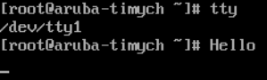

1. Какого типа команда `cd`? Попробуйте объяснить, почему она именно такого типа; опишите ход своих мыслей, если считаете что она могла бы быть другого типа.
    1. cd is a shell builtin - встроенная команда
    2. cd должна быть встроенной, поскольку она позволяет задать директорию в которой находится сама оболчка(shell), если бы она была внешней - то пришлось бы как-то отправлять команду на смену директории внутрь процесса оболочки.

2. Какая альтернатива без pipe команде `grep <some_string> <some_file> | wc -l`? `man grep` поможет в ответе на этот вопрос. Ознакомьтесь с [документом](http://www.smallo.ruhr.de/award.html) о других подобных некорректных вариантах использования pipe.
    ```
    grep -c "systemd" /var/log/messages
    641
    ```

3. Какой процесс с PID `1` является родителем для всех процессов в вашей виртуальной машине Ubuntu 20.04?
   
   `/usr/lib/systemd/systemd --switched-root --system --deserialize 22`
    
    C PID 1 запускается процесс systemd, который инициализирует систему, запускает сервисы(unit) в нужном порядке в соответствии с зависимостями для target

4. Как будет выглядеть команда, которая перенаправит вывод stderr `ls` на другую сессию терминала?

    Например: `ls > /dev/pts/0`

5. Получится ли одновременно передать команде файл на stdin и вывести ее stdout в другой файл? Приведите работающий пример.
    ```
    [root ~]# echo -e "line1\nline2\nline3" > 1.txt
    [root ~]# tail -n 1 <  1.txt > tail.out
    [root ~]# cat tail.out
    line3
    ```

6. Получится ли находясь в графическом режиме, вывести данные из PTY в какой-либо из эмуляторов TTY? Сможете ли вы наблюдать выводимые данные?

    Наппример: 
    ```    
    [root~]# who
    root     tty1         2022-08-16 09:48
    root     pts/0        2022-08-16 08:09
    root     pts/1        2022-08-16 09:38
    [root~]# echo "Hello" > /dev/tty1
    ```
    


1. Выполните команду `bash 5>&1`. К чему она приведет? Что будет, если вы выполните `echo netology > /proc/$$/fd/5`? Почему так происходит?

    При выполнении `bash 5>&1` запускается оболчка с перенаправлением FD 5 в StdOut. Команда `echo netology > /proc/$$/fd/5` отправить 'netology' в 5 FD текущей оболочки, и следовательно далее вывод из 5 попадет в StdOut и `netology` будет выведено на экран.

1. Получится ли в качестве входного потока для pipe использовать только stderr команды, не потеряв при этом отображение stdout на pty? Напоминаем: по умолчанию через pipe передается только stdout команды слева от `|` на stdin команды справа.
Это можно сделать, поменяв стандартные потоки местами через промежуточный новый дескриптор, который вы научились создавать в предыдущем вопросе.
    ```
    [root~]# ls /tmp  4>&1 5>&2 2>&4 1>&5 |grep file
    systemd-private-5fec696b0f8c43a4b6c3da94b730ad5e-chronyd.service-wp9LQ4
    [root~]# ls /tmp1  4>&1 5>&2 2>&4 1>&5 |grep file
    ls: cannot access '/tmp1': No such file or directory
    ```

1. Что выведет команда `cat /proc/$$/environ`? Как еще можно получить аналогичный по содержанию вывод?

    Выводит переменные окружения, аналогичный вывод: env/printenv

1. Используя `man`, опишите что доступно по адресам `/proc/<PID>/cmdline`, `/proc/<PID>/exe`.

    `/proc/<PID>/cmdline` содержит коммандную строку процесса. Например:
    
    ```
    [root ~]# cat /proc/30805/cmdline
    ping8.8.8.8
    ```
   
    `/proc/<PID>/exe` ссылка на исполняемый файл. Например:

    ```
    [root ~]# ll /proc/30805/exe
    lrwxrwxrwx. 1 root root 0 Aug 16 17:06 /proc/30805/exe -> /usr/bin/ping
    ```

1. Узнайте, какую наиболее старшую версию набора инструкций SSE поддерживает ваш процессор с помощью `/proc/cpuinfo`.
    ```
    [root~]# cat /proc/cpuinfo | grep -o 'sse\S*[ ]' | sort |uniq
    sse
    sse2
    sse3
    sse4_1
    sse4_2
    ```


1. При открытии нового окна терминала и `vagrant ssh` создается новая сессия и выделяется pty. Это можно подтвердить командой `tty`, которая упоминалась в лекции 3.2. Однако:

    ```bash
	vagrant@netology1:~$ ssh localhost 'tty'
	not a tty
    ```
	Почитайте, почему так происходит, и как изменить поведение.

    При запуске ssh сразу с командой не создается терминал таким образом команда tty не сработает
    С ключом -t можно принудительно создать псевдо-терминал.

1. Бывает, что есть необходимость переместить запущенный процесс из одной сессии в другую. Попробуйте сделать это, воспользовавшись `reptyr`. Например, так можно перенести в `screen` процесс, который вы запустили по ошибке в обычной SSH-сессии.

    ```
    в терминале 1:
    ping 8.8.8.8
    ctrl+Z
    bg
    jobs -l
    disown процесса ping
    
    в терминале 2:
    screen
    ps -a 
    ищем ping
    reptyr ид процесса ping
    ```


2. `sudo echo string > /root/new_file` не даст выполнить перенаправление под обычным пользователем, так как перенаправлением занимается процесс shell'а, который запущен без `sudo` под вашим пользователем. Для решения данной проблемы можно использовать конструкцию `echo string | sudo tee /root/new_file`. Узнайте что делает команда `tee` и почему в отличие от `sudo echo` команда с `sudo tee` будет работать.

    Перенаправление выполняется не от привилегерованного пользователя, поэтому не дает записать вывод в /root. 
    Команда tee позволяет выводить на экран, в файл или в переменную то что ей подали на вход.
    Команда tee в случае с конструкцией `echo string | sudo tee /root/new_file`  перенаправляет вывод уже от привилегерованного пользователя.