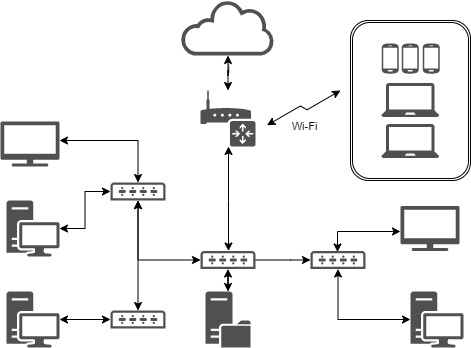

# Домашнее задание к занятию "3.8. Компьютерные сети, лекция 3"

1. Подключитесь к публичному маршрутизатору в интернет. Найдите маршрут к вашему публичному IP
    ```
    telnet route-views.routeviews.org
    Username: rviews
    show ip route x.x.x.x/32
    show bgp x.x.x.x/32
    ```

    ```bash
    route-views>show ip route 109.173.41.113
    Routing entry for 109.173.0.0/17
    Known via "bgp 6447", distance 20, metric 0
    Tag 2497, type external
    Last update from 202.232.0.2 3d13h ago
    Routing Descriptor Blocks:
    * 202.232.0.2, from 202.232.0.2, 3d13h ago
        Route metric is 0, traffic share count is 1
        AS Hops 3
        Route tag 2497
        MPLS label: none

    route-views>show bgp 109.173.41.113
    BGP routing table entry for 109.173.0.0/17, version 2453944477
    Paths: (23 available, best #22, table default)
    Not advertised to any peer
    Refresh Epoch 1
    3267 12389 42610
        194.85.40.15 from 194.85.40.15 (185.141.126.1)
        Origin IGP, metric 0, localpref 100, valid, external
        path 7FE032C88ED8 RPKI State not found
        rx pathid: 0, tx pathid: 0
    Refresh Epoch 1
    7018 1299 42610
        12.0.1.63 from 12.0.1.63 (12.0.1.63)
        Origin incomplete, localpref 100, valid, external
        Community: 7018:5000 7018:37232
        path 7FE13FB20FA8 RPKI State not found
        rx pathid: 0, tx pathid: 0
    Refresh Epoch 1
    3333 1273 12389 42610
        193.0.0.56 from 193.0.0.56 (193.0.0.56)
        Origin IGP, localpref 100, valid, external
        Community: 1273:12752 1273:32090
        path 7FE0C4D9EEE0 RPKI State not found
        rx pathid: 0, tx pathid: 0
    Refresh Epoch 1
    57866 9002 42610
        37.139.139.17 from 37.139.139.17 (37.139.139.17)
        Origin IGP, metric 0, localpref 100, valid, external
        Community: 9002:9002 9002:64667 57866:100 65100:9002 65103:1 65104:31
        unknown transitive attribute: flag 0xE0 type 0x20 length 0x30
            value 0000 E20A 0000 0064 0000 232A 0000 E20A
                0000 0065 0000 0064 0000 E20A 0000 0067
                0000 0001 0000 E20A 0000 0068 0000 001F

        path 7FE041709618 RPKI State not found
        rx pathid: 0, tx pathid: 0
    Refresh Epoch 1
    4901 6079 1299 42610
        162.250.137.254 from 162.250.137.254 (162.250.137.254)
        Origin incomplete, localpref 100, valid, external
        Community: 65000:10100 65000:10300 65000:10400
        path 7FE17522FBA0 RPKI State not found
        rx pathid: 0, tx pathid: 0
    Refresh Epoch 1
    8283 1299 42610
        94.142.247.3 from 94.142.247.3 (94.142.247.3)
        Origin incomplete, metric 0, localpref 100, valid, external
        Community: 1299:30000 8283:1 8283:101
        unknown transitive attribute: flag 0xE0 type 0x20 length 0x18
            value 0000 205B 0000 0000 0000 0001 0000 205B
                0000 0005 0000 0001
        path 7FE0CFE71348 RPKI State not found
        rx pathid: 0, tx pathid: 0
    Refresh Epoch 1
    20130 6939 1273 12389 42610
        140.192.8.16 from 140.192.8.16 (140.192.8.16)
        Origin IGP, localpref 100, valid, external
        path 7FE0B833A190 RPKI State not found
        rx pathid: 0, tx pathid: 0
    Refresh Epoch 1
    20912 3257 1299 42610
        212.66.96.126 from 212.66.96.126 (212.66.96.126)
        Origin incomplete, localpref 100, valid, external
        Community: 3257:8101 3257:30055 3257:50001 3257:53900 3257:53902 20912:65004
        path 7FE0CC1E2C78 RPKI State not found
        rx pathid: 0, tx pathid: 0
    Refresh Epoch 1
    49788 12552 12389 12389 12389 12389 12389 12389 42610
        91.218.184.60 from 91.218.184.60 (91.218.184.60)
        Origin IGP, localpref 100, valid, external
        Community: 12552:12000 12552:12100 12552:12101 12552:22000
        Extended Community: 0x43:100:1
        path 7FE14562C598 RPKI State not found
        rx pathid: 0, tx pathid: 0
    Refresh Epoch 1
    53767 174 12389 12389 12389 12389 12389 12389 42610
        162.251.163.2 from 162.251.163.2 (162.251.162.3)
        Origin IGP, localpref 100, valid, external
        Community: 174:21101 174:22005 53767:5000
        path 7FE09813B580 RPKI State not found
        rx pathid: 0, tx pathid: 0
    Refresh Epoch 1
    7660 2516 12389 42610
        203.181.248.168 from 203.181.248.168 (203.181.248.168)
        Origin IGP, localpref 100, valid, external
        Community: 2516:1050 7660:9003
        path 7FE10F0F8348 RPKI State not found
        rx pathid: 0, tx pathid: 0
    Refresh Epoch 1
    101 3356 12389 12389 12389 12389 12389 12389 42610
        209.124.176.223 from 209.124.176.223 (209.124.176.223)
        Origin IGP, localpref 100, valid, external
        Community: 101:20100 101:20110 101:22100 3356:2 3356:22 3356:100 3356:123 3356:501 3356:903 3356:2065
        Extended Community: RT:101:22100
        path 7FE17E5C2948 RPKI State not found
        rx pathid: 0, tx pathid: 0
    Refresh Epoch 1
    3561 3910 3356 12389 12389 12389 12389 12389 12389 42610
        206.24.210.80 from 206.24.210.80 (206.24.210.80)
        Origin IGP, localpref 100, valid, external
        path 7FE12C927B58 RPKI State not found
        rx pathid: 0, tx pathid: 0
    Refresh Epoch 1
    701 1273 12389 42610
        137.39.3.55 from 137.39.3.55 (137.39.3.55)
        Origin IGP, localpref 100, valid, external
        path 7FE141F988F0 RPKI State not found
        rx pathid: 0, tx pathid: 0
    Refresh Epoch 1
    3356 12389 12389 12389 12389 12389 12389 42610
        4.68.4.46 from 4.68.4.46 (4.69.184.201)
        Origin IGP, metric 0, localpref 100, valid, external
        Community: 3356:2 3356:22 3356:100 3356:123 3356:501 3356:903 3356:2065
        path 7FE0A1894BF0 RPKI State not found
        rx pathid: 0, tx pathid: 0
    Refresh Epoch 1
    19214 3257 1299 42610
        208.74.64.40 from 208.74.64.40 (208.74.64.40)
        Origin incomplete, localpref 100, valid, external
        Community: 3257:8108 3257:30391 3257:50002 3257:51200 3257:51203
        path 7FE0F5482350 RPKI State not found
        rx pathid: 0, tx pathid: 0
    Refresh Epoch 1
    1351 6939 1273 12389 42610
        132.198.255.253 from 132.198.255.253 (132.198.255.253)
        Origin IGP, localpref 100, valid, external
        path 7FE0EB18CFA8 RPKI State not found
        rx pathid: 0, tx pathid: 0
    Refresh Epoch 1
    3303 1273 12389 42610
        217.192.89.50 from 217.192.89.50 (138.187.128.158)
        Origin IGP, localpref 100, valid, external
        Community: 1273:12752 1273:32090 3303:1004 3303:1007 3303:1030 3303:3067
        path 7FE0E48582C8 RPKI State not found
        rx pathid: 0, tx pathid: 0
    Refresh Epoch 1
    852 1299 42610
        154.11.12.212 from 154.11.12.212 (96.1.209.43)
        Origin IGP, metric 0, localpref 100, valid, external
        path 7FE0F8957828 RPKI State not found
        rx pathid: 0, tx pathid: 0
    Refresh Epoch 1
    3549 3356 12389 12389 12389 12389 12389 12389 42610
        208.51.134.254 from 208.51.134.254 (67.16.168.191)
        Origin IGP, metric 0, localpref 100, valid, external
        Community: 3356:2 3356:22 3356:100 3356:123 3356:501 3356:903 3356:2065 3549:2581 3549:30840
        path 7FE0262815C0 RPKI State not found
        rx pathid: 0, tx pathid: 0
    Refresh Epoch 1
    6939 1273 12389 42610
        64.71.137.241 from 64.71.137.241 (216.218.252.164)
        Origin IGP, localpref 100, valid, external
        path 7FE1687B0478 RPKI State not found
        rx pathid: 0, tx pathid: 0
    Refresh Epoch 3
    2497 12389 42610
        202.232.0.2 from 202.232.0.2 (58.138.96.254)
        Origin IGP, localpref 100, valid, external, best
        path 7FE00C5D7680 RPKI State not found
        rx pathid: 0, tx pathid: 0x0
    Refresh Epoch 1
    3257 1299 42610
        89.149.178.10 from 89.149.178.10 (213.200.83.26)
        Origin incomplete, metric 10, localpref 100, valid, external
        Community: 3257:8794 3257:30052 3257:50001 3257:54900 3257:54901
        path 7FE11439DFA0 RPKI State not found
        rx pathid: 0, tx pathid: 0
    ```

2. Создайте dummy0 интерфейс в Ubuntu. Добавьте несколько статических маршрутов. Проверьте таблицу маршрутизации.


    ```bash
    root@timych-ubu1:~# vim /etc/netplan/02-dummy.yaml
    version: 2
    renderer: networkd
    bridges:
        dummy0:
        dhcp4: no
        dhcp6: no
        accept-ra: no
        interfaces: [ ]
        addresses:
            - 169.254.1.1/24
        routes:
            - to: 10.30.0.0/24

    root@timych-ubu1:~# ip -br r
    default via 192.168.171.2 dev ens33 proto dhcp src 192.168.171.135 metric 100
    10.0.0.0/24 dev bond.101 proto kernel scope link src 10.0.0.16
    10.30.0.0/24 dev dummy0 proto
    ```


3. Проверьте открытые TCP порты в Ubuntu, какие протоколы и приложения используют эти порты? Приведите несколько примеров.

    ```bash
    root@timych-ubu1:~# ss -plunt
    Netid  State   Recv-Q  Send-Q             Local Address:Port     Peer Address:Port  Process
    udp    UNCONN  0       0                  127.0.0.53%lo:53            0.0.0.0:*      users:(("systemd-resolve",pid=838,fd=12))
    udp    UNCONN  0       0          192.168.171.135%ens33:68            0.0.0.0:*      users:(("systemd-network",pid=832,fd=25))
    tcp    LISTEN  0       4096               127.0.0.53%lo:53            0.0.0.0:*      users:(("systemd-resolve",pid=838,fd=13))
    tcp    LISTEN  0       128                      0.0.0.0:22            0.0.0.0:*      users:(("sshd",pid=908,fd=3))
    tcp    LISTEN  0       128                    127.0.0.1:6010          0.0.0.0:*      users:(("sshd",pid=1310,fd=11))
    tcp    LISTEN  0       128                         [::]:22               [::]:*      users:(("sshd",pid=908,fd=4))
    tcp    LISTEN  0       128                        [::1]:6010             [::]:*      users:(("sshd",pid=1310,fd=10))
    ```

4. Проверьте используемые UDP сокеты в Ubuntu, какие протоколы и приложения используют эти порты?
    ```bash
    root@timych-ubu1:~# ss -ulapn
    State    Recv-Q   Send-Q              Local Address:Port       Peer Address:Port   Process
    UNCONN   0        0                   127.0.0.53%lo:53              0.0.0.0:*       users:(("systemd-resolve",pid=808,fd=12))
    UNCONN   0        0           192.168.171.135%ens33:68              0.0.0.0:*       users:(("systemd-network",pid=801,fd=15))
    ```
    - systemd-resolve на порту 53 - сервис разрешения имен для локальных приложений
    - systemd-network на порту 68 - Bootstrap protocol client для назначения ip адресов 


5. Используя diagrams.net, создайте L3 диаграмму вашей домашней сети или любой другой сети, с которой вы работали. 
    