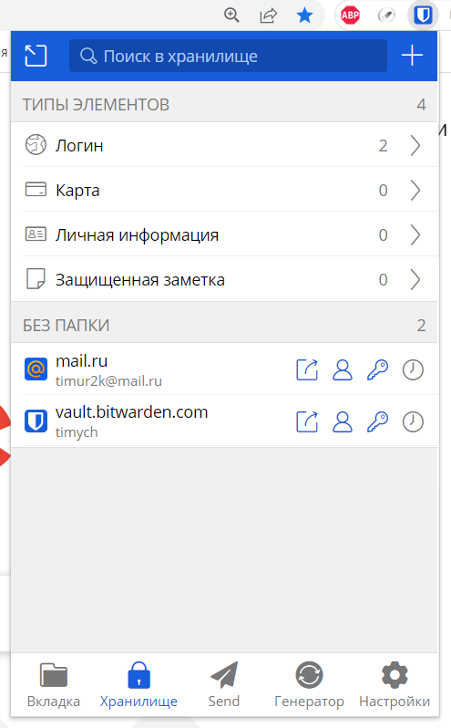
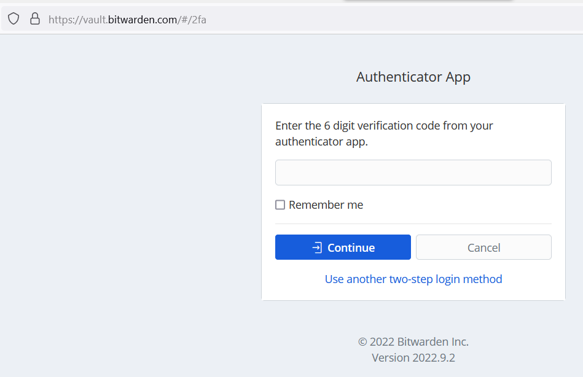
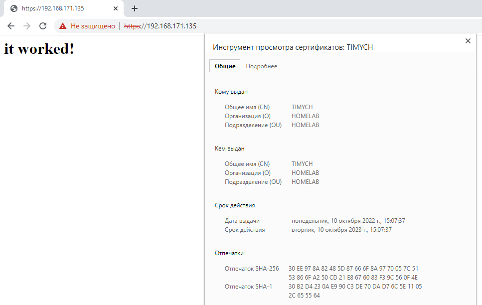
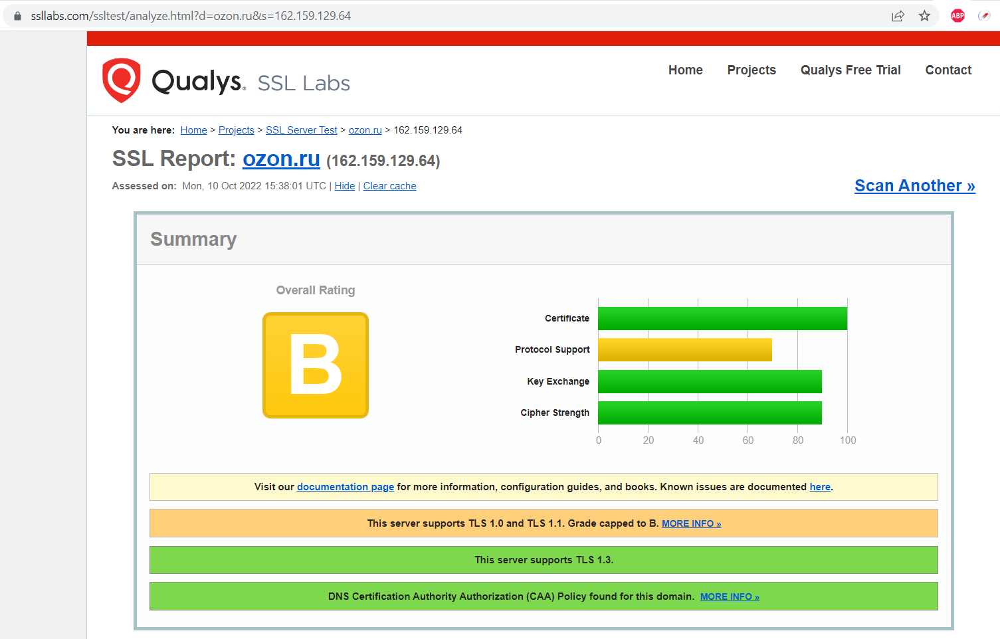

# Домашнее задание к занятию "3.9. Элементы безопасности информационных систем"

1. Установите Bitwarden плагин для браузера. Зарегестрируйтесь и сохраните несколько паролей.

    

2. Установите Google authenticator на мобильный телефон. Настройте вход в Bitwarden акаунт через Google authenticator OTP.

    

3. Установите apache2, сгенерируйте самоподписанный сертификат, настройте тестовый сайт для работы по HTTPS.


    ```bash
    root@timych-ubu1:~# apt-get install apache2
    root@timych-ubu1:~# systemctl status  apache2
    ● apache2.service - The Apache HTTP Server
        Loaded: loaded (/lib/systemd/system/apache2.service; enabled; vendor preset: enabled)
        Active: active (running) since Mon 2022-10-10 11:59:47 UTC; 1min 30s ago
        Docs: https://httpd.apache.org/docs/2.4/
    Main PID: 2778 (apache2)
        Tasks: 55 (limit: 4575)
        Memory: 6.0M
        CGroup: /system.slice/apache2.service
                ├─2778 /usr/sbin/apache2 -k start
                ├─2780 /usr/sbin/apache2 -k start
                └─2781 /usr/sbin/apache2 -k start
    root@timych-ubu1:~# a2enmod ssl
    root@timych-ubu1:~# openssl req -x509 -nodes -days 365 -newkey rsa:2048 -keyout /etc/ssl/private/apache-selfsigned.key -out /etc/ssl/certs/apache-selfsigned.crt
    root@timych-ubu1:~# vim /etc/apache2/sites-available/timych-site.conf
    root@timych-ubu1:~# cat /etc/apache2/sites-available/timych-site.conf
        <VirtualHost *:443>
        ServerName timych-site
        DocumentRoot /var/www/timych-site

        SSLEngine on
        SSLCertificateFile /etc/ssl/certs/apache-selfsigned.crt
        SSLCertificateKeyFile /etc/ssl/private/apache-selfsigned.key
        </VirtualHost>
    root@timych-ubu1:~# mkdir /var/www/timych-site
    root@timych-ubu1:~# vim /var/www/timych-site/index.html
        <h1>it worked!</h1>
    root@timych-ubu1:~# a2ensite timych-site.conf
    root@timych-ubu1:~# systemctl reload apache2.service
    root@timych-ubu1:~# ss -plunt
    Netid          State           Recv-Q           Send-Q                             Local Address:Port                     Peer Address:Port          Process
    udp            UNCONN          0                0                                  127.0.0.53%lo:53                            0.0.0.0:*              users:(("systemd-resolve",pid=808,fd=12))
    udp            UNCONN          0                0                          192.168.171.135%ens33:68                            0.0.0.0:*              users:(("systemd-network",pid=801,fd=15))
    tcp            LISTEN          0                4096                               127.0.0.53%lo:53                            0.0.0.0:*              users:(("systemd-resolve",pid=808,fd=13))
    tcp            LISTEN          0                128                                      0.0.0.0:22                            0.0.0.0:*              users:(("sshd",pid=894,fd=3))
    tcp            LISTEN          0                128                                    127.0.0.1:6010                          0.0.0.0:*              users:(("sshd",pid=1977,fd=11))
    tcp            LISTEN          0                511                                            *:80                                  *:*              users:(("apache2",pid=3833,fd=4),("apache2",pid=3832,fd=4),("apache2",pid=2778,fd=4))
    tcp            LISTEN          0                128                                         [::]:22                               [::]:*              users:(("sshd",pid=894,fd=4))
    tcp            LISTEN          0                128                                        [::1]:6010                             [::]:*              users:(("sshd",pid=1977,fd=10))
    tcp            LISTEN          0                511                                            *:443                                 *:*              users:(("apache2",pid=3833,fd=6),("apache2",pid=3832,fd=6),("apache2",pid=2778,fd=6))
    ```

    


4. Проверьте на TLS уязвимости произвольный сайт в интернете (кроме сайтов МВД, ФСБ, МинОбр, НацБанк, РосКосмос, РосАтом, РосНАНО и любых госкомпаний, объектов КИИ, ВПК ... и тому подобное).

    ```bash
    root@timych-ubu1:~/testssl/testssl.sh# ./testssl.sh https://ozon.ru

    ###########################################################
        testssl.sh       3.2rc2 from https://testssl.sh/dev/
        (0ed2bf0 2022-10-07 16:48:06)

        This program is free software. Distribution and
                modification under GPLv2 permitted.
        USAGE w/o ANY WARRANTY. USE IT AT YOUR OWN RISK!

        Please file bugs @ https://testssl.sh/bugs/

    ###########################################################

    Using "OpenSSL 1.0.2-bad (1.0.2k-dev)" [~183 ciphers]
    on timych-ubu1:./bin/openssl.Linux.x86_64
    (built: "Sep  1 14:03:44 2022", platform: "linux-x86_64")


    Testing all IPv4 addresses (port 443): 162.159.129.64 162.159.128.64
    ---------------------------------------------------------------------------------------------------
    Start 2022-10-10 15:14:22        -->> 162.159.129.64:443 (ozon.ru) <<--

    Further IP addresses:   162.159.128.64
    rDNS (162.159.129.64):  --
    Service detected:       HTTP


    Testing protocols via sockets except NPN+ALPN

    SSLv2      not offered (OK)
    SSLv3      not offered (OK)
    TLS 1      offered (deprecated)
    TLS 1.1    offered (deprecated)
    TLS 1.2    offered (OK)
    TLS 1.3    offered (OK): final
    NPN/SPDY   h2, http/1.1 (advertised)
    ALPN/HTTP2 h2, http/1.1 (offered)

    Testing cipher categories

    NULL ciphers (no encryption)                      not offered (OK)
    Anonymous NULL Ciphers (no authentication)        not offered (OK)
    Export ciphers (w/o ADH+NULL)                     not offered (OK)
    LOW: 64 Bit + DES, RC[2,4], MD5 (w/o export)      not offered (OK)
    Triple DES Ciphers / IDEA                         offered
    Obsoleted CBC ciphers (AES, ARIA etc.)            offered
    Strong encryption (AEAD ciphers) with no FS       offered (OK)
    Forward Secrecy strong encryption (AEAD ciphers)  offered (OK)


    Testing server's cipher preferences

    Hexcode  Cipher Suite Name (OpenSSL)       KeyExch.   Encryption  Bits     Cipher Suite Name (IANA/RFC)
    -----------------------------------------------------------------------------------------------------------------------------
    SSLv2
    -
    SSLv3
    -
    TLSv1 (server order)
    xc013   ECDHE-RSA-AES128-SHA              ECDH 256   AES         128      TLS_ECDHE_RSA_WITH_AES_128_CBC_SHA
    x2f     AES128-SHA                        RSA        AES         128      TLS_RSA_WITH_AES_128_CBC_SHA
    xc014   ECDHE-RSA-AES256-SHA              ECDH 256   AES         256      TLS_ECDHE_RSA_WITH_AES_256_CBC_SHA
    x35     AES256-SHA                        RSA        AES         256      TLS_RSA_WITH_AES_256_CBC_SHA
    x0a     DES-CBC3-SHA                      RSA        3DES        168      TLS_RSA_WITH_3DES_EDE_CBC_SHA
    TLSv1.1 (server order)
    xc013   ECDHE-RSA-AES128-SHA              ECDH 256   AES         128      TLS_ECDHE_RSA_WITH_AES_128_CBC_SHA
    x2f     AES128-SHA                        RSA        AES         128      TLS_RSA_WITH_AES_128_CBC_SHA
    xc014   ECDHE-RSA-AES256-SHA              ECDH 256   AES         256      TLS_ECDHE_RSA_WITH_AES_256_CBC_SHA
    x35     AES256-SHA                        RSA        AES         256      TLS_RSA_WITH_AES_256_CBC_SHA
    TLSv1.2 (server order -- server prioritizes ChaCha ciphers when preferred by clients)
    xc02f   ECDHE-RSA-AES128-GCM-SHA256       ECDH 253   AESGCM      128      TLS_ECDHE_RSA_WITH_AES_128_GCM_SHA256
    xcc13   ECDHE-RSA-CHACHA20-POLY1305-OLD   ECDH 253   ChaCha20    256      TLS_ECDHE_RSA_WITH_CHACHA20_POLY1305_SHA256_OLD
    xcca8   ECDHE-RSA-CHACHA20-POLY1305       ECDH 253   ChaCha20    256      TLS_ECDHE_RSA_WITH_CHACHA20_POLY1305_SHA256
    xc013   ECDHE-RSA-AES128-SHA              ECDH 253   AES         128      TLS_ECDHE_RSA_WITH_AES_128_CBC_SHA
    x9c     AES128-GCM-SHA256                 RSA        AESGCM      128      TLS_RSA_WITH_AES_128_GCM_SHA256
    x2f     AES128-SHA                        RSA        AES         128      TLS_RSA_WITH_AES_128_CBC_SHA
    xc030   ECDHE-RSA-AES256-GCM-SHA384       ECDH 253   AESGCM      256      TLS_ECDHE_RSA_WITH_AES_256_GCM_SHA384
    xc014   ECDHE-RSA-AES256-SHA              ECDH 253   AES         256      TLS_ECDHE_RSA_WITH_AES_256_CBC_SHA
    x9d     AES256-GCM-SHA384                 RSA        AESGCM      256      TLS_RSA_WITH_AES_256_GCM_SHA384
    x35     AES256-SHA                        RSA        AES         256      TLS_RSA_WITH_AES_256_CBC_SHA
    xc027   ECDHE-RSA-AES128-SHA256           ECDH 253   AES         128      TLS_ECDHE_RSA_WITH_AES_128_CBC_SHA256
    x3c     AES128-SHA256                     RSA        AES         128      TLS_RSA_WITH_AES_128_CBC_SHA256
    xc028   ECDHE-RSA-AES256-SHA384           ECDH 253   AES         256      TLS_ECDHE_RSA_WITH_AES_256_CBC_SHA384
    x3d     AES256-SHA256                     RSA        AES         256      TLS_RSA_WITH_AES_256_CBC_SHA256
    TLSv1.3./testssl.sh: connect: Connection refused
    ./testssl.sh: line 11361: /dev/tcp/162.159.129.64/443: Connection refused
    Oops: TCP connect problem

    Unable to open a socket to 162.159.129.64:443.  (no server order, thus listed by strength)
    x1302   TLS_AES_256_GCM_SHA384            ECDH 253   AESGCM      256      TLS_AES_256_GCM_SHA384
    x1303   TLS_CHACHA20_POLY1305_SHA256      ECDH 253   ChaCha20    256      TLS_CHACHA20_POLY1305_SHA256
    x1301   TLS_AES_128_GCM_SHA256            ECDH 253   AESGCM      128      TLS_AES_128_GCM_SHA256

    Has server cipher order?     yes (OK) -- only for < TLS 1.3
    Negotiated protocol          TLSv1.3
    Negotiated cipher            TLS_AES_256_GCM_SHA384, 253 bit ECDH (X25519)

    Testing robust forward secrecy (FS) -- omitting Null Authentication/Encryption, 3DES, RC4

    FS is offered (OK)           TLS_AES_256_GCM_SHA384 TLS_CHACHA20_POLY1305_SHA256 ECDHE-RSA-CHACHA20-POLY1305-OLD ECDHE-RSA-AES256-GCM-SHA384
                                ECDHE-RSA-AES256-SHA384 ECDHE-RSA-AES256-SHA ECDHE-RSA-CHACHA20-POLY1305 TLS_AES_128_GCM_SHA256
                                ECDHE-RSA-AES128-GCM-SHA256 ECDHE-RSA-AES128-SHA256 ECDHE-RSA-AES128-SHA
    Elliptic curves offered:     prime256v1 secp384r1 secp521r1 X25519


    Testing server defaults (Server Hello)

    TLS extensions (standard)    "server name/#0" "renegotiation info/#65281" "EC point formats/#11" "session ticket/#35" "status request/#5"
                                "next protocol/#13172" "key share/#51" "supported versions/#43" "extended master secret/#23"
                                "application layer protocol negotiation/#16" "compress_certificate/#27"
    Session Ticket RFC 5077 hint 64800 seconds, session tickets keys seems to be rotated < daily
    SSL Session ID support       yes
    Session Resumption           Tickets: yes, ID: yes
    TLS clock skew               0 sec from localtime
    Certificate Compression      0002/Brotli
    Client Authentication        none
    Signature Algorithm          SHA256 with RSA
    Server key size              RSA 2048 bits (exponent is 65537)
    Server key usage             Digital Signature, Key Encipherment
    Server extended key usage    TLS Web Server Authentication, TLS Web Client Authentication
    Serial                       618E6EBF01ED9B56F7348C32 (OK: length 12)
    Fingerprints                 SHA1 2E4EA2877CFF3D6A4A83617DF1DF2B0BBCCF573F
                                SHA256 66799C5A87D7AB8A97925D1E4B1D6E05B7CACEAB3B24911190F825C992103124
    Common Name (CN)             *.ozon.ru
    subjectAltName (SAN)         *.ozon.ru *.ozone.ru www.ozon.ru ozon.ru
    Trust (hostname)             Ok via SAN (same w/o SNI)
    Chain of trust               Ok
    EV cert (experimental)       no
    Certificate Validity (UTC)   expires < 30 days (5) (2021-09-13 16:51 --> 2022-10-15 16:51)
    ETS/"eTLS", visibility info  not present
    Certificate Revocation List  --
    OCSP URI                     http://ocsp.globalsign.com/gsrsaovsslca2018
    OCSP stapling                offered, not revoked
    OCSP must staple extension   --
    DNS CAA RR (experimental)    available - please check for match with "Issuer" below
                                contactemail=security@ozon.ru, iodef=mailto:security@ozon.ru, issue=emsign.com, issue=globalsign.com,
                                issue=letsencrypt.org, issuewild=emsign.com, issuewild=globalsign.com, issuewild=letsencrypt.org
    Certificate Transparency     yes (certificate extension)
    Certificates provided        3
    Issuer                       GlobalSign RSA OV SSL CA 2018 (GlobalSign nv-sa from BE)
    Intermediate cert validity   #1: ok > 40 days (2028-11-21 00:00). GlobalSign RSA OV SSL CA 2018 <-- GlobalSign
                                #2: ok > 40 days (2028-01-28 12:00). GlobalSign <-- GlobalSign Root CA
    Intermediate Bad OCSP (exp.) Ok


    Testing HTTP header response @ "/"

    HTTP Status Code             403 Forbidden
    HTTP clock skew              0 sec from localtime
    Strict Transport Security    not offered
    Public Key Pinning           --
    Server banner                cloudflare
    Application banner           --
    Cookie(s)                    1 issued: 1/1 secure, 1/1 HttpOnly -- maybe better try target URL of 30x
    Security headers             X-Frame-Options: SAMEORIGIN
                                Permissions-Policy:
                                    accelerometer=(),autoplay=(),camera=(),clipboard-read=(),clipboard-write=(),fullscreen=(),geolocation=(),gyroscope=(),hid=(),interest-cohort=(),magnetometer=(),microphone=(),payment=(),publickey-credentials-get=(),screen-wake-lock=(),serial=(),sync-xhr=(),usb=()
                                Cache-Control: private, max-age=0, no-store, no-cache, must-revalidate, post-check=0, pre-check=0
    Reverse Proxy banner         --


    Testing vulnerabilities

    Heartbleed (CVE-2014-0160)                not vulnerable (OK), no heartbeat extension
    CCS (CVE-2014-0224)                       not vulnerable (OK)
    Ticketbleed (CVE-2016-9244), experiment.  not vulnerable (OK)
    ROBOT                                     not vulnerable (OK)
    Secure Renegotiation (RFC 5746)           supported (OK)
    Secure Client-Initiated Renegotiation     not vulnerable (OK)
    CRIME, TLS (CVE-2012-4929)                not vulnerable (OK)
    BREACH (CVE-2013-3587)                    potentially NOT ok, "br gzip" HTTP compression detected. - only supplied "/" tested
                                            Can be ignored for static pages or if no secrets in the page
    POODLE, SSL (CVE-2014-3566)               not vulnerable (OK), no SSLv3 support
    TLS_FALLBACK_SCSV (RFC 7507)              Downgrade attack prevention supported (OK)
    SWEET32 (CVE-2016-2183, CVE-2016-6329)    VULNERABLE, uses 64 bit block ciphers
    FREAK (CVE-2015-0204)                     not vulnerable (OK)
    DROWN (CVE-2016-0800, CVE-2016-0703)      not vulnerable on this host and port (OK)
                                            make sure you don't use this certificate elsewhere with SSLv2 enabled services, see
                                            https://search.censys.io/search?resource=hosts&virtual_hosts=INCLUDE&q=66799C5A87D7AB8A97925D1E4B1D6E05B7CACEAB3B24911190F825C992103124
    LOGJAM (CVE-2015-4000), experimental      not vulnerable (OK): no DH EXPORT ciphers, no DH key detected with <= TLS 1.2
    BEAST (CVE-2011-3389)                     TLS1: ECDHE-RSA-AES128-SHA AES128-SHA ECDHE-RSA-AES256-SHA AES256-SHA DES-CBC3-SHA
                                            VULNERABLE -- but also supports higher protocols  TLSv1.1 TLSv1.2 (likely mitigated)
    LUCKY13 (CVE-2013-0169), experimental     potentially VULNERABLE, uses cipher block chaining (CBC) ciphers with TLS. Check patches
    Winshock (CVE-2014-6321), experimental    not vulnerable (OK)
    RC4 (CVE-2013-2566, CVE-2015-2808)        no RC4 ciphers detected (OK)


    Running client simulations (HTTP) via sockets

    Browser                      Protocol  Cipher Suite Name (OpenSSL)       Forward Secrecy
    ------------------------------------------------------------------------------------------------
    Android 6.0                  TLSv1.2   ECDHE-RSA-CHACHA20-POLY1305-OLD   256 bit ECDH (P-256)
    Android 7.0 (native)         TLSv1.2   ECDHE-RSA-AES128-GCM-SHA256       256 bit ECDH (P-256)
    Android 8.1 (native)         TLSv1.2   ECDHE-RSA-AES128-GCM-SHA256       253 bit ECDH (X25519)
    Android 9.0 (native)         TLSv1.3   TLS_AES_128_GCM_SHA256            253 bit ECDH (X25519)
    Android 10.0 (native)        TLSv1.3   TLS_AES_128_GCM_SHA256            253 bit ECDH (X25519)
    Android 11 (native)          TLSv1.3   TLS_AES_128_GCM_SHA256            253 bit ECDH (X25519)
    Android 12 (native)          TLSv1.3   TLS_AES_128_GCM_SHA256            253 bit ECDH (X25519)
    Chrome 79 (Win 10)           TLSv1.3   TLS_AES_128_GCM_SHA256            253 bit ECDH (X25519)
    Chrome 101 (Win 10)          TLSv1.3   TLS_AES_128_GCM_SHA256            253 bit ECDH (X25519)
    Firefox 66 (Win 8.1/10)      TLSv1.3   TLS_AES_128_GCM_SHA256            253 bit ECDH (X25519)
    Firefox 100 (Win 10)         TLSv1.3   TLS_AES_128_GCM_SHA256            253 bit ECDH (X25519)
    IE 6 XP                      No connection
    IE 8 Win 7                   TLSv1.0   ECDHE-RSA-AES128-SHA              256 bit ECDH (P-256)
    IE 8 XP                      TLSv1.0   DES-CBC3-SHA                      No FS
    IE 11 Win 7                  TLSv1.2   ECDHE-RSA-AES128-SHA              256 bit ECDH (P-256)
    IE 11 Win 8.1                TLSv1.2   ECDHE-RSA-AES128-SHA              256 bit ECDH (P-256)
    IE 11 Win Phone 8.1          TLSv1.2   ECDHE-RSA-AES128-SHA              256 bit ECDH (P-256)
    IE 11 Win 10                 TLSv1.2   ECDHE-RSA-AES128-GCM-SHA256       256 bit ECDH (P-256)
    Edge 15 Win 10               TLSv1.2   ECDHE-RSA-AES128-GCM-SHA256       253 bit ECDH (X25519)
    Edge 101 Win 10 21H2         TLSv1.3   TLS_AES_128_GCM_SHA256            253 bit ECDH (X25519)
    Safari 12.1 (iOS 12.2)       TLSv1.3   TLS_CHACHA20_POLY1305_SHA256      253 bit ECDH (X25519)
    Safari 13.0 (macOS 10.14.6)  TLSv1.3   TLS_CHACHA20_POLY1305_SHA256      253 bit ECDH (X25519)
    Safari 15.4 (macOS 12.3.1)   TLSv1.3   TLS_AES_128_GCM_SHA256            253 bit ECDH (X25519)
    Java 7u25                    TLSv1.0   ECDHE-RSA-AES128-SHA              256 bit ECDH (P-256)
    Java 8u161                   TLSv1.2   ECDHE-RSA-AES128-GCM-SHA256       256 bit ECDH (P-256)
    Java 11.0.2 (OpenJDK)        TLSv1.3   TLS_AES_128_GCM_SHA256            256 bit ECDH (P-256)
    Java 17.0.3 (OpenJDK)        TLSv1.3   TLS_AES_256_GCM_SHA384            253 bit ECDH (X25519)
    go 1.17.8                    TLSv1.3   TLS_AES_128_GCM_SHA256            253 bit ECDH (X25519)
    LibreSSL 2.8.3 (Apple)       TLSv1.2   ECDHE-RSA-CHACHA20-POLY1305       253 bit ECDH (X25519)
    OpenSSL 1.0.2e               TLSv1.2   ECDHE-RSA-AES128-GCM-SHA256       256 bit ECDH (P-256)
    OpenSSL 1.1.0l (Debian)      TLSv1.2   ECDHE-RSA-CHACHA20-POLY1305       253 bit ECDH (X25519)
    OpenSSL 1.1.1d (Debian)      TLSv1.3   TLS_AES_256_GCM_SHA384            253 bit ECDH (X25519)
    OpenSSL 3.0.3 (git)          TLSv1.3   TLS_AES_256_GCM_SHA384            253 bit ECDH (X25519)
    Apple Mail (16.0)            TLSv1.2   ECDHE-RSA-AES128-GCM-SHA256       256 bit ECDH (P-256)
    Thunderbird (91.9)           TLSv1.3   TLS_AES_128_GCM_SHA256            253 bit ECDH (X25519)


    Rating (experimental)

    Rating specs (not complete)  SSL Labs's 'SSL Server Rating Guide' (version 2009q from 2020-01-30)
    Specification documentation  https://github.com/ssllabs/research/wiki/SSL-Server-Rating-Guide
    Protocol Support (weighted)  95 (28)
    Key Exchange     (weighted)  90 (27)
    Cipher Strength  (weighted)  90 (36)
    Final Score                  91
    Overall Grade                B
    Grade cap reasons            Grade capped to B. TLS 1.1 offered
                                Grade capped to B. TLS 1.0 offered
                                Grade capped to A. HSTS is not offered

    Done 2022-10-10 15:17:04 [ 166s] -->> 162.159.129.64:443 (ozon.ru) <<--

    ---------------------------------------------------------------------------------------------------
    Start 2022-10-10 15:17:06        -->> 162.159.128.64:443 (ozon.ru) <<--

    Further IP addresses:   162.159.129.64
    rDNS (162.159.128.64):  --
    Service detected:       HTTP


    Testing protocols via sockets except NPN+ALPN

    SSLv2      not offered (OK)
    SSLv3      not offered (OK)
    TLS 1      offered (deprecated)
    TLS 1.1    offered (deprecated)
    TLS 1.2    offered (OK)
    TLS 1.3    offered (OK): final
    NPN/SPDY   h2, http/1.1 (advertised)
    ALPN/HTTP2 h2, http/1.1 (offered)

    Testing cipher categories

    NULL ciphers (no encryption)                      not offered (OK)
    Anonymous NULL Ciphers (no authentication)        not offered (OK)
    Export ciphers (w/o ADH+NULL)                     not offered (OK)
    LOW: 64 Bit + DES, RC[2,4], MD5 (w/o export)      not offered (OK)
    Triple DES Ciphers / IDEA                         offered
    Obsoleted CBC ciphers (AES, ARIA etc.)            offered
    Strong encryption (AEAD ciphers) with no FS       offered (OK)
    Forward Secrecy strong encryption (AEAD ciphers)  offered (OK)


    Testing server's cipher preferences

    Hexcode  Cipher Suite Name (OpenSSL)       KeyExch.   Encryption  Bits     Cipher Suite Name (IANA/RFC)
    -----------------------------------------------------------------------------------------------------------------------------
    SSLv2
    -
    SSLv3
    -
    TLSv1 (server order)
    xc013   ECDHE-RSA-AES128-SHA              ECDH 256   AES         128      TLS_ECDHE_RSA_WITH_AES_128_CBC_SHA
    x2f     AES128-SHA                        RSA        AES         128      TLS_RSA_WITH_AES_128_CBC_SHA
    xc014   ECDHE-RSA-AES256-SHA              ECDH 256   AES         256      TLS_ECDHE_RSA_WITH_AES_256_CBC_SHA
    x35     AES256-SHA                        RSA        AES         256      TLS_RSA_WITH_AES_256_CBC_SHA
    x0a     DES-CBC3-SHA                      RSA        3DES        168      TLS_RSA_WITH_3DES_EDE_CBC_SHA
    TLSv1.1 (server order)
    xc013   ECDHE-RSA-AES128-SHA              ECDH 256   AES         128      TLS_ECDHE_RSA_WITH_AES_128_CBC_SHA
    x2f     AES128-SHA                        RSA        AES         128      TLS_RSA_WITH_AES_128_CBC_SHA
    xc014   ECDHE-RSA-AES256-SHA              ECDH 256   AES         256      TLS_ECDHE_RSA_WITH_AES_256_CBC_SHA
    x35     AES256-SHA                        RSA        AES         256      TLS_RSA_WITH_AES_256_CBC_SHA
    TLSv1.2 Oops: openssl s_client connect problem
    (server order -- server prioritizes ChaCha ciphers when preferred by clients)
    xc02f   ECDHE-RSA-AES128-GCM-SHA256       ECDH 253   AESGCM      128      TLS_ECDHE_RSA_WITH_AES_128_GCM_SHA256
    xcc13   ECDHE-RSA-CHACHA20-POLY1305-OLD   ECDH 253   ChaCha20    256      TLS_ECDHE_RSA_WITH_CHACHA20_POLY1305_SHA256_OLD
    xcca8   ECDHE-RSA-CHACHA20-POLY1305       ECDH 253   ChaCha20    256      TLS_ECDHE_RSA_WITH_CHACHA20_POLY1305_SHA256
    xc013   ECDHE-RSA-AES128-SHA              ECDH 253   AES         128      TLS_ECDHE_RSA_WITH_AES_128_CBC_SHA
    x9c     AES128-GCM-SHA256                 RSA        AESGCM      128      TLS_RSA_WITH_AES_128_GCM_SHA256
    x2f     AES128-SHA                        RSA        AES         128      TLS_RSA_WITH_AES_128_CBC_SHA
    xc030   ECDHE-RSA-AES256-GCM-SHA384       ECDH 253   AESGCM      256      TLS_ECDHE_RSA_WITH_AES_256_GCM_SHA384
    xc014   ECDHE-RSA-AES256-SHA              ECDH 253   AES         256      TLS_ECDHE_RSA_WITH_AES_256_CBC_SHA
    x9d     AES256-GCM-SHA384                 RSA        AESGCM      256      TLS_RSA_WITH_AES_256_GCM_SHA384
    x35     AES256-SHA                        RSA        AES         256      TLS_RSA_WITH_AES_256_CBC_SHA
    xc027   ECDHE-RSA-AES128-SHA256           ECDH 253   AES         128      TLS_ECDHE_RSA_WITH_AES_128_CBC_SHA256
    x3c     AES128-SHA256                     RSA        AES         128      TLS_RSA_WITH_AES_128_CBC_SHA256
    xc028   ECDHE-RSA-AES256-SHA384           ECDH 253   AES         256      TLS_ECDHE_RSA_WITH_AES_256_CBC_SHA384
    x3d     AES256-SHA256                     RSA        AES         256      TLS_RSA_WITH_AES_256_CBC_SHA256
    TLSv1.3 (no server order, thus listed by strength)
    x1302   TLS_AES_256_GCM_SHA384            ECDH 253   AESGCM      256      TLS_AES_256_GCM_SHA384
    x1303   TLS_CHACHA20_POLY1305_SHA256      ECDH 253   ChaCha20    256      TLS_CHACHA20_POLY1305_SHA256
    x1301   TLS_AES_128_GCM_SHA256            ECDH 253   AESGCM      128      TLS_AES_128_GCM_SHA256

    Has server cipher order?     yes (OK) -- only for < TLS 1.3
    Negotiated protocol          TLSv1.3
    Negotiated cipher            TLS_AES_256_GCM_SHA384, 253 bit ECDH (X25519)

    Testing robust forward secrecy (FS) -- omitting Null Authentication/Encryption, 3DES, RC4

    FS is offered (OK)           TLS_AES_256_GCM_SHA384 TLS_CHACHA20_POLY1305_SHA256 ECDHE-RSA-CHACHA20-POLY1305-OLD ECDHE-RSA-AES256-GCM-SHA384
                                ECDHE-RSA-AES256-SHA384 ECDHE-RSA-AES256-SHA ECDHE-RSA-CHACHA20-POLY1305 TLS_AES_128_GCM_SHA256
                                ECDHE-RSA-AES128-GCM-SHA256 ECDHE-RSA-AES128-SHA256 ECDHE-RSA-AES128-SHA
    Elliptic curves offered:     prime256v1 secp384r1 secp521r1 X25519


    Testing server defaults (Server Hello)

    TLS extensions (standard)    "server name/#0" "renegotiation info/#65281" "EC point formats/#11" "session ticket/#35" "status request/#5"
                                "next protocol/#13172" "key share/#51" "supported versions/#43" "extended master secret/#23"
                                "application layer protocol negotiation/#16" "compress_certificate/#27"
    Session Ticket RFC 5077 hint 64800 seconds, session tickets keys seems to be rotated < daily
    SSL Session ID support       yes
    Session Resumption           Tickets: yes, ID: yes
    TLS clock skew               0 sec from localtime
    Certificate Compression      0002/Brotli
    Client Authentication        none
    Signature Algorithm          SHA256 with RSA
    Server key size              RSA 2048 bits (exponent is 65537)
    Server key usage             Digital Signature, Key Encipherment
    Server extended key usage    TLS Web Server Authentication, TLS Web Client Authentication
    Serial                       618E6EBF01ED9B56F7348C32 (OK: length 12)
    Fingerprints                 SHA1 2E4EA2877CFF3D6A4A83617DF1DF2B0BBCCF573F
                                SHA256 66799C5A87D7AB8A97925D1E4B1D6E05B7CACEAB3B24911190F825C992103124
    Common Name (CN)             *.ozon.ru
    subjectAltName (SAN)         *.ozon.ru *.ozone.ru www.ozon.ru ozon.ru
    Trust (hostname)             Ok via SAN (same w/o SNI)
    Chain of trust               Ok
    EV cert (experimental)       no
    Certificate Validity (UTC)   expires < 30 days (5) (2021-09-13 16:51 --> 2022-10-15 16:51)
    ETS/"eTLS", visibility info  not present
    Certificate Revocation List  --
    OCSP URI                     http://ocsp.globalsign.com/gsrsaovsslca2018
    OCSP stapling                offered, not revoked
    OCSP must staple extension   --
    DNS CAA RR (experimental)    available - please check for match with "Issuer" below
                                contactemail=security@ozon.ru, iodef=mailto:security@ozon.ru, issue=emsign.com, issue=globalsign.com,
                                issue=letsencrypt.org, issuewild=emsign.com, issuewild=globalsign.com, issuewild=letsencrypt.org
    Certificate Transparency     yes (certificate extension)
    Certificates provided        3
    Issuer                       GlobalSign RSA OV SSL CA 2018 (GlobalSign nv-sa from BE)
    Intermediate cert validity   #1: ok > 40 days (2028-11-21 00:00). GlobalSign RSA OV SSL CA 2018 <-- GlobalSign
                                #2: ok > 40 days (2028-01-28 12:00). GlobalSign <-- GlobalSign Root CA
    Intermediate Bad OCSP (exp.) Ok


    Testing HTTP header response @ "/"

    HTTP Status Code             403 Forbidden
    HTTP clock skew              0 sec from localtime
    Strict Transport Security    not offered
    Public Key Pinning           --
    Server banner                cloudflare
    Application banner           --
    Cookie(s)                    1 issued: 1/1 secure, 1/1 HttpOnly -- maybe better try target URL of 30x
    Security headers             X-Frame-Options: SAMEORIGIN
                                Permissions-Policy:
                                    accelerometer=(),autoplay=(),camera=(),clipboard-read=(),clipboard-write=(),fullscreen=(),geolocation=(),gyroscope=(),hid=(),interest-cohort=(),magnetometer=(),microphone=(),payment=(),publickey-credentials-get=(),screen-wake-lock=(),serial=(),sync-xhr=(),usb=()
                                Cache-Control: private, max-age=0, no-store, no-cache, must-revalidate, post-check=0, pre-check=0
    Reverse Proxy banner         --


    Testing vulnerabilities

    Heartbleed (CVE-2014-0160)                not vulnerable (OK), no heartbeat extension
    CCS (CVE-2014-0224)                       not vulnerable (OK)
    Ticketbleed (CVE-2016-9244), experiment.  not vulnerable (OK)
    ROBOT                                     not vulnerable (OK)
    Secure Renegotiation (RFC 5746)           supported (OK)
    Secure Client-Initiated Renegotiation     not vulnerable (OK)
    CRIME, TLS (CVE-2012-4929)                not vulnerable (OK)
    BREACH (CVE-2013-3587)                    potentially NOT ok, "br gzip" HTTP compression detected. - only supplied "/" tested
                                            Can be ignored for static pages or if no secrets in the page
    POODLE, SSL (CVE-2014-3566)               not vulnerable (OK), no SSLv3 support
    TLS_FALLBACK_SCSV (RFC 7507)              Downgrade attack prevention supported (OK)
    SWEET32 (CVE-2016-2183, CVE-2016-6329)    VULNERABLE, uses 64 bit block ciphers
    FREAK (CVE-2015-0204)                     not vulnerable (OK)
    DROWN (CVE-2016-0800, CVE-2016-0703)      not vulnerable on this host and port (OK)
                                            make sure you don't use this certificate elsewhere with SSLv2 enabled services, see
                                            https://search.censys.io/search?resource=hosts&virtual_hosts=INCLUDE&q=66799C5A87D7AB8A97925D1E4B1D6E05B7CACEAB3B24911190F825C992103124
    LOGJAM (CVE-2015-4000), experimental      not vulnerable (OK): no DH EXPORT ciphers, no DH key detected with <= TLS 1.2
    BEAST (CVE-2011-3389)                     TLS1: ECDHE-RSA-AES128-SHA AES128-SHA ECDHE-RSA-AES256-SHA AES256-SHA DES-CBC3-SHA
                                            VULNERABLE -- but also supports higher protocols  TLSv1.1 TLSv1.2 (likely mitigated)
    LUCKY13 (CVE-2013-0169), experimental     potentially VULNERABLE, uses cipher block chaining (CBC) ciphers with TLS. Check patches
    Winshock (CVE-2014-6321), experimental    not vulnerable (OK)
    RC4 (CVE-2013-2566, CVE-2015-2808)        no RC4 ciphers detected (OK)


    Running client simulations (HTTP) via sockets

    Browser                      Protocol  Cipher Suite Name (OpenSSL)       Forward Secrecy
    ------------------------------------------------------------------------------------------------
    Android 6.0                  TLSv1.2   ECDHE-RSA-CHACHA20-POLY1305-OLD   256 bit ECDH (P-256)
    Android 7.0 (native)         TLSv1.2   ECDHE-RSA-AES128-GCM-SHA256       256 bit ECDH (P-256)
    Android 8.1 (native)         TLSv1.2   ECDHE-RSA-AES128-GCM-SHA256       253 bit ECDH (X25519)
    Android 9.0 (native)         TLSv1.3   TLS_AES_128_GCM_SHA256            253 bit ECDH (X25519)
    Android 10.0 (native)        TLSv1.3   TLS_AES_128_GCM_SHA256            253 bit ECDH (X25519)
    Android 11 (native)          TLSv1.3   TLS_AES_128_GCM_SHA256            253 bit ECDH (X25519)
    Android 12 (native)          TLSv1.3   TLS_AES_128_GCM_SHA256            253 bit ECDH (X25519)
    Chrome 79 (Win 10)           TLSv1.3   TLS_AES_128_GCM_SHA256            253 bit ECDH (X25519)
    Chrome 101 (Win 10)          TLSv1.3   TLS_AES_128_GCM_SHA256            253 bit ECDH (X25519)
    Firefox 66 (Win 8.1/10)      TLSv1.3   TLS_AES_128_GCM_SHA256            253 bit ECDH (X25519)
    Firefox 100 (Win 10)         TLSv1.3   TLS_AES_128_GCM_SHA256            253 bit ECDH (X25519)
    IE 6 XP                      No connection
    IE 8 Win 7                   TLSv1.0   ECDHE-RSA-AES128-SHA              256 bit ECDH (P-256)
    IE 8 XP                      TLSv1.0   DES-CBC3-SHA                      No FS
    IE 11 Win 7                  TLSv1.2   ECDHE-RSA-AES128-SHA              256 bit ECDH (P-256)
    IE 11 Win 8.1                TLSv1.2   ECDHE-RSA-AES128-SHA              256 bit ECDH (P-256)
    IE 11 Win Phone 8.1          TLSv1.2   ECDHE-RSA-AES128-SHA              256 bit ECDH (P-256)
    IE 11 Win 10                 TLSv1.2   ECDHE-RSA-AES128-GCM-SHA256       256 bit ECDH (P-256)
    Edge 15 Win 10               TLSv1.2   ECDHE-RSA-AES128-GCM-SHA256       253 bit ECDH (X25519)
    Edge 101 Win 10 21H2         TLSv1.3   TLS_AES_128_GCM_SHA256            253 bit ECDH (X25519)
    Safari 12.1 (iOS 12.2)       TLSv1.3   TLS_CHACHA20_POLY1305_SHA256      253 bit ECDH (X25519)
    Safari 13.0 (macOS 10.14.6)  TLSv1.3   TLS_CHACHA20_POLY1305_SHA256      253 bit ECDH (X25519)
    Safari 15.4 (macOS 12.3.1)   TLSv1.3   TLS_AES_128_GCM_SHA256            253 bit ECDH (X25519)
    Java 7u25                    TLSv1.0   ECDHE-RSA-AES128-SHA              256 bit ECDH (P-256)
    Java 8u161                   TLSv1.2   ECDHE-RSA-AES128-GCM-SHA256       256 bit ECDH (P-256)
    Java 11.0.2 (OpenJDK)        TLSv1.3   TLS_AES_128_GCM_SHA256            256 bit ECDH (P-256)
    Java 17.0.3 (OpenJDK)        TLSv1.3   TLS_AES_256_GCM_SHA384            253 bit ECDH (X25519)
    go 1.17.8                    TLSv1.3   TLS_AES_128_GCM_SHA256            253 bit ECDH (X25519)
    LibreSSL 2.8.3 (Apple)       TLSv1.2   ECDHE-RSA-CHACHA20-POLY1305       253 bit ECDH (X25519)
    OpenSSL 1.0.2e               TLSv1.2   ECDHE-RSA-AES128-GCM-SHA256       256 bit ECDH (P-256)
    OpenSSL 1.1.0l (Debian)      TLSv1.2   ECDHE-RSA-CHACHA20-POLY1305       253 bit ECDH (X25519)
    OpenSSL 1.1.1d (Debian)      TLSv1.3   TLS_AES_256_GCM_SHA384            253 bit ECDH (X25519)
    OpenSSL 3.0.3 (git)          TLSv1.3   TLS_AES_256_GCM_SHA384            253 bit ECDH (X25519)
    Apple Mail (16.0)            TLSv1.2   ECDHE-RSA-AES128-GCM-SHA256       256 bit ECDH (P-256)
    Thunderbird (91.9)           TLSv1.3   TLS_AES_128_GCM_SHA256            253 bit ECDH (X25519)


    Rating (experimental)

    Rating specs (not complete)  SSL Labs's 'SSL Server Rating Guide' (version 2009q from 2020-01-30)
    Specification documentation  https://github.com/ssllabs/research/wiki/SSL-Server-Rating-Guide
    Protocol Support (weighted)  95 (28)
    Key Exchange     (weighted)  90 (27)
    Cipher Strength  (weighted)  90 (36)
    Final Score                  91
    Overall Grade                B
    Grade cap reasons            Grade capped to B. TLS 1.1 offered
                                Grade capped to B. TLS 1.0 offered
                                Grade capped to A. HSTS is not offered

    Done 2022-10-10 15:20:11 [ 353s] -->> 162.159.128.64:443 (ozon.ru) <<--

    ---------------------------------------------------------------------------------------------------
    Done testing now all IP addresses (on port 443): 162.159.129.64 162.159.128.64
    ```

    


5. Установите на Ubuntu ssh сервер, сгенерируйте новый приватный ключ. Скопируйте свой публичный ключ на другой сервер. Подключитесь к серверу по SSH-ключу.
   
    Генерируем ключ:
     ```bash
    timych@timych-ubu2:~$ ssh-keygen
    
    Generating public/private rsa key pair.
    Enter file in which to save the key (/home/timych/.ssh/id_rsa):
    Enter passphrase (empty for no passphrase):
    Enter same passphrase again:
    Your identification has been saved in /home/timych/.ssh/id_rsa
    Your public key has been saved in /home/timych/.ssh/id_rsa.pub
    The key fingerprint is:
    SHA256:dzblTFqa8ERJXF+6cNvfTiNzjZCqqwRma2p3YGTCkS0 timych@timych-ubu2
    The keys randomart image is:
    +---[RSA 3072]----+
    |   o       ooo. .|
    |  E .      .o  o.|
    | . o      . o * .|
    |  o o      + & + |
    |   ++   S . @ = .|
    |   ooo   . + o .+|
    |   .o..   .  o.o=|
    |  .o...  .    +o.|
    | ... ...o.      .|
    +----[SHA256]-----+
    ```
    Копируем публичный ключ на другой сервер:
    ```bash
    timych@timych-ubu2:~$ ssh-copy-id timych@192.168.171.135
    /usr/bin/ssh-copy-id: INFO: Source of key(s) to be installed: "/home/timych/.ssh/id_rsa.pub"
    The authenticity of host '192.168.171.135 (192.168.171.135)' can't be established.
    ECDSA key fingerprint is SHA256:yulBXrZXCPLLqP5WUzoTw8Xg0FsfQT7zu3fwRDpa6J4.
    Are you sure you want to continue connecting (yes/no/[fingerprint])? yes
    /usr/bin/ssh-copy-id: INFO: attempting to log in with the new key(s), to filter out any that are already installed
    /usr/bin/ssh-copy-id: INFO: 1 key(s) remain to be installed -- if you are prompted now it is to install the new keys
    timych@192.168.171.135's password:

    Number of key(s) added: 1

    Now try logging into the machine, with:   "ssh 'timych@192.168.171.135'"
    ```

    Пробуем авторизоваться с ключом:
    ```bash   
    timych@timych-ubu2:~$ ssh timych@192.168.171.135
    Enter passphrase for key '/home/timych/.ssh/id_rsa':
    Welcome to Ubuntu 20.04.5 LTS (GNU/Linux 5.4.0-126-generic x86_64)
    
    <вывод пропущен>
    
    Last login: Mon Oct 10 12:24:55 2022 from 192.168.171.136
    timych@timych-ubu1:~$
    ```

6. Переименуйте файлы ключей из задания 5. Настройте файл конфигурации SSH клиента, так чтобы вход на удаленный сервер осуществлялся по имени сервера.
    ```bash
    timych@timych-ubu2:~$ mv /home/timych/.ssh/id_rsa /home/timych/.ssh/ubu1_id_rsa
    timych@timych-ubu2:~$ mv /home/timych/.ssh/id_rsa.pub /home/timych/.ssh/ubu1_id_rsa.pub

    timych@timych-ubu2:~$ vim /home/timych/.ssh/config
    Host ubu2
            HostName 192.168.171.135
            Port 22
            IdentityFile ~/.ssh/ubu1_id_rsa


    timych@timych-ubu2:~$ ssh ubu1
    Enter passphrase for key '/home/timych/.ssh/ubu1_id_rsa':
    Welcome to Ubuntu 20.04.5 LTS (GNU/Linux 5.4.0-126-generic x86_64)

    <вывод пропущен>

    Last login: Mon Oct 10 12:25:08 2022 from 192.168.171.136
    timych@timych-ubu1:~$
    ```
7. Соберите дамп трафика утилитой tcpdump в формате pcap, 100 пакетов. Откройте файл pcap в Wireshark.


    ```bash
    root@timych-ubu1:~# tcpdump -i ens33 -c 100 -w tcpdump.pcap
    ```
    
