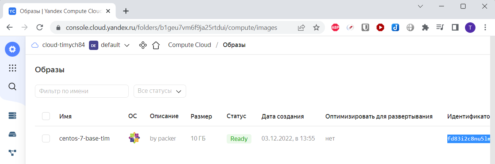
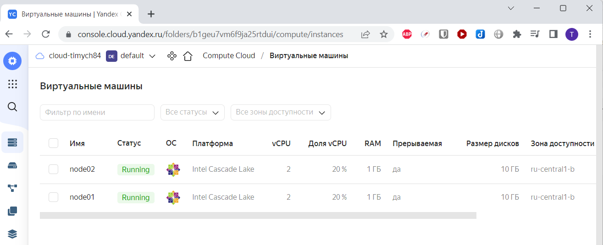
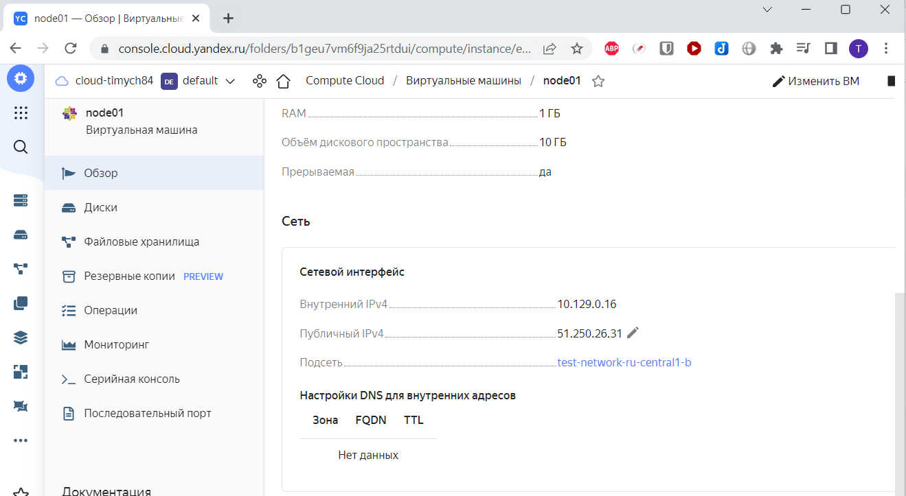
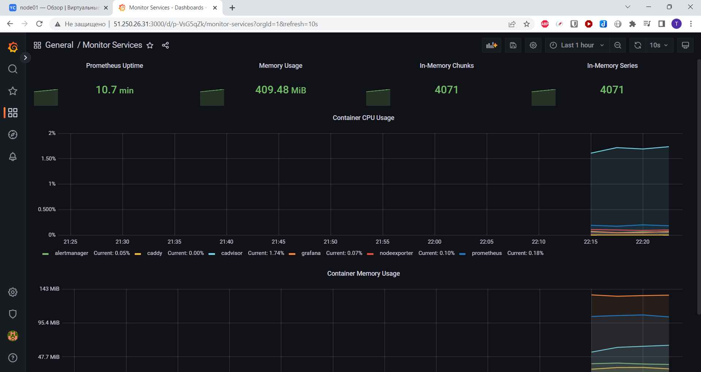
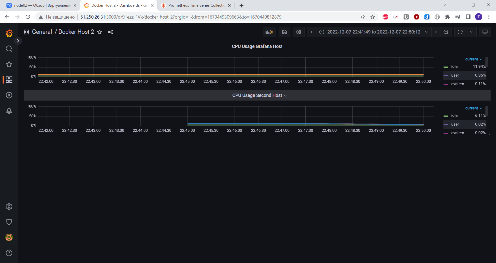
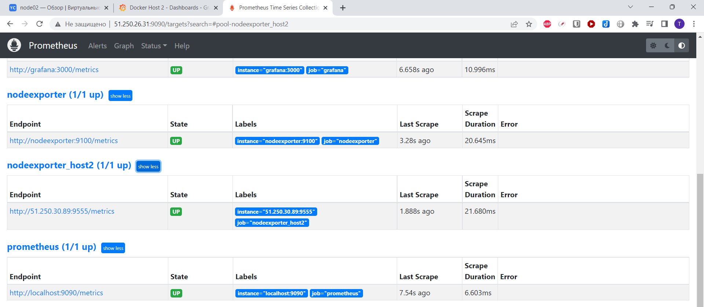

# Домашнее задание к занятию "4. Оркестрация группой Docker контейнеров на примере Docker Compose"

## Задача 1

Создать собственный образ  любой операционной системы (например, centos-7) с помощью Packer ([инструкция](https://cloud.yandex.ru/docs/tutorials/infrastructure-management/packer-quickstart))

Для получения зачета вам необходимо предоставить скриншот страницы с созданным образом из личного кабинета YandexCloud.

 

## Задача 2

Создать вашу первую виртуальную машину в YandexCloud.

Для получения зачета, вам необходимо предоставить cкриншот страницы свойств созданной ВМ из личного кабинета YandexCloud.

 
 

## Задача 3

Создать ваш первый готовый к боевой эксплуатации компонент мониторинга, состоящий из стека микросервисов.

 

## Задача 4 (*)

Создать вторую ВМ и подключить её к мониторингу развёрнутому на первом сервере.

Для получения зачета, вам необходимо предоставить:
- Скриншот из Grafana, на котором будут отображаться метрики добавленного вами сервера.

