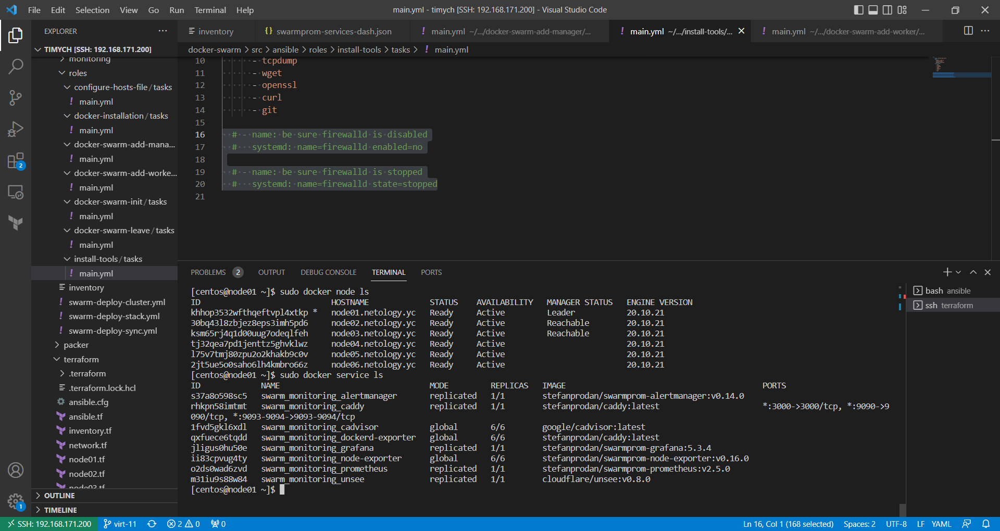
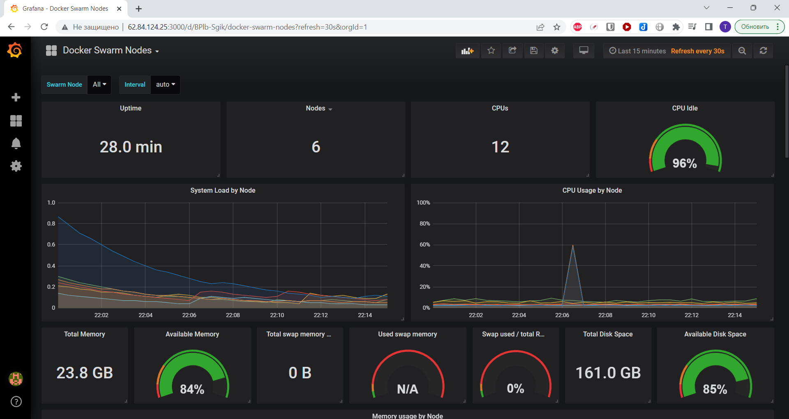
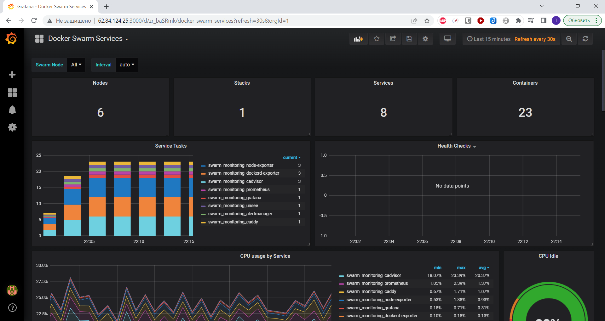

# Домашнее задание к занятию "5. Оркестрация кластером Docker контейнеров на примере Docker Swarm"

## Задача 1

Дайте письменые ответы на следующие вопросы:

- В чём отличие режимов работы сервисов в Docker Swarm кластере: replication и global?
  - replicated - можно указать количество запущенных экземпляров сервиса
  - global - сервис будет запущен на каждой ноде
- Какой алгоритм выбора лидера используется в Docker Swarm кластере?
  - Используется алгоритм распределённого консенсуса Raft. Подробно рассмотрено тут: http://thesecretlivesofdata.com/raft/
- Что такое Overlay Network?
  -Виртуальная сеть поверх существующей связи между хостами Docker Swarm, которую могут использовать контейнеры на разнвх хостах кластера. Для реализации используется технология vxlan

## Задача 2

Создать ваш первый Docker Swarm кластер в Яндекс.Облаке

Для получения зачета, вам необходимо предоставить скриншот из терминала (консоли), с выводом команды:
```
docker node ls
```

## Задача 3

Создать ваш первый, готовый к боевой эксплуатации кластер мониторинга, состоящий из стека микросервисов.

Для получения зачета, вам необходимо предоставить скриншот из терминала (консоли), с выводом команды:

```
docker service ls
```

## Ответ к задачам 2 и 3:
 
 
 

## Задача 4 (*)

Выполнить на лидере Docker Swarm кластера команду (указанную ниже) и дать письменное описание её функционала, что она делает и зачем она нужна:
```
# см.документацию: https://docs.docker.com/engine/swarm/swarm_manager_locking/
docker swarm update --autolock=true
```

Команда позволяет заблокировать кластер docker swarm и не допускает присоединения менеджера к кластеру после перезагрузки сервиса.
Для присоединения требуется ввести ключ который выводится при запуске команды docker swarm update --autolock=true.
Вывод команды:

```bash
[root@centos7-node1 ~]# docker swarm update --autolock=true
Swarm updated.
To unlock a swarm manager after it restarts, run the `docker swarm unlock`
command and provide the following key:

    SWMKEY-1-ftw7VJRKEgckMCqu/ul6PtDYr2F6QhLTNt0hkEVQHd4

Please remember to store this key in a password manager, since without it you
will not be able to restart the manager.
```

Данная технология позволяет предотвратить несанкционированный доступ к управлению кластером.
