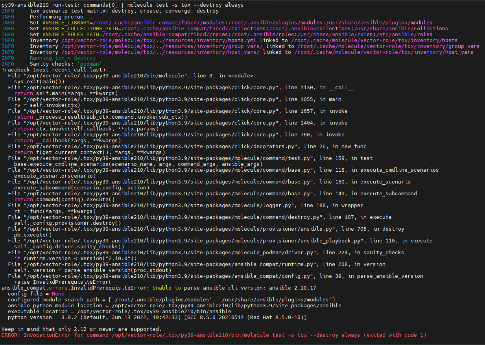
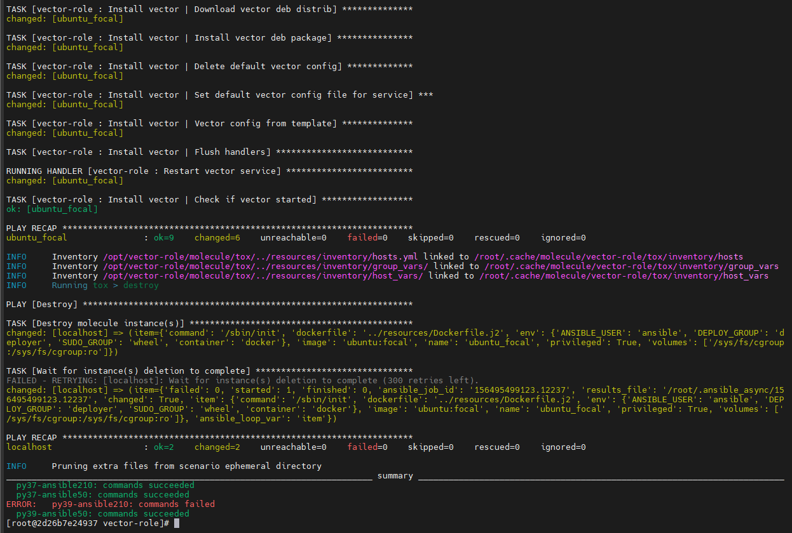

# Домашнее задание к занятию 5 «Тестирование roles»

## Подготовка к выполнению

1. Установите molecule: `pip3 install "molecule==3.5.2"`.
2. Выполните `docker pull aragast/netology:latest` —  это образ с podman, tox и несколькими пайтонами (3.7 и 3.9) внутри.

## Основная часть

Ваша цель — настроить тестирование ваших ролей.

Задача — сделать сценарии тестирования для vector.

Ожидаемый результат — все сценарии успешно проходят тестирование ролей.

### Molecule

1. Запустите  `molecule test -s centos7` внутри корневой директории clickhouse-role, посмотрите на вывод команды.
2. Перейдите в каталог с ролью vector-role и создайте сценарий тестирования по умолчанию при помощи `molecule init scenario --driver-name docker`.
3. Добавьте несколько разных дистрибутивов (centos:8, ubuntu:latest) для инстансов и протестируйте роль, исправьте найденные ошибки, если они есть.
4. Добавьте несколько assert в verify.yml-файл для  проверки работоспособности vector-role (проверка, что конфиг валидный, проверка успешности запуска и др.).
5. Запустите тестирование роли повторно и проверьте, что оно прошло успешно.
5. Добавьте новый тег на коммит с рабочим сценарием в соответствии с семантическим версионированием.

[Роль vector со сценариями тестирования](https://github.com/Timych84/vector-role)


### Tox

1. Добавьте в директорию с vector-role файлы из [директории](./example).
2. Запустите `docker run --privileged=True -v <path_to_repo>:/opt/vector-role -w /opt/vector-role -it aragast/netology:latest /bin/bash`, где path_to_repo — путь до корня репозитория с vector-role на вашей файловой системе.
3. Внутри контейнера выполните команду `tox`, посмотрите на вывод.
5. Создайте облегчённый сценарий для `molecule` с драйвером `molecule_podman`. Проверьте его на исполнимость.

Создан облегченный сценарий tox:
- converge.yml:
```yml
---
- name: Converge
  hosts: all
  tasks:
    - name: "Include vector-role"
      include_role:
        name: "vector-role"
```
- molecule.yml

```yml
---
dependency:
  name: galaxy
driver:
  name: podman
platforms:
  - name: ubuntu_focal
    image: ubuntu:focal
    dockerfile: ../resources/Dockerfile.j2
    # pre_build_image: true
    command: /sbin/init
    volumes:
      - /sys/fs/cgroup:/sys/fs/cgroup:ro
    env:
      ANSIBLE_USER: ansible
      SUDO_GROUP: wheel
      DEPLOY_GROUP: deployer
      container: docker
    privileged: True
provisioner:
  name: ansible
  inventory:
    links:
      hosts: ../resources/inventory/hosts.yml
      group_vars: ../resources/inventory/group_vars/
      host_vars: ../resources/inventory/host_vars/
verifier:
  name: ansible
scenario:
  test_sequence:
    - destroy
    - create
    - converge
    - destroy
```
- verify.yml

```yml
---
# This is an example playbook to execute Ansible tests.

- name: Verify
  hosts: all
  gather_facts: false
  tasks:
  - name: Example assertion
    assert:
      that: true
```

6. Пропишите правильную команду в `tox.ini`, чтобы запускался облегчённый сценарий.

- tox.ini(пришлось поднять версию ansible из-за ошибки совместимости с python 3.9)

```ini
[tox]
minversion = 1.8
basepython = python3.6
envlist = py{37,39}-ansible{210,50}
skipsdist = true

[testenv]
passenv = *
deps =
    -r tox-requirements.txt
    ansible210: ansible<3.0
    ansible50: ansible < 6.0
commands =
    {posargs:molecule test -s tox --destroy always}
```

7. Запустите команду `tox`. Убедитесь, что всё отработало успешно.

Не отработал вариант py39-ansible210 из-за ошибки совместимости, требуется не ниже 2.12.7
 

Результат выполнения:
 

1. Добавьте новый тег на коммит с рабочим сценарием в соответствии с семантическим версионированием.

После выполнения у вас должно получится два сценария molecule и один tox.ini файл в репозитории. Не забудьте указать в ответе теги решений Tox и Molecule заданий. В качестве решения пришлите ссылку на  ваш репозиторий и скриншоты этапов выполнения задания.

## Необязательная часть

1. Проделайте схожие манипуляции для создания роли LightHouse.

[Роль lighthouse со сценариями тестирования](https://github.com/Timych84/lighthouse_role)

2. Создайте сценарий внутри любой из своих ролей, который умеет поднимать весь стек при помощи всех ролей.

Сценарий для интеграционного теста решил создать для плейбука с тремя ролями, а не внутри одной из ролей(чтобы оставить роль в чистом виде).

- converge.yml:
```yml
---
- name: Install clickhouse
  hosts: clickhouse
  tasks:
    - name: "Include clickhouse role"
      ansible.builtin.include_role:
        name: clickhouse
  post_tasks:
    - name: Configure clickhouse | Create table for syslog
      ansible.builtin.command: "clickhouse-client -q '{{ clickhouse_syslog_create_table_query }}'"
      register: create_tbl
      failed_when: create_tbl.rc != 0 and create_db.rc != 57
      changed_when: create_tbl.rc == 0
- name: Install lighthouse
  hosts: lighthouse
  tasks:
    - name: "Include lighthouse role"
      ansible.builtin.include_role:
        name: lighthouse-role
- name: Install Vector
  hosts: vector
  vars:
    clickhouse_ipaddress: "{{ hostvars['clickhouse']['ansible_default_ipv4']['address'] }}"
  tasks:
    - name: "Include vector role"
      ansible.builtin.include_role:
        name: vector-role
```
- molecule.yml

```yml
---
dependency:
  name: galaxy
driver:
  name: docker
platforms:
  - name: clickhouse
    image: centos:7
    dockerfile: ../resources/Dockerfile.j2
    # pre_build_image: true
    command: /sbin/init
    capabilities:
      - SYS_ADMIN
    volumes:
      - /sys/fs/cgroup:/sys/fs/cgroup:ro
    env:
      ANSIBLE_USER: ansible
      SUDO_GROUP: wheel
      DEPLOY_GROUP: deployer
      container: docker
    privileged: True
  - name: vector
    image: centos:7
    dockerfile: ../resources/Dockerfile.j2
    # pre_build_image: true
    command: /sbin/init
    capabilities:
      - SYS_ADMIN
    volumes:
      - /sys/fs/cgroup:/sys/fs/cgroup:ro
    env:
      ANSIBLE_USER: ansible
      SUDO_GROUP: wheel
      DEPLOY_GROUP: deployer
      container: docker
    privileged: True
  - name: lighthouse
    image: centos:7
    dockerfile: ../resources/Dockerfile.j2
    # pre_build_image: true
    command: /sbin/init
    capabilities:
      - SYS_ADMIN
    volumes:
      - /sys/fs/cgroup:/sys/fs/cgroup:ro
    env:
      ANSIBLE_USER: ansible
      SUDO_GROUP: wheel
      DEPLOY_GROUP: deployer
      container: docker
    privileged: True
provisioner:
  name: ansible
  env:
    ANSIBLE_ROLES_PATH: "../../roles"
  inventory:
    links:
      hosts: ../resources/inventory/hosts.yml
      group_vars: ../resources/inventory/group_vars/
      host_vars: ../resources/inventory/host_vars/
verifier:
  name: ansible
```


3. Убедитесь в работоспособности своего стека. Создайте отдельный verify.yml, который будет проверять работоспособность интеграции всех инструментов между ними.

verify.yml выполняется на стороне контейнера с clickhouse и проверяет приходят ли логи от Vector запросом к соответствующей таблице, а также curl к Lighthouse на предмет проверки работоспособности nginx.

- verify.yml:
```yml
---
# This is an example playbook to execute Ansible tests.

- name: Verify
  hosts: all
  gather_facts: true
  tasks:
    - name: Example assertion
      ansible.builtin.assert:
        that: true
- name: Verify
  hosts: clickhouse
  gather_facts: true
  tasks:
    - name: Verify stack | Select count from table for syslog
      ansible.builtin.command: "clickhouse-client -q '{{ clickhouse_syslog_select_table_query }}'"
      register: create_db
      changed_when: create_db.rc == 0
    - name: Verify stack | Print logs count
      ansible.builtin.debug:
        var: create_db.stdout
    - name: Verify stack | Pause for 10 seconds for additional log entries
      ansible.builtin.pause:
        seconds: 10
    - name: Verify stack | Select count from table for syslog
      ansible.builtin.command: "clickhouse-client -q '{{ clickhouse_syslog_select_table_query }}'"
      register: create_db_2
      changed_when: create_db_2.rc == 0
    - name: Verify stack | Print logs count after pause
      ansible.builtin.debug:
        var: create_db_2.stdout
    - name: Verify stack | Check if later log count larger than earlier log count
      ansible.builtin.assert:
        that:
          - create_db_2.stdout > create_db.stdout
        fail_msg: "Later log count not larger than earlier log count"
    - name: Verify stack | curl from clickhouse to lighthouse
      ansible.builtin.uri:
        url: "http://{{ hostvars['lighthouse']['ansible_default_ipv4']['address'] }}"
```


  <details>
      <summary>Результат molecule test</summary>

  ```bash
  timych@timych-ubu2:~/roles_clickhouse_vector_lighthouse/playbook$ molecule test
  INFO     default scenario test matrix: dependency, lint, cleanup, destroy, syntax, create, prepare, converge, idempotence, side_effect, verify, cleanup, destroy
  INFO     Performing prerun...
  INFO     Running ansible-galaxy role install -vr requirements.yml --roles-path /home/timych/.cache/ansible-compat/2f2cc2/roles
  INFO     Set ANSIBLE_LIBRARY=/home/timych/.cache/ansible-compat/2f2cc2/modules:/home/timych/.ansible/plugins/modules:/usr/share/ansible/plugins/modules
  INFO     Set ANSIBLE_COLLECTIONS_PATH=/home/timych/.cache/ansible-compat/2f2cc2/collections:/home/timych/.ansible/collections:/usr/share/ansible/collections
  INFO     Set ANSIBLE_ROLES_PATH=/home/timych/.cache/ansible-compat/2f2cc2/roles:roles:/home/timych/.ansible/roles:/usr/share/ansible/roles:/etc/ansible/roles
  INFO     Inventory /home/timych/roles_clickhouse_vector_lighthouse/playbook/molecule/default/../resources/inventory/hosts.yml linked to /home/timych/.cache/molecule/playbook/default/inventory/hosts
  INFO     Inventory /home/timych/roles_clickhouse_vector_lighthouse/playbook/molecule/default/../resources/inventory/group_vars/ linked to /home/timych/.cache/molecule/playbook/default/inventory/group_vars
  INFO     Inventory /home/timych/roles_clickhouse_vector_lighthouse/playbook/molecule/default/../resources/inventory/host_vars/ linked to /home/timych/.cache/molecule/playbook/default/inventory/host_vars
  INFO     Running default > dependency
  WARNING  Skipping, missing the requirements file.
  WARNING  Skipping, missing the requirements file.
  INFO     Inventory /home/timych/roles_clickhouse_vector_lighthouse/playbook/molecule/default/../resources/inventory/hosts.yml linked to /home/timych/.cache/molecule/playbook/default/inventory/hosts
  INFO     Inventory /home/timych/roles_clickhouse_vector_lighthouse/playbook/molecule/default/../resources/inventory/group_vars/ linked to /home/timych/.cache/molecule/playbook/default/inventory/group_vars
  INFO     Inventory /home/timych/roles_clickhouse_vector_lighthouse/playbook/molecule/default/../resources/inventory/host_vars/ linked to /home/timych/.cache/molecule/playbook/default/inventory/host_vars
  INFO     Running default > lint
  INFO     Lint is disabled.
  INFO     Inventory /home/timych/roles_clickhouse_vector_lighthouse/playbook/molecule/default/../resources/inventory/hosts.yml linked to /home/timych/.cache/molecule/playbook/default/inventory/hosts
  INFO     Inventory /home/timych/roles_clickhouse_vector_lighthouse/playbook/molecule/default/../resources/inventory/group_vars/ linked to /home/timych/.cache/molecule/playbook/default/inventory/group_vars
  INFO     Inventory /home/timych/roles_clickhouse_vector_lighthouse/playbook/molecule/default/../resources/inventory/host_vars/ linked to /home/timych/.cache/molecule/playbook/default/inventory/host_vars
  INFO     Running default > cleanup
  WARNING  Skipping, cleanup playbook not configured.
  INFO     Inventory /home/timych/roles_clickhouse_vector_lighthouse/playbook/molecule/default/../resources/inventory/hosts.yml linked to /home/timych/.cache/molecule/playbook/default/inventory/hosts
  INFO     Inventory /home/timych/roles_clickhouse_vector_lighthouse/playbook/molecule/default/../resources/inventory/group_vars/ linked to /home/timych/.cache/molecule/playbook/default/inventory/group_vars
  INFO     Inventory /home/timych/roles_clickhouse_vector_lighthouse/playbook/molecule/default/../resources/inventory/host_vars/ linked to /home/timych/.cache/molecule/playbook/default/inventory/host_vars
  INFO     Running default > destroy
  INFO     Sanity checks: 'docker'

  PLAY [Destroy] *****************************************************************

  TASK [Destroy molecule instance(s)] ********************************************
  changed: [localhost] => (item=clickhouse)
  changed: [localhost] => (item=vector)
  changed: [localhost] => (item=lighthouse)

  TASK [Wait for instance(s) deletion to complete] *******************************
  ok: [localhost] => (item=clickhouse)
  ok: [localhost] => (item=vector)
  ok: [localhost] => (item=lighthouse)

  TASK [Delete docker networks(s)] ***********************************************

  PLAY RECAP *********************************************************************
  localhost                  : ok=2    changed=1    unreachable=0    failed=0    skipped=1    rescued=0    ignored=0

  INFO     Inventory /home/timych/roles_clickhouse_vector_lighthouse/playbook/molecule/default/../resources/inventory/hosts.yml linked to /home/timych/.cache/molecule/playbook/default/inventory/hosts
  INFO     Inventory /home/timych/roles_clickhouse_vector_lighthouse/playbook/molecule/default/../resources/inventory/group_vars/ linked to /home/timych/.cache/molecule/playbook/default/inventory/group_vars
  INFO     Inventory /home/timych/roles_clickhouse_vector_lighthouse/playbook/molecule/default/../resources/inventory/host_vars/ linked to /home/timych/.cache/molecule/playbook/default/inventory/host_vars
  INFO     Running default > syntax

  playbook: /home/timych/roles_clickhouse_vector_lighthouse/playbook/molecule/default/converge.yml
  INFO     Inventory /home/timych/roles_clickhouse_vector_lighthouse/playbook/molecule/default/../resources/inventory/hosts.yml linked to /home/timych/.cache/molecule/playbook/default/inventory/hosts
  INFO     Inventory /home/timych/roles_clickhouse_vector_lighthouse/playbook/molecule/default/../resources/inventory/group_vars/ linked to /home/timych/.cache/molecule/playbook/default/inventory/group_vars
  INFO     Inventory /home/timych/roles_clickhouse_vector_lighthouse/playbook/molecule/default/../resources/inventory/host_vars/ linked to /home/timych/.cache/molecule/playbook/default/inventory/host_vars
  INFO     Running default > create

  PLAY [Create] ******************************************************************

  TASK [Log into a Docker registry] **********************************************
  skipping: [localhost] => (item=None)
  skipping: [localhost] => (item=None)
  skipping: [localhost] => (item=None)
  skipping: [localhost]

  TASK [Check presence of custom Dockerfiles] ************************************
  ok: [localhost] => (item={'capabilities': ['SYS_ADMIN'], 'command': '/sbin/init', 'dockerfile': '../resources/Dockerfile.j2', 'env': {'ANSIBLE_USER': 'ansible', 'DEPLOY_GROUP': 'deployer', 'SUDO_GROUP': 'wheel', 'container': 'docker'}, 'image': 'centos:7', 'name': 'clickhouse', 'privileged': True, 'volumes': ['/sys/fs/cgroup:/sys/fs/cgroup:ro']})
  ok: [localhost] => (item={'capabilities': ['SYS_ADMIN'], 'command': '/sbin/init', 'dockerfile': '../resources/Dockerfile.j2', 'env': {'ANSIBLE_USER': 'ansible', 'DEPLOY_GROUP': 'deployer', 'SUDO_GROUP': 'wheel', 'container': 'docker'}, 'image': 'centos:7', 'name': 'vector', 'privileged': True, 'volumes': ['/sys/fs/cgroup:/sys/fs/cgroup:ro']})
  ok: [localhost] => (item={'capabilities': ['SYS_ADMIN'], 'command': '/sbin/init', 'dockerfile': '../resources/Dockerfile.j2', 'env': {'ANSIBLE_USER': 'ansible', 'DEPLOY_GROUP': 'deployer', 'SUDO_GROUP': 'wheel', 'container': 'docker'}, 'image': 'centos:7', 'name': 'lighthouse', 'privileged': True, 'volumes': ['/sys/fs/cgroup:/sys/fs/cgroup:ro']})

  TASK [Create Dockerfiles from image names] *************************************
  changed: [localhost] => (item={'capabilities': ['SYS_ADMIN'], 'command': '/sbin/init', 'dockerfile': '../resources/Dockerfile.j2', 'env': {'ANSIBLE_USER': 'ansible', 'DEPLOY_GROUP': 'deployer', 'SUDO_GROUP': 'wheel', 'container': 'docker'}, 'image': 'centos:7', 'name': 'clickhouse', 'privileged': True, 'volumes': ['/sys/fs/cgroup:/sys/fs/cgroup:ro']})
  ok: [localhost] => (item={'capabilities': ['SYS_ADMIN'], 'command': '/sbin/init', 'dockerfile': '../resources/Dockerfile.j2', 'env': {'ANSIBLE_USER': 'ansible', 'DEPLOY_GROUP': 'deployer', 'SUDO_GROUP': 'wheel', 'container': 'docker'}, 'image': 'centos:7', 'name': 'vector', 'privileged': True, 'volumes': ['/sys/fs/cgroup:/sys/fs/cgroup:ro']})
  ok: [localhost] => (item={'capabilities': ['SYS_ADMIN'], 'command': '/sbin/init', 'dockerfile': '../resources/Dockerfile.j2', 'env': {'ANSIBLE_USER': 'ansible', 'DEPLOY_GROUP': 'deployer', 'SUDO_GROUP': 'wheel', 'container': 'docker'}, 'image': 'centos:7', 'name': 'lighthouse', 'privileged': True, 'volumes': ['/sys/fs/cgroup:/sys/fs/cgroup:ro']})

  TASK [Discover local Docker images] ********************************************
  ok: [localhost] => (item={'diff': [], 'dest': '/home/timych/.cache/molecule/playbook/default/Dockerfile_centos_7', 'src': '/home/timych/.ansible/tmp/ansible-tmp-1678045002.7724006-2467-72033726626190/source', 'md5sum': '31351494d15c9d2e4048ba373fdb0c61', 'checksum': '09587a5a0380ebb02d112bf6519f22dd95746d56', 'changed': True, 'uid': 1000, 'gid': 1000, 'owner': 'timych', 'group': 'timych', 'mode': '0600', 'state': 'file', 'size': 2196, 'invocation': {'module_args': {'src': '/home/timych/.ansible/tmp/ansible-tmp-1678045002.7724006-2467-72033726626190/source', 'dest': '/home/timych/.cache/molecule/playbook/default/Dockerfile_centos_7', 'mode': '0600', 'follow': False, '_original_basename': 'Dockerfile.j2', 'checksum': '09587a5a0380ebb02d112bf6519f22dd95746d56', 'backup': False, 'force': True, 'unsafe_writes': False, 'content': None, 'validate': None, 'directory_mode': None, 'remote_src': None, 'local_follow': None, 'owner': None, 'group': None, 'seuser': None, 'serole': None, 'selevel': None, 'setype': None, 'attributes': None}}, 'failed': False, 'item': {'capabilities': ['SYS_ADMIN'], 'command': '/sbin/init', 'dockerfile': '../resources/Dockerfile.j2', 'env': {'ANSIBLE_USER': 'ansible', 'DEPLOY_GROUP': 'deployer', 'SUDO_GROUP': 'wheel', 'container': 'docker'}, 'image': 'centos:7', 'name': 'clickhouse', 'privileged': True, 'volumes': ['/sys/fs/cgroup:/sys/fs/cgroup:ro']}, 'ansible_loop_var': 'item', 'i': 0, 'ansible_index_var': 'i'})
  ok: [localhost] => (item={'diff': {'before': {'path': '/home/timych/.cache/molecule/playbook/default/Dockerfile_centos_7'}, 'after': {'path': '/home/timych/.cache/molecule/playbook/default/Dockerfile_centos_7'}}, 'path': '/home/timych/.cache/molecule/playbook/default/Dockerfile_centos_7', 'changed': False, 'uid': 1000, 'gid': 1000, 'owner': 'timych', 'group': 'timych', 'mode': '0600', 'state': 'file', 'size': 2196, 'invocation': {'module_args': {'mode': '0600', 'dest': '/home/timych/.cache/molecule/playbook/default/Dockerfile_centos_7', '_original_basename': 'Dockerfile.j2', 'recurse': False, 'state': 'file', 'path': '/home/timych/.cache/molecule/playbook/default/Dockerfile_centos_7', 'force': False, 'follow': True, 'modification_time_format': '%Y%m%d%H%M.%S', 'access_time_format': '%Y%m%d%H%M.%S', 'unsafe_writes': False, '_diff_peek': None, 'src': None, 'modification_time': None, 'access_time': None, 'owner': None, 'group': None, 'seuser': None, 'serole': None, 'selevel': None, 'setype': None, 'attributes': None}}, 'checksum': '09587a5a0380ebb02d112bf6519f22dd95746d56', 'dest': '/home/timych/.cache/molecule/playbook/default/Dockerfile_centos_7', 'failed': False, 'item': {'capabilities': ['SYS_ADMIN'], 'command': '/sbin/init', 'dockerfile': '../resources/Dockerfile.j2', 'env': {'ANSIBLE_USER': 'ansible', 'DEPLOY_GROUP': 'deployer', 'SUDO_GROUP': 'wheel', 'container': 'docker'}, 'image': 'centos:7', 'name': 'vector', 'privileged': True, 'volumes': ['/sys/fs/cgroup:/sys/fs/cgroup:ro']}, 'ansible_loop_var': 'item', 'i': 1, 'ansible_index_var': 'i'})
  ok: [localhost] => (item={'diff': {'before': {'path': '/home/timych/.cache/molecule/playbook/default/Dockerfile_centos_7'}, 'after': {'path': '/home/timych/.cache/molecule/playbook/default/Dockerfile_centos_7'}}, 'path': '/home/timych/.cache/molecule/playbook/default/Dockerfile_centos_7', 'changed': False, 'uid': 1000, 'gid': 1000, 'owner': 'timych', 'group': 'timych', 'mode': '0600', 'state': 'file', 'size': 2196, 'invocation': {'module_args': {'mode': '0600', 'dest': '/home/timych/.cache/molecule/playbook/default/Dockerfile_centos_7', '_original_basename': 'Dockerfile.j2', 'recurse': False, 'state': 'file', 'path': '/home/timych/.cache/molecule/playbook/default/Dockerfile_centos_7', 'force': False, 'follow': True, 'modification_time_format': '%Y%m%d%H%M.%S', 'access_time_format': '%Y%m%d%H%M.%S', 'unsafe_writes': False, '_diff_peek': None, 'src': None, 'modification_time': None, 'access_time': None, 'owner': None, 'group': None, 'seuser': None, 'serole': None, 'selevel': None, 'setype': None, 'attributes': None}}, 'checksum': '09587a5a0380ebb02d112bf6519f22dd95746d56', 'dest': '/home/timych/.cache/molecule/playbook/default/Dockerfile_centos_7', 'failed': False, 'item': {'capabilities': ['SYS_ADMIN'], 'command': '/sbin/init', 'dockerfile': '../resources/Dockerfile.j2', 'env': {'ANSIBLE_USER': 'ansible', 'DEPLOY_GROUP': 'deployer', 'SUDO_GROUP': 'wheel', 'container': 'docker'}, 'image': 'centos:7', 'name': 'lighthouse', 'privileged': True, 'volumes': ['/sys/fs/cgroup:/sys/fs/cgroup:ro']}, 'ansible_loop_var': 'item', 'i': 2, 'ansible_index_var': 'i'})

  TASK [Build an Ansible compatible image (new)] *********************************
  ok: [localhost] => (item=molecule_local/centos:7)
  ok: [localhost] => (item=molecule_local/centos:7)
  ok: [localhost] => (item=molecule_local/centos:7)

  TASK [Create docker network(s)] ************************************************

  TASK [Determine the CMD directives] ********************************************
  ok: [localhost] => (item={'capabilities': ['SYS_ADMIN'], 'command': '/sbin/init', 'dockerfile': '../resources/Dockerfile.j2', 'env': {'ANSIBLE_USER': 'ansible', 'DEPLOY_GROUP': 'deployer', 'SUDO_GROUP': 'wheel', 'container': 'docker'}, 'image': 'centos:7', 'name': 'clickhouse', 'privileged': True, 'volumes': ['/sys/fs/cgroup:/sys/fs/cgroup:ro']})
  ok: [localhost] => (item={'capabilities': ['SYS_ADMIN'], 'command': '/sbin/init', 'dockerfile': '../resources/Dockerfile.j2', 'env': {'ANSIBLE_USER': 'ansible', 'DEPLOY_GROUP': 'deployer', 'SUDO_GROUP': 'wheel', 'container': 'docker'}, 'image': 'centos:7', 'name': 'vector', 'privileged': True, 'volumes': ['/sys/fs/cgroup:/sys/fs/cgroup:ro']})
  ok: [localhost] => (item={'capabilities': ['SYS_ADMIN'], 'command': '/sbin/init', 'dockerfile': '../resources/Dockerfile.j2', 'env': {'ANSIBLE_USER': 'ansible', 'DEPLOY_GROUP': 'deployer', 'SUDO_GROUP': 'wheel', 'container': 'docker'}, 'image': 'centos:7', 'name': 'lighthouse', 'privileged': True, 'volumes': ['/sys/fs/cgroup:/sys/fs/cgroup:ro']})

  TASK [Create molecule instance(s)] *********************************************
  changed: [localhost] => (item=clickhouse)
  changed: [localhost] => (item=vector)
  changed: [localhost] => (item=lighthouse)

  TASK [Wait for instance(s) creation to complete] *******************************
  FAILED - RETRYING: [localhost]: Wait for instance(s) creation to complete (300 retries left).
  changed: [localhost] => (item={'failed': 0, 'started': 1, 'finished': 0, 'ansible_job_id': '607135508669.2889', 'results_file': '/home/timych/.ansible_async/607135508669.2889', 'changed': True, 'item': {'capabilities': ['SYS_ADMIN'], 'command': '/sbin/init', 'dockerfile': '../resources/Dockerfile.j2', 'env': {'ANSIBLE_USER': 'ansible', 'DEPLOY_GROUP': 'deployer', 'SUDO_GROUP': 'wheel', 'container': 'docker'}, 'image': 'centos:7', 'name': 'clickhouse', 'privileged': True, 'volumes': ['/sys/fs/cgroup:/sys/fs/cgroup:ro']}, 'ansible_loop_var': 'item'})
  changed: [localhost] => (item={'failed': 0, 'started': 1, 'finished': 0, 'ansible_job_id': '878015373442.2917', 'results_file': '/home/timych/.ansible_async/878015373442.2917', 'changed': True, 'item': {'capabilities': ['SYS_ADMIN'], 'command': '/sbin/init', 'dockerfile': '../resources/Dockerfile.j2', 'env': {'ANSIBLE_USER': 'ansible', 'DEPLOY_GROUP': 'deployer', 'SUDO_GROUP': 'wheel', 'container': 'docker'}, 'image': 'centos:7', 'name': 'vector', 'privileged': True, 'volumes': ['/sys/fs/cgroup:/sys/fs/cgroup:ro']}, 'ansible_loop_var': 'item'})
  changed: [localhost] => (item={'failed': 0, 'started': 1, 'finished': 0, 'ansible_job_id': '272633938746.2944', 'results_file': '/home/timych/.ansible_async/272633938746.2944', 'changed': True, 'item': {'capabilities': ['SYS_ADMIN'], 'command': '/sbin/init', 'dockerfile': '../resources/Dockerfile.j2', 'env': {'ANSIBLE_USER': 'ansible', 'DEPLOY_GROUP': 'deployer', 'SUDO_GROUP': 'wheel', 'container': 'docker'}, 'image': 'centos:7', 'name': 'lighthouse', 'privileged': True, 'volumes': ['/sys/fs/cgroup:/sys/fs/cgroup:ro']}, 'ansible_loop_var': 'item'})

  PLAY RECAP *********************************************************************
  localhost                  : ok=7    changed=3    unreachable=0    failed=0    skipped=2    rescued=0    ignored=0

  INFO     Inventory /home/timych/roles_clickhouse_vector_lighthouse/playbook/molecule/default/../resources/inventory/hosts.yml linked to /home/timych/.cache/molecule/playbook/default/inventory/hosts
  INFO     Inventory /home/timych/roles_clickhouse_vector_lighthouse/playbook/molecule/default/../resources/inventory/group_vars/ linked to /home/timych/.cache/molecule/playbook/default/inventory/group_vars
  INFO     Inventory /home/timych/roles_clickhouse_vector_lighthouse/playbook/molecule/default/../resources/inventory/host_vars/ linked to /home/timych/.cache/molecule/playbook/default/inventory/host_vars
  INFO     Running default > prepare
  WARNING  Skipping, prepare playbook not configured.
  INFO     Inventory /home/timych/roles_clickhouse_vector_lighthouse/playbook/molecule/default/../resources/inventory/hosts.yml linked to /home/timych/.cache/molecule/playbook/default/inventory/hosts
  INFO     Inventory /home/timych/roles_clickhouse_vector_lighthouse/playbook/molecule/default/../resources/inventory/group_vars/ linked to /home/timych/.cache/molecule/playbook/default/inventory/group_vars
  INFO     Inventory /home/timych/roles_clickhouse_vector_lighthouse/playbook/molecule/default/../resources/inventory/host_vars/ linked to /home/timych/.cache/molecule/playbook/default/inventory/host_vars
  INFO     Running default > converge

  PLAY [Install clickhouse] ******************************************************

  TASK [Gathering Facts] *********************************************************
  ok: [clickhouse]

  TASK [Include clickhouse role] *************************************************

  TASK [clickhouse : Include OS Family Specific Variables] ***********************
  ok: [clickhouse]

  TASK [clickhouse : include_tasks] **********************************************
  included: /home/timych/roles_clickhouse_vector_lighthouse/playbook/roles/clickhouse/tasks/precheck.yml for clickhouse

  TASK [clickhouse : Requirements check | Checking sse4_2 support] ***************
  ok: [clickhouse]

  TASK [clickhouse : Requirements check | Not supported distribution && release] ***
  skipping: [clickhouse]

  TASK [clickhouse : include_tasks] **********************************************
  included: /home/timych/roles_clickhouse_vector_lighthouse/playbook/roles/clickhouse/tasks/params.yml for clickhouse

  TASK [clickhouse : Set clickhouse_service_enable] ******************************
  ok: [clickhouse]

  TASK [clickhouse : Set clickhouse_service_ensure] ******************************
  ok: [clickhouse]

  TASK [clickhouse : include_tasks] **********************************************
  included: /home/timych/roles_clickhouse_vector_lighthouse/playbook/roles/clickhouse/tasks/install/yum.yml for clickhouse

  TASK [clickhouse : Install by YUM | Ensure clickhouse repo GPG key imported] ***
  changed: [clickhouse]

  TASK [clickhouse : Install by YUM | Ensure clickhouse repo installed] **********
  changed: [clickhouse]

  TASK [clickhouse : Install by YUM | Ensure clickhouse package installed (latest)] ***
  changed: [clickhouse]

  TASK [clickhouse : Install by YUM | Ensure clickhouse package installed (version latest)] ***
  skipping: [clickhouse]

  TASK [clickhouse : include_tasks] **********************************************
  included: /home/timych/roles_clickhouse_vector_lighthouse/playbook/roles/clickhouse/tasks/configure/sys.yml for clickhouse

  TASK [clickhouse : Check clickhouse config, data and logs] *********************
  ok: [clickhouse] => (item=/var/log/clickhouse-server)
  changed: [clickhouse] => (item=/etc/clickhouse-server)
  changed: [clickhouse] => (item=/var/lib/clickhouse/tmp/)
  changed: [clickhouse] => (item=/var/lib/clickhouse/)

  TASK [clickhouse : Config | Create config.d folder] ****************************
  changed: [clickhouse]

  TASK [clickhouse : Config | Create users.d folder] *****************************
  changed: [clickhouse]

  TASK [clickhouse : Config | Generate system config] ****************************
  changed: [clickhouse]

  TASK [clickhouse : Config | Generate users config] *****************************
  changed: [clickhouse]

  TASK [clickhouse : Config | Generate remote_servers config] ********************
  skipping: [clickhouse]

  TASK [clickhouse : Config | Generate macros config] ****************************
  skipping: [clickhouse]

  TASK [clickhouse : Config | Generate zookeeper servers config] *****************
  skipping: [clickhouse]

  TASK [clickhouse : Config | Fix interserver_http_port and intersever_https_port collision] ***
  skipping: [clickhouse]

  TASK [clickhouse : Notify Handlers Now] ****************************************

  RUNNING HANDLER [clickhouse : Restart Clickhouse Service] **********************
  ok: [clickhouse]

  TASK [clickhouse : include_tasks] **********************************************
  included: /home/timych/roles_clickhouse_vector_lighthouse/playbook/roles/clickhouse/tasks/service.yml for clickhouse

  TASK [clickhouse : Ensure clickhouse-server.service is enabled: True and state: restarted] ***
  changed: [clickhouse]

  TASK [clickhouse : Wait for Clickhouse Server to Become Ready] *****************
  ok: [clickhouse]

  TASK [clickhouse : include_tasks] **********************************************
  included: /home/timych/roles_clickhouse_vector_lighthouse/playbook/roles/clickhouse/tasks/configure/db.yml for clickhouse

  TASK [clickhouse : Set ClickHose Connection String] ****************************
  ok: [clickhouse]

  TASK [clickhouse : Gather list of existing databases] **************************
  ok: [clickhouse]

  TASK [clickhouse : Config | Delete database config] ****************************
  skipping: [clickhouse] => (item={'name': 'logs'})

  TASK [clickhouse : Config | Create database config] ****************************
  changed: [clickhouse] => (item={'name': 'logs'})

  TASK [clickhouse : include_tasks] **********************************************
  included: /home/timych/roles_clickhouse_vector_lighthouse/playbook/roles/clickhouse/tasks/configure/dict.yml for clickhouse

  TASK [clickhouse : Config | Generate dictionary config] ************************
  skipping: [clickhouse]

  TASK [clickhouse : include_tasks] **********************************************
  skipping: [clickhouse]

  TASK [Configure clickhouse | Create table for syslog] **************************
  changed: [clickhouse]

  PLAY [Install lighthouse] ******************************************************

  TASK [Gathering Facts] *********************************************************
  ok: [lighthouse]

  TASK [Include lighthouse role] *************************************************

  TASK [lighthouse-role : Install Lighthouse | Include pkg_mgr tasks] ************
  included: /home/timych/roles_clickhouse_vector_lighthouse/playbook/roles/lighthouse-role/tasks/install/yum.yml for lighthouse

  TASK [lighthouse-role : Install lighthouse | Set Nginx user] *******************
  ok: [lighthouse]

  TASK [lighthouse-role : Install lighthouse | Install epel repo] ****************
  changed: [lighthouse]

  TASK [lighthouse-role : Install lighthouse | Install nginx, git, rsync and firewalld] ***
  changed: [lighthouse]

  TASK [lighthouse-role : Install lighthouse | Flush handlers] *******************

  RUNNING HANDLER [lighthouse-role : Restart nginx service] **********************
  changed: [lighthouse]

  RUNNING HANDLER [lighthouse-role : Restart firewalld service] ******************
  changed: [lighthouse]

  TASK [lighthouse-role : Install lighthouse | Clone a lighthouse repo] **********
  changed: [lighthouse]

  TASK [lighthouse-role : Install lighthouse | Copy lighthouse to site folder] ***
  changed: [lighthouse]

  TASK [lighthouse-role : Install lighthouse | Test whether SELinux is enabled] ***
  fatal: [lighthouse]: FAILED! => {"changed": false, "cmd": "/usr/sbin/selinuxenabled", "msg": "[Errno 2] No such file or directory", "rc": 2, "stderr": "", "stderr_lines": [], "stdout": "", "stdout_lines": []}
  ...ignoring

  TASK [lighthouse-role : Install lighthouse | Configure SELinux for nginx] ******
  skipping: [lighthouse]

  TASK [lighthouse-role : Install lighthouse | Open http/s port on firewalld] ****
  changed: [lighthouse] => (item=http)
  changed: [lighthouse] => (item=https)

  TASK [lighthouse-role : Install lighthouse | Rewrite nginx main config file] ***
  changed: [lighthouse]

  TASK [lighthouse-role : Install lighthouse | Rewrite nginx lighthouse config file] ***
  changed: [lighthouse]

  RUNNING HANDLER [lighthouse-role : Reload nginx service] ***********************
  changed: [lighthouse]

  PLAY [Install Vector] **********************************************************

  TASK [Gathering Facts] *********************************************************
  ok: [vector]

  TASK [Include vector role] *****************************************************

  TASK [vector-role : Install vector | Include pkg_mgr tasks] ********************
  included: /home/timych/roles_clickhouse_vector_lighthouse/playbook/roles/vector-role/tasks/install/yum.yml for vector

  TASK [vector-role : Install vector | Download vector rpm distrib] **************
  changed: [vector]

  TASK [vector-role : Install vector | Install vector rpm package] ***************
  changed: [vector]

  TASK [vector-role : Install vector | Delete default vector config] *************
  changed: [vector]

  TASK [vector-role : Install vector | Set default vector config file for service] ***
  changed: [vector]

  TASK [vector-role : Install vector | Vector config from template] **************
  changed: [vector]

  TASK [vector-role : Install vector | Flush handlers] ***************************

  RUNNING HANDLER [vector-role : Restart vector service] *************************
  changed: [vector]

  TASK [vector-role : Install vector | Check if vector started] ******************
  ok: [vector]

  PLAY RECAP *********************************************************************
  clickhouse                 : ok=27   changed=11   unreachable=0    failed=0    skipped=9    rescued=0    ignored=0
  lighthouse                 : ok=14   changed=10   unreachable=0    failed=0    skipped=1    rescued=0    ignored=1
  vector                     : ok=9    changed=6    unreachable=0    failed=0    skipped=0    rescued=0    ignored=0

  INFO     Inventory /home/timych/roles_clickhouse_vector_lighthouse/playbook/molecule/default/../resources/inventory/hosts.yml linked to /home/timych/.cache/molecule/playbook/default/inventory/hosts
  INFO     Inventory /home/timych/roles_clickhouse_vector_lighthouse/playbook/molecule/default/../resources/inventory/group_vars/ linked to /home/timych/.cache/molecule/playbook/default/inventory/group_vars
  INFO     Inventory /home/timych/roles_clickhouse_vector_lighthouse/playbook/molecule/default/../resources/inventory/host_vars/ linked to /home/timych/.cache/molecule/playbook/default/inventory/host_vars
  INFO     Running default > idempotence

  PLAY [Install clickhouse] ******************************************************

  TASK [Gathering Facts] *********************************************************
  ok: [clickhouse]

  TASK [Include clickhouse role] *************************************************

  TASK [clickhouse : Include OS Family Specific Variables] ***********************
  ok: [clickhouse]

  TASK [clickhouse : include_tasks] **********************************************
  included: /home/timych/roles_clickhouse_vector_lighthouse/playbook/roles/clickhouse/tasks/precheck.yml for clickhouse

  TASK [clickhouse : Requirements check | Checking sse4_2 support] ***************
  ok: [clickhouse]

  TASK [clickhouse : Requirements check | Not supported distribution && release] ***
  skipping: [clickhouse]

  TASK [clickhouse : include_tasks] **********************************************
  included: /home/timych/roles_clickhouse_vector_lighthouse/playbook/roles/clickhouse/tasks/params.yml for clickhouse

  TASK [clickhouse : Set clickhouse_service_enable] ******************************
  ok: [clickhouse]

  TASK [clickhouse : Set clickhouse_service_ensure] ******************************
  ok: [clickhouse]

  TASK [clickhouse : include_tasks] **********************************************
  included: /home/timych/roles_clickhouse_vector_lighthouse/playbook/roles/clickhouse/tasks/install/yum.yml for clickhouse

  TASK [clickhouse : Install by YUM | Ensure clickhouse repo GPG key imported] ***
  ok: [clickhouse]

  TASK [clickhouse : Install by YUM | Ensure clickhouse repo installed] **********
  ok: [clickhouse]

  TASK [clickhouse : Install by YUM | Ensure clickhouse package installed (latest)] ***
  ok: [clickhouse]

  TASK [clickhouse : Install by YUM | Ensure clickhouse package installed (version latest)] ***
  skipping: [clickhouse]

  TASK [clickhouse : include_tasks] **********************************************
  included: /home/timych/roles_clickhouse_vector_lighthouse/playbook/roles/clickhouse/tasks/configure/sys.yml for clickhouse

  TASK [clickhouse : Check clickhouse config, data and logs] *********************
  ok: [clickhouse] => (item=/var/log/clickhouse-server)
  ok: [clickhouse] => (item=/etc/clickhouse-server)
  ok: [clickhouse] => (item=/var/lib/clickhouse/tmp/)
  ok: [clickhouse] => (item=/var/lib/clickhouse/)

  TASK [clickhouse : Config | Create config.d folder] ****************************
  ok: [clickhouse]

  TASK [clickhouse : Config | Create users.d folder] *****************************
  ok: [clickhouse]

  TASK [clickhouse : Config | Generate system config] ****************************
  ok: [clickhouse]

  TASK [clickhouse : Config | Generate users config] *****************************
  ok: [clickhouse]

  TASK [clickhouse : Config | Generate remote_servers config] ********************
  skipping: [clickhouse]

  TASK [clickhouse : Config | Generate macros config] ****************************
  skipping: [clickhouse]

  TASK [clickhouse : Config | Generate zookeeper servers config] *****************
  skipping: [clickhouse]

  TASK [clickhouse : Config | Fix interserver_http_port and intersever_https_port collision] ***
  skipping: [clickhouse]

  TASK [clickhouse : Notify Handlers Now] ****************************************

  TASK [clickhouse : include_tasks] **********************************************
  included: /home/timych/roles_clickhouse_vector_lighthouse/playbook/roles/clickhouse/tasks/service.yml for clickhouse

  TASK [clickhouse : Ensure clickhouse-server.service is enabled: True and state: started] ***
  ok: [clickhouse]

  TASK [clickhouse : Wait for Clickhouse Server to Become Ready] *****************
  ok: [clickhouse]

  TASK [clickhouse : include_tasks] **********************************************
  included: /home/timych/roles_clickhouse_vector_lighthouse/playbook/roles/clickhouse/tasks/configure/db.yml for clickhouse

  TASK [clickhouse : Set ClickHose Connection String] ****************************
  ok: [clickhouse]

  TASK [clickhouse : Gather list of existing databases] **************************
  ok: [clickhouse]

  TASK [clickhouse : Config | Delete database config] ****************************
  skipping: [clickhouse] => (item={'name': 'logs'})

  TASK [clickhouse : Config | Create database config] ****************************
  skipping: [clickhouse] => (item={'name': 'logs'})

  TASK [clickhouse : include_tasks] **********************************************
  included: /home/timych/roles_clickhouse_vector_lighthouse/playbook/roles/clickhouse/tasks/configure/dict.yml for clickhouse

  TASK [clickhouse : Config | Generate dictionary config] ************************
  skipping: [clickhouse]

  TASK [clickhouse : include_tasks] **********************************************
  skipping: [clickhouse]

  TASK [Configure clickhouse | Create table for syslog] **************************
  ok: [clickhouse]

  PLAY [Install lighthouse] ******************************************************

  TASK [Gathering Facts] *********************************************************
  ok: [lighthouse]

  TASK [Include lighthouse role] *************************************************

  TASK [lighthouse-role : Install Lighthouse | Include pkg_mgr tasks] ************
  included: /home/timych/roles_clickhouse_vector_lighthouse/playbook/roles/lighthouse-role/tasks/install/yum.yml for lighthouse

  TASK [lighthouse-role : Install lighthouse | Set Nginx user] *******************
  ok: [lighthouse]

  TASK [lighthouse-role : Install lighthouse | Install epel repo] ****************
  ok: [lighthouse]

  TASK [lighthouse-role : Install lighthouse | Install nginx, git, rsync and firewalld] ***
  ok: [lighthouse]

  TASK [lighthouse-role : Install lighthouse | Flush handlers] *******************

  TASK [lighthouse-role : Install lighthouse | Clone a lighthouse repo] **********
  ok: [lighthouse]

  TASK [lighthouse-role : Install lighthouse | Copy lighthouse to site folder] ***
  ok: [lighthouse]

  TASK [lighthouse-role : Install lighthouse | Test whether SELinux is enabled] ***
  fatal: [lighthouse]: FAILED! => {"changed": false, "cmd": "/usr/sbin/selinuxenabled", "msg": "[Errno 2] No such file or directory", "rc": 2, "stderr": "", "stderr_lines": [], "stdout": "", "stdout_lines": []}
  ...ignoring

  TASK [lighthouse-role : Install lighthouse | Configure SELinux for nginx] ******
  skipping: [lighthouse]

  TASK [lighthouse-role : Install lighthouse | Open http/s port on firewalld] ****
  ok: [lighthouse] => (item=http)
  ok: [lighthouse] => (item=https)

  TASK [lighthouse-role : Install lighthouse | Rewrite nginx main config file] ***
  ok: [lighthouse]

  TASK [lighthouse-role : Install lighthouse | Rewrite nginx lighthouse config file] ***
  ok: [lighthouse]

  PLAY [Install Vector] **********************************************************

  TASK [Gathering Facts] *********************************************************
  ok: [vector]

  TASK [Include vector role] *****************************************************

  TASK [vector-role : Install vector | Include pkg_mgr tasks] ********************
  included: /home/timych/roles_clickhouse_vector_lighthouse/playbook/roles/vector-role/tasks/install/yum.yml for vector

  TASK [vector-role : Install vector | Download vector rpm distrib] **************
  ok: [vector]

  TASK [vector-role : Install vector | Install vector rpm package] ***************
  ok: [vector]

  TASK [vector-role : Install vector | Delete default vector config] *************
  ok: [vector]

  TASK [vector-role : Install vector | Set default vector config file for service] ***
  ok: [vector]

  TASK [vector-role : Install vector | Vector config from template] **************
  ok: [vector]

  TASK [vector-role : Install vector | Flush handlers] ***************************

  TASK [vector-role : Install vector | Check if vector started] ******************
  ok: [vector]

  PLAY RECAP *********************************************************************
  clickhouse                 : ok=25   changed=0    unreachable=0    failed=0    skipped=10   rescued=0    ignored=0
  lighthouse                 : ok=11   changed=0    unreachable=0    failed=0    skipped=1    rescued=0    ignored=1
  vector                     : ok=8    changed=0    unreachable=0    failed=0    skipped=0    rescued=0    ignored=0

  INFO     Idempotence completed successfully.
  INFO     Inventory /home/timych/roles_clickhouse_vector_lighthouse/playbook/molecule/default/../resources/inventory/hosts.yml linked to /home/timych/.cache/molecule/playbook/default/inventory/hosts
  INFO     Inventory /home/timych/roles_clickhouse_vector_lighthouse/playbook/molecule/default/../resources/inventory/group_vars/ linked to /home/timych/.cache/molecule/playbook/default/inventory/group_vars
  INFO     Inventory /home/timych/roles_clickhouse_vector_lighthouse/playbook/molecule/default/../resources/inventory/host_vars/ linked to /home/timych/.cache/molecule/playbook/default/inventory/host_vars
  INFO     Running default > side_effect
  WARNING  Skipping, side effect playbook not configured.
  INFO     Inventory /home/timych/roles_clickhouse_vector_lighthouse/playbook/molecule/default/../resources/inventory/hosts.yml linked to /home/timych/.cache/molecule/playbook/default/inventory/hosts
  INFO     Inventory /home/timych/roles_clickhouse_vector_lighthouse/playbook/molecule/default/../resources/inventory/group_vars/ linked to /home/timych/.cache/molecule/playbook/default/inventory/group_vars
  INFO     Inventory /home/timych/roles_clickhouse_vector_lighthouse/playbook/molecule/default/../resources/inventory/host_vars/ linked to /home/timych/.cache/molecule/playbook/default/inventory/host_vars
  INFO     Running default > verify
  INFO     Running Ansible Verifier

  PLAY [Verify] ******************************************************************

  TASK [Gathering Facts] *********************************************************
  ok: [lighthouse]
  ok: [clickhouse]
  ok: [vector]

  TASK [Example assertion] *******************************************************
  ok: [clickhouse] => {
      "changed": false,
      "msg": "All assertions passed"
  }
  ok: [lighthouse] => {
      "changed": false,
      "msg": "All assertions passed"
  }
  ok: [vector] => {
      "changed": false,
      "msg": "All assertions passed"
  }

  PLAY [Verify] ******************************************************************

  TASK [Gathering Facts] *********************************************************
  ok: [clickhouse]

  TASK [Verify clickhouse | Select count from table for syslog] ******************
  changed: [clickhouse]

  TASK [Print count] *************************************************************
  ok: [clickhouse] => {
      "create_db.stdout": "2062"
  }

  TASK [Pause for 10 minutes for additional log entries] *************************
  Pausing for 10 seconds
                        (ctrl+C then 'C' = continue early, ctrl+C then 'A' = abort)
                                                                                    ok: [clickhouse]

  TASK [Verify clickhouse | Select count from table for syslog] ******************
  changed: [clickhouse]

  TASK [Print count] *************************************************************
  ok: [clickhouse] => {
      "create_db_2.stdout": "2064"
  }

  TASK [Check if variables are equal] ********************************************
  ok: [clickhouse] => {
      "changed": false,
      "msg": "All assertions passed"
  }

  TASK [Verify lighthouse | curl from clickhouse to lighthouse] ******************
  ok: [clickhouse]

  PLAY RECAP *********************************************************************
  clickhouse                 : ok=10   changed=2    unreachable=0    failed=0    skipped=0    rescued=0    ignored=0
  lighthouse                 : ok=2    changed=0    unreachable=0    failed=0    skipped=0    rescued=0    ignored=0
  vector                     : ok=2    changed=0    unreachable=0    failed=0    skipped=0    rescued=0    ignored=0

  INFO     Verifier completed successfully.
  INFO     Inventory /home/timych/roles_clickhouse_vector_lighthouse/playbook/molecule/default/../resources/inventory/hosts.yml linked to /home/timych/.cache/molecule/playbook/default/inventory/hosts
  INFO     Inventory /home/timych/roles_clickhouse_vector_lighthouse/playbook/molecule/default/../resources/inventory/group_vars/ linked to /home/timych/.cache/molecule/playbook/default/inventory/group_vars
  INFO     Inventory /home/timych/roles_clickhouse_vector_lighthouse/playbook/molecule/default/../resources/inventory/host_vars/ linked to /home/timych/.cache/molecule/playbook/default/inventory/host_vars
  INFO     Running default > cleanup
  WARNING  Skipping, cleanup playbook not configured.
  INFO     Inventory /home/timych/roles_clickhouse_vector_lighthouse/playbook/molecule/default/../resources/inventory/hosts.yml linked to /home/timych/.cache/molecule/playbook/default/inventory/hosts
  INFO     Inventory /home/timych/roles_clickhouse_vector_lighthouse/playbook/molecule/default/../resources/inventory/group_vars/ linked to /home/timych/.cache/molecule/playbook/default/inventory/group_vars
  INFO     Inventory /home/timych/roles_clickhouse_vector_lighthouse/playbook/molecule/default/../resources/inventory/host_vars/ linked to /home/timych/.cache/molecule/playbook/default/inventory/host_vars
  INFO     Running default > destroy

  PLAY [Destroy] *****************************************************************

  TASK [Destroy molecule instance(s)] ********************************************
  changed: [localhost] => (item=clickhouse)
  changed: [localhost] => (item=vector)
  changed: [localhost] => (item=lighthouse)

  TASK [Wait for instance(s) deletion to complete] *******************************
  FAILED - RETRYING: [localhost]: Wait for instance(s) deletion to complete (300 retries left).
  changed: [localhost] => (item=clickhouse)
  changed: [localhost] => (item=vector)
  changed: [localhost] => (item=lighthouse)

  TASK [Delete docker networks(s)] ***********************************************

  PLAY RECAP *********************************************************************
  localhost                  : ok=2    changed=2    unreachable=0    failed=0    skipped=1    rescued=0    ignored=0

  INFO     Pruning extra files from scenario ephemeral directory
  ```

  </details>

4. Выложите свои roles в репозитории.

[Роль vector со сценариями тестирования](https://github.com/Timych84/vector-role)

[Роль lighthouse со сценариями тестирования](https://github.com/Timych84/lighthouse_role)

[Плейбук со сценарием тестирования стека Clickhouse-Vector-Lighthouse]()


В качестве решения пришлите ссылки и скриншоты этапов выполнения задания.

---

### Как оформить решение задания

Выполненное домашнее задание пришлите в виде ссылки на .md-файл в вашем репозитории.
