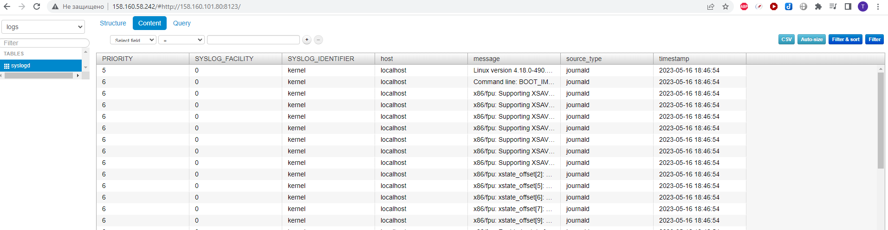

# Домашнее задание к занятию 6 «Создание собственных модулей»

## Подготовка к выполнению

1. Создайте пустой публичный репозиторий в своём любом проекте: `my_own_collection`.
2. Скачайте репозиторий Ansible: `git clone https://github.com/ansible/ansible.git` по любому, удобному вам пути.
3. Зайдите в директорию Ansible: `cd ansible`.
4. Создайте виртуальное окружение: `python3 -m venv venv`.
5. Активируйте виртуальное окружение: `. venv/bin/activate`. Дальнейшие действия производятся только в виртуальном окружении.
6. Установите зависимости `pip install -r requirements.txt`.
7. Запустите настройку окружения `. hacking/env-setup`.
8. Если все шаги прошли успешно — выйдите из виртуального окружения `deactivate`.
9. Ваше окружение настроено. Чтобы запустить его, нужно находиться в директории `ansible` и выполнить конструкцию `. venv/bin/activate && . hacking/env-setup`.

## Основная часть

Ваша цель — написать собственный module, который вы можете использовать в своей role через playbook. Всё это должно быть собрано в виде collection и отправлено в ваш репозиторий.

**Шаг 1.** В виртуальном окружении создайте новый `my_own_module.py` файл.

**Шаг 2.** Наполните его содержимым:

```python
#!/usr/bin/python

# Copyright: (c) 2018, Terry Jones <terry.jones@example.org>
# GNU General Public License v3.0+ (see COPYING or https://www.gnu.org/licenses/gpl-3.0.txt)
from __future__ import (absolute_import, division, print_function)
__metaclass__ = type

DOCUMENTATION = r'''
---
module: my_test

short_description: This is my test module

# If this is part of a collection, you need to use semantic versioning,
# i.e. the version is of the form "2.5.0" and not "2.4".
version_added: "1.0.0"

description: This is my longer description explaining my test module.

options:
    name:
        description: This is the message to send to the test module.
        required: true
        type: str
    new:
        description:
            - Control to demo if the result of this module is changed or not.
            - Parameter description can be a list as well.
        required: false
        type: bool
# Specify this value according to your collection
# in format of namespace.collection.doc_fragment_name
extends_documentation_fragment:
    - my_namespace.my_collection.my_doc_fragment_name

author:
    - Your Name (@yourGitHubHandle)
'''

EXAMPLES = r'''
# Pass in a message
- name: Test with a message
  my_namespace.my_collection.my_test:
    name: hello world

# pass in a message and have changed true
- name: Test with a message and changed output
  my_namespace.my_collection.my_test:
    name: hello world
    new: true

# fail the module
- name: Test failure of the module
  my_namespace.my_collection.my_test:
    name: fail me
'''

RETURN = r'''
# These are examples of possible return values, and in general should use other names for return values.
original_message:
    description: The original name param that was passed in.
    type: str
    returned: always
    sample: 'hello world'
message:
    description: The output message that the test module generates.
    type: str
    returned: always
    sample: 'goodbye'
'''

from ansible.module_utils.basic import AnsibleModule


def run_module():
    # define available arguments/parameters a user can pass to the module
    module_args = dict(
        name=dict(type='str', required=True),
        new=dict(type='bool', required=False, default=False)
    )

    # seed the result dict in the object
    # we primarily care about changed and state
    # changed is if this module effectively modified the target
    # state will include any data that you want your module to pass back
    # for consumption, for example, in a subsequent task
    result = dict(
        changed=False,
        original_message='',
        message=''
    )

    # the AnsibleModule object will be our abstraction working with Ansible
    # this includes instantiation, a couple of common attr would be the
    # args/params passed to the execution, as well as if the module
    # supports check mode
    module = AnsibleModule(
        argument_spec=module_args,
        supports_check_mode=True
    )

    # if the user is working with this module in only check mode we do not
    # want to make any changes to the environment, just return the current
    # state with no modifications
    if module.check_mode:
        module.exit_json(**result)

    # manipulate or modify the state as needed (this is going to be the
    # part where your module will do what it needs to do)
    result['original_message'] = module.params['name']
    result['message'] = 'goodbye'

    # use whatever logic you need to determine whether or not this module
    # made any modifications to your target
    if module.params['new']:
        result['changed'] = True

    # during the execution of the module, if there is an exception or a
    # conditional state that effectively causes a failure, run
    # AnsibleModule.fail_json() to pass in the message and the result
    if module.params['name'] == 'fail me':
        module.fail_json(msg='You requested this to fail', **result)

    # in the event of a successful module execution, you will want to
    # simple AnsibleModule.exit_json(), passing the key/value results
    module.exit_json(**result)


def main():
    run_module()


if __name__ == '__main__':
    main()
```
Или возьмите это наполнение [из статьи](https://docs.ansible.com/ansible/latest/dev_guide/developing_modules_general.html#creating-a-module).

**Шаг 3.** Заполните файл в соответствии с требованиями Ansible так, чтобы он выполнял основную задачу: module должен создавать текстовый файл на удалённом хосте по пути, определённом в параметре `path`, с содержимым, определённым в параметре `content`.

**Шаг 4.** Проверьте module на исполняемость локально.


```json
{
    "ANSIBLE_MODULE_ARGS": {
        "path": "/home/timych/testfile.txt",
        "content":  "Test content,\n ··containing \"double quotes\". Escapes (like \\n) work.\n",
        "force": false
    }
}
```


```bash
(venv) timych@timych-ubu2:~/ansible-module-develop$ python -m ansible.modules.my_own_module test.json

{"changed": true, "invocation": {"module_args": {"path": "/home/timych/testfile.txt", "content": "Test content,\n \u00b7\u00b7containing \"double quotes\". Escapes (like \\n) work.\n", "force": false}}}
(venv) timych@timych-ubu2:~/ansible-module-develop$ python -m ansible.modules.my_own_module test.json

{"changed": false, "invocation": {"module_args": {"path": "/home/timych/testfile.txt", "content": "Test content,\n \u00b7\u00b7containing \"double quotes\". Escapes (like \\n) work.\n", "force": false}}}

(venv) timych@timych-ubu2:~/ansible-module-develop$ cat /home/timych/testfile.txt
Test content,
 ··containing "double quotes". Escapes (like \n) work.
```

**Шаг 5.** Напишите single task playbook и используйте module в нём.

**Шаг 6.** Проверьте через playbook на идемпотентность.

Первый запуск:

```bash
(venv) timych@timych-ubu2:~/ansible-module-develop$ ansible-playbook -i inventory.yml playbook.yml
[WARNING]: You are running the development version of Ansible. You should only run Ansible from "devel" if you are modifying the
Ansible engine, or trying out features under development. This is a rapidly changing source of code and can become unstable at
any point.

PLAY [test my new module] *******************************************************************************************************

TASK [Gathering Facts] **********************************************************************************************************
ok: [test-server-03]

TASK [Write content to file] ****************************************************************************************************
changed: [test-server-03]

TASK [dump test output] *********************************************************************************************************
ok: [test-server-03] => {
    "msg": {
        "changed": true,
        "failed": false
    }
}

PLAY RECAP **********************************************************************************************************************
test-server-03             : ok=3    changed=1    unreachable=0    failed=0    skipped=0    rescued=0    ignored=0
```
Второй запуск:

```bash
(venv) timych@timych-ubu2:~/ansible-module-develop$ ansible-playbook -i inventory.yml playbook.yml
[WARNING]: You are running the development version of Ansible. You should only run Ansible from "devel" if you are modifying the
Ansible engine, or trying out features under development. This is a rapidly changing source of code and can become unstable at
any point.

PLAY [test my new module] *******************************************************************************************************

TASK [Gathering Facts] **********************************************************************************************************
ok: [test-server-03]

TASK [Write content to file] ****************************************************************************************************
ok: [test-server-03]

TASK [dump test output] *********************************************************************************************************
ok: [test-server-03] => {
    "msg": {
        "changed": false,
        "failed": false
    }
}

PLAY RECAP **********************************************************************************************************************
test-server-03             : ok=3    changed=0    unreachable=0    failed=0    skipped=0    rescued=0    ignored=0
```
Получаем "changed=0"

**Шаг 7.** Выйдите из виртуального окружения.

**Шаг 8.** Инициализируйте новую collection: `ansible-galaxy collection init my_own_namespace.yandex_cloud_elk`.

**Шаг 9.** В эту collection перенесите свой module в соответствующую директорию.

**Шаг 10.** Single task playbook преобразуйте в single task role и перенесите в collection. У role должны быть default всех параметров module.

**Шаг 11.** Создайте playbook для использования этой role.

```yml
---
- name: Write content
  tags: write_content
  hosts: all
  roles:
    - timych.yandex_cloud_cvl.content
  vars:
    - path: "~/testfile.txt"
    - content: "test\ncontent2"
    - force: false
```

**Шаг 12.** Заполните всю документацию по collection, выложите в свой репозиторий, поставьте тег `1.0.0` на этот коммит.

**Шаг 13.** Создайте .tar.gz этой collection: `ansible-galaxy collection build` в корневой директории collection.

**Шаг 14.** Создайте ещё одну директорию любого наименования, перенесите туда single task playbook и архив c collection.

**Шаг 15.** Установите collection из локального архива: `ansible-galaxy collection install <archivename>.tar.gz`.


```bash
timych@timych-ubu-n1:~/ansible_collection_test$ ansible-galaxy collection install timych-yandex_cloud_cvl-1.0.0.tar.gz
Starting galaxy collection install process
Process install dependency map
Starting collection install process
Installing 'timych.yandex_cloud_cvl:1.0.0' to '/home/timych/.ansible/collections/ansible_collections/timych/yandex_cloud_cvl'
timych.yandex_cloud_cvl:1.0.0 was installed successfully
```

**Шаг 16.** Запустите playbook, убедитесь, что он работает.

timych@timych-ubu-n1:~/ansible_collection_test$ ansible-playbook -i inventory.yml example_content.yml

```bash
PLAY [Write content] **********************************************************************************************************************************************************************************

TASK [Gathering Facts] ********************************************************************************************************************************************************************************
ok: [test-server-03]

TASK [timych.yandex_cloud_cvl.content : run the new module] *******************************************************************************************************************************************
changed: [test-server-03]

TASK [timych.yandex_cloud_cvl.content : dump test output] *********************************************************************************************************************************************
ok: [test-server-03] => {
    "msg": {
        "changed": true,
        "failed": false,
        "file_exists": false,
        "same_content": false,
        "target_content": "test\ncontent2"
    }
}

PLAY RECAP ********************************************************************************************************************************************************************************************
test-server-03             : ok=3    changed=1    unreachable=0    failed=0    skipped=0    rescued=0    ignored=0
```


**Шаг 17.** В ответ необходимо прислать ссылки на collection и tar.gz архив, а также скриншоты выполнения пунктов 4, 6, 15 и 16.

## Необязательная часть

1. Реализуйте свой модуль для создания хостов в Yandex Cloud.
2. Модуль может и должен иметь зависимость от `yc`, основной функционал: создание ВМ с нужным сайзингом на основе нужной ОС. Дополнительные модули по созданию кластеров ClickHouse, MySQL и прочего реализовывать не надо, достаточно простейшего создания ВМ.

    Коллекция на Github: https://github.com/Timych84/ansible-collection-cvl.git

    Модуль yc поддерживает следующие опции:
    - name - Имя
    - description - Описание
    - state - Целевое состояние
    - update - Обновлять ли параметры инстанса(требуется перезагрузка)
    - zone - Зона доступности
    - ssh_key - Ключ для авторизации пользователем yc-user
    - hostname - Имя хоста инстанса
    - memory - Количество памяти(ГБ)
    - cores - Количество ядер
    - core_fraction - Гарантированая доля ядрв
    - public_ip - Присваивать ли внешний IP
    - preemptible - Прерываемый ли инстанс
    - boot_disk - параметры диска
        - image_family - семейство ОС
        - image_folder_id - папка с образами ОС
        - size - размер диска(ГБ)
        - type - типа диска

    Примеры плейбуков:
    - Создание инстанса
    ```yml
    - name: Create instance
      hosts: control
      tasks:
        - name: Create instance
          timych.yandex_cloud_cvl.yc:
            name: "compute-instance-1"
            description: "compute-instance-1"
            ssh_key: "~/.ssh/id_rsa.pub"
            state: present
            update: false
            zone: ru-central1-a
            hostname: "compute-instance-1"
            memory: 4
            cores: 2
            core_fraction: 20
            public_ip: true
            preemptible: true
            boot_disk:
              image_family: centos-stream-8
              image_folder_id: standard-images
              size: 10
              type: network-hdd
    ```
    - Удаление инстанса
    ```yml
   - name: Destroy created instance
     hosts: control
     tasks:
       - name: Destroy created instance
         timych.yandex_cloud_cvl.yc:
           name: "compute-instance-1"
           state: absent
           zone: ru-central1-a
    ```
    - Обновление инстанса
    ```yml
   - name: Update instance
     hosts: control
     tasks:
       - name: Update instance
         timych.yandex_cloud_cvl.yc:
           name: "compute-instance-1"
           description: "compute-instance-1"
           state: present
           update: true
           zone: ru-central1-a
           memory: 2
           cores: 2
           core_fraction: 20
    ```
3. Модуль может формировать динамическое inventory, но эта часть не является обязательной, достаточно, чтобы он делал хосты с указанной спецификацией в YAML.

Создание инвентори реализовано через модуль add_host и template в плейбуке далее.

4. Протестируйте модуль на идемпотентность, исполнимость. При успехе добавьте этот модуль в свою коллекцию.
5. Измените playbook так, чтобы он умел создавать инфраструктуру под inventory, а после устанавливал весь ваш стек Observability на нужные хосты и настраивал его.

Итоговый плейбук для развертывания стека Clickhouse-Vector-Lighthouse:
- создает 3 инстанса с использованием модуля yc
- формирует in_memory inventory
- устанавливает Clickhouse, создает в нем базу logs с таблицей syslogd для записи тестовых данных syslogd из Vector\
- устанавливает Vector и настраивает отправку журналов syslogd в Clickhouse
- устанавливает Lighthouse
- на основе шаблона HostsFile.j2 формирует inventory с созданными инстансами
- выводит список внешних адресов созданных инстансов

Playbook:

```yml
    - name: Create instances
      hosts: control
      tags: crate_instances
      vars:
        instances:
          - name: 'clickhouse-01'
            description: 'clickhouse'
            memory: 2
            cores: 2
            core_fraction: 20
          - name: 'vector-01'
            description: 'vector'
            memory: 2
            cores: 2
            core_fraction: 20
          - name: 'lighthouse-01'
            description: 'lighthouse'
            memory: 2
            cores: 2
            core_fraction: 20
      tasks:
        - name: Run the YC module
          timych.yandex_cloud_cvl.yc:
            name: "{{ item.name }}"
            description: "{{ item.description }}"
            ssh_key: "~/.ssh/id_rsa.pub"
            state: present
            update: true
            zone: ru-central1-a
            hostname: "{{ item.name }}"
            memory: "{{ item.memory }}"
            cores: "{{ item.cores }}"
            core_fraction: "{{ item.core_fraction }}"
            public_ip: true
            preemptible: true
            boot_disk:
              image_family: centos-stream-8
              image_folder_id: standard-images
              size: 10
              type: network-hdd
          register: instace_result
          when: "item.name not in groups[item.description]"
          loop: "{{ instances }}"
        - name: Add hosts to in memory inventory
          ansible.builtin.add_host:
            name: '{{ item.vm.name }}'
            groups:
              - '{{ item.vm.description }}'
              - in_memory
            ansible_host: '{{ item.vm.network_interfaces[0].primary_v4_address.one_to_one_nat.address }}'
            host_description: '{{ item.vm.description }}'
          when: item.changed
          loop: "{{ instace_result.results }}"
        - name: Wait for ssh connect
          ansible.builtin.wait_for:
            port: 22
            host: '{{ item.vm.network_interfaces[0].primary_v4_address.one_to_one_nat.address }}'
            delay: 10
            timeout: 300
          when: item.changed
          loop: "{{ instace_result.results }}"
    - name: Install Clickhouse
      tags: clickhouse_install
      become: true
      hosts: clickhouse
      remote_user: yc-user
      roles:
        - timych.yandex_cloud_cvl.clickhouse
      vars_files:
        - clickhouse.yml
    - name: Configure Clickhouse
      tags: clickhouse_config
      hosts: clickhouse
      remote_user: yc-user
      become: true
      vars_files:
        - clickhouse.yml
      tasks:
        - name: Configure clickhouse | Create table for syslog
          ansible.builtin.command: "clickhouse-client  --host 127.0.0.1 -q '{{ clickhouse_syslog_table_query }}'"
          register: create_db
          failed_when: create_db.rc != 0 and create_db.rc != 57
          changed_when: create_db.rc == 0
    - name: Install Vector
      tags: vector_install
      hosts: vector
      remote_user: yc-user
      vars:
        clickhouse_ipaddress: "{{ hostvars['clickhouse-01'].ansible_host }}"
      roles:
        - timych.yandex_cloud_cvl.vector_role
    - name: Install lighthouse
      tags: lighthouse_install
      become: true
      remote_user: yc-user
      hosts: lighthouse
      roles:
        - timych.yandex_cloud_cvl.lighthouse_role
    - name: Output inventory
      hosts: control
      gather_facts: false
      tasks:
        - name: Run the Template
          ansible.builtin.template:
            src: HostsFile.j2
            dest: gen_inv.yml
            mode: '0644'
            owner: timych
            group: timych
          when: "groups['in_memory'] is defined"
        - name: Print IP Addresses
          ansible.builtin.debug:
            msg: "{{ hostvars[item].host_description }}: {{ hostvars[item].ansible_host }}"
          when: "groups['in_memory'] is defined"
          loop: "{{ groups['in_memory'] }}"
```


<details>
    <summary>Результат выполнения</summary>

```bash
root@timych-ubu-n1:/home/timych/ansible_collection_test# ansible-playbook -i inventory.yml create_site.yml

PLAY [Create instances] *******************************************************************************************************************************************************************************

TASK [Gathering Facts] ********************************************************************************************************************************************************************************
ok: [test-server-01]

TASK [Run the YC module] ******************************************************************************************************************************************************************************
changed: [test-server-01] => (item={'name': 'clickhouse-01', 'description': 'clickhouse', 'memory': 2, 'cores': 2, 'core_fraction': 20})
changed: [test-server-01] => (item={'name': 'vector-01', 'description': 'vector', 'memory': 2, 'cores': 2, 'core_fraction': 20})
changed: [test-server-01] => (item={'name': 'lighthouse-01', 'description': 'lighthouse', 'memory': 2, 'cores': 2, 'core_fraction': 20})

TASK [Add hosts to in memory inventory] ***************************************************************************************************************************************************************
ok: [test-server-01] => (item={'invocation': {'module_args': {'core_fraction': 20, 'description': 'clickhouse', 'zone': 'ru-central1-a', 'preemptible': True, 'hostname': 'clickhouse-01', 'update': True, 'ssh_key': '~/.ssh/id_rsa.pub', 'public_ip': True, 'state': 'present', 'boot_disk': {'image_family': 'centos-stream-8', 'type': 'network-hdd', 'image_folder_id': 'standard-images', 'size': 10}, 'memory': 2, 'cores': 2, 'name': 'clickhouse-01'}}, 'yc_check_installed_rc': 0, 'yc_command_result': [0, '{\n  "id": "fhmkk5q22kkua87q42uk",\n  "folder_id": "b1geu7vm6f9ja25rtdui",\n  "created_at": "2023-05-16T18:45:14Z",\n  "name": "clickhouse-01",\n  "description": "clickhouse",\n  "zone_id": "ru-central1-a",\n  "platform_id": "standard-v2",\n  "resources": {\n    "memory": "2147483648",\n    "cores": "2",\n    "core_fraction": "20"\n  },\n  "status": "RUNNING",\n  "metadata_options": {\n    "gce_http_endpoint": "ENABLED",\n    "aws_v1_http_endpoint": "ENABLED",\n    "gce_http_token": "ENABLED",\n    "aws_v1_http_token": "DISABLED"\n  },\n  "boot_disk": {\n    "mode": "READ_WRITE",\n    "device_name": "fhm071t5skhqbknj7282",\n    "auto_delete": true,\n    "disk_id": "fhm071t5skhqbknj7282"\n  },\n  "network_interfaces": [\n    {\n      "index": "0",\n      "mac_address": "d0:0d:14:a1:74:21",\n      "subnet_id": "e9b2aeoiuuvdfp6lfg7j",\n      "primary_v4_address": {\n        "address": "10.130.0.3",\n        "one_to_one_nat": {\n          "address": "158.160.101.80",\n          "ip_version": "IPV4"\n        }\n      }\n    }\n  ],\n  "fqdn": "clickhouse-01.ru-central1.internal",\n  "scheduling_policy": {\n    "preemptible": true\n  },\n  "network_settings": {\n    "type": "STANDARD"\n  },\n  "placement_policy": {}\n}\n\n', '...1s...6s...11s...17s...22s...27s...33s...38s...43s...48s...54s...59s...done (1m0s)\n'], 'vm': {'status': 'RUNNING', 'metadata_options': {'gce_http_endpoint': 'ENABLED', 'aws_v1_http_endpoint': 'ENABLED', 'gce_http_token': 'ENABLED', 'aws_v1_http_token': 'DISABLED'}, 'folder_id': 'b1geu7vm6f9ja25rtdui', 'resources': {'cores': '2', 'core_fraction': '20', 'memory': '2147483648'}, 'zone_id': 'ru-central1-a', 'placement_policy': {}, 'created_at': '2023-05-16T18:45:14Z', 'network_interfaces': [{'subnet_id': 'e9b2aeoiuuvdfp6lfg7j', 'index': '0', 'primary_v4_address': {'one_to_one_nat': {'ip_version': 'IPV4', 'address': '158.160.101.80'}, 'address': '10.130.0.3'}, 'mac_address': 'd0:0d:14:a1:74:21'}], 'fqdn': 'clickhouse-01.ru-central1.internal', 'platform_id': 'standard-v2', 'boot_disk': {'auto_delete': True, 'mode': 'READ_WRITE', 'disk_id': 'fhm071t5skhqbknj7282', 'device_name': 'fhm071t5skhqbknj7282'}, 'description': 'clickhouse', 'network_settings': {'type': 'STANDARD'}, 'id': 'fhmkk5q22kkua87q42uk', 'scheduling_policy': {'preemptible': True}, 'name': 'clickhouse-01'}, 'changed': True, 'failed': False, 'item': {'name': 'clickhouse-01', 'description': 'clickhouse', 'memory': 2, 'cores': 2, 'core_fraction': 20}, 'ansible_loop_var': 'item'})
ok: [test-server-01] => (item={'invocation': {'module_args': {'core_fraction': 20, 'description': 'vector', 'zone': 'ru-central1-a', 'preemptible': True, 'hostname': 'vector-01', 'update': True, 'ssh_key': '~/.ssh/id_rsa.pub', 'public_ip': True, 'state': 'present', 'boot_disk': {'image_family': 'centos-stream-8', 'type': 'network-hdd', 'image_folder_id': 'standard-images', 'size': 10}, 'memory': 2, 'cores': 2, 'name': 'vector-01'}}, 'yc_check_installed_rc': 0, 'yc_command_result': [0, '{\n  "id": "fhm07cavauoj2j972pq4",\n  "folder_id": "b1geu7vm6f9ja25rtdui",\n  "created_at": "2023-05-16T18:46:14Z",\n  "name": "vector-01",\n  "description": "vector",\n  "zone_id": "ru-central1-a",\n  "platform_id": "standard-v2",\n  "resources": {\n    "memory": "2147483648",\n    "cores": "2",\n    "core_fraction": "20"\n  },\n  "status": "RUNNING",\n  "metadata_options": {\n    "gce_http_endpoint": "ENABLED",\n    "aws_v1_http_endpoint": "ENABLED",\n    "gce_http_token": "ENABLED",\n    "aws_v1_http_token": "DISABLED"\n  },\n  "boot_disk": {\n    "mode": "READ_WRITE",\n    "device_name": "fhmag2vc2krubm0ec239",\n    "auto_delete": true,\n    "disk_id": "fhmag2vc2krubm0ec239"\n  },\n  "network_interfaces": [\n    {\n      "index": "0",\n      "mac_address": "d0:0d:3b:15:f5:7b",\n      "subnet_id": "e9b2aeoiuuvdfp6lfg7j",\n      "primary_v4_address": {\n        "address": "10.130.0.18",\n        "one_to_one_nat": {\n          "address": "158.160.52.219",\n          "ip_version": "IPV4"\n        }\n      }\n    }\n  ],\n  "fqdn": "vector-01.ru-central1.internal",\n  "scheduling_policy": {\n    "preemptible": true\n  },\n  "network_settings": {\n    "type": "STANDARD"\n  },\n  "placement_policy": {}\n}\n\n', '...1s...6s...12s...17s...22s...27s...33s...done (33s)\n'], 'vm': {'status': 'RUNNING', 'metadata_options': {'gce_http_endpoint': 'ENABLED', 'aws_v1_http_endpoint': 'ENABLED', 'gce_http_token': 'ENABLED', 'aws_v1_http_token': 'DISABLED'}, 'folder_id': 'b1geu7vm6f9ja25rtdui', 'resources': {'cores': '2', 'core_fraction': '20', 'memory': '2147483648'}, 'zone_id': 'ru-central1-a', 'placement_policy': {}, 'created_at': '2023-05-16T18:46:14Z', 'network_interfaces': [{'subnet_id': 'e9b2aeoiuuvdfp6lfg7j', 'index': '0', 'primary_v4_address': {'one_to_one_nat': {'ip_version': 'IPV4', 'address': '158.160.52.219'}, 'address': '10.130.0.18'}, 'mac_address': 'd0:0d:3b:15:f5:7b'}], 'fqdn': 'vector-01.ru-central1.internal', 'platform_id': 'standard-v2', 'boot_disk': {'auto_delete': True, 'mode': 'READ_WRITE', 'disk_id': 'fhmag2vc2krubm0ec239', 'device_name': 'fhmag2vc2krubm0ec239'}, 'description': 'vector', 'network_settings': {'type': 'STANDARD'}, 'id': 'fhm07cavauoj2j972pq4', 'scheduling_policy': {'preemptible': True}, 'name': 'vector-01'}, 'changed': True, 'failed': False, 'item': {'name': 'vector-01', 'description': 'vector', 'memory': 2, 'cores': 2, 'core_fraction': 20}, 'ansible_loop_var': 'item'})
ok: [test-server-01] => (item={'invocation': {'module_args': {'core_fraction': 20, 'description': 'lighthouse', 'zone': 'ru-central1-a', 'preemptible': True, 'hostname': 'lighthouse-01', 'update': True, 'ssh_key': '~/.ssh/id_rsa.pub', 'public_ip': True, 'state': 'present', 'boot_disk': {'image_family': 'centos-stream-8', 'type': 'network-hdd', 'image_folder_id': 'standard-images', 'size': 10}, 'memory': 2, 'cores': 2, 'name': 'lighthouse-01'}}, 'yc_check_installed_rc': 0, 'yc_command_result': [0, '{\n  "id": "fhmj2kv3j5pif9ke0lkl",\n  "folder_id": "b1geu7vm6f9ja25rtdui",\n  "created_at": "2023-05-16T18:46:50Z",\n  "name": "lighthouse-01",\n  "description": "lighthouse",\n  "zone_id": "ru-central1-a",\n  "platform_id": "standard-v2",\n  "resources": {\n    "memory": "2147483648",\n    "cores": "2",\n    "core_fraction": "20"\n  },\n  "status": "RUNNING",\n  "metadata_options": {\n    "gce_http_endpoint": "ENABLED",\n    "aws_v1_http_endpoint": "ENABLED",\n    "gce_http_token": "ENABLED",\n    "aws_v1_http_token": "DISABLED"\n  },\n  "boot_disk": {\n    "mode": "READ_WRITE",\n    "device_name": "fhmkvl6va2moraql43ng",\n    "auto_delete": true,\n    "disk_id": "fhmkvl6va2moraql43ng"\n  },\n  "network_interfaces": [\n    {\n      "index": "0",\n      "mac_address": "d0:0d:13:15:3e:39",\n      "subnet_id": "e9b2aeoiuuvdfp6lfg7j",\n      "primary_v4_address": {\n        "address": "10.130.0.30",\n        "one_to_one_nat": {\n          "address": "158.160.58.242",\n          "ip_version": "IPV4"\n        }\n      }\n    }\n  ],\n  "fqdn": "lighthouse-01.ru-central1.internal",\n  "scheduling_policy": {\n    "preemptible": true\n  },\n  "network_settings": {\n    "type": "STANDARD"\n  },\n  "placement_policy": {}\n}\n\n', '...1s...6s...12s...17s...23s...28s...33s...done (33s)\n'], 'vm': {'status': 'RUNNING', 'metadata_options': {'gce_http_endpoint': 'ENABLED', 'aws_v1_http_endpoint': 'ENABLED', 'gce_http_token': 'ENABLED', 'aws_v1_http_token': 'DISABLED'}, 'folder_id': 'b1geu7vm6f9ja25rtdui', 'resources': {'cores': '2', 'core_fraction': '20', 'memory': '2147483648'}, 'zone_id': 'ru-central1-a', 'placement_policy': {}, 'created_at': '2023-05-16T18:46:50Z', 'network_interfaces': [{'subnet_id': 'e9b2aeoiuuvdfp6lfg7j', 'index': '0', 'primary_v4_address': {'one_to_one_nat': {'ip_version': 'IPV4', 'address': '158.160.58.242'}, 'address': '10.130.0.30'}, 'mac_address': 'd0:0d:13:15:3e:39'}], 'fqdn': 'lighthouse-01.ru-central1.internal', 'platform_id': 'standard-v2', 'boot_disk': {'auto_delete': True, 'mode': 'READ_WRITE', 'disk_id': 'fhmkvl6va2moraql43ng', 'device_name': 'fhmkvl6va2moraql43ng'}, 'description': 'lighthouse', 'network_settings': {'type': 'STANDARD'}, 'id': 'fhmj2kv3j5pif9ke0lkl', 'scheduling_policy': {'preemptible': True}, 'name': 'lighthouse-01'}, 'changed': True, 'failed': False, 'item': {'name': 'lighthouse-01', 'description': 'lighthouse', 'memory': 2, 'cores': 2, 'core_fraction': 20}, 'ansible_loop_var': 'item'})

TASK [Wait for ssh connect] ***************************************************************************************************************************************************************************
ok: [test-server-01] => (item={'invocation': {'module_args': {'core_fraction': 20, 'description': 'clickhouse', 'zone': 'ru-central1-a', 'preemptible': True, 'hostname': 'clickhouse-01', 'update': True, 'ssh_key': '~/.ssh/id_rsa.pub', 'public_ip': True, 'state': 'present', 'boot_disk': {'image_family': 'centos-stream-8', 'type': 'network-hdd', 'image_folder_id': 'standard-images', 'size': 10}, 'memory': 2, 'cores': 2, 'name': 'clickhouse-01'}}, 'yc_check_installed_rc': 0, 'yc_command_result': [0, '{\n  "id": "fhmkk5q22kkua87q42uk",\n  "folder_id": "b1geu7vm6f9ja25rtdui",\n  "created_at": "2023-05-16T18:45:14Z",\n  "name": "clickhouse-01",\n  "description": "clickhouse",\n  "zone_id": "ru-central1-a",\n  "platform_id": "standard-v2",\n  "resources": {\n    "memory": "2147483648",\n    "cores": "2",\n    "core_fraction": "20"\n  },\n  "status": "RUNNING",\n  "metadata_options": {\n    "gce_http_endpoint": "ENABLED",\n    "aws_v1_http_endpoint": "ENABLED",\n    "gce_http_token": "ENABLED",\n    "aws_v1_http_token": "DISABLED"\n  },\n  "boot_disk": {\n    "mode": "READ_WRITE",\n    "device_name": "fhm071t5skhqbknj7282",\n    "auto_delete": true,\n    "disk_id": "fhm071t5skhqbknj7282"\n  },\n  "network_interfaces": [\n    {\n      "index": "0",\n      "mac_address": "d0:0d:14:a1:74:21",\n      "subnet_id": "e9b2aeoiuuvdfp6lfg7j",\n      "primary_v4_address": {\n        "address": "10.130.0.3",\n        "one_to_one_nat": {\n          "address": "158.160.101.80",\n          "ip_version": "IPV4"\n        }\n      }\n    }\n  ],\n  "fqdn": "clickhouse-01.ru-central1.internal",\n  "scheduling_policy": {\n    "preemptible": true\n  },\n  "network_settings": {\n    "type": "STANDARD"\n  },\n  "placement_policy": {}\n}\n\n', '...1s...6s...11s...17s...22s...27s...33s...38s...43s...48s...54s...59s...done (1m0s)\n'], 'vm': {'status': 'RUNNING', 'metadata_options': {'gce_http_endpoint': 'ENABLED', 'aws_v1_http_endpoint': 'ENABLED', 'gce_http_token': 'ENABLED', 'aws_v1_http_token': 'DISABLED'}, 'folder_id': 'b1geu7vm6f9ja25rtdui', 'resources': {'cores': '2', 'core_fraction': '20', 'memory': '2147483648'}, 'zone_id': 'ru-central1-a', 'placement_policy': {}, 'created_at': '2023-05-16T18:45:14Z', 'network_interfaces': [{'subnet_id': 'e9b2aeoiuuvdfp6lfg7j', 'index': '0', 'primary_v4_address': {'one_to_one_nat': {'ip_version': 'IPV4', 'address': '158.160.101.80'}, 'address': '10.130.0.3'}, 'mac_address': 'd0:0d:14:a1:74:21'}], 'fqdn': 'clickhouse-01.ru-central1.internal', 'platform_id': 'standard-v2', 'boot_disk': {'auto_delete': True, 'mode': 'READ_WRITE', 'disk_id': 'fhm071t5skhqbknj7282', 'device_name': 'fhm071t5skhqbknj7282'}, 'description': 'clickhouse', 'network_settings': {'type': 'STANDARD'}, 'id': 'fhmkk5q22kkua87q42uk', 'scheduling_policy': {'preemptible': True}, 'name': 'clickhouse-01'}, 'changed': True, 'failed': False, 'item': {'name': 'clickhouse-01', 'description': 'clickhouse', 'memory': 2, 'cores': 2, 'core_fraction': 20}, 'ansible_loop_var': 'item'})
ok: [test-server-01] => (item={'invocation': {'module_args': {'core_fraction': 20, 'description': 'vector', 'zone': 'ru-central1-a', 'preemptible': True, 'hostname': 'vector-01', 'update': True, 'ssh_key': '~/.ssh/id_rsa.pub', 'public_ip': True, 'state': 'present', 'boot_disk': {'image_family': 'centos-stream-8', 'type': 'network-hdd', 'image_folder_id': 'standard-images', 'size': 10}, 'memory': 2, 'cores': 2, 'name': 'vector-01'}}, 'yc_check_installed_rc': 0, 'yc_command_result': [0, '{\n  "id": "fhm07cavauoj2j972pq4",\n  "folder_id": "b1geu7vm6f9ja25rtdui",\n  "created_at": "2023-05-16T18:46:14Z",\n  "name": "vector-01",\n  "description": "vector",\n  "zone_id": "ru-central1-a",\n  "platform_id": "standard-v2",\n  "resources": {\n    "memory": "2147483648",\n    "cores": "2",\n    "core_fraction": "20"\n  },\n  "status": "RUNNING",\n  "metadata_options": {\n    "gce_http_endpoint": "ENABLED",\n    "aws_v1_http_endpoint": "ENABLED",\n    "gce_http_token": "ENABLED",\n    "aws_v1_http_token": "DISABLED"\n  },\n  "boot_disk": {\n    "mode": "READ_WRITE",\n    "device_name": "fhmag2vc2krubm0ec239",\n    "auto_delete": true,\n    "disk_id": "fhmag2vc2krubm0ec239"\n  },\n  "network_interfaces": [\n    {\n      "index": "0",\n      "mac_address": "d0:0d:3b:15:f5:7b",\n      "subnet_id": "e9b2aeoiuuvdfp6lfg7j",\n      "primary_v4_address": {\n        "address": "10.130.0.18",\n        "one_to_one_nat": {\n          "address": "158.160.52.219",\n          "ip_version": "IPV4"\n        }\n      }\n    }\n  ],\n  "fqdn": "vector-01.ru-central1.internal",\n  "scheduling_policy": {\n    "preemptible": true\n  },\n  "network_settings": {\n    "type": "STANDARD"\n  },\n  "placement_policy": {}\n}\n\n', '...1s...6s...12s...17s...22s...27s...33s...done (33s)\n'], 'vm': {'status': 'RUNNING', 'metadata_options': {'gce_http_endpoint': 'ENABLED', 'aws_v1_http_endpoint': 'ENABLED', 'gce_http_token': 'ENABLED', 'aws_v1_http_token': 'DISABLED'}, 'folder_id': 'b1geu7vm6f9ja25rtdui', 'resources': {'cores': '2', 'core_fraction': '20', 'memory': '2147483648'}, 'zone_id': 'ru-central1-a', 'placement_policy': {}, 'created_at': '2023-05-16T18:46:14Z', 'network_interfaces': [{'subnet_id': 'e9b2aeoiuuvdfp6lfg7j', 'index': '0', 'primary_v4_address': {'one_to_one_nat': {'ip_version': 'IPV4', 'address': '158.160.52.219'}, 'address': '10.130.0.18'}, 'mac_address': 'd0:0d:3b:15:f5:7b'}], 'fqdn': 'vector-01.ru-central1.internal', 'platform_id': 'standard-v2', 'boot_disk': {'auto_delete': True, 'mode': 'READ_WRITE', 'disk_id': 'fhmag2vc2krubm0ec239', 'device_name': 'fhmag2vc2krubm0ec239'}, 'description': 'vector', 'network_settings': {'type': 'STANDARD'}, 'id': 'fhm07cavauoj2j972pq4', 'scheduling_policy': {'preemptible': True}, 'name': 'vector-01'}, 'changed': True, 'failed': False, 'item': {'name': 'vector-01', 'description': 'vector', 'memory': 2, 'cores': 2, 'core_fraction': 20}, 'ansible_loop_var': 'item'})
ok: [test-server-01] => (item={'invocation': {'module_args': {'core_fraction': 20, 'description': 'lighthouse', 'zone': 'ru-central1-a', 'preemptible': True, 'hostname': 'lighthouse-01', 'update': True, 'ssh_key': '~/.ssh/id_rsa.pub', 'public_ip': True, 'state': 'present', 'boot_disk': {'image_family': 'centos-stream-8', 'type': 'network-hdd', 'image_folder_id': 'standard-images', 'size': 10}, 'memory': 2, 'cores': 2, 'name': 'lighthouse-01'}}, 'yc_check_installed_rc': 0, 'yc_command_result': [0, '{\n  "id": "fhmj2kv3j5pif9ke0lkl",\n  "folder_id": "b1geu7vm6f9ja25rtdui",\n  "created_at": "2023-05-16T18:46:50Z",\n  "name": "lighthouse-01",\n  "description": "lighthouse",\n  "zone_id": "ru-central1-a",\n  "platform_id": "standard-v2",\n  "resources": {\n    "memory": "2147483648",\n    "cores": "2",\n    "core_fraction": "20"\n  },\n  "status": "RUNNING",\n  "metadata_options": {\n    "gce_http_endpoint": "ENABLED",\n    "aws_v1_http_endpoint": "ENABLED",\n    "gce_http_token": "ENABLED",\n    "aws_v1_http_token": "DISABLED"\n  },\n  "boot_disk": {\n    "mode": "READ_WRITE",\n    "device_name": "fhmkvl6va2moraql43ng",\n    "auto_delete": true,\n    "disk_id": "fhmkvl6va2moraql43ng"\n  },\n  "network_interfaces": [\n    {\n      "index": "0",\n      "mac_address": "d0:0d:13:15:3e:39",\n      "subnet_id": "e9b2aeoiuuvdfp6lfg7j",\n      "primary_v4_address": {\n        "address": "10.130.0.30",\n        "one_to_one_nat": {\n          "address": "158.160.58.242",\n          "ip_version": "IPV4"\n        }\n      }\n    }\n  ],\n  "fqdn": "lighthouse-01.ru-central1.internal",\n  "scheduling_policy": {\n    "preemptible": true\n  },\n  "network_settings": {\n    "type": "STANDARD"\n  },\n  "placement_policy": {}\n}\n\n', '...1s...6s...12s...17s...23s...28s...33s...done (33s)\n'], 'vm': {'status': 'RUNNING', 'metadata_options': {'gce_http_endpoint': 'ENABLED', 'aws_v1_http_endpoint': 'ENABLED', 'gce_http_token': 'ENABLED', 'aws_v1_http_token': 'DISABLED'}, 'folder_id': 'b1geu7vm6f9ja25rtdui', 'resources': {'cores': '2', 'core_fraction': '20', 'memory': '2147483648'}, 'zone_id': 'ru-central1-a', 'placement_policy': {}, 'created_at': '2023-05-16T18:46:50Z', 'network_interfaces': [{'subnet_id': 'e9b2aeoiuuvdfp6lfg7j', 'index': '0', 'primary_v4_address': {'one_to_one_nat': {'ip_version': 'IPV4', 'address': '158.160.58.242'}, 'address': '10.130.0.30'}, 'mac_address': 'd0:0d:13:15:3e:39'}], 'fqdn': 'lighthouse-01.ru-central1.internal', 'platform_id': 'standard-v2', 'boot_disk': {'auto_delete': True, 'mode': 'READ_WRITE', 'disk_id': 'fhmkvl6va2moraql43ng', 'device_name': 'fhmkvl6va2moraql43ng'}, 'description': 'lighthouse', 'network_settings': {'type': 'STANDARD'}, 'id': 'fhmj2kv3j5pif9ke0lkl', 'scheduling_policy': {'preemptible': True}, 'name': 'lighthouse-01'}, 'changed': True, 'failed': False, 'item': {'name': 'lighthouse-01', 'description': 'lighthouse', 'memory': 2, 'cores': 2, 'core_fraction': 20}, 'ansible_loop_var': 'item'})

PLAY [Install Clickhouse] *****************************************************************************************************************************************************************************

TASK [Gathering Facts] ********************************************************************************************************************************************************************************
ok: [clickhouse-01]

TASK [clickhouse : Include OS Family Specific Variables] **********************************************************************************************************************************************
ok: [clickhouse-01]

TASK [clickhouse : include_tasks] *********************************************************************************************************************************************************************
included: /root/.ansible/roles/clickhouse/tasks/precheck.yml for clickhouse-01

TASK [clickhouse : Requirements check | Checking sse4_2 support] **************************************************************************************************************************************
ok: [clickhouse-01]

TASK [clickhouse : Requirements check | Not supported distribution && release] ************************************************************************************************************************
skipping: [clickhouse-01]

TASK [clickhouse : include_tasks] *********************************************************************************************************************************************************************
included: /root/.ansible/roles/clickhouse/tasks/params.yml for clickhouse-01

TASK [clickhouse : Set clickhouse_service_enable] *****************************************************************************************************************************************************
ok: [clickhouse-01]

TASK [clickhouse : Set clickhouse_service_ensure] *****************************************************************************************************************************************************
ok: [clickhouse-01]

TASK [clickhouse : include_tasks] *********************************************************************************************************************************************************************
included: /root/.ansible/roles/clickhouse/tasks/install/dnf.yml for clickhouse-01

TASK [clickhouse : Install by YUM | Ensure clickhouse repo GPG key imported] **************************************************************************************************************************
changed: [clickhouse-01]

TASK [clickhouse : Install by YUM | Ensure clickhouse repo installed] *********************************************************************************************************************************
changed: [clickhouse-01]

TASK [clickhouse : Install by YUM | Ensure clickhouse package installed (latest)] *********************************************************************************************************************
changed: [clickhouse-01]

TASK [clickhouse : Install by YUM | Ensure clickhouse package installed (version latest)] *************************************************************************************************************
skipping: [clickhouse-01]

TASK [clickhouse : include_tasks] *********************************************************************************************************************************************************************
included: /root/.ansible/roles/clickhouse/tasks/configure/sys.yml for clickhouse-01

TASK [clickhouse : Check clickhouse config, data and logs] ********************************************************************************************************************************************
ok: [clickhouse-01] => (item=/var/log/clickhouse-server)
changed: [clickhouse-01] => (item=/etc/clickhouse-server)
changed: [clickhouse-01] => (item=/var/lib/clickhouse/tmp/)
changed: [clickhouse-01] => (item=/var/lib/clickhouse/)

TASK [clickhouse : Config | Create config.d folder] ***************************************************************************************************************************************************
changed: [clickhouse-01]

TASK [clickhouse : Config | Create users.d folder] ****************************************************************************************************************************************************
changed: [clickhouse-01]

TASK [clickhouse : Config | Generate system config] ***************************************************************************************************************************************************
changed: [clickhouse-01]

TASK [clickhouse : Config | Generate users config] ****************************************************************************************************************************************************
changed: [clickhouse-01]

TASK [clickhouse : Config | Generate remote_servers config] *******************************************************************************************************************************************
skipping: [clickhouse-01]

TASK [clickhouse : Config | Generate macros config] ***************************************************************************************************************************************************
skipping: [clickhouse-01]

TASK [clickhouse : Config | Generate zookeeper servers config] ****************************************************************************************************************************************
skipping: [clickhouse-01]

TASK [clickhouse : Config | Fix interserver_http_port and intersever_https_port collision] ************************************************************************************************************
skipping: [clickhouse-01]

TASK [clickhouse : Notify Handlers Now] ***************************************************************************************************************************************************************

RUNNING HANDLER [clickhouse : Restart Clickhouse Service] *********************************************************************************************************************************************
ok: [clickhouse-01]

TASK [clickhouse : include_tasks] *********************************************************************************************************************************************************************
included: /root/.ansible/roles/clickhouse/tasks/service.yml for clickhouse-01

TASK [clickhouse : Ensure clickhouse-server.service is enabled: True and state: restarted] ************************************************************************************************************
changed: [clickhouse-01]

TASK [clickhouse : Wait for Clickhouse Server to Become Ready] ****************************************************************************************************************************************
ok: [clickhouse-01]

TASK [clickhouse : include_tasks] *********************************************************************************************************************************************************************
included: /root/.ansible/roles/clickhouse/tasks/configure/db.yml for clickhouse-01

TASK [clickhouse : Set ClickHose Connection String] ***************************************************************************************************************************************************
ok: [clickhouse-01]

TASK [clickhouse : Gather list of existing databases] *************************************************************************************************************************************************
ok: [clickhouse-01]

TASK [clickhouse : Config | Delete database config] ***************************************************************************************************************************************************
skipping: [clickhouse-01] => (item={'name': 'logs'})

TASK [clickhouse : Config | Create database config] ***************************************************************************************************************************************************
changed: [clickhouse-01] => (item={'name': 'logs'})

TASK [clickhouse : include_tasks] *********************************************************************************************************************************************************************
included: /root/.ansible/roles/clickhouse/tasks/configure/dict.yml for clickhouse-01

TASK [clickhouse : Config | Generate dictionary config] ***********************************************************************************************************************************************
skipping: [clickhouse-01]

TASK [clickhouse : include_tasks] *********************************************************************************************************************************************************************
skipping: [clickhouse-01]

PLAY [Configure Clickhouse] ***************************************************************************************************************************************************************************

TASK [Gathering Facts] ********************************************************************************************************************************************************************************
ok: [clickhouse-01]

TASK [Configure clickhouse | Create table for syslog] *************************************************************************************************************************************************
changed: [clickhouse-01]

PLAY [Install Vector] *********************************************************************************************************************************************************************************

TASK [Gathering Facts] ********************************************************************************************************************************************************************************
ok: [vector-01]

TASK [timych.yandex_cloud_cvl.vector_role : Install vector | Include pkg_mgr tasks] *******************************************************************************************************************
included: /root/.ansible/collections/ansible_collections/timych/yandex_cloud_cvl/roles/vector_role/tasks/install/dnf.yml for vector-01

TASK [timych.yandex_cloud_cvl.vector_role : Install vector | Download vector rpm distrib] *************************************************************************************************************
changed: [vector-01]

TASK [timych.yandex_cloud_cvl.vector_role : Install vector | Install vector rpm package] **************************************************************************************************************
changed: [vector-01]

TASK [timych.yandex_cloud_cvl.vector_role : Install vector | Delete default vector config] ************************************************************************************************************
changed: [vector-01]

TASK [timych.yandex_cloud_cvl.vector_role : Install vector | Set default vector config file for service] **********************************************************************************************
changed: [vector-01]

TASK [timych.yandex_cloud_cvl.vector_role : Install vector | Vector config from template] *************************************************************************************************************
changed: [vector-01]

TASK [timych.yandex_cloud_cvl.vector_role : Install vector | Flush handlers] **************************************************************************************************************************

RUNNING HANDLER [timych.yandex_cloud_cvl.vector_role : Restart vector service] ************************************************************************************************************************
changed: [vector-01]

TASK [timych.yandex_cloud_cvl.vector_role : Install vector | Check if vector started] *****************************************************************************************************************
ok: [vector-01]

PLAY [Install lighthouse] *****************************************************************************************************************************************************************************

TASK [Gathering Facts] ********************************************************************************************************************************************************************************
ok: [lighthouse-01]

TASK [timych.yandex_cloud_cvl.lighthouse_role : Install Lighthouse | Include pkg_mgr tasks] ***********************************************************************************************************
included: /root/.ansible/collections/ansible_collections/timych/yandex_cloud_cvl/roles/lighthouse_role/tasks/install/dnf.yml for lighthouse-01

TASK [timych.yandex_cloud_cvl.lighthouse_role : Install lighthouse | Set Nginx user] ******************************************************************************************************************
ok: [lighthouse-01]

TASK [timych.yandex_cloud_cvl.lighthouse_role : Install lighthouse | Install epel repo] ***************************************************************************************************************
changed: [lighthouse-01]

TASK [timych.yandex_cloud_cvl.lighthouse_role : Install lighthouse | Install nginx, git, rsync and firewalld] *****************************************************************************************
changed: [lighthouse-01]

TASK [timych.yandex_cloud_cvl.lighthouse_role : Install lighthouse | Flush handlers] ******************************************************************************************************************

RUNNING HANDLER [timych.yandex_cloud_cvl.lighthouse_role : Restart nginx service] *********************************************************************************************************************
changed: [lighthouse-01]

RUNNING HANDLER [timych.yandex_cloud_cvl.lighthouse_role : Restart firewalld service] *****************************************************************************************************************
changed: [lighthouse-01]

TASK [timych.yandex_cloud_cvl.lighthouse_role : Install lighthouse | Clone a lighthouse repo] *********************************************************************************************************
changed: [lighthouse-01]

TASK [timych.yandex_cloud_cvl.lighthouse_role : Install lighthouse | Copy lighthouse to site folder] **************************************************************************************************
changed: [lighthouse-01]

TASK [timych.yandex_cloud_cvl.lighthouse_role : Install lighthouse | Test whether SELinux is enabled] *************************************************************************************************
ok: [lighthouse-01]

TASK [timych.yandex_cloud_cvl.lighthouse_role : Install lighthouse | Configure SELinux for nginx] *****************************************************************************************************
ok: [lighthouse-01]

TASK [timych.yandex_cloud_cvl.lighthouse_role : Install lighthouse | Open http/s port on firewalld] ***************************************************************************************************
changed: [lighthouse-01] => (item=http)
changed: [lighthouse-01] => (item=https)

TASK [timych.yandex_cloud_cvl.lighthouse_role : Install lighthouse | Rewrite nginx main config file] **************************************************************************************************
changed: [lighthouse-01]

TASK [timych.yandex_cloud_cvl.lighthouse_role : Install lighthouse | Rewrite nginx lighthouse config file] ********************************************************************************************
changed: [lighthouse-01]

RUNNING HANDLER [timych.yandex_cloud_cvl.lighthouse_role : Reload nginx service] **********************************************************************************************************************
changed: [lighthouse-01]

PLAY [Output inventory] *******************************************************************************************************************************************************************************

TASK [Run the Template] *******************************************************************************************************************************************************************************
changed: [test-server-01]

TASK [Print IP Addresses] *****************************************************************************************************************************************************************************
ok: [test-server-01] => (item=clickhouse-01) => {
    "msg": "clickhouse: 158.160.101.80"
}
ok: [test-server-01] => (item=vector-01) => {
    "msg": "vector: 158.160.52.219"
}
ok: [test-server-01] => (item=lighthouse-01) => {
    "msg": "lighthouse: 158.160.58.242"
}

PLAY RECAP ********************************************************************************************************************************************************************************************
clickhouse-01              : ok=28   changed=11   unreachable=0    failed=0    skipped=9    rescued=0    ignored=0
lighthouse-01              : ok=15   changed=10   unreachable=0    failed=0    skipped=0    rescued=0    ignored=0
test-server-01             : ok=6    changed=2    unreachable=0    failed=0    skipped=0    rescued=0    ignored=0
vector-01                  : ok=9    changed=6    unreachable=0    failed=0    skipped=0    rescued=0    ignored=0

```

</details>

Итоговый inventory файл:

```yml
---
control:
  hosts:
    test-server-01:
      ansible_host: 192.168.171.221

clickhouse:
  hosts:
    clickhouse-01:
      ansible_host: 158.160.101.80

vector:
  hosts:
    vector-01:
      ansible_host: 158.160.52.219

lighthouse:
  hosts:
    lighthouse-01:
      ansible_host: 158.160.58.242
```


Скриншот из Lighthouse с логами с инстанса с Vector:
 


6. В итоге ваша коллекция обязательно должна содержать: clickhouse-role (если есть своя), lighthouse-role, vector-role, два модуля: my_own_module и модуль управления Yandex Cloud хостами и playbook, который демонстрирует создание Observability стека.

Коллекция на Github: https://github.com/Timych84/ansible-collection-cvl.git

---

### Как оформить решение задания

Выполненное домашнее задание пришлите в виде ссылки на .md-файл в вашем репозитории.

---
