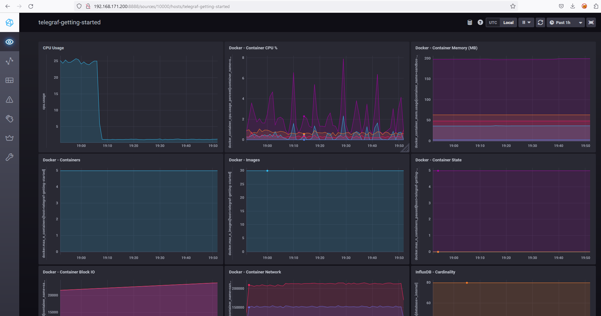
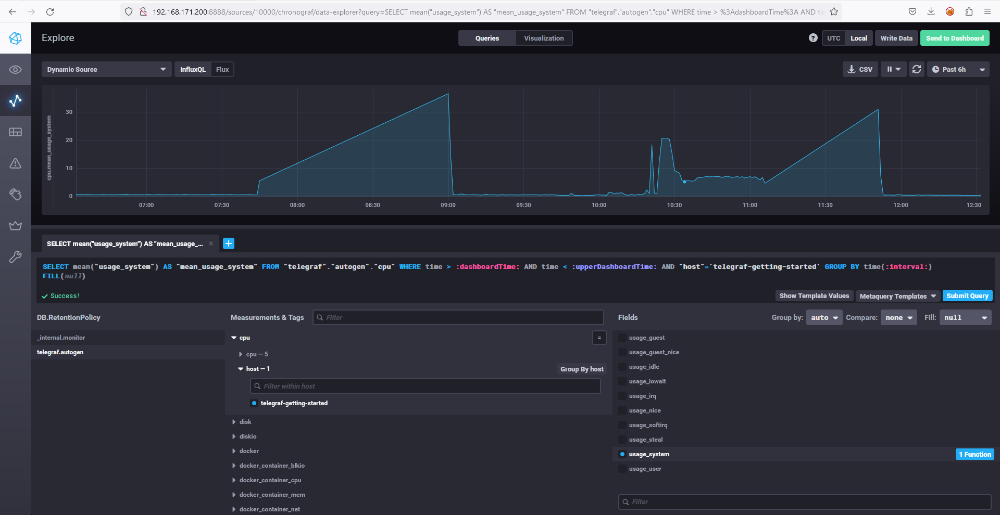
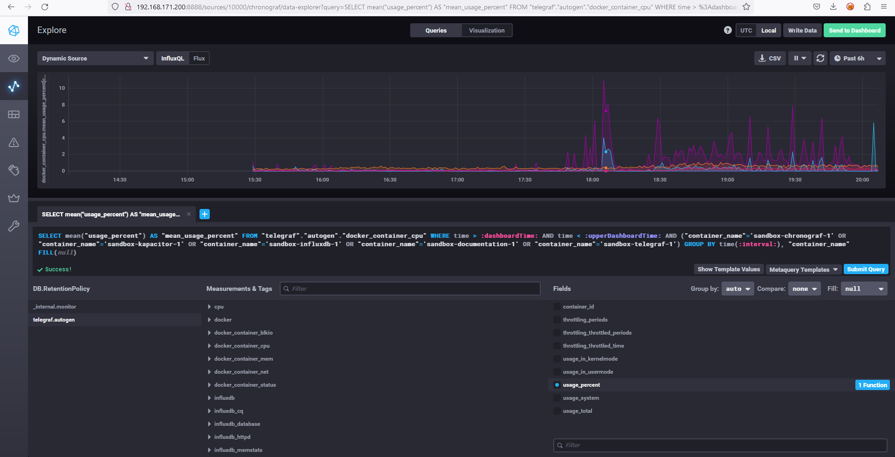
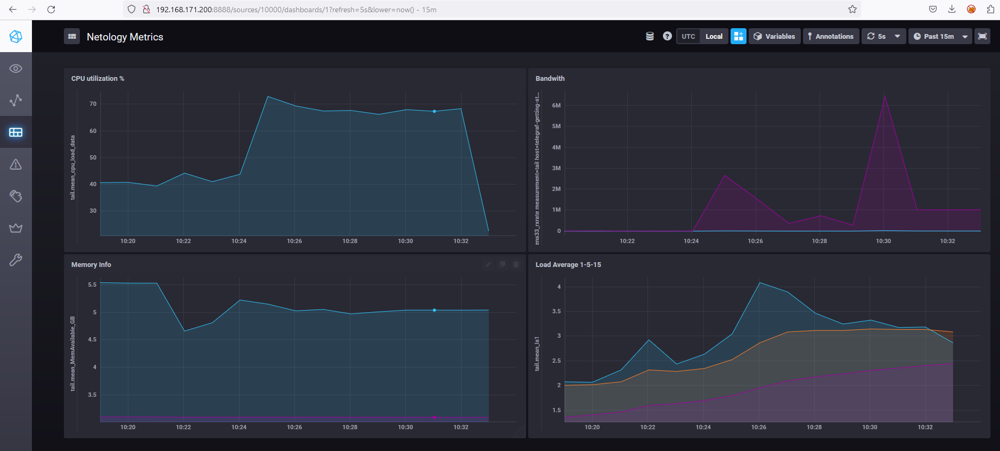
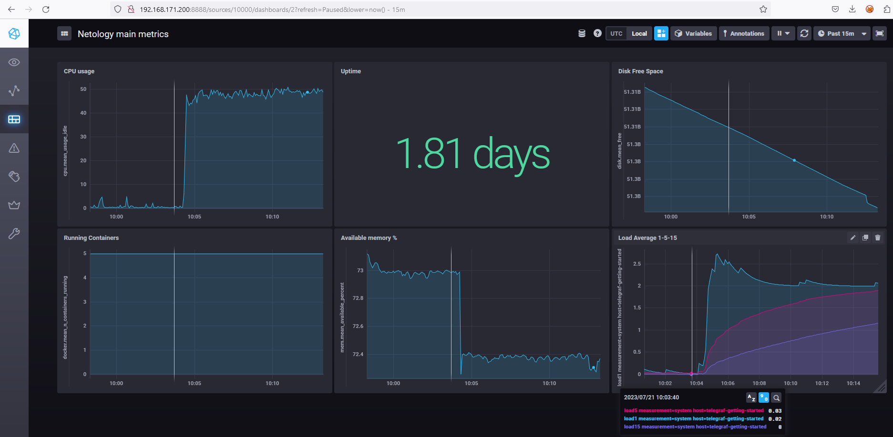

# Домашнее задание к занятию "13.Системы мониторинга"

## Обязательные задания

1. Вас пригласили настроить мониторинг на проект. На онбординге вам рассказали, что проект представляет из себя
платформу для вычислений с выдачей текстовых отчетов, которые сохраняются на диск. Взаимодействие с платформой
осуществляется по протоколу http. Также вам отметили, что вычисления загружают ЦПУ. Какой минимальный набор метрик вы
выведите в мониторинг и почему?
#

- Load Average - как основной индикатор, что в системе что-то не так
- % свободной оперативной памяти
- Использование swap
- % Свободного пространство на дисках
- % использования inodes
- коды ответа http
- метрики нагрузки на дисковую подсистему(зависит от характера нагрузки IOPS, throughput)

2. Менеджер продукта посмотрев на ваши метрики сказал, что ему непонятно что такое RAM/inodes/CPUla. Также он сказал,
что хочет понимать, насколько мы выполняем свои обязанности перед клиентами и какое качество обслуживания. Что вы
можете ему предложить?
#

Если качество обслуживания определено в SLA, то надо предложить метрики максимально близкие к ним, например процент ответов по http, время реакции на определенные события, соответствие времени операций требованиям и т.д.

3. Вашей DevOps команде в этом году не выделили финансирование на построение системы сбора логов. Разработчики в свою
очередь хотят видеть все ошибки, которые выдают их приложения. Какое решение вы можете предпринять в этой ситуации,
чтобы разработчики получали ошибки приложения?
#

При полном отсутствии технических ресурсов, возможно подойдет использование бесплатного Sentry, New Relic.

1. Вы, как опытный SRE, сделали мониторинг, куда вывели отображения выполнения SLA=99% по http кодам ответов.
Вычисляете этот параметр по следующей формуле: summ_2xx_requests/summ_all_requests. Данный параметр не поднимается выше
70%, но при этом в вашей системе нет кодов ответа 5xx и 4xx. Где у вас ошибка?
#

Отсутствует учет 1хх и 3хх кодов ответа.

5. Опишите основные плюсы и минусы pull и push систем мониторинга.
#


### Push
Плюсы:
- Возможность мгновенно реагировать на проблему
- Можно гибко управлять безопасностью(в случае динамических адресов, NAT и просто правил безопасности)
- отправка сразу в несколько точек
- гибкая настройка отправки только необходимых метрик в нужные системы
- Можно сохранить данные при отказе сервера мониторинга(при настройке отправки)
- использование UDP

Минусы:
- При UDP не гарантирована доставка
- Нужно настраивать агентов на каждом устройстве(при отсутствии встроенных методов)

### Pull
Плюсы:
- Проще настраивать(нет необходимости установки и конфигурирования агентов)
- Возможность настроить взаимодействие через прокси для обеспечения безопасности
- Проще отладка получения данных с агентов(можно самому забирать такие же метрики)

Минусы:
- недоступна мнгновенная реакция на проблемы
- Необходимо открывать порты на объектах мониторинга
- проблемы с гарантией доставки(объект не знает получены ли данные в системе мониторинга)


1. Какие из ниже перечисленных систем относятся к push модели, а какие к pull? А может есть гибридные?

    - Prometheus
    - TICK
    - Zabbix
    - VictoriaMetrics
    - Nagios
#


|Название  |Push  |Pull  |Push+Pull  |
|---------|---------|---------|---------|
|Prometheus     |         |         |    +(почти Push с Pushgateway)     |
|TICK     |+         |         |         |
|Zabbix     |         |         |+(можно push с помощью агента)         |
|VictoriaMetrics     |         |         |+(по информации производителя)         |
|Nagios     |         |+         |         |


7. Склонируйте себе [репозиторий](https://github.com/influxdata/sandbox/tree/master) и запустите TICK-стэк,
используя технологии docker и docker-compose.

В виде решения на это упражнение приведите скриншот веб-интерфейса ПО chronograf (`http://localhost:8888`).

Скриншот:

   - Chronograf:\
   


P.S.: если при запуске некоторые контейнеры будут падать с ошибкой - проставьте им режим `Z`, например
`./data:/var/lib:Z`
#
8. Перейдите в веб-интерфейс Chronograf (http://localhost:8888) и откройте вкладку Data explorer.

    - Нажмите на кнопку Add a query
    - Изучите вывод интерфейса и выберите БД telegraf.autogen
    - В `measurments` выберите cpu->host->telegraf-getting-started, а в `fields` выберите usage_system. Внизу появится график утилизации cpu.
    - Вверху вы можете увидеть запрос, аналогичный SQL-синтаксису. Поэкспериментируйте с запросом, попробуйте изменить группировку и интервал наблюдений.

Для выполнения задания приведите скриншот с отображением метрик утилизации cpu из веб-интерфейса.

Скриншот:

   - Chronograf CPU utilization:\
   


#
9. Изучите список [telegraf inputs](https://github.com/influxdata/telegraf/tree/master/plugins/inputs).
Добавьте в конфигурацию telegraf следующий плагин - [docker](https://github.com/influxdata/telegraf/tree/master/plugins/inputs/docker):
```
[[inputs.docker]]
  endpoint = "unix:///var/run/docker.sock"
```

Дополнительно вам может потребоваться донастройка контейнера telegraf в `docker-compose.yml` дополнительного volume и
режима privileged:
```
  telegraf:
    image: telegraf:1.4.0
    privileged: true
    volumes:
      - ./etc/telegraf.conf:/etc/telegraf/telegraf.conf:Z
      - /var/run/docker.sock:/var/run/docker.sock:Z
    links:
      - influxdb
    ports:
      - "8092:8092/udp"
      - "8094:8094"
      - "8125:8125/udp"
```

После настройке перезапустите telegraf, обновите веб интерфейс и приведите скриншотом список `measurments` в
веб-интерфейсе базы telegraf.autogen . Там должны появиться метрики, связанные с docker.


Скриншот:

   - Chronograf Docker:\
   


Факультативно можете изучить какие метрики собирает telegraf после выполнения данного задания.

## Дополнительное задание (со звездочкой*) - необязательно к выполнению

1. Вы устроились на работу в стартап. На данный момент у вас нет возможности развернуть полноценную систему
мониторинга, и вы решили самостоятельно написать простой python3-скрипт для сбора основных метрик сервера. Вы, как
опытный системный-администратор, знаете, что системная информация сервера лежит в директории `/proc`.
Также, вы знаете, что в системе Linux есть  планировщик задач cron, который может запускать задачи по расписанию.

Суммировав все, вы спроектировали приложение, которое:
- является python3 скриптом
- собирает метрики из папки `/proc`
- складывает метрики в файл 'YY-MM-DD-awesome-monitoring.log' в директорию /var/log
(YY - год, MM - месяц, DD - день)
- каждый сбор метрик складывается в виде json-строки, в виде:
  + timestamp (временная метка, int, unixtimestamp)
  + metric_1 (метрика 1)
  + metric_2 (метрика 2)

     ...

  + metric_N (метрика N)

- сбор метрик происходит каждую 1 минуту по cron-расписанию

Для успешного выполнения задания нужно привести:

а) работающий код python3-скрипта,

б) конфигурацию cron-расписания,

в) пример верно сформированного 'YY-MM-DD-awesome-monitoring.log', имеющий не менее 5 записей,

P.S.: количество собираемых метрик должно быть не менее 4-х.
P.P.S.: по желанию можно себя не ограничивать только сбором метрик из `/proc`.

1. Сделал скрипт, который собирает:
-  CPU utilization
-  информация с сетевых адаптеров(количество переданных/принятых байт)
-  информация о свободной оперативной памяти и использования swap
-  информация о load average 1, 5 и 15
3. Код на python:
    ```python
    import time
    import datetime
    import json


    def get_utilization():
        with open('/proc/stat') as c:
            fields_first = [float(column) for column in c.readline().strip().split()[1:]]
            time.sleep(1)
            c.seek(0)
            fields_second = [float(column) for column in c.readline().strip().split()[1:]]
        last_idle, last_total = fields_first[3], sum(fields_first)
        idle, total = fields_second[3], sum(fields_second)
        idle_delta, total_delta = idle - last_idle, total - last_total
        utilization = round((100.0 * (1.0 - idle_delta / total_delta)), 2)
        return utilization


    def get_network_data():
        with open('/proc/net/dev') as n:
            all_net_data = n.readlines()
        interfaces = dict()
        for line in all_net_data[2:]:
            adapter_info = line.split()
            adapter = {
                "rxrate": int(adapter_info[1]),
                "txrate": int(adapter_info[9]),
            }
            interfaces[adapter_info[0][:-1]] = adapter
        return interfaces


    def get_memory_data():

        with open('/proc/meminfo', 'r', encoding='utf-8') as m:
            all_mem_data = m.readlines()
        memory_info = {}
        mem_metrics = [
            'MemAvailable',
            'SwapFree'
        ]

        for line in all_mem_data:
            if line.split(":")[0] in mem_metrics:
                memory_info[line.split(":")[0]] = int(line.split(":")[1].strip().split()[0])
        return memory_info


    def get_loadavg_data():
        with open('/proc/loadavg') as la:
            fields_la = la.readline().split()[:3]

        load_avg_data = {
            "la1": fields_la[0],
            "la5": fields_la[1],
            "la15": fields_la[2],
        }
        return load_avg_data


    def main():
        filename = "/var/log/netology/" + (datetime.date.today().strftime("%Y-%m-%d")) + "-awesome-monitoring.log"
        result = dict()
        result["timestamp"] = datetime.datetime.now().strftime('%Y-%m-%d %H:%M:%S.%f+%Z')
        result["network_data"] = get_network_data()
        result["cpu_load_data"] = get_utilization()
        result['memory_data'] = get_memory_data()
        result['load_average_data'] = get_loadavg_data()
        json_data = json.dumps(result)
        # print(json_data)
        with open(filename, "a") as out_file:
            out_file.write(json_data + "\n")


    if __name__ == "__main__":
        main()
    ```

4. Расписание в crontab:\
`* * * * * /usr/bin/python3 /usr/local/netology-monitoring.py`

1. Содержимое файлв лога:

```json
{"timestamp": "2023-07-20 18:14:21.962208+", "network_data": {"veth10e726b": {"rxrate": 79343979, "txrate": 31421852}, "vethe886f06": {"rxrate": 0, "txrate": 2592}, "vethad75395": {"rxrate": 34563082, "txrate": 73131323}, "br-2741a5677810": {"rxrate": 71096067, "txrate": 15815172}, "veth76ebf25": {"rxrate": 466978885, "txrate": 57968315}, "docker0": {"rxrate": 0, "txrate": 110}, "ens33": {"rxrate": 757748434, "txrate": 8332580168}, "lo": {"rxrate": 269571337, "txrate": 269571337}, "vethd8df9c0": {"rxrate": 5017350, "txrate": 354573584}}, "cpu_load_data": 1.0, "memory_data": {"MemAvailable": 5386332, "SwapFree": 3282160}, "load_average_data": {"la1": "1.47", "la5": "0.63", "la15": "0.26"}}
{"timestamp": "2023-07-20 18:14:28.004204+", "network_data": {"veth10e726b": {"rxrate": 79344087, "txrate": 31421960}, "vethe886f06": {"rxrate": 0, "txrate": 2592}, "vethad75395": {"rxrate": 34582187, "txrate": 73152845}, "br-2741a5677810": {"rxrate": 71096147, "txrate": 15815280}, "veth76ebf25": {"rxrate": 467144069, "txrate": 57988506}, "docker0": {"rxrate": 0, "txrate": 110}, "ens33": {"rxrate": 757749050, "txrate": 8332581274}, "lo": {"rxrate": 269571785, "txrate": 269571785}, "vethd8df9c0": {"rxrate": 5018436, "txrate": 354717246}}, "cpu_load_data": 0.0, "memory_data": {"MemAvailable": 5386640, "SwapFree": 3282160}, "load_average_data": {"la1": "1.35", "la5": "0.62", "la15": "0.25"}}
{"timestamp": "2023-07-20 18:15:01.491883+", "network_data": {"veth10e726b": {"rxrate": 79345857, "txrate": 31427618}, "vethe886f06": {"rxrate": 0, "txrate": 2592}, "vethad75395": {"rxrate": 34642031, "txrate": 73296733}, "br-2741a5677810": {"rxrate": 71097651, "txrate": 15820938}, "veth76ebf25": {"rxrate": 467750432, "txrate": 58055764}, "docker0": {"rxrate": 0, "txrate": 110}, "ens33": {"rxrate": 757763824, "txrate": 8332594890}, "lo": {"rxrate": 269575588, "txrate": 269575588}, "vethd8df9c0": {"rxrate": 5025850, "txrate": 355179721}}, "cpu_load_data": 1.01, "memory_data": {"MemAvailable": 5383984, "SwapFree": 3282160}, "load_average_data": {"la1": "0.81", "la5": "0.56", "la15": "0.25"}}
```


2. В веб-интерфейсе откройте вкладку `Dashboards`. Попробуйте создать свой dashboard с отображением:

    - утилизации ЦПУ
    - количества использованного RAM
    - утилизации пространства на дисках
    - количество поднятых контейнеров
    - аптайм
    - ...
    - фантазируйте)

    ---

Сделал в telegraf.conf парсинг собираемых скриптов логов с помощью tail json_v2:

```ini
[[inputs.tail]]
  files = ["/var/log/netology/*-awesome-monitoring.log"]
  from_beginning = true
  data_format = "json_v2"
      [[inputs.tail.json_v2]]
          [[inputs.tail.json_v2.object]]
              path = "network_data"
              # type = "int"
              disable_prepend_keys = false
              tags = ["txrate","rxrate"]
          [[inputs.tail.json_v2.object]]
              path = "memory_data"
              # type = "int"
              disable_prepend_keys = true
              included_keys = [
                  "MemAvailable",
                  "SwapFree",
              ]
          [[inputs.tail.json_v2.field]]
              path = "cpu_load_data"
              tags = ["cpu_load_data"]
              type = "float"

          [[inputs.tail.json_v2.field]]
              path = "load_average_data.la1"
              tags = ["la1"]
              type = "float"
          [[inputs.tail.json_v2.field]]
              path = "load_average_data.la5"
              tags = ["la5"]
              type = "float"
          [[inputs.tail.json_v2.field]]
              path = "load_average_data.la15"
              tags = ["la15"]
              type = "float"

```
Скриншот:

   - Chronograf метрики из скрипта:\
   

   - Chronograf метрики из задания:\
   

### Как оформить ДЗ?

Выполненное домашнее задание пришлите ссылкой на .md-файл в вашем репозитории.

---
