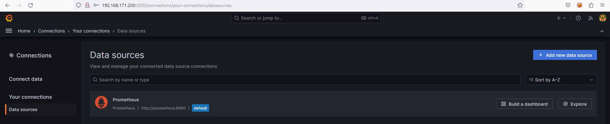
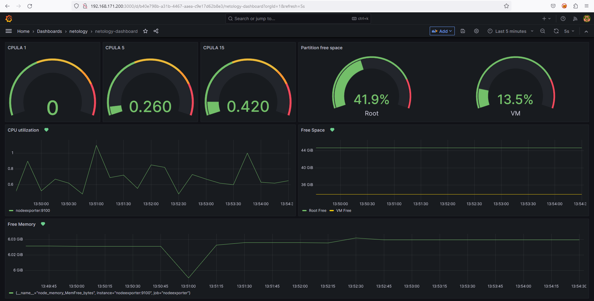
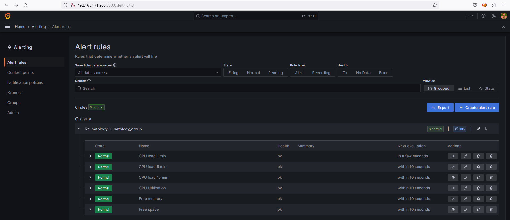
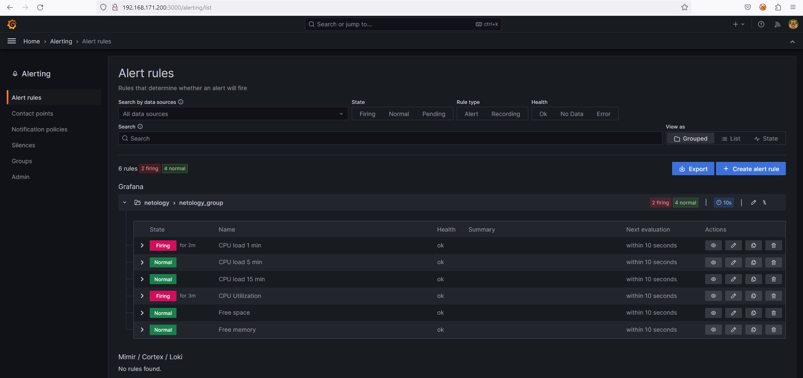
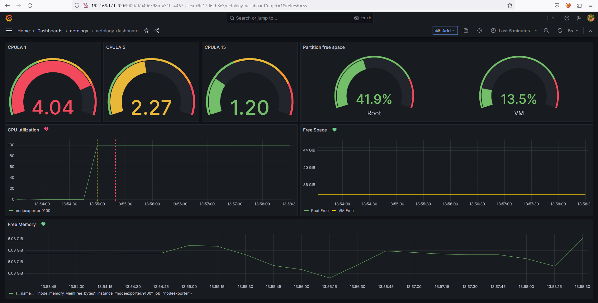
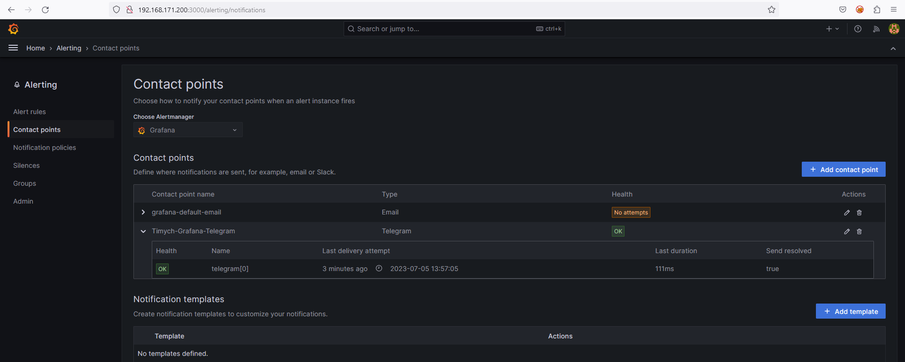
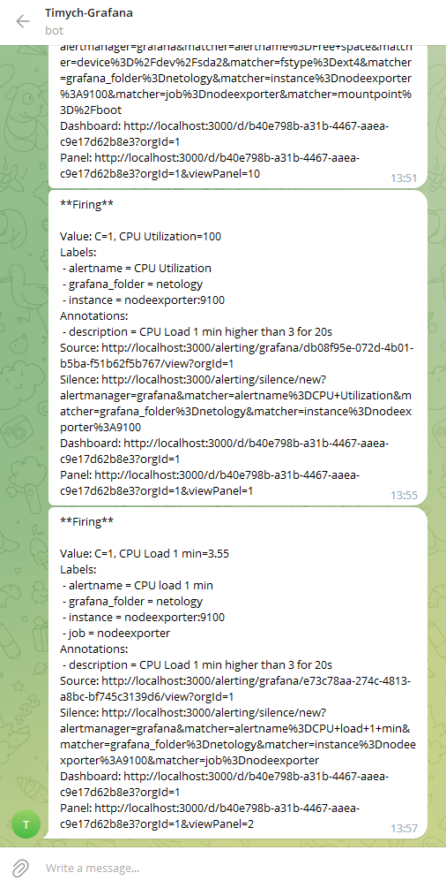

# Домашнее задание к занятию 14 «Средство визуализации Grafana»

## Задание повышенной сложности

**При решении задания 1** не используйте директорию [help](./help) для сборки проекта. Самостоятельно разверните grafana, где в роли источника данных будет выступать prometheus, а сборщиком данных будет node-exporter:

- grafana;
- prometheus-server;
- prometheus node-exporter.

За дополнительными материалами можете обратиться в официальную документацию grafana и prometheus.

В решении к домашнему заданию также приведите все конфигурации, скрипты, манифесты, которые вы
использовали в процессе решения задания.

**При решении задания 3** вы должны самостоятельно завести удобный для вас канал нотификации, например, Telegram или email, и отправить туда тестовые события.

В решении приведите скриншоты тестовых событий из каналов нотификаций.

## Обязательные задания

### Задание 1

1. Используя директорию [help](./help) внутри этого домашнего задания, запустите связку prometheus-grafana.
1. Зайдите в веб-интерфейс grafana, используя авторизационные данные, указанные в манифесте docker-compose.
1. Подключите поднятый вами prometheus, как источник данных.
1. Решение домашнего задания — скриншот веб-интерфейса grafana со списком подключенных Datasource.

### Решение
1. Скриншот:

   - Prometheus connection:\
   


## Задание 2

Изучите самостоятельно ресурсы:

1. [PromQL tutorial for beginners and humans](https://valyala.medium.com/promql-tutorial-for-beginners-9ab455142085).
1. [Understanding Machine CPU usage](https://www.robustperception.io/understanding-machine-cpu-usage).
1. [Introduction to PromQL, the Prometheus query language](https://grafana.com/blog/2020/02/04/introduction-to-promql-the-prometheus-query-language/).

Создайте Dashboard и в ней создайте Panels:

- утилизация CPU для nodeexporter (в процентах, 100-idle);
- CPULA 1/5/15;
- количество свободной оперативной памяти;
- количество места на файловой системе.

Для решения этого задания приведите promql-запросы для выдачи этих метрик, а также скриншот получившейся Dashboard.


### Решение
1. promql-запросы:
   - утилизация CPU для nodeexporter (в процентах, 100-idle):\
    `(1 - (avg by (instance) (irate(node_cpu_seconds_total{mode="idle"}[1m])))) * 100`
   - CPULA 1/5/15:\
    `node_load1`\
    `node_load5`\
    `node_load15`
   - количество свободной оперативной памяти:\
    `node_memory_MemFree_bytes`
   - количество места на файловой системе(сделал для двух основных точек монтирования):\
    `node_filesystem_avail_bytes{mountpoint="/",fstype!="rootfs"}`\
    `node_filesystem_avail_bytes{mountpoint="/mnt/VM",fstype!="rootfs"}`\
    можно для всех устройств сделать с помощью:\
    `node_filesystem_avail_bytes{fstype!="tmpfs"}`\
    Также добавил отдельные панели, показывающие процент свободного места:\
    `100 - ((node_filesystem_avail_bytes{mountpoint="/"} * 100) / node_filesystem_size_bytes{mountpoint="/"})`\
    `100 - ((node_filesystem_avail_bytes{mountpoint="/mnt/VM"} * 100) / node_filesystem_size_bytes{mountpoint="/mnt/VM"})`

1. Скриншот:

   - Dashboard:\
   

## Задание 3

1. Создайте для каждой Dashboard подходящее правило alert — можно обратиться к первой лекции в блоке «Мониторинг».
2. В качестве решения задания приведите скриншот вашей итоговой Dashboard.

### Решение

1. Скриншоты:

   - Alert rules без нагрузки:\
   
   - Alert rules под нагрузкой:\
   
   - Dashboard без нагрузки:\
   
   - Alert rules под нагрузкой:\
   
   - Contact points:\
   
   - Уведомление в Telegram:\
   


## Задание 4

1. Сохраните ваш Dashboard.Для этого перейдите в настройки Dashboard, выберите в боковом меню «JSON MODEL». Далее скопируйте отображаемое json-содержимое в отдельный файл и сохраните его.
1. В качестве решения задания приведите листинг этого файла.

### Решение

1. JSON Dashboard:

    <details>

    ```json
    {
        "annotations": {
        "list": [
            {
            "builtIn": 1,
            "datasource": {
                "type": "grafana",
                "uid": "-- Grafana --"
            },
            "enable": true,
            "hide": true,
            "iconColor": "rgba(0, 211, 255, 1)",
            "name": "Annotations & Alerts",
            "type": "dashboard"
            }
        ]
        },
        "editable": true,
        "fiscalYearStartMonth": 0,
        "graphTooltip": 0,
        "id": 1,
        "links": [],
        "liveNow": false,
        "panels": [
        {
            "datasource": {
            "type": "prometheus",
            "uid": "e845ef1b-1a20-485c-97a7-b9126d1d5881"
            },
            "fieldConfig": {
            "defaults": {
                "color": {
                "mode": "thresholds"
                },
                "mappings": [],
                "max": 5,
                "min": 0,
                "thresholds": {
                "mode": "absolute",
                "steps": [
                    {
                    "color": "green",
                    "value": null
                    },
                    {
                    "color": "#EAB839",
                    "value": 2
                    },
                    {
                    "color": "orange",
                    "value": 3.5
                    },
                    {
                    "color": "red",
                    "value": 4
                    }
                ]
                }
            },
            "overrides": []
            },
            "gridPos": {
            "h": 7,
            "w": 4,
            "x": 0,
            "y": 0
            },
            "id": 2,
            "options": {
            "orientation": "auto",
            "reduceOptions": {
                "calcs": [
                "lastNotNull"
                ],
                "fields": "",
                "values": false
            },
            "showThresholdLabels": false,
            "showThresholdMarkers": true
            },
            "pluginVersion": "9.5.2",
            "targets": [
            {
                "datasource": {
                "type": "prometheus",
                "uid": "e845ef1b-1a20-485c-97a7-b9126d1d5881"
                },
                "editorMode": "builder",
                "expr": "node_load1",
                "legendFormat": "__auto",
                "range": true,
                "refId": "A"
            }
            ],
            "title": "CPULA 1",
            "type": "gauge"
        },
        {
            "datasource": {
            "type": "prometheus",
            "uid": "e845ef1b-1a20-485c-97a7-b9126d1d5881"
            },
            "fieldConfig": {
            "defaults": {
                "color": {
                "mode": "thresholds"
                },
                "mappings": [],
                "max": 5,
                "min": 0,
                "thresholds": {
                "mode": "absolute",
                "steps": [
                    {
                    "color": "green",
                    "value": null
                    },
                    {
                    "color": "#EAB839",
                    "value": 2
                    },
                    {
                    "color": "orange",
                    "value": 3.5
                    },
                    {
                    "color": "red",
                    "value": 4
                    }
                ]
                }
            },
            "overrides": []
            },
            "gridPos": {
            "h": 7,
            "w": 4,
            "x": 4,
            "y": 0
            },
            "id": 7,
            "options": {
            "orientation": "auto",
            "reduceOptions": {
                "calcs": [
                "lastNotNull"
                ],
                "fields": "",
                "values": false
            },
            "showThresholdLabels": false,
            "showThresholdMarkers": true
            },
            "pluginVersion": "9.5.2",
            "targets": [
            {
                "datasource": {
                "type": "prometheus",
                "uid": "e845ef1b-1a20-485c-97a7-b9126d1d5881"
                },
                "editorMode": "builder",
                "expr": "node_load5",
                "legendFormat": "__auto",
                "range": true,
                "refId": "A"
            }
            ],
            "title": "CPULA 5",
            "type": "gauge"
        },
        {
            "datasource": {
            "type": "prometheus",
            "uid": "e845ef1b-1a20-485c-97a7-b9126d1d5881"
            },
            "fieldConfig": {
            "defaults": {
                "color": {
                "mode": "thresholds"
                },
                "mappings": [],
                "max": 5,
                "min": 0,
                "thresholds": {
                "mode": "absolute",
                "steps": [
                    {
                    "color": "green",
                    "value": null
                    },
                    {
                    "color": "#EAB839",
                    "value": 2
                    },
                    {
                    "color": "orange",
                    "value": 3.5
                    },
                    {
                    "color": "red",
                    "value": 4
                    }
                ]
                }
            },
            "overrides": []
            },
            "gridPos": {
            "h": 7,
            "w": 4,
            "x": 8,
            "y": 0
            },
            "id": 8,
            "options": {
            "orientation": "auto",
            "reduceOptions": {
                "calcs": [
                "lastNotNull"
                ],
                "fields": "",
                "values": false
            },
            "showThresholdLabels": false,
            "showThresholdMarkers": true
            },
            "pluginVersion": "9.5.2",
            "targets": [
            {
                "datasource": {
                "type": "prometheus",
                "uid": "e845ef1b-1a20-485c-97a7-b9126d1d5881"
                },
                "editorMode": "builder",
                "expr": "node_load15",
                "legendFormat": "__auto",
                "range": true,
                "refId": "A"
            }
            ],
            "title": "CPULA 15",
            "type": "gauge"
        },
        {
            "datasource": {
            "type": "prometheus",
            "uid": "e845ef1b-1a20-485c-97a7-b9126d1d5881"
            },
            "description": "",
            "fieldConfig": {
            "defaults": {
                "color": {
                "mode": "thresholds"
                },
                "mappings": [],
                "max": 100,
                "min": 0,
                "thresholds": {
                "mode": "absolute",
                "steps": [
                    {
                    "color": "green",
                    "value": null
                    },
                    {
                    "color": "red",
                    "value": 80
                    }
                ]
                },
                "unit": "percent"
            },
            "overrides": []
            },
            "gridPos": {
            "h": 7,
            "w": 12,
            "x": 12,
            "y": 0
            },
            "id": 9,
            "options": {
            "orientation": "auto",
            "reduceOptions": {
                "calcs": [
                "lastNotNull"
                ],
                "fields": "",
                "values": false
            },
            "showThresholdLabels": false,
            "showThresholdMarkers": true
            },
            "pluginVersion": "9.5.2",
            "targets": [
            {
                "datasource": {
                "type": "prometheus",
                "uid": "e845ef1b-1a20-485c-97a7-b9126d1d5881"
                },
                "editorMode": "builder",
                "expr": "100 - ((node_filesystem_avail_bytes{mountpoint=\"/\",fstype!=\"rootfs\"} * 100) / node_filesystem_size_bytes{mountpoint=\"/\",fstype!=\"rootfs\"})",
                "legendFormat": "Root",
                "range": true,
                "refId": "A"
            },
            {
                "datasource": {
                "type": "prometheus",
                "uid": "e845ef1b-1a20-485c-97a7-b9126d1d5881"
                },
                "editorMode": "code",
                "expr": "100 - ((node_filesystem_avail_bytes{mountpoint=\"/mnt/VM\",fstype!=\"rootfs\"} * 100) / node_filesystem_size_bytes{mountpoint=\"/mnt/VM\",fstype!=\"rootfs\"})",
                "hide": false,
                "legendFormat": "VM",
                "range": true,
                "refId": "B"
            }
            ],
            "title": "Partition free space",
            "type": "gauge"
        },
        {
            "datasource": {
            "type": "prometheus",
            "uid": "e845ef1b-1a20-485c-97a7-b9126d1d5881"
            },
            "fieldConfig": {
            "defaults": {
                "color": {
                "mode": "palette-classic"
                },
                "custom": {
                "axisCenteredZero": false,
                "axisColorMode": "text",
                "axisLabel": "",
                "axisPlacement": "auto",
                "barAlignment": 0,
                "drawStyle": "line",
                "fillOpacity": 0,
                "gradientMode": "none",
                "hideFrom": {
                    "legend": false,
                    "tooltip": false,
                    "viz": false
                },
                "lineInterpolation": "linear",
                "lineWidth": 1,
                "pointSize": 1,
                "scaleDistribution": {
                    "type": "linear"
                },
                "showPoints": "auto",
                "spanNulls": false,
                "stacking": {
                    "group": "A",
                    "mode": "none"
                },
                "thresholdsStyle": {
                    "mode": "off"
                }
                },
                "mappings": [],
                "thresholds": {
                "mode": "absolute",
                "steps": [
                    {
                    "color": "green",
                    "value": null
                    },
                    {
                    "color": "red",
                    "value": 80
                    }
                ]
                }
            },
            "overrides": []
            },
            "gridPos": {
            "h": 8,
            "w": 12,
            "x": 0,
            "y": 7
            },
            "id": 1,
            "options": {
            "legend": {
                "calcs": [],
                "displayMode": "list",
                "placement": "bottom",
                "showLegend": true
            },
            "tooltip": {
                "mode": "single",
                "sort": "none"
            }
            },
            "targets": [
            {
                "datasource": {
                "type": "prometheus",
                "uid": "e845ef1b-1a20-485c-97a7-b9126d1d5881"
                },
                "editorMode": "code",
                "expr": "(1 - (rate(node_cpu_seconds_total{mode=\"idle\"}[$__rate_interval]))) * 100",
                "hide": true,
                "legendFormat": "__auto",
                "range": true,
                "refId": "A"
            },
            {
                "datasource": {
                "type": "prometheus",
                "uid": "e845ef1b-1a20-485c-97a7-b9126d1d5881"
                },
                "editorMode": "code",
                "expr": "(1 - (avg by (instance) (irate(node_cpu_seconds_total{mode=\"idle\"}[1m])))) * 100",
                "hide": false,
                "legendFormat": "__auto",
                "range": true,
                "refId": "B"
            }
            ],
            "title": "CPU utilization",
            "type": "timeseries"
        },
        {
            "datasource": {
            "type": "prometheus",
            "uid": "e845ef1b-1a20-485c-97a7-b9126d1d5881"
            },
            "fieldConfig": {
            "defaults": {
                "color": {
                "mode": "palette-classic"
                },
                "custom": {
                "axisCenteredZero": false,
                "axisColorMode": "text",
                "axisLabel": "",
                "axisPlacement": "auto",
                "barAlignment": 0,
                "drawStyle": "line",
                "fillOpacity": 0,
                "gradientMode": "none",
                "hideFrom": {
                    "legend": false,
                    "tooltip": false,
                    "viz": false
                },
                "lineInterpolation": "linear",
                "lineWidth": 1,
                "pointSize": 1,
                "scaleDistribution": {
                    "type": "linear"
                },
                "showPoints": "auto",
                "spanNulls": false,
                "stacking": {
                    "group": "A",
                    "mode": "none"
                },
                "thresholdsStyle": {
                    "mode": "off"
                }
                },
                "mappings": [],
                "thresholds": {
                "mode": "absolute",
                "steps": [
                    {
                    "color": "green",
                    "value": null
                    }
                ]
                },
                "unit": "bytes"
            },
            "overrides": []
            },
            "gridPos": {
            "h": 8,
            "w": 12,
            "x": 12,
            "y": 7
            },
            "id": 10,
            "options": {
            "legend": {
                "calcs": [],
                "displayMode": "list",
                "placement": "bottom",
                "showLegend": true
            },
            "tooltip": {
                "mode": "single",
                "sort": "none"
            }
            },
            "pluginVersion": "9.5.2",
            "targets": [
            {
                "datasource": {
                "type": "prometheus",
                "uid": "e845ef1b-1a20-485c-97a7-b9126d1d5881"
                },
                "editorMode": "code",
                "expr": "node_filesystem_avail_bytes{mountpoint=\"/\"}",
                "legendFormat": "Root Free",
                "range": true,
                "refId": "A"
            },
            {
                "datasource": {
                "type": "prometheus",
                "uid": "e845ef1b-1a20-485c-97a7-b9126d1d5881"
                },
                "editorMode": "code",
                "expr": "node_filesystem_avail_bytes{mountpoint=\"/mnt/VM\"}",
                "hide": false,
                "legendFormat": "VM Free",
                "range": true,
                "refId": "B"
            }
            ],
            "title": "Free Space",
            "type": "timeseries"
        },
        {
            "datasource": {
            "type": "prometheus",
            "uid": "e845ef1b-1a20-485c-97a7-b9126d1d5881"
            },
            "fieldConfig": {
            "defaults": {
                "color": {
                "mode": "palette-classic"
                },
                "custom": {
                "axisCenteredZero": false,
                "axisColorMode": "text",
                "axisLabel": "",
                "axisPlacement": "auto",
                "barAlignment": 0,
                "drawStyle": "line",
                "fillOpacity": 0,
                "gradientMode": "none",
                "hideFrom": {
                    "legend": false,
                    "tooltip": false,
                    "viz": false
                },
                "lineInterpolation": "linear",
                "lineWidth": 1,
                "pointSize": 3,
                "scaleDistribution": {
                    "type": "linear"
                },
                "showPoints": "auto",
                "spanNulls": false,
                "stacking": {
                    "group": "A",
                    "mode": "none"
                },
                "thresholdsStyle": {
                    "mode": "off"
                }
                },
                "mappings": [],
                "thresholds": {
                "mode": "absolute",
                "steps": [
                    {
                    "color": "green",
                    "value": null
                    },
                    {
                    "color": "red",
                    "value": 80
                    }
                ]
                },
                "unit": "bytes"
            },
            "overrides": []
            },
            "gridPos": {
            "h": 7,
            "w": 24,
            "x": 0,
            "y": 15
            },
            "id": 5,
            "options": {
            "legend": {
                "calcs": [],
                "displayMode": "list",
                "placement": "bottom",
                "showLegend": true
            },
            "tooltip": {
                "mode": "single",
                "sort": "none"
            }
            },
            "targets": [
            {
                "datasource": {
                "type": "prometheus",
                "uid": "e845ef1b-1a20-485c-97a7-b9126d1d5881"
                },
                "editorMode": "code",
                "expr": "node_memory_MemFree_bytes",
                "legendFormat": "__auto",
                "range": true,
                "refId": "A"
            }
            ],
            "title": "Free Memory",
            "type": "timeseries"
        }
        ],
        "refresh": "5s",
        "schemaVersion": 38,
        "style": "dark",
        "tags": [],
        "templating": {
        "list": []
        },
        "time": {
        "from": "now-5m",
        "to": "now"
        },
        "timepicker": {},
        "timezone": "",
        "title": "netology-dashboard",
        "uid": "b40e798b-a31b-4467-aaea-c9e17d62b8e3",
        "version": 14,
        "weekStart": ""
    }
    ```

    </details>

---

### Как оформить решение задания

Выполненное домашнее задание пришлите в виде ссылки на .md-файл в вашем репозитории.

---
