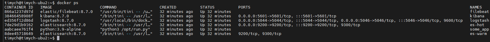
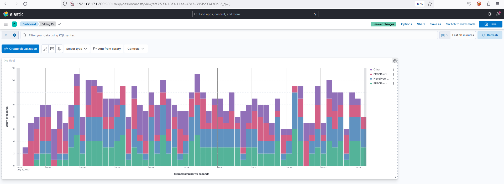
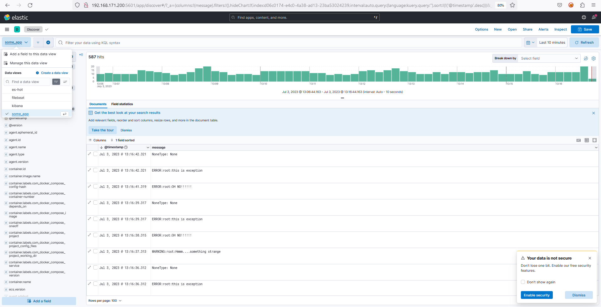

# Домашнее задание к занятию 15 «Система сбора логов Elastic Stack»

## Дополнительные ссылки

При выполнении задания используйте дополнительные ресурсы:

- [поднимаем elk в docker](https://www.elastic.co/guide/en/elastic-stack-get-started/current/get-started-docker.html);
- [поднимаем elk в docker с filebeat и docker-логами](https://www.sarulabs.com/post/5/2019-08-12/sending-docker-logs-to-elasticsearch-and-kibana-with-filebeat.html);
- [конфигурируем logstash](https://www.elastic.co/guide/en/logstash/current/configuration.html);
- [плагины filter для logstash](https://www.elastic.co/guide/en/logstash/current/filter-plugins.html);
- [конфигурируем filebeat](https://www.elastic.co/guide/en/beats/libbeat/5.3/config-file-format.html);
- [привязываем индексы из elastic в kibana](https://www.elastic.co/guide/en/kibana/current/index-patterns.html);
- [как просматривать логи в kibana](https://www.elastic.co/guide/en/kibana/current/discover.html);
- [решение ошибки increase vm.max_map_count elasticsearch](https://stackoverflow.com/questions/42889241/how-to-increase-vm-max-map-count).

В процессе выполнения в зависимости от системы могут также возникнуть не указанные здесь проблемы.

Используйте output stdout filebeat/kibana и api elasticsearch для изучения корня проблемы и её устранения.

## Задание повышенной сложности

Не используйте директорию [help](./help) при выполнении домашнего задания.

## Задание 1

Вам необходимо поднять в докере и связать между собой:

- elasticsearch (hot и warm ноды);
- logstash;
- kibana;
- filebeat.

Logstash следует сконфигурировать для приёма по tcp json-сообщений.

Filebeat следует сконфигурировать для отправки логов docker вашей системы в logstash.

В директории [help](./help) находится манифест docker-compose и конфигурации filebeat/logstash для быстрого
выполнения этого задания.

Результатом выполнения задания должны быть:

- скриншот `docker ps` через 5 минут после старта всех контейнеров (их должно быть 5);
- скриншот интерфейса kibana;
- docker-compose манифест (если вы не использовали директорию help);
- ваши yml-конфигурации для стека (если вы не использовали директорию help).


### Решение
1. Скриншоты:

   - Docker ps:\
   

   - Kibana:\
   

1. Манифест Docker Compose

    ```yml
    version: '2.2'
    services:

      es-hot:
        image: elasticsearch:8.7.0
        container_name: es-hot
        environment:
          - node.name=es-hot
          - cluster.name=es-docker-cluster
          - discovery.seed_hosts=es-hot,es-warm
          - cluster.initial_master_nodes=es-hot,es-warm
          - node.roles=master,data_content,data_hot
          - "ES_JAVA_OPTS=-Xms512m -Xmx512m"
          - "http.host=0.0.0.0"
          - xpack.security.enabled=false
        volumes:
          - es-hot:/usr/share/elasticsearch:Z
        ulimits:
          memlock:
            soft: -1
            hard: -1
          nofile:
            soft: 65536
            hard: 65536
        ports:
          - 9200:9200
        networks:
          - elastic-net
        depends_on:
          - es-warm

      es-warm:
        image: elasticsearch:8.7.0
        container_name: es-warm
        environment:
          - node.name=es-warm
          - cluster.name=es-docker-cluster
          - discovery.seed_hosts=es-hot,es-warm
          - cluster.initial_master_nodes=es-hot,es-warm
          - node.roles=master,data_warm
          - "ES_JAVA_OPTS=-Xms512m -Xmx512m"
          - xpack.security.enabled=false
          - "http.host=0.0.0.0"
        volumes:
          - es-warm:/usr/share/elasticsearch:Z
        ulimits:
          memlock:
            soft: -1
            hard: -1
          nofile:
            soft: 65536
            hard: 65536
        networks:
          - elastic-net

      kibana:
        image: kibana:8.7.0
        container_name: kibana
        ports:
          - 5601:5601
        environment:
          ELASTICSEARCH_URL: http://es-hot:9200
          ELASTICSEARCH_HOSTS: '["http://es-hot:9200","http://es-warm:9200"]'
        networks:
          - elastic-net
        depends_on:
          - es-hot
          - es-warm

      logstash:
        image: logstash:8.7.0
        container_name: logstash
        environment:
          - "LS_JAVA_OPTS=-Xms256m -Xmx256m"
        ports:
          - 5046:5046
          - 5044:5044
        volumes:
          - ./configs/logstash.conf:/usr/share/logstash/pipeline/logstash.conf:Z
          - ./configs/logstash.yml:/opt/logstash/config/logstash.yml:Z
        networks:
          - elastic-net
        depends_on:
          - es-hot
          - es-warm

      filebeat:
        image: elastic/filebeat:8.7.0
        container_name: filebeat
        privileged: true
        user: root
        command: filebeat -e -strict.perms=false
        volumes:
          - ./configs/filebeat.yml:/usr/share/filebeat/filebeat.yml:Z
          - /var/lib/docker:/var/lib/docker:Z
          - /var/run/docker.sock:/var/run/docker.sock:Z
        depends_on:
          - logstash
        networks:
          - elastic-net

      some_application:
        image: library/python:3.9-alpine
        container_name: some_app
        volumes:
          - ./pinger/:/opt/:Z
        entrypoint: python3 /opt/run.py

    volumes:
      es-hot:
      es-warm:

    networks:
      elastic-net:
        driver: bridge

    ```

1. Конфигурации:

   - Filebeat.yml:
    ```yml
    filebeat.inputs:
      - type: container
        paths:
          - '/var/lib/docker/containers/*/*.log'

    processors:
      - add_docker_metadata:
          host: "unix:///var/run/docker.sock"

      - decode_json_fields:
          fields: ["message"]
          target: "json"
          overwrite_keys: true

    output.logstash:
      hosts: ["logstash:5046"]
      protocol: tcp

    # output.console:
    #   # pretty: true

    logging.json: true
    logging.metrics.enabled: false
    ```
   - logstash.conf:

    ```ini
    input {
      beats {
        port => 5046
      }
    }

    filter{
      json{
        source => "json"
       }
      # grok {
      #   match => { "message" => "%{WORD:error_level}:%{WORD:user}:%{GREEDYDATA:error_message}" }
      # }
      mutate {
        add_field => { "index_name" => "%{[container][name]}-%{+YYYY.MM.dd}" }
      }
    }

    output {
      elasticsearch {
        hosts => ["es-hot:9200"]
        index => "%{[container][name]}-%{+YYYY-MM-dd}"
      }
    }
    ```

1. Ссылки:

    [Манифест docker compose](https://github.com/Timych84/devops-netology/blob/main/10-monitoring-04-elk/docker-compose.yml)\
    [Конфигурация Filebeat](https://github.com/Timych84/devops-netology/blob/main/10-monitoring-04-elk/filebeat.yml)\
    [Конфигурация Logstash](https://github.com/Timych84/devops-netology/blob/main/10-monitoring-04-elk/logstash.conf)
------


## Задание 2

Перейдите в меню [создания index-patterns  в kibana](http://localhost:5601/app/management/kibana/indexPatterns/create) и создайте несколько index-patterns из имеющихся.

Перейдите в меню просмотра логов в kibana (Discover) и самостоятельно изучите, как отображаются логи и как производить поиск по логам.

В манифесте директории help также приведенно dummy-приложение, которое генерирует рандомные события в stdout-контейнера.
Эти логи должны порождать индекс logstash-* в elasticsearch. Если этого индекса нет — воспользуйтесь советами и источниками из раздела «Дополнительные ссылки» этого задания.

### Решение

1. В конфигурацию Logstash было добавлено создание отдельного индекса для каждого контейнера с помощью %{[container][name]} и созданы несколько index-patterns(es-hot, filebeat, kibana, some_app)
1. Скриншоты:

   - Indexes:\
   

---

### Как оформить решение задания

Выполненное домашнее задание пришлите в виде ссылки на .md-файл в вашем репозитории.

---
