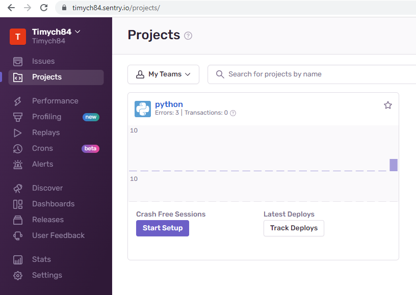
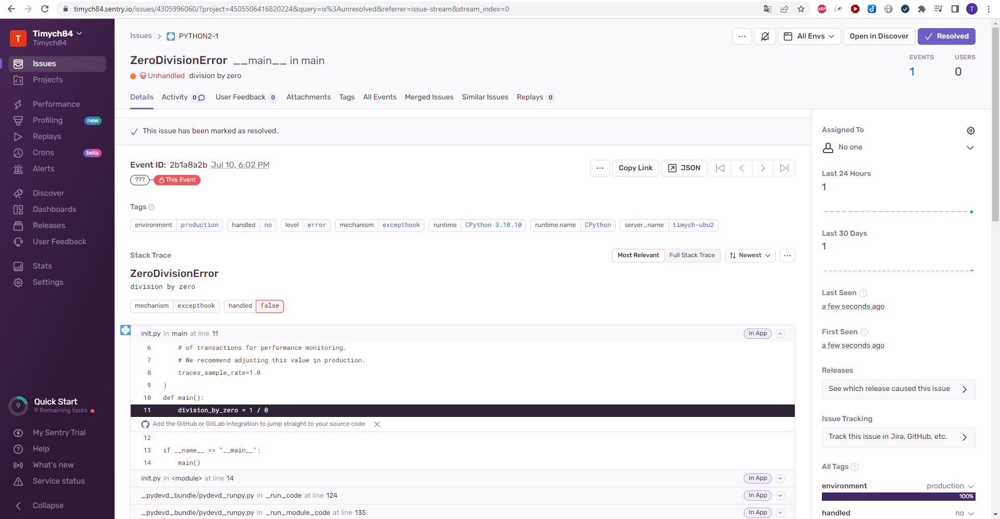
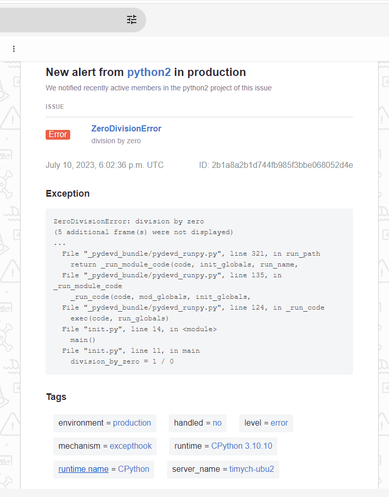
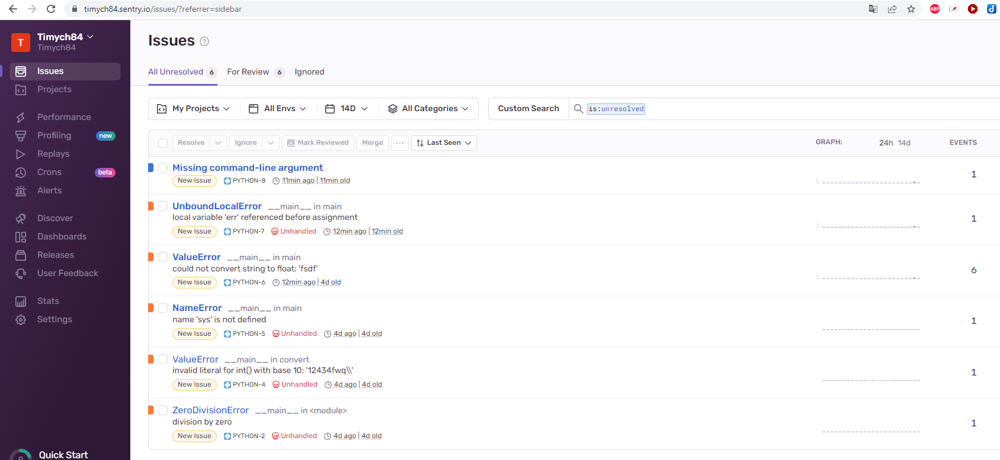

# Домашнее задание к занятию 16 «Платформа мониторинга Sentry»

## Задание 1

Так как Self-Hosted Sentry довольно требовательная к ресурсам система, мы будем использовать Free Сloud account.

Free Cloud account имеет ограничения:

- 5 000 errors;
- 10 000 transactions;
- 1 GB attachments.

Для подключения Free Cloud account:

- зайдите на sentry.io;
- нажмите «Try for free»;
- используйте авторизацию через ваш GitHub-аккаунт;
- далее следуйте инструкциям.

В качестве решения задания пришлите скриншот меню Projects.

### Решение
1. Скриншот:

   - Prohjects:\
   


## Задание 2

1. Создайте python-проект и нажмите `Generate sample event` для генерации тестового события.
1. Изучите информацию, представленную в событии.
1. Перейдите в список событий проекта, выберите созданное вами и нажмите `Resolved`.
1. В качестве решения задание предоставьте скриншот `Stack trace` из этого события и список событий проекта после нажатия `Resolved`.

### Решение
1. Скриншоты:

   - Issues:\
   
   - Issues after resolve:\
   

## Задание 3

1. Перейдите в создание правил алёртинга.
2. Выберите проект и создайте дефолтное правило алёртинга без настройки полей.
3. Снова сгенерируйте событие `Generate sample event`.
Если всё было выполнено правильно — через некоторое время вам на почту, привязанную к GitHub-аккаунту, придёт оповещение о произошедшем событии.
4. Если сообщение не пришло — проверьте настройки аккаунта Sentry (например, привязанную почту), что у вас не было
`sample issue` до того, как вы его сгенерировали, и то, что правило алёртинга выставлено по дефолту (во всех полях all).
Также проверьте проект, в котором вы создаёте событие — возможно алёрт привязан к другому.
5. В качестве решения задания пришлите скриншот тела сообщения из оповещения на почте.
6. Дополнительно поэкспериментируйте с правилами алёртинга. Выбирайте разные условия отправки и создавайте sample events.

### Решение
1. Скриншот:

   - Mail:\
   
   - Issues after resolve:\

## Задание повышенной сложности

1. Создайте проект на ЯП Python или GO (около 10–20 строк), подключите к нему sentry SDK и отправьте несколько тестовых событий.
2. Поэкспериментируйте с различными передаваемыми параметрами, но помните об ограничениях Free учётной записи Cloud Sentry.
3. В качестве решения задания пришлите скриншот меню issues вашего проекта и пример кода подключения sentry sdk/отсылки событий.


### Решение
1. В качесетве кода взял за пример тестовое задание из курса CS50 по Python для вычисления курса BTC и добавил в него отправку ошибок и сообщений в Sentry

    ```python
    import sentry_sdk
    import sys
    import requests


    sentry_sdk.init(
        dsn="https://94b86bdfdeb34929bea3ac156d7df116@o4505481877389312.ingest.sentry.io/4505481880600576",

        # Set traces_sample_rate to 1.0 to capture 100%
        # of transactions for performance monitoring.
        # We recommend adjusting this value in production.
        traces_sample_rate=1.0
    )


    def main():
        n = len(sys.argv)
        if n == 1:
            sentry_sdk.capture_message("Missing command-line argument")
            sys.exit("Missing command-line argument")
        elif (n == 2):
            try:
                total_doll = float(sys.argv[1])
                amount = get_btc_price() * total_doll
                print(f"${amount:,.4f}")
            except ValueError as err:
                sentry_sdk.capture_exception(err)
                sys.exit("Command-line argument is not a number")
        else:
            sentry_sdk.capture_message("Too many command-line argument")
            sys.exit("Too many command-line argument")


    def get_btc_price():
        try:
            response = requests.get(
            "https://api.coindesk.com/v1/bpi/currentprice.json"
            )
            result = response.json()
            btc_price = float((result["bpi"]["USD"]["rate"]).replace(',',''))
            return btc_price
        except requests.RequestException as err:
            sentry_sdk.capture_exception(err)
            print("Except request")
            sys(exit)

    if __name__ == "__main__":
        main()
    ```


2. Скриншот:

   - Issues:\
   


---

### Как оформить решение задания

Выполненное домашнее задание пришлите в виде ссылки на .md-файл в вашем репозитории.

---
