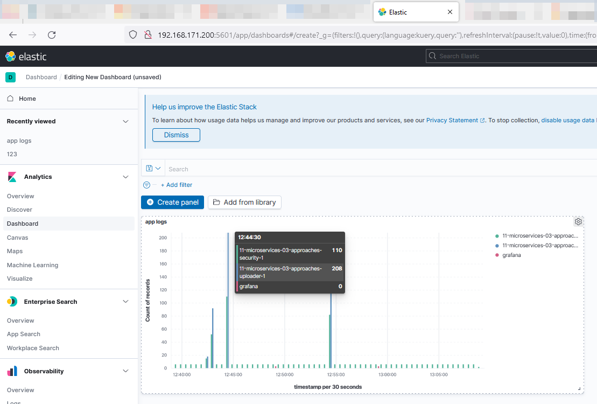
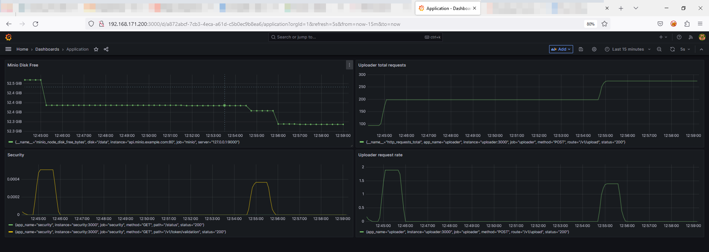

# Домашнее задание к занятию «Микросервисы: подходы»

Вы работаете в крупной компании, которая строит систему на основе микросервисной архитектуры.
Вам как DevOps-специалисту необходимо выдвинуть предложение по организации инфраструктуры для разработки и эксплуатации.


## Задача 1: Обеспечить разработку

Предложите решение для обеспечения процесса разработки: хранение исходного кода, непрерывная интеграция и непрерывная поставка.
Решение может состоять из одного или нескольких программных продуктов и должно описывать способы и принципы их взаимодействия.

Решение должно соответствовать следующим требованиям:
- облачная система;
- система контроля версий Git;
- репозиторий на каждый сервис;
- запуск сборки по событию из системы контроля версий;
- запуск сборки по кнопке с указанием параметров;
- возможность привязать настройки к каждой сборке;
- возможность создания шаблонов для различных конфигураций сборок;
- возможность безопасного хранения секретных данных (пароли, ключи доступа);
- несколько конфигураций для сборки из одного репозитория;
- кастомные шаги при сборке;
- собственные докер-образы для сборки проектов;
- возможность развернуть агентов сборки на собственных серверах;
- возможность параллельного запуска нескольких сборок;
- возможность параллельного запуска тестов.

Обоснуйте свой выбор.

## Решение
Если никакого процесса разработки в компании не существует, то я бы предложил использовать GitLab CE. Бесплатное решение, которое позволяет закрыть все требования.

- Есть как платные облачные реализации, так и развертываение на собственном сервере.
- Использует Git в основе хранения кода
- Неограниченное количество репозиториев
- С помощью функционаля CI/CD позволяет реализовать все требования:
  - запуск сборки по событию из системы контроля версий
  - запуск сборки по кнопке с указанием параметров
  - возможность привязать настройки к каждой сборке
  - возможность создания шаблонов для различных конфигураций сборок
  - возможность безопасного хранения секретных данных (пароли, ключи доступа)
  - несколько конфигураций для сборки из одного репозитория
  - кастомные шаги при сборке

Свой собственный registry:
  - собственные докер-образы для сборки проектов

Используя несколько Runner:
  - возможность развернуть агентов сборки на собственных серверах
  - возможность параллельного запуска нескольких сборок
  - возможность параллельного запуска тестов

Также можно рассмотреть платные решения GitHub c GitHub Actions или Atlassian BitBucket, тоже закрывающие требуемый функционал.

В целом я бы выбрал GitLab CE как целостное относительно простое решение вокруг которого есть большое сообщество.

## Задача 2: Логи

Предложите решение для обеспечения сбора и анализа логов сервисов в микросервисной архитектуре.
Решение может состоять из одного или нескольких программных продуктов и должно описывать способы и принципы их взаимодействия.

Решение должно соответствовать следующим требованиям:
- сбор логов в центральное хранилище со всех хостов, обслуживающих систему;
- минимальные требования к приложениям, сбор логов из stdout;
- гарантированная доставка логов до центрального хранилища;
- обеспечение поиска и фильтрации по записям логов;
- обеспечение пользовательского интерфейса с возможностью предоставления доступа разработчикам для поиска по записям логов;
- возможность дать ссылку на сохранённый поиск по записям логов.

Обоснуйте свой выбор.

Основными конкурентами в данной задаче мне видятся два решения:
на основе ElasticSearch:
- для сбора логов в центральное хранилище используется Elasticsearch
- для сбора логов можно использовать Vector, достаочно просто и гибкое решения для сбора обработки и отправки логов в Elasticsearch в данном решении
- для поиска и фильтрации по записаям логов используетя Kibana с богатым функционалом поиска и представления логов

на основе Grafana Loki
- для сбора логов в центральное хранилище используется Grafana Loki
- для сбора логов используется Promtail, он позовляет собирать логи и отправлять их в Grafana Loki
- для поиска и фильтрации по записаям логов используетя Grafana

В данном случае я бы выбрал решение на Grafana Loki, в целом оно считается менее требовательным к ресурсам и хранению, хотя и с менее богатым функционалом. Также можно в качестве преимущества считать общий стек продуктов Grafana для анализа логов и мониторинга.


## Задача 3: Мониторинг

Предложите решение для обеспечения сбора и анализа состояния хостов и сервисов в микросервисной архитектуре.
Решение может состоять из одного или нескольких программных продуктов и должно описывать способы и принципы их взаимодействия.

Решение должно соответствовать следующим требованиям:
- сбор метрик со всех хостов, обслуживающих систему;
- сбор метрик состояния ресурсов хостов: CPU, RAM, HDD, Network;
- сбор метрик потребляемых ресурсов для каждого сервиса: CPU, RAM, HDD, Network;
- сбор метрик, специфичных для каждого сервиса;
- пользовательский интерфейс с возможностью делать запросы и агрегировать информацию;
- пользовательский интерфейс с возможностью настраивать различные панели для отслеживания состояния системы.

Обоснуйте свой выбор.

Для решения задач я в данном случае выбрал бы решение, основанное на Grafana.
- Prometheus аггрегирует все собранные метрики
- агенты Prometheus позволят собирать все необходимые метрики
- Grafana позволяет отображать всю информацию и с помощью дэшбордов представлять ее в требуемом виде.

В целом решение на основе Grafana используется в большом количестве решений, имеет хорошую поддержку со стороны коммюнити.

## Задача 4: Логи * (необязательная)

Продолжить работу по задаче API Gateway: сервисы, используемые в задаче, пишут логи в stdout.

Добавить в систему сервисы для сбора логов Vector + ElasticSearch + Kibana со всех сервисов, обеспечивающих работу API.

### Результат выполнения:

docker compose файл, запустив который можно перейти по адресу http://localhost:8081, по которому доступна Kibana.
Логин в Kibana должен быть admin, пароль qwerty123456.


## Решение 4.

Раздел docker-compose.yaml в части логов:

```yml
#######################  Logging services
  vector:
    image: timberio/vector:0.30.0-alpine
    volumes:
      - ./vector/vector.yaml:/etc/vector/vector.yaml:ro
      - /var/run/docker.sock:/var/run/docker.sock:ro
    ports:
      - "8686:8686"
    command: "-c /etc/vector/vector.yaml"
    networks:
      - elastic-net
  es-hot:
    image: docker.elastic.co/elasticsearch/elasticsearch:7.11.0
    container_name: es-hot
    environment:
      - node.name=es-hot
      - cluster.name=es-docker-cluster
      - discovery.seed_hosts=es-warm
      - cluster.initial_master_nodes=es-hot,es-warm
      - bootstrap.memory_lock=true
      - "ES_JAVA_OPTS=-Xms512m -Xmx512m"
      - xpack.security.enabled=$ELASTIC_SECURITY
      - ELASTIC_SECURITY=true
      - ELASTIC_USERNAME=elastic
      - ELASTIC_PASSWORD=$ELASTIC_PASSWORD
    volumes:
      - es-hot:/usr/share/elasticsearch:Z
    ulimits:
      memlock:
        soft: -1
        hard: -1
      nofile:
        soft: 65536
        hard: 65536
    ports:
      - 9200:9200
    networks:
      - elastic-net
    depends_on:
      - es-warm
  es-warm:
    image: docker.elastic.co/elasticsearch/elasticsearch:7.11.0
    container_name: es-warm
    environment:
      - node.name=es-warm
      - cluster.name=es-docker-cluster
      - discovery.seed_hosts=es-hot
      - cluster.initial_master_nodes=es-hot,es-warm
      - bootstrap.memory_lock=true
      - "ES_JAVA_OPTS=-Xms512m -Xmx512m"
      - xpack.security.enabled=$ELASTIC_SECURITY
      - ELASTIC_SECURITY=true
      - ELASTIC_USERNAME=elastic
      - ELASTIC_PASSWORD=$ELASTIC_PASSWORD
    volumes:
      - es-warm:/usr/share/elasticsearch:Z
    ulimits:
      memlock:
        soft: -1
        hard: -1
      nofile:
        soft: 65536
        hard: 65536
    networks:
      - elastic-net
  kibana:
    image: docker.elastic.co/kibana/kibana:7.11.0
    container_name: kibana
    ports:
      - 5601:5601
    environment:
      - ELASTICSEARCH_HOSTS=["http://es-hot:9200","http://es-warm:9200"]
      - ELASTICSEARCH_USERNAME=elastic
      - ELASTICSEARCH_PASSWORD=$ELASTIC_PASSWORD
    networks:
      - elastic-net
    depends_on:
      - es-hot
      - es-warm
```

Конфигурация vector:

```yml
api:
  enabled: true
  address: '0.0.0.0:8686'
sources:
  docker_app_logs:
    type: docker_logs
    exclude_containers:
      - kibana
      - es-hot
      - es-warm
      - 11-microservices-03-approaches-gateway-1
transforms:
  transform_to_elastic:
    type: remap
    inputs:
      - docker_app_logs
    source: |-
      . = remove!(value: ., path: ["label"])
      . = remove!(value: ., path: ["container_id"])
      . = remove!(value: ., path: ["container_created_at"])

sinks:
  # console:
  #   inputs:
  #     - transform_to_elastic
  #   target: stdout
  #   type: console
  #   encoding:
  #     codec: json

  docker_logs_sink:
    type: elasticsearch
    inputs:
      - transform_to_elastic
    api_version: auto
    compression: none
    bulk:
      index: "vector-docker2-%Y.%m.%d"
    endpoints:
      - http://es-hot:9200
    id_key: id
    mode: bulk
    auth:
      user: elastic
      password: qwerty123456
      strategy: basic
```

Скриншот из Kibana с отображением логов приложений собранных с помощью Vector:
 


## Задача 5: Мониторинг * (необязательная)

Продолжить работу по задаче API Gateway: сервисы, используемые в задаче, предоставляют набор метрик в формате prometheus:

- сервис security по адресу /metrics,
- сервис uploader по адресу /metrics,
- сервис storage (minio) по адресу /minio/v2/metrics/cluster.

Добавить в систему сервисы для сбора метрик (Prometheus и Grafana) со всех сервисов, обеспечивающих работу API.
Построить в Graphana dashboard, показывающий распределение запросов по сервисам.

### Результат выполнения:

docker compose файл, запустив который можно перейти по адресу http://localhost:8081, по которому доступна Grafana с настроенным Dashboard.
Логин в Grafana должен быть admin, пароль qwerty123456.

## Решение 5.

Раздел docker-compose.yaml в части мониторинга:
```yml
#######################  Monitoring services
  prometheus:
    image: prom/prometheus:v2.44.0
    container_name: prometheus
    volumes:
      - ./prometheus:/etc/prometheus:Z
      - prometheus-data:/prometheus
    command:
      - '--config.file=/etc/prometheus/prometheus.yml'
      - '--storage.tsdb.path=/prometheus'
      - '--web.console.libraries=/etc/prometheus/console_libraries'
      - '--web.console.templates=/etc/prometheus/consoles'
      - '--storage.tsdb.retention.time=200h'
      - '--web.enable-lifecycle'
    restart: unless-stopped
    depends_on:
      - nodeexporter
    expose:
      - 9090
    ports:
      - 9090:9090
    networks:
      - monitor-net
  nodeexporter:
    image: prom/node-exporter:v1.6.0
    container_name: nodeexporter
    volumes:
      - /proc:/host/proc:ro
      - /sys:/host/sys:ro
      - /:/rootfs:ro
    command:
      - '--path.procfs=/host/proc'
      - '--path.rootfs=/rootfs'
      - '--path.sysfs=/host/sys'
      - '--collector.filesystem.ignored-mount-points=^/(sys|proc|dev|host|etc)($$|/)'
    restart: unless-stopped
    expose:
      - 9100
    networks:
      - monitor-net
  grafana:
    image: grafana/grafana:9.5.2
    container_name: grafana
    volumes:
      - grafana_data:/var/lib/grafana
    environment:
      - GF_SECURITY_ADMIN_USER=admin
      - GF_SECURITY_ADMIN_PASSWORD=$GF_SECURITY_ADMIN_PASSWORD
      - GF_USERS_ALLOW_SIGN_UP=false
    restart: unless-stopped
    depends_on:
      - prometheus
    ports:
      - 3000:3000
    expose:
      - 3000
    networks:
      - monitor-net
```

Конфигурация Prometheus:

```yml
global:
  scrape_interval:     15s
  evaluation_interval: 15s

scrape_configs:
  - job_name: 'nodeexporter'
    scrape_interval: 5s
    static_configs:
      - targets: ['nodeexporter:9100']
  - job_name: 'uploader'
    scrape_interval: 5s
    static_configs:
      - targets: ['uploader:3000']
    metrics_path: '/metrics'

  - job_name: 'security'
    scrape_interval: 5s
    static_configs:
      - targets: ['security:3000']
    metrics_path: '/metrics'

  - job_name: 'minio'
    scrape_interval: 5s
    static_configs:
      - targets: ['api.minio.example.com']
    metrics_path: '/minio/v2/metrics/cluster'
```
Скриншот из Grafana с отображением метрик от приложений:
 


Итоговый Docker Compose


---

### Как оформить ДЗ?

Выполненное домашнее задание пришлите ссылкой на .md-файл в вашем репозитории.

---
