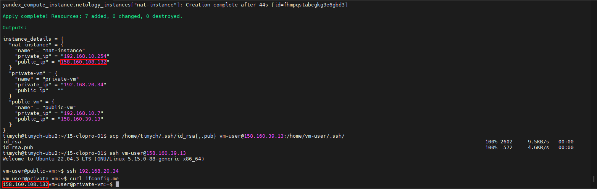

# Домашнее задание к занятию «Организация сети»

### Подготовка к выполнению задания

1. Домашнее задание состоит из обязательной части, которую нужно выполнить на провайдере Yandex Cloud, и дополнительной части в AWS (выполняется по желанию).
2. Все домашние задания в блоке 15 связаны друг с другом и в конце представляют пример законченной инфраструктуры.
3. Все задания нужно выполнить с помощью Terraform. Результатом выполненного домашнего задания будет код в репозитории.
4. Перед началом работы настройте доступ к облачным ресурсам из Terraform, используя материалы прошлых лекций и домашнее задание по теме «Облачные провайдеры и синтаксис Terraform». Заранее выберите регион (в случае AWS) и зону.

---
### Задание 1. Yandex Cloud

**Что нужно сделать**

1. Создать пустую VPC. Выбрать зону.
2. Публичная подсеть.

 - Создать в VPC subnet с названием public, сетью 192.168.10.0/24.
 - Создать в этой подсети NAT-инстанс, присвоив ему адрес 192.168.10.254. В качестве image_id использовать fd80mrhj8fl2oe87o4e1.
 - Создать в этой публичной подсети виртуалку с публичным IP, подключиться к ней и убедиться, что есть доступ к интернету.
3. Приватная подсеть.
 - Создать в VPC subnet с названием private, сетью 192.168.20.0/24.
 - Создать route table. Добавить статический маршрут, направляющий весь исходящий трафик private сети в NAT-инстанс.
 - Создать в этой приватной подсети виртуалку с внутренним IP, подключиться к ней через виртуалку, созданную ранее, и убедиться, что есть доступ к интернету.

Resource Terraform для Yandex Cloud:

- [VPC subnet](https://registry.terraform.io/providers/yandex-cloud/yandex/latest/docs/resources/vpc_subnet).
- [Route table](https://registry.terraform.io/providers/yandex-cloud/yandex/latest/docs/resources/vpc_route_table).
- [Compute Instance](https://registry.terraform.io/providers/yandex-cloud/yandex/latest/docs/resources/compute_instance).

---
### Задание 2. AWS* (задание со звёздочкой)

Это необязательное задание. Его выполнение не влияет на получение зачёта по домашней работе.

**Что нужно сделать**

1. Создать пустую VPC с подсетью 10.10.0.0/16.
2. Публичная подсеть.

 - Создать в VPC subnet с названием public, сетью 10.10.1.0/24.
 - Разрешить в этой subnet присвоение public IP по-умолчанию.
 - Создать Internet gateway.
 - Добавить в таблицу маршрутизации маршрут, направляющий весь исходящий трафик в Internet gateway.
 - Создать security group с разрешающими правилами на SSH и ICMP. Привязать эту security group на все, создаваемые в этом ДЗ, виртуалки.
 - Создать в этой подсети виртуалку и убедиться, что инстанс имеет публичный IP. Подключиться к ней, убедиться, что есть доступ к интернету.
 - Добавить NAT gateway в public subnet.
3. Приватная подсеть.
 - Создать в VPC subnet с названием private, сетью 10.10.2.0/24.
 - Создать отдельную таблицу маршрутизации и привязать её к private подсети.
 - Добавить Route, направляющий весь исходящий трафик private сети в NAT.
 - Создать виртуалку в приватной сети.
 - Подключиться к ней по SSH по приватному IP через виртуалку, созданную ранее в публичной подсети, и убедиться, что с виртуалки есть выход в интернет.

Resource Terraform:

1. [VPC](https://registry.terraform.io/providers/hashicorp/aws/latest/docs/resources/vpc).
1. [Subnet](https://registry.terraform.io/providers/hashicorp/aws/latest/docs/resources/subnet).
1. [Internet Gateway](https://registry.terraform.io/providers/hashicorp/aws/latest/docs/resources/internet_gateway).

### Правила приёма работы

Домашняя работа оформляется в своём Git репозитории в файле README.md. Выполненное домашнее задание пришлите ссылкой на .md-файл в вашем репозитории.
Файл README.md должен содержать скриншоты вывода необходимых команд, а также скриншоты результатов.
Репозиторий должен содержать тексты манифестов или ссылки на них в файле README.md.


### Решение

1. Конфигурационные файлы Terraform
   1. main.tf
        ```terraform
        terraform {
                    backend "s3" {
                    endpoint                    = "storage.yandexcloud.net"
                    bucket                      = "netology-tf-state"
                    region                      = "ru-central1"
                    key                         = "netology/netology.tfstate"
                    skip_region_validation      = true
                    skip_credentials_validation = true
                  }
                }

                provider "yandex" {
                  zone = var.zone
                }

                resource "yandex_compute_instance" "netology_instances" {
                  for_each                  = var.ycinstances
                  name                      = each.value.name
                  zone                      = var.zone
                  hostname                  = each.value.name
                  allow_stopping_for_update = true

                  resources {
                    core_fraction = each.value.core_fraction
                    cores         = each.value.cores
                    memory        = each.value.memory
                  }

                  boot_disk {
                    initialize_params {
                      image_id = each.value.image_id
                      name     = each.value.name
                      type     = each.value.hdd_type
                      size     = each.value.hdd_size
                    }
                  }

                  network_interface {
                    subnet_id  = var.ycinstances[each.key].subnet == "private" ? yandex_vpc_subnet.private.id : yandex_vpc_subnet.public.id
                    nat        = each.value.nat
                    ip_address = try(each.value.ipaddress, null)
                  }

                  scheduling_policy {
                    preemptible = true
                  }
                  lifecycle {
                    create_before_destroy = true
                  }
                  metadata = {
                    user-data = "#cloud-config\nusers:\n  - name: ${each.value.username}\n    groups: sudo\n    shell: /bin/bash\n    sudo: ['ALL=(ALL) NOPASSWD:ALL']\n    ssh-authorized-keys:\n      - ${file("${each.value.ssh_key}")}"
                  }
                }
        ```
   1. network.tf
        ```terraform
        resource "yandex_vpc_network" "default" {
          name = "netology"
        }

        resource "yandex_vpc_subnet" "public" {
          name           = "public"
          zone           = var.zone
          network_id     = yandex_vpc_network.default.id
          v4_cidr_blocks = ["192.168.10.0/24"]
        }

        resource "yandex_vpc_subnet" "private" {
          name           = "private"
          zone           = var.zone
          network_id     = yandex_vpc_network.default.id
          v4_cidr_blocks = ["192.168.20.0/24"]
          route_table_id = yandex_vpc_route_table.nat-instance-route.id
        }


        resource "yandex_vpc_route_table" "nat-instance-route" {
          name       = "nat-instance-route"
          network_id = yandex_vpc_network.default.id
          static_route {
            destination_prefix = "0.0.0.0/0"
            next_hop_address   = var.ycinstances["nat-instance"].ipaddress
          }
        }
        ```
   1. output.tf
        ```terraform
        locals {
                  instance_details = {
                    for key, instance in yandex_compute_instance.netology_instances :
                    key => {
                      name = instance.name
                      public_ip   = instance.network_interface.0.nat_ip_address
                      private_ip   = instance.network_interface.0.ip_address
                    }
                  }
                }


                output "instance_details" {
                  value = local.instance_details
                }
        ```
   1. versions.tf
        ```terraform
        terraform {
          required_providers {
            yandex = {
              source = "yandex-cloud/yandex"
            }
          }
          required_version = ">= 0.13"
        }
        ```
   1. variables.tf
        ```terraform
        variable "zone" {
          default = "ru-central1-a"
        }

        variable "ycinstances" {
          default = {
            nat-instance = {
              name          = "nat-instance"
              username      = "nat-user"
              image_id      = "fd8v8e1pus04ru8ibe12"
              core_fraction = 20
              cores         = 2
              memory        = 4
              hdd_type      = "network-hdd"
              hdd_size      = "10"
              subnet        = "public"
              ipaddress     = "192.168.10.254"
              nat           = true
              ssh_key       = "~/.ssh/id_rsa.pub"
            }
            public-vm = {
              name          = "public-vm"
              username      = "vm-user"
              image_id      = "fd8m3j9ott9u69hks0gg"
              core_fraction = 20
              cores         = 2
              memory        = 2
              hdd_type      = "network-hdd"
              hdd_size      = "20"
              subnet        = "public"
              nat           = true
              ssh_key       = "~/.ssh/id_rsa.pub"
            }
            private-vm = {
              name          = "private-vm"
              username      = "vm-user"
              image_id      = "fd8m3j9ott9u69hks0gg"
              core_fraction = 20
              cores         = 2
              memory        = 2
              hdd_type      = "network-hdd"
              hdd_size      = "20"
              subnet        = "private"
              nat           = false
              ssh_key       = "~/.ssh/id_rsa.pub"
            }
          }
        }
        ```

1. Результат выполнения(копирование сертификата на public-vm, соедиенение к private-vm, проверка доступа к интернет через curl ifconfig.me)


1. Ссылка на конфигурационные файлы terraform
[terraform](https://github.com/Timych84/devops-netology/blob/main/15-clopro-01/terraform/)
