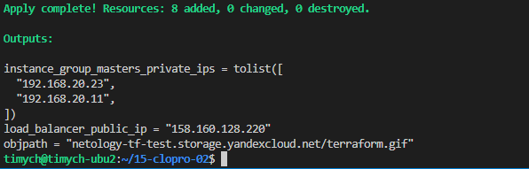

# Домашнее задание к занятию «Вычислительные мощности. Балансировщики нагрузки»

### Подготовка к выполнению задания

1. Домашнее задание состоит из обязательной части, которую нужно выполнить на провайдере Yandex Cloud, и дополнительной части в AWS (выполняется по желанию).
2. Все домашние задания в блоке 15 связаны друг с другом и в конце представляют пример законченной инфраструктуры.
3. Все задания нужно выполнить с помощью Terraform. Результатом выполненного домашнего задания будет код в репозитории.
4. Перед началом работы настройте доступ к облачным ресурсам из Terraform, используя материалы прошлых лекций и домашних заданий.

---
## Задание 1. Yandex Cloud

**Что нужно сделать**

1. Создать бакет Object Storage и разместить в нём файл с картинкой:

 - Создать бакет в Object Storage с произвольным именем (например, _имя_студента_дата_).
 - Положить в бакет файл с картинкой.
 - Сделать файл доступным из интернета.

2. Создать группу ВМ в public подсети фиксированного размера с шаблоном LAMP и веб-страницей, содержащей ссылку на картинку из бакета:

 - Создать Instance Group с тремя ВМ и шаблоном LAMP. Для LAMP рекомендуется использовать `image_id = fd827b91d99psvq5fjit`.
 - Для создания стартовой веб-страницы рекомендуется использовать раздел `user_data` в [meta_data](https://cloud.yandex.ru/docs/compute/concepts/vm-metadata).
 - Разместить в стартовой веб-странице шаблонной ВМ ссылку на картинку из бакета.
 - Настроить проверку состояния ВМ.

3. Подключить группу к сетевому балансировщику:

 - Создать сетевой балансировщик.
 - Проверить работоспособность, удалив одну или несколько ВМ.
4. (дополнительно)* Создать Application Load Balancer с использованием Instance group и проверкой состояния.

Полезные документы:

- [Compute instance group](https://registry.terraform.io/providers/yandex-cloud/yandex/latest/docs/resources/compute_instance_group).
- [Network Load Balancer](https://registry.terraform.io/providers/yandex-cloud/yandex/latest/docs/resources/lb_network_load_balancer).
- [Группа ВМ с сетевым балансировщиком](https://cloud.yandex.ru/docs/compute/operations/instance-groups/create-with-balancer).

---
## Задание 2*. AWS (задание со звёздочкой)

Это необязательное задание. Его выполнение не влияет на получение зачёта по домашней работе.

**Что нужно сделать**

Используя конфигурации, выполненные в домашнем задании из предыдущего занятия, добавить к Production like сети Autoscaling group из трёх EC2-инстансов с  автоматической установкой веб-сервера в private домен.

1. Создать бакет S3 и разместить в нём файл с картинкой:

 - Создать бакет в S3 с произвольным именем (например, _имя_студента_дата_).
 - Положить в бакет файл с картинкой.
 - Сделать доступным из интернета.
2. Сделать Launch configurations с использованием bootstrap-скрипта с созданием веб-страницы, на которой будет ссылка на картинку в S3.
3. Загрузить три ЕС2-инстанса и настроить LB с помощью Autoscaling Group.

Resource Terraform:

- [S3 bucket](https://registry.terraform.io/providers/hashicorp/aws/latest/docs/resources/s3_bucket)
- [Launch Template](https://registry.terraform.io/providers/hashicorp/aws/latest/docs/resources/launch_template).
- [Autoscaling group](https://registry.terraform.io/providers/hashicorp/aws/latest/docs/resources/autoscaling_group).
- [Launch configuration](https://registry.terraform.io/providers/hashicorp/aws/latest/docs/resources/launch_configuration).

Пример bootstrap-скрипта:

```
#!/bin/bash
yum install httpd -y
service httpd start
chkconfig httpd on
cd /var/www/html
echo "<html><h1>My cool web-server</h1></html>" > index.html
```
### Правила приёма работы

Домашняя работа оформляется в своём Git репозитории в файле README.md. Выполненное домашнее задание пришлите ссылкой на .md-файл в вашем репозитории.
Файл README.md должен содержать скриншоты вывода необходимых команд, а также скриншоты результатов.
Репозиторий должен содержать тексты манифестов или ссылки на них в файле README.md.


### Решение

1. Конфигурационные файлы Terraform
   1. main.tf
        ```terraform
        terraform {


          backend "s3" {
            endpoint                    = "storage.yandexcloud.net"
            bucket                      = "netology-tf-state"
            region                      = "ru-central1"
            key                         = "netology/netology-15-02.tfstate"
            skip_region_validation      = true
            skip_credentials_validation = true
          }
        }

        provider "yandex" {
          zone = var.zone
        }

        resource "yandex_iam_service_account" "ig-sa" {
          name        = "ig-sa"
        }

        resource "yandex_resourcemanager_folder_iam_member" "editor" {
          folder_id = var.FOLDER_ID
          role      = "editor"
          member    = "serviceAccount:${yandex_iam_service_account.ig-sa.id}"
        }


        resource "yandex_compute_instance_group" "ig-1" {
          name               = "nlb-vm-group"
          folder_id          = var.FOLDER_ID
          service_account_id = "${yandex_iam_service_account.ig-sa.id}"

          instance_template {
            platform_id = var.ycinstance.platform_id
            hostname    = "netology-test-{instance.zone_id}-{instance.index}"
            resources {
              core_fraction = var.ycinstance.core_fraction
              memory        = var.ycinstance.memory
              cores         = var.ycinstance.cores
            }

            boot_disk {
              mode = "READ_WRITE"
              initialize_params {
                image_id = var.ycinstance.image_id
                type     = var.ycinstance.hdd_type
                size     = var.ycinstance.hdd_size
              }
            }

            network_interface {
              network_id = yandex_vpc_network.default.id
              subnet_ids = ["${yandex_vpc_subnet.private.id}"]
              nat        = var.ycinstance.nat
            }

            metadata = {
              user-data =  "#cloud-config\nusers:\n  - name: ${var.ycinstance.username}\n    groups: sudo\n    shell: /bin/bash\n    sudo: ['ALL=(ALL) NOPASSWD:ALL']\n    ssh-authorized-keys:\n      - ${file("${var.ycinstance.ssh_key}")}\nwrite_files:\n  - path: '/var/www/html/index.nginx-debian.html'\n    content: |\n        ${indent(8,file("./index.html"))}\n    permissions: '0644'\n    defer: true\nruncmd:\n  - hostname > /root/hello.txt\n  - sed -i \"s/Your Server Name Here/$(hostname)/g\" /var/www/html/index.nginx-debian.html\n  - sed -i ${"\"s/--imagelink--/https:\\/\\/${yandex_storage_bucket.test.bucket_domain_name}\\/${yandex_storage_object.index-html.id}/g\""} /var/www/html/index.nginx-debian.html\n"
            }
          }

          scale_policy {
            fixed_scale {
              size = 2
            }
          }

          allocation_policy {
            zones = var.ig-1-zones
          }

          deploy_policy {
            max_unavailable = 1
            max_expansion   = 0
          }

          load_balancer {
            target_group_name = "nlb-tg"
          }
        }

        resource "yandex_lb_network_load_balancer" "netology" {
          name = "nlb-1"
          listener {
            name = "nlb-listener"
            port = 80
          }
          attached_target_group {
            target_group_id = "${yandex_compute_instance_group.ig-1.load_balancer.0.target_group_id}"
            healthcheck {
              name                = "health-check-1"
              unhealthy_threshold = 5
              healthy_threshold   = 5
              http_options {
                path = "/"
                port = 80
              }
            }
          }
        }
        ```
       1. network.tf
        ```terraform
        resource "yandex_vpc_network" "default" {
          name = "netology"
        }

        resource "yandex_vpc_subnet" "private" {
          name           = "private"
          zone           = var.zone
          network_id     = yandex_vpc_network.default.id
          v4_cidr_blocks = ["192.168.20.0/24"]
        }
        ```
   1. storage.tf
        ```terraform
        resource "yandex_storage_bucket" "test" {
          access_key = var.ACCESS_KEY
          secret_key = var.SECRET_KEY
          bucket     = "netology-tf-test"
          acl        = "public-read"
        }

        resource "yandex_storage_object" "index-html" {
          access_key = var.ACCESS_KEY
          secret_key = var.SECRET_KEY
          bucket     = yandex_storage_bucket.test.id
          key        = "terraform.gif"
          source     = "terraform.gif"
        }
        ```

   1. output.tf
        ```terraform
        output "load_balancer_public_ip" {
          description = "Private IP addresses"
          value = try("${[for s in yandex_lb_network_load_balancer.netology.listener: s.external_address_spec.*.address][0][0]}")
        }


        output "instance_group_masters_private_ips" {
          description = "Private IP addresses"
          value = yandex_compute_instance_group.ig-1.instances.*.network_interface.0.ip_address
        }

        output "objpath" {
          description = "objpath"
          value = "${yandex_storage_bucket.test.bucket_domain_name}/${yandex_storage_object.index-html.id}"
        }
        ```
   1. versions.tf
        ```terraform
        terraform {
          required_providers {
            yandex = {
              source = "yandex-cloud/yandex"
            }
          }
        }
        ```
   1. variables.tf
        ```terraform
        variable "zone" {
          default = "ru-central1-a"
        }

        variable "ig-1-zones" {
          default = ["ru-central1-a"]
        }

        variable "FOLDER_ID" {
            type        = string
            description = "ENV Variable FOLDER_ID"
        }

        variable "ACCESS_KEY" {
            type        = string
            description = "ENV Variable ACCESS_KEY"
        }

        variable "SECRET_KEY" {
            type        = string
            description = "ENV Variable SECRET_KEY"
            sensitive = true
        }

        variable "ycinstance" {
          default = {
              name          = "nat-instance"
              username      = "vm-user"
              image_id      = "fd8b939lr87it9flb468"
              platform_id   = "standard-v1"
              core_fraction = 20
              cores         = 2
              memory        = 4
              hdd_type      = "network-hdd"
              hdd_size      = "10"
              nat           = false
              ssh_key       = "~/.ssh/id_rsa.pub"
              ssh_pr_key    = "~/.ssh/id_rsa"
          }
        }
        ```

1. Результат выполнения(Создание instance group(LEMP), создание в инстансах веб-страницы с указанием имени сервера на странице, network load balancer, проверка)



1. Ссылка на конфигурационные файлы terraform
[terraform](https://github.com/Timych84/devops-netology/blob/main/15-clopro-02/terraform/)
