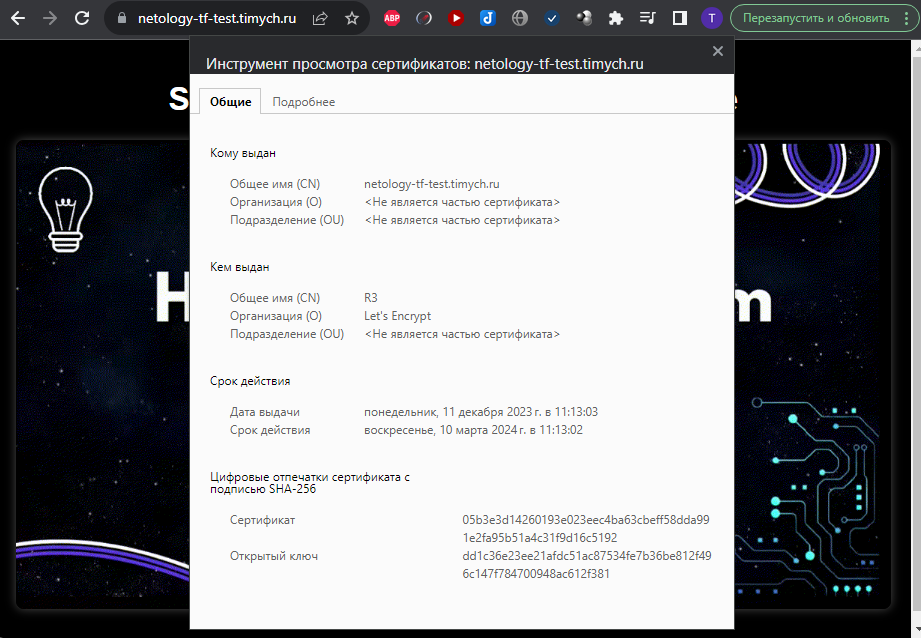

# Домашнее задание к занятию «Безопасность в облачных провайдерах»

Используя конфигурации, выполненные в рамках предыдущих домашних заданий, нужно добавить возможность шифрования бакета.

---
## Задание 1. Yandex Cloud

1. С помощью ключа в KMS необходимо зашифровать содержимое бакета:

 - создать ключ в KMS;
 - с помощью ключа зашифровать содержимое бакета, созданного ранее.
2. (Выполняется не в Terraform)* Создать статический сайт в Object Storage c собственным публичным адресом и сделать доступным по HTTPS:

 - создать сертификат;
 - создать статическую страницу в Object Storage и применить сертификат HTTPS;
 - в качестве результата предоставить скриншот на страницу с сертификатом в заголовке (замочек).

Полезные документы:

- [Настройка HTTPS статичного сайта](https://cloud.yandex.ru/docs/storage/operations/hosting/certificate).
- [Object Storage bucket](https://registry.terraform.io/providers/yandex-cloud/yandex/latest/docs/resources/storage_bucket).
- [KMS key](https://registry.terraform.io/providers/yandex-cloud/yandex/latest/docs/resources/kms_symmetric_key).

---
## Задание 2*. AWS (задание со звёздочкой)

Это необязательное задание. Его выполнение не влияет на получение зачёта по домашней работе.

**Что нужно сделать**

1. С помощью роли IAM записать файлы ЕС2 в S3-бакет:
 - создать роль в IAM для возможности записи в S3 бакет;
 - применить роль к ЕС2-инстансу;
 - с помощью bootstrap-скрипта записать в бакет файл веб-страницы.
2. Организация шифрования содержимого S3-бакета:

 - используя конфигурации, выполненные в домашнем задании из предыдущего занятия, добавить к созданному ранее бакету S3 возможность шифрования Server-Side, используя общий ключ;
 - включить шифрование SSE-S3 бакету S3 для шифрования всех вновь добавляемых объектов в этот бакет.

3. *Создание сертификата SSL и применение его к ALB:

 - создать сертификат с подтверждением по email;
 - сделать запись в Route53 на собственный поддомен, указав адрес LB;
 - применить к HTTPS-запросам на LB созданный ранее сертификат.

Resource Terraform:

- [IAM Role](https://registry.terraform.io/providers/hashicorp/aws/latest/docs/resources/iam_role).
- [AWS KMS](https://registry.terraform.io/providers/hashicorp/aws/latest/docs/resources/kms_key).
- [S3 encrypt with KMS key](https://registry.terraform.io/providers/hashicorp/aws/latest/docs/resources/s3_bucket_object#encrypting-with-kms-key).

Пример bootstrap-скрипта:

```
#!/bin/bash
yum install httpd -y
service httpd start
chkconfig httpd on
cd /var/www/html
echo "<html><h1>My cool web-server</h1></html>" > index.html
aws s3 mb s3://mysuperbacketname2021
aws s3 cp index.html s3://mysuperbacketname2021
```

### Правила приёма работы

Домашняя работа оформляется в своём Git репозитории в файле README.md. Выполненное домашнее задание пришлите ссылкой на .md-файл в вашем репозитории.
Файл README.md должен содержать скриншоты вывода необходимых команд, а также скриншоты результатов.
Репозиторий должен содержать тексты манифестов или ссылки на них в файле README.md.


### Решение

1. Для настройки шифрования в бакете добавляем ресурс yandex_kms_symmetric_key, добавляем сервисному аккунту роль kms.keys.encrypterDecrypter и включаем шифрование в ресурсе бакета(server_side_encryption_configuration). При этом работа включение делает невозможным просмотр статического сайта(ошибка nusuchbucket), поэтому в дальнейшем коде шифрование закомментировано.
2. Сертификат удалось прикрутить с помощью terraform, единственно, что пришлось в стороннем dns сервисе сделать запись типа: CNAME netology-tf-test netology-tf-test.timych.ru.website.yandexcloud.net.
   1. Добавляем сертификат LetsEncrypt с помощью ресурса yandex_cm_certificate с типом проверки HTTP
   2. Получаем содержимое и путь к проверочному файлу для LetsEncrypt из ресурса yandex_cm_certificate
   3. Кладем с помощью ресурса yandex_storage_object по требуемому пути файл для проверки LetsEncrypt
   4. Ждем валидации сертификата и привязки его к бакету
   5. Результат:\
    
    

3. Конфигурационные файлы Terraform
   1. main.tf
        ```terraform
        terraform {


            backend "s3" {
            endpoints = {
                s3 = "https://storage.yandexcloud.net"
            }
            bucket                      = "netology-tf-state"
            region                      = "ru-central1"
            key                         = "netology/netology-15-03.tfstate"
            skip_region_validation      = true
            skip_credentials_validation = true
            skip_requesting_account_id  = true
            skip_s3_checksum            = true
            }
        }

        provider "yandex" {
            zone = var.zone
        }
        ```
    2. security.tf
         ```terraform
        resource "yandex_kms_symmetric_key" "key-net-a" {
          name              = "netology-symetric-key"
          description       = "symmetric key for netology"
          default_algorithm = "AES_256"
          rotation_period   = "8760h"
          folder_id = var.FOLDER_ID
        }


        resource "yandex_iam_service_account" "sa" {
          name = "netology-15-03"
          folder_id = var.FOLDER_ID
        }

        resource "yandex_resourcemanager_folder_iam_member" "sa-editor" {
          folder_id = var.FOLDER_ID
          role      = "storage.editor"
          member    = "serviceAccount:${yandex_iam_service_account.sa.id}"
        }

        resource "yandex_resourcemanager_folder_iam_member" "kms" {
          folder_id = var.FOLDER_ID
          role      = "kms.keys.encrypterDecrypter"
          member    = "serviceAccount:${yandex_iam_service_account.sa.id}"
        }

        resource "yandex_iam_service_account_static_access_key" "sa-static-key" {
          service_account_id = yandex_iam_service_account.sa.id
          description        = "static access key for object storage"
        }

        resource "yandex_cm_certificate" "le-certificate" {
          name    = "netology"
          domains = ["netology-tf-test.timych.ru"]

          managed {
          challenge_type = "HTTP"
          }
        }
         ```
   2. storage.tf
        ```terraform
        resource "yandex_storage_bucket" "test" {
          access_key = yandex_iam_service_account_static_access_key.sa-static-key.access_key
          secret_key = yandex_iam_service_account_static_access_key.sa-static-key.secret_key
          bucket     = "netology-tf-test.timych.ru"
          acl        = "public-read"
          website {
            index_document = "index.html"
            error_document = "error.html"
          }
          https {
            certificate_id = yandex_cm_certificate.le-certificate.id
          }
          # server_side_encryption_configuration {
          #     rule {
          #       apply_server_side_encryption_by_default {
          #         kms_master_key_id = yandex_kms_symmetric_key.key-net-a.id
          #         sse_algorithm     = "aws:kms"
          #       }
          #     }
          #   }
        }

        resource "yandex_storage_object" "terraform-gif" {
          access_key = yandex_iam_service_account_static_access_key.sa-static-key.access_key
          secret_key = yandex_iam_service_account_static_access_key.sa-static-key.secret_key
          bucket     = yandex_storage_bucket.test.id
          key        = "terraform.gif"
          source     = "terraform.gif"
          acl        = "public-read"
        }

        resource "yandex_storage_object" "index-html" {
          access_key = yandex_iam_service_account_static_access_key.sa-static-key.access_key
          secret_key = yandex_iam_service_account_static_access_key.sa-static-key.secret_key
          bucket     = yandex_storage_bucket.test.id
          key        = "index.html"
          source     = "index.html"
          acl        = "public-read"
        }

        resource "yandex_storage_object" "error-html" {
          access_key = yandex_iam_service_account_static_access_key.sa-static-key.access_key
          secret_key = yandex_iam_service_account_static_access_key.sa-static-key.secret_key
          bucket     = yandex_storage_bucket.test.id
          key        = "error.html"
          source     = "error.html"
          acl        = "public-read"
        }


        locals {
          url = yandex_cm_certificate.le-certificate.challenges[0].http_url
          extracted_part = regex("^http[s]*:\\/\\/[^\\/]+\\/(.+)$", local.url)[0]
        }


        resource "yandex_storage_object" "lets" {
          access_key = yandex_iam_service_account_static_access_key.sa-static-key.access_key
          secret_key = yandex_iam_service_account_static_access_key.sa-static-key.secret_key
          bucket     = yandex_storage_bucket.test.id
          key        = local.extracted_part
          content    = yandex_cm_certificate.le-certificate.challenges[0].http_content
          acl        = "public-read"
        }
        ```

   1. versions.tf
        ```terraform
        terraform {
          required_providers {
            yandex = {
              source = "yandex-cloud/yandex"
            }
          }
        }
        ```
   1. variables.tf
        ```terraform
        variable "zone" {
          default = "ru-central1-a"
        }

        variable "FOLDER_ID" {
            type        = string
            description = "ENV Variable FOLDER_ID"
        }
        ```


1. Ссылка на конфигурационные файлы terraform
[terraform](https://github.com/Timych84/devops-netology/blob/main/15-clopro-02/terraform/)
