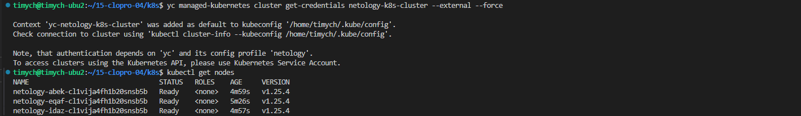
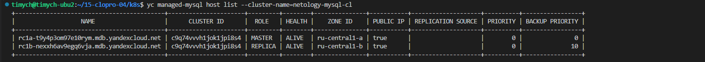
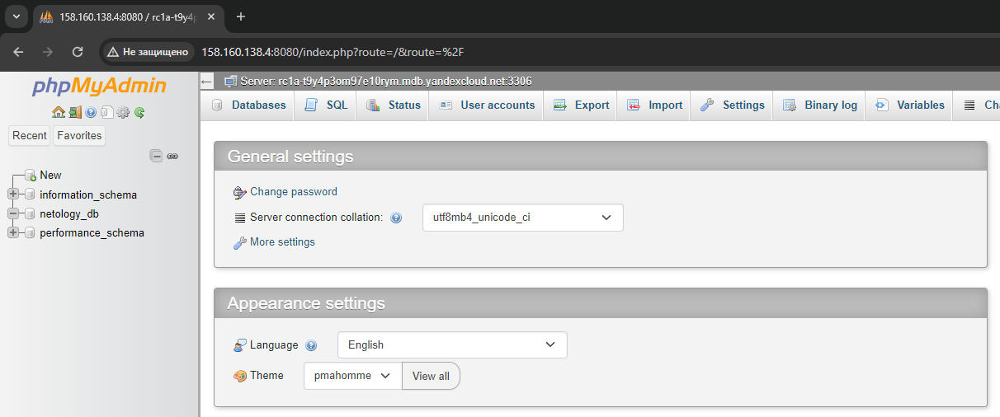

# Домашнее задание к занятию «Кластеры. Ресурсы под управлением облачных провайдеров»

### Цели задания

1. Организация кластера Kubernetes и кластера баз данных MySQL в отказоустойчивой архитектуре.
2. Размещение в private подсетях кластера БД, а в public — кластера Kubernetes.

---
## Задание 1. Yandex Cloud

1. Настроить с помощью Terraform кластер баз данных MySQL.

 - Используя настройки VPC из предыдущих домашних заданий, добавить дополнительно подсеть private в разных зонах, чтобы обеспечить отказоустойчивость.
 - Разместить ноды кластера MySQL в разных подсетях.
 - Необходимо предусмотреть репликацию с произвольным временем технического обслуживания.
 - Использовать окружение Prestable, платформу Intel Broadwell с производительностью 50% CPU и размером диска 20 Гб.
 - Задать время начала резервного копирования — 23:59.
 - Включить защиту кластера от непреднамеренного удаления.
 - Создать БД с именем `netology_db`, логином и паролем.

2. Настроить с помощью Terraform кластер Kubernetes.

 - Используя настройки VPC из предыдущих домашних заданий, добавить дополнительно две подсети public в разных зонах, чтобы обеспечить отказоустойчивость.
 - Создать отдельный сервис-аккаунт с необходимыми правами.
 - Создать региональный мастер Kubernetes с размещением нод в трёх разных подсетях.
 - Добавить возможность шифрования ключом из KMS, созданным в предыдущем домашнем задании.
 - Создать группу узлов, состояющую из трёх машин с автомасштабированием до шести.
 - Подключиться к кластеру с помощью `kubectl`.
 - *Запустить микросервис phpmyadmin и подключиться к ранее созданной БД.
 - *Создать сервис-типы Load Balancer и подключиться к phpmyadmin. Предоставить скриншот с публичным адресом и подключением к БД.

Полезные документы:

- [MySQL cluster](https://registry.terraform.io/providers/yandex-cloud/yandex/latest/docs/resources/mdb_mysql_cluster).
- [Создание кластера Kubernetes](https://cloud.yandex.ru/docs/managed-kubernetes/operations/kubernetes-cluster/kubernetes-cluster-create)
- [K8S Cluster](https://registry.terraform.io/providers/yandex-cloud/yandex/latest/docs/resources/kubernetes_cluster).
- [K8S node group](https://registry.terraform.io/providers/yandex-cloud/yandex/latest/docs/resources/kubernetes_node_group).

### Решение

1. Конфигурационные файлы Terraform для создания кластеров MySQL и Kubernetes
   1.   <details>
        <summary>main.tf</summary>

        ```terraform
        terraform {
            backend "s3" {
            endpoints = {
                s3 = "https://storage.yandexcloud.net"
            }
            bucket                      = "netology-tf-state"
            region                      = "ru-central1"
            key                         = "netology/netology-15-04-k8s.tfstate"
            skip_region_validation      = true
            skip_credentials_validation = true
            skip_requesting_account_id  = true
            skip_s3_checksum            = true
            }
        }

        provider "yandex" {
            zone = var.zone
        }
        ```
        </details>
   1.   <details>
        <summary>security.tf</summary>

         ```terraform
        resource "yandex_iam_service_account" "netology-k8s-sa" {
          name        = "netology-k8s-sa"
          description = "K8S regional service account"
        }

        resource "yandex_resourcemanager_folder_iam_member" "k8s-clusters-agent" {
          folder_id = var.FOLDER_ID
          role      = "k8s.clusters.agent"
          member    = "serviceAccount:${yandex_iam_service_account.netology-k8s-sa.id}"
        }

        resource "yandex_resourcemanager_folder_iam_member" "vpc-public-admin" {
          folder_id = var.FOLDER_ID
          role      = "vpc.publicAdmin"
          member    = "serviceAccount:${yandex_iam_service_account.netology-k8s-sa.id}"
        }

        resource "yandex_resourcemanager_folder_iam_member" "images-puller" {
          folder_id = var.FOLDER_ID
          role      = "container-registry.images.puller"
          member    = "serviceAccount:${yandex_iam_service_account.netology-k8s-sa.id}"
        }

        resource "yandex_kms_symmetric_key" "kms-key" {
          name              = "kms-key"
          default_algorithm = "AES_128"
          rotation_period   = "8760h"
        }

        resource "yandex_resourcemanager_folder_iam_member" "editor" {
          folder_id = var.FOLDER_ID
          role      = "editor"
          member    = "serviceAccount:${yandex_iam_service_account.netology-k8s-sa.id}"
        }

        resource "yandex_vpc_security_group" "k8s-main-sg" {
          name        = "k8s-main-sg"
          description = "Правила группы обеспечивают базовую работоспособность кластера Managed Service for Kubernetes."
          network_id  = yandex_vpc_network.netology_net.id
          ingress {
            protocol          = "TCP"
            description       = "Правило разрешает проверки доступности с диапазона адресов балансировщика нагрузки. Нужно для работы отказоустойчивого кластера Managed Service for Kubernetes и сервисов балансировщика."
            predefined_target = "loadbalancer_healthchecks"
            from_port         = 0
            to_port           = 65535
          }
          ingress {
            protocol          = "ANY"
            description       = "Правило разрешает взаимодействие мастер-узел и узел-узел внутри группы безопасности."
            predefined_target = "self_security_group"
            from_port         = 0
            to_port           = 65535
          }
          ingress {
            protocol          = "ANY"
            description       = "Правило разрешает взаимодействие под-под и сервис-сервис. Укажите подсети вашего кластера Managed Service for Kubernetes и сервисов."
            v4_cidr_blocks    = concat(yandex_vpc_subnet.netology-k8s-subnet-a.v4_cidr_blocks, yandex_vpc_subnet.netology-k8s-subnet-b.v4_cidr_blocks, yandex_vpc_subnet.netology-k8s-subnet-c.v4_cidr_blocks)
            from_port         = 0
            to_port           = 65535
          }
          ingress {
            protocol          = "ICMP"
            description       = "Правило разрешает отладочные ICMP-пакеты из внутренних подсетей."
            v4_cidr_blocks    = ["10.0.0.0/8", "172.16.0.0/12", "192.168.0.0/16"]
          }
          ingress {
            protocol          = "TCP"
            description       = "Правило разрешает входящий трафик из интернета на диапазон портов NodePort. Добавьте или измените порты на нужные вам."
            v4_cidr_blocks    = ["0.0.0.0/0"]
            from_port         = 30000
            to_port           = 32767
          }
          egress {
            protocol          = "ANY"
            description       = "Правило разрешает весь исходящий трафик. Узлы могут связаться с Yandex Container Registry, Yandex Object Storage, Docker Hub и т. д."
            v4_cidr_blocks    = ["0.0.0.0/0"]
            from_port         = 0
            to_port           = 65535
          }

          ingress {
            protocol          = "TCP"
            description       = "Правило для доступа к K8S API. Желательно ограничивать конкретными адресами."
            v4_cidr_blocks    = ["0.0.0.0/0"]
            from_port         = 0
            to_port           = 443
          }

          ingress {
            protocol          = "TCP"
            description       = "Правило для доступа к K8S API. Желательно ограничивать конкретными адресами."
            v4_cidr_blocks    = ["0.0.0.0/0"]
            from_port         = 0
            to_port           = 6443
          }
        }


        resource "yandex_vpc_security_group" "mysql-sg" {
          name       = "mysql-sg"
          network_id = yandex_vpc_network.netology_net.id

          ingress {
            description    = "MySQL"
            port           = 3306
            protocol       = "TCP"
            v4_cidr_blocks = [ "0.0.0.0/0" ]
          }
        }
         ```
        </details>
   1.   <details>
        <summary>network.tf</summary>

        ```terraform
        resource "yandex_vpc_network" "netology_net" {
          name = "netology_net"
        }

        resource "yandex_vpc_subnet" "netology-mysql-subnet-a" {
          name             = "netology-mysql-subnet-a"
          zone             = "ru-central1-a"
          network_id       = yandex_vpc_network.netology_net.id
          v4_cidr_blocks   = ["10.3.0.0/24"]
        }

        resource "yandex_vpc_subnet" "netology-mysql-subnet-b" {
          name             = "netology-mysql-subnet-b"
          zone             = "ru-central1-b"
          network_id       = yandex_vpc_network.netology_net.id
          v4_cidr_blocks   = ["10.4.0.0/24"]
        }


        resource "yandex_vpc_subnet" "netology-k8s-subnet-a" {
          name             = "netology-k8s-subnet-a"
          zone             = "ru-central1-a"
          network_id       = yandex_vpc_network.netology_net.id
          v4_cidr_blocks   = ["10.5.0.0/24"]
        }

        resource "yandex_vpc_subnet" "netology-k8s-subnet-b" {
          name             = "netology-k8s-subnet-b"
          zone             = "ru-central1-b"
          network_id       = yandex_vpc_network.netology_net.id
          v4_cidr_blocks   = ["10.6.0.0/24"]
        }

        resource "yandex_vpc_subnet" "netology-k8s-subnet-c" {
          name             = "netology-k8s-subnet-c"
          zone             = "ru-central1-c"
          network_id       = yandex_vpc_network.netology_net.id
          v4_cidr_blocks   = ["10.7.0.0/24"]
        }

        ```
        </details>

   1.   <details>
        <summary>versions.tf</summary>

        ```terraform
        terraform {
          required_providers {
            yandex = {
              source = "yandex-cloud/yandex"
            }
          }
        }
        ```
        </details>
   1.   <details>
        <summary>variables.tf</summary>

        ```terraform
        variable "zone" {
          default = "ru-central1-a"
        }

        variable "FOLDER_ID" {
            type        = string
            description = "ENV Variable FOLDER_ID"
        }

        variable "NETOLOGY_DBPASS" {
            type        = string
            description = "ENV password for netology_db"
            sensitive = true
        }
        ```
        </details>

   1.   <details>
        <summary>mysql.tf(Создание кластера MySQL и бд в нем)</summary>

        ```terraform
        resource "yandex_mdb_mysql_cluster" "netology-mysql-cl" {
          name                = "netology-mysql-cl"
          environment         = "PRODUCTION"
          network_id          = yandex_vpc_network.netology_net.id
          version             = "8.0"
          security_group_ids  = [ yandex_vpc_security_group.mysql-sg.id ]
          deletion_protection = true
          maintenance_window {
            type = "ANYTIME"
          }

          backup_window_start {
            hours   = 23
            minutes = 59
          }

          resources {
            resource_preset_id = "b1.medium"
            disk_type_id       = "network-hdd"
            disk_size          = 20
          }

          host {
            zone             = "ru-central1-a"
            name             = "netology-mysql-a"
            subnet_id        = yandex_vpc_subnet.netology-mysql-subnet-a.id
            assign_public_ip = true
          }

          host {
            zone             = "ru-central1-b"
            name             = "netology-mysql-b"
            subnet_id        = yandex_vpc_subnet.netology-mysql-subnet-b.id
            assign_public_ip = true
            backup_priority  = 10
          }
        }

        resource "yandex_mdb_mysql_database" "netology_db" {
          cluster_id = yandex_mdb_mysql_cluster.netology-mysql-cl.id
          name       = "netology_db"
        }

        resource "yandex_mdb_mysql_user" "netology" {
          cluster_id = yandex_mdb_mysql_cluster.netology-mysql-cl.id
          name       = "netology"
          password   = var.NETOLOGY_DBPASS
          permission {
            database_name = yandex_mdb_mysql_database.netology_db.name
            roles         = ["ALL"]
          }
        }
        ```
        </details>
   1.   <details>
        <summary>cluster.tf(Создание кластера)</summary>

        ```terraform
        locals {
          k8s_version = "1.25"
        }

        resource "yandex_kubernetes_cluster" "k8s-regional" {
          name       = "netology-k8s-cluster"
          network_id = yandex_vpc_network.netology_net.id
          master {
            version = local.k8s_version
            regional {
              region = "ru-central1"
              location {
                zone      = yandex_vpc_subnet.netology-k8s-subnet-a.zone
                subnet_id = yandex_vpc_subnet.netology-k8s-subnet-a.id
              }
              location {
                zone      = yandex_vpc_subnet.netology-k8s-subnet-b.zone
                subnet_id = yandex_vpc_subnet.netology-k8s-subnet-b.id
              }
              location {
                zone      = yandex_vpc_subnet.netology-k8s-subnet-c.zone
                subnet_id = yandex_vpc_subnet.netology-k8s-subnet-c.id
              }
            }
            public_ip = true
          }

          service_account_id      = yandex_iam_service_account.netology-k8s-sa.id
          node_service_account_id = yandex_iam_service_account.netology-k8s-sa.id
          depends_on = [
            yandex_iam_service_account.netology-k8s-sa,
            yandex_resourcemanager_folder_iam_member.k8s-clusters-agent,
            yandex_resourcemanager_folder_iam_member.vpc-public-admin,
            yandex_resourcemanager_folder_iam_member.images-puller,
            yandex_resourcemanager_folder_iam_member.editor,
            yandex_kms_symmetric_key.kms-key,
            yandex_vpc_security_group.k8s-main-sg
          ]
          kms_provider {
            key_id = yandex_kms_symmetric_key.kms-key.id
          }
        }

        ```
        </details>
   1.   <details>
        <summary>node_group.tf(Создание группы узлов)</summary>

        ```terraform
        resource "yandex_kubernetes_node_group" "netology-k8s-nodegroup" {
          cluster_id = yandex_kubernetes_cluster.k8s-regional.id
          name       = "netology-k8s-nodegroup"
          instance_template {
            name       = "netology-{instance.short_id}-{instance_group.id}"
            platform_id = "standard-v3"
            network_acceleration_type = "standard"
            network_interface {
              nat                = true
              subnet_ids = [yandex_vpc_subnet.netology-k8s-subnet-a.id]
            }
            resources {
              memory = 4
              cores  = 2
              core_fraction = 20
            }

            boot_disk {
              type = "network-hdd"
              size = 64
            }

            scheduling_policy {
              preemptible = true
            }

            container_runtime {
              type = "containerd"
            }
          }
          scale_policy {
            auto_scale {
              min     = 3
              max     = 6
              initial = 3
            }
          }
          allocation_policy {
            location {
              zone = "ru-central1-a"
            }
          }
        }

        ```
        </details>

1. После создания кластеров получаем доступ к кластеру Kubernetes и проверяем статус узлов.\

1. Получаем имя узла MySQL\

1. Решил развррнуть deployment с phpmyadmin и LoadBalancer service с помощью Terraform K8S provider. Конфигурационные файлы Terraform:
   1.   <details>
        <summary>main.tf</summary>
        ```terraform
        locals {
          mysql_host      = "rc1a-t9y4p3om97e10rym.mdb.yandexcloud.net"
          mysql_port      = 3306
          phpmyadmin_port = 80
          k8s_namespace   = "netology"
        }

        provider "kubernetes" {
          config_path    = "~/.kube/config"
          config_context = "yc-netology-k8s-cluster"
        }

        resource "kubernetes_namespace" "netology" {
          metadata {
            name = local.k8s_namespace
          }
        }

        resource "kubernetes_deployment" "phpmyadmin-01" {
          metadata {
            name = "phpmyadmin"
            labels = {
              app = "phpmyadmin"
            }
            namespace = local.k8s_namespace
          }

          spec {
            replicas = 1

            selector {
              match_labels = {
                app = "phpmyadmin"
              }
            }

            template {
              metadata {
                labels = {
                  app = "phpmyadmin"
                }
              }

              spec {
                container {
                  image = "phpmyadmin/phpmyadmin"
                  name  = "phpmyadmin"
                  env {
                    name = "PMA_HOST"
                    value = local.mysql_host
                  }
                  env {
                    name = "PMA_PORT"
                    value = local.mysql_port
                  }
                  port {
                    container_port = local.phpmyadmin_port
                    name = "phpmyadmin"
                  }
                }
              }
            }
          }
        }


        resource "kubernetes_service" "phpmyadmin" {
          metadata {
            name = "phpmyadmin"
            namespace = local.k8s_namespace
          }
          spec {
            selector = {
              app = kubernetes_deployment.phpmyadmin-01.spec.0.template.0.metadata[0].labels.app
            }
            port {
              port        = 8080
              target_port = local.phpmyadmin_port
            }

            type = "LoadBalancer"
          }
        }
        ```
        </details>

   1.   <details>
        <summary>output.tf</summary>

        ```terraform
        output "Service_ip" {
          value = kubernetes_service.phpmyadmin.status[0].load_balancer[0].ingress[0].ip
        }
        ```
        </details>

1. При применении получаем адрес по которому можно подключаться к phpmyadmin




2. Ссылка на конфигурационные файлы terraform
[terraform](https://github.com/Timych84/devops-netology/blob/main/15-clopro-04/terraform/)
