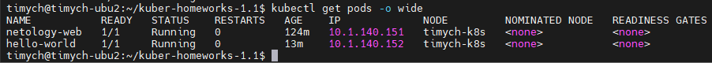
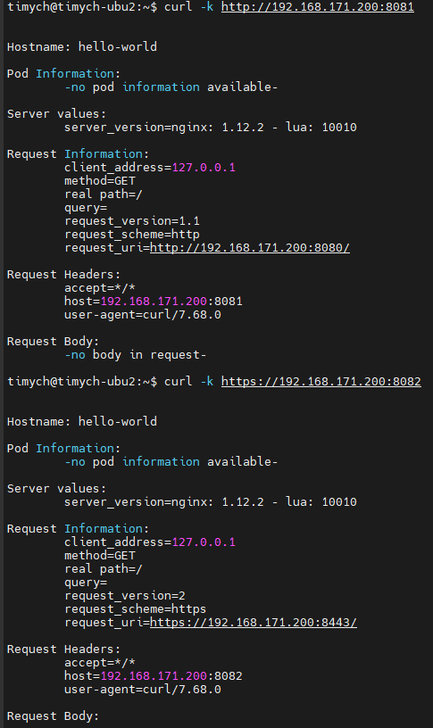
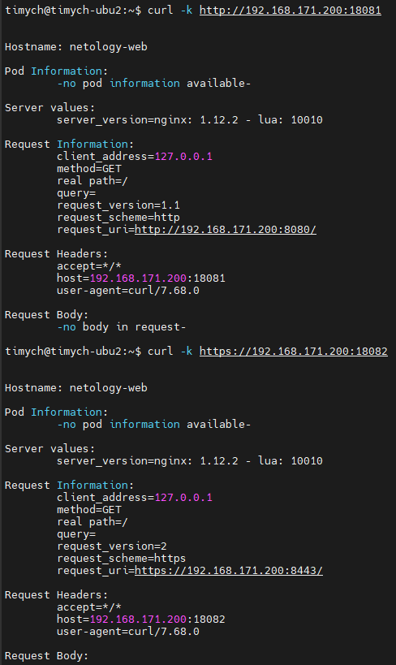

# Домашнее задание к занятию «Базовые объекты K8S»

### Цель задания

В тестовой среде для работы с Kubernetes, установленной в предыдущем ДЗ, необходимо развернуть Pod с приложением и подключиться к нему со своего локального компьютера.

------

### Чеклист готовности к домашнему заданию

1. Установленное k8s-решение (например, MicroK8S).
2. Установленный локальный kubectl.
3. Редактор YAML-файлов с подключенным Git-репозиторием.

------

### Инструменты и дополнительные материалы, которые пригодятся для выполнения задания

1. Описание [Pod](https://kubernetes.io/docs/concepts/workloads/pods/) и примеры манифестов.
2. Описание [Service](https://kubernetes.io/docs/concepts/services-networking/service/).

------

### Задание 1. Создать Pod с именем hello-world

1. Создать манифест (yaml-конфигурацию) Pod.
2. Использовать image - gcr.io/kubernetes-e2e-test-images/echoserver:2.2.
3. Подключиться локально к Pod с помощью `kubectl port-forward` и вывести значение (curl или в браузере).

### Решение

1. Манифест

    ```yml
    apiVersion: v1
    kind: Pod
    metadata:
      name: hello-world
      labels:
        app: echoserver
    spec:
      containers:
      - name: echoserver
        image: gcr.io/kubernetes-e2e-test-images/echoserver:2.2
        ports:
        - containerPort: 8080
        - containerPort: 8443
        # env:
        # - name: PORT
        #   value: "8080" и "8443" порт в данном образе всегда
        resources:
          limits:
            cpu: "0.1"
            memory: "128Mi"
    ```
1. Скрипт port-forward для проброса двух портов одновременно:

    ```bash
    #!/bin/bash
    # Push commands in the background, when the script exits, the commands will exit too
    kubectl port-forward -n default --address 192.168.171.200 services/netology-svc 18081:8081 & \
    kubectl port-forward -n default --address 192.168.171.200 services/netology-svc 18082:8082 & \
    echo "Press CTRL-C to stop port forwarding and exit the script"
    wait
    ```

1. Скриншоты:

- Get pods:\


- Curl:\


1. Ссылки:

    [Манифест pod](https://github.com/Timych84/devops-netology/blob/main/kuber-homeworks-1.2/echoserver/hello-world_pod.yaml)
    [Скрипт port-forward для pod](https://github.com/Timych84/devops-netology/blob/main/kuber-homeworks-1.2/echoserver/port-forward_pod.sh)

------

### Задание 2. Создать Service и подключить его к Pod

1. Создать Pod с именем netology-web.
2. Использовать image — gcr.io/kubernetes-e2e-test-images/echoserver:2.2.
3. Создать Service с именем netology-svc и подключить к netology-web.
4. Подключиться локально к Service с помощью `kubectl port-forward` и вывести значение (curl или в браузере).

### Решение

1. Манифест pod:
    ```yml
    apiVersion: v1
    kind: Pod
    metadata:
        name: netology-web
        labels:
        app: netology-web
    spec:
        containers:
        - name: echoserver
        image: gcr.io/kubernetes-e2e-test-images/echoserver:2.2
        ports:
        - containerPort: 8080
        - containerPort: 8443
        # env:
        # - name: PORT
        #   value: "8080" и "8443" порт в данном образе всегда
        resources:
            limits:
            cpu: "0.1"
            memory: "128Mi"
    ```
1. Манифест service:
    ```yml
    apiVersion: v1
    kind: Service
    metadata:
      name: netology-svc
      # namespace: echoserver
    spec:
      ports:
        - port: 8081
          targetPort: 8080
          name: http
          protocol: TCP
        - port: 8082
          targetPort: 8443
          name: https
          protocol: TCP
      type: ClusterIP
      selector:
        app: netology-web
    ```

1. Скрипт port-forward для проброса двух портов одновременно:

    ```bash
    #!/bin/bash
    # Push commands in the background, when the script exits, the commands will exit too
    kubectl port-forward -n default --address 192.168.171.200 services/netology-svc 18081:8081 & \
    kubectl port-forward -n default --address 192.168.171.200 services/netology-svc 18082:8082 & \
    echo "Press CTRL-C to stop port forwarding and exit the script"
    wait
    ```

1. Скриншоты:

- Get pods:\


- Curl:\



1. Ссылки:

    [Манифест pod](https://github.com/Timych84/devops-netology/blob/main/kuber-homeworks-1.2/echoserver/netology-web_pod.yaml)

    [Манифест svc](https://github.com/Timych84/devops-netology/blob/main/kuber-homeworks-1.2/echoserver/netology-svc_service.yaml)

    [Скрипт port-forward для svc](https://github.com/Timych84/devops-netology/blob/main/kuber-homeworks-1.2/echoserver/port-forward_svc.sh)
------

### Правила приёма работы

1. Домашняя работа оформляется в своем Git-репозитории в файле README.md. Выполненное домашнее задание пришлите ссылкой на .md-файл в вашем репозитории.
2. Файл README.md должен содержать скриншоты вывода команд `kubectl get pods`, а также скриншот результата подключения.
3. Репозиторий должен содержать файлы манифестов и ссылки на них в файле README.md.

------

### Критерии оценки
Зачёт — выполнены все задания, ответы даны в развернутой форме, приложены соответствующие скриншоты и файлы проекта, в выполненных заданиях нет противоречий и нарушения логики.

На доработку — задание выполнено частично или не выполнено, в логике выполнения заданий есть противоречия, существенные недостатки.
