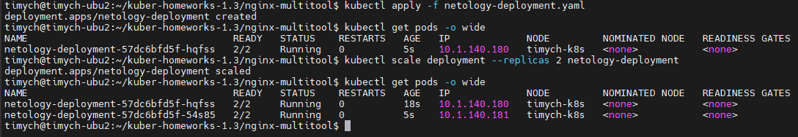
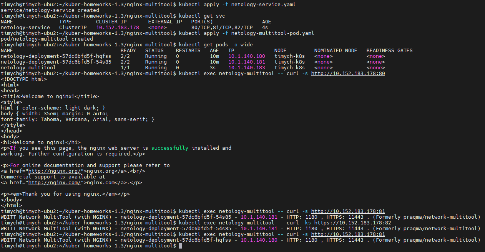
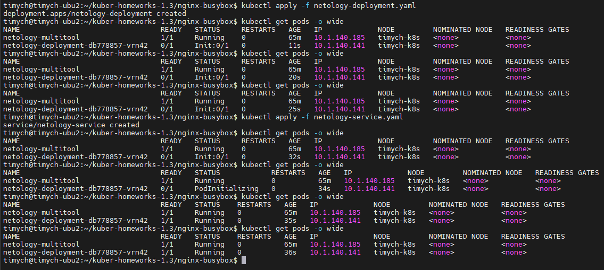

# Домашнее задание к занятию «Запуск приложений в K8S»

### Цель задания

В тестовой среде для работы с Kubernetes, установленной в предыдущем ДЗ, необходимо развернуть Deployment с приложением, состоящим из нескольких контейнеров, и масштабировать его.

------

### Чеклист готовности к домашнему заданию

1. Установленное k8s-решение (например, MicroK8S).
2. Установленный локальный kubectl.
3. Редактор YAML-файлов с подключённым git-репозиторием.

------

### Инструменты и дополнительные материалы, которые пригодятся для выполнения задания

1. [Описание](https://kubernetes.io/docs/concepts/workloads/controllers/deployment/) Deployment и примеры манифестов.
2. [Описание](https://kubernetes.io/docs/concepts/workloads/pods/init-containers/) Init-контейнеров.
3. [Описание](https://github.com/wbitt/Network-MultiTool) Multitool.

------

### Задание 1. Создать Deployment и обеспечить доступ к репликам приложения из другого Pod

1. Создать Deployment приложения, состоящего из двух контейнеров — nginx и multitool. Решить возникшую ошибку.
2. После запуска увеличить количество реплик работающего приложения до 2.
3. Продемонстрировать количество подов до и после масштабирования.
4. Создать Service, который обеспечит доступ до реплик приложений из п.1.
5. Создать отдельный Pod с приложением multitool и убедиться с помощью `curl`, что из пода есть доступ до приложений из п.1.

### Решение

1. Манифест Deployment

    ```yml
    apiVersion: apps/v1
    kind: Deployment
    metadata:
      name: netology-deployment
      namespace: netology
    spec:
      replicas: 1
      selector:
        matchLabels:
          app: netology-apps
      template:
        metadata:
          labels:
            app: netology-apps
        spec:
          containers:
          - name: nginx
            imagePullPolicy: IfNotPresent
            image: nginx:1.25.1-alpine3.17
            ports:
            - containerPort: 80
            env:
            - name: PORT
              value: "80"
            resources:
              limits:
                cpu: "0.1"
                memory: "128Mi"
          - name: network-multitool
            imagePullPolicy: IfNotPresent
            image: wbitt/network-multitool
            env:
            - name: HTTP_PORT
              value: "1180"
            - name: HTTPS_PORT
              value: "11443"
            ports:
            - containerPort: 1180
              name: http-port
            - containerPort: 11443
              name: https-port
            resources:
              limits:
                cpu: "0.1"
                memory: "128Mi"

    ```

1. Масштабирование:

   - Get pods:\
   

1. Манифест сервиса:
    ```yml
    apiVersion: v1
    kind: Service
    metadata:
      name: netology-service
      namespace: netology
    spec:
      ports:
        - port: 80
          targetPort: 80
          protocol: TCP
          name: nginx-http
        - port: 81
          targetPort: 1180
          protocol: TCP
          name: multitool-http
        - port: 82
          targetPort: 11443
          protocol: TCP
          name: multitool-https
      type: ClusterIP
      selector:
        app: netology-apps
    ```

1. Манифест пода:
    ```yml
    apiVersion: v1
    kind: Pod
    metadata:
      name: netology-multitool
      labels:
        name: netology-multitool
    spec:
      containers:
      - name: netology-multitool
        image: wbitt/network-multitool
        resources:
          limits:
            cpu: "0.1"
            memory: "128Mi"
        env:
        - name: HTTP_PORT
          value: "1180"
        - name: HTTPS_PORT
          value: "11443"
        ports:
        - containerPort: 1180
          name: http-port
        - containerPort: 11443
          name: https-port
    ```

1. Проверка доступа из пода к сервису:

   - Service access:\
   


2. Ссылки:

    [Манифест deployment](https://github.com/Timych84/devops-netology/blob/main/kuber-homeworks-1.3/nginx-multitool/netology-deployment.yaml)

    [Манифест service](https://github.com/Timych84/devops-netology/blob/main/kuber-homeworks-1.3/nginx-multitool/netology-service.yaml)

    [Манифест multitool pod](https://github.com/Timych84/devops-netology/blob/main/kuber-homeworks-1.3/nginx-multitool/netology-multitool-pod.yaml)

------

### Задание 2. Создать Deployment и обеспечить старт основного контейнера при выполнении условий

1. Создать Deployment приложения nginx и обеспечить старт контейнера только после того, как будет запущен сервис этого приложения.
2. Убедиться, что nginx не стартует. В качестве Init-контейнера взять busybox.
3. Создать и запустить Service. Убедиться, что Init запустился.
4. Продемонстрировать состояние пода до и после запуска сервиса.

### Решение

1. Манифест Deployment

    ```yml
    apiVersion: apps/v1
    kind: Deployment
    metadata:
      name: netology-deployment
      namespace: netology
    spec:
      replicas: 1
      selector:
        matchLabels:
          app: netology-apps
      template:
        metadata:
          labels:
            app: netology-apps
        spec:
          containers:
          - name: nginx
            imagePullPolicy: IfNotPresent
            image: nginx:1.25.1-alpine3.17
            ports:
            - containerPort: 80
            env:
            - name: PORT
              value: "80"
            resources:
              limits:
                cpu: "0.1"
                memory: "128Mi"
          initContainers:
          - name: init-busybox
            image: busybox:1.36
            command: ['sh', '-c', "for i in $(seq 30); do sleep 2; if nslookup netology-service.netology.svc.cluster.local; then exit 0; fi; echo waiting for netology-service; done; exit 1"]
    ```

1. Проверка работы init контейнера:

   - Init container test:\
   


2. Ссылки:

    [Манифест deployment](https://github.com/Timych84/devops-netology/blob/main/kuber-homeworks-1.3/nginx-busybox/netology-deployment.yaml)

    [Манифест service](https://github.com/Timych84/devops-netology/blob/main/kuber-homeworks-1.3/nginx-multitool/netology-service.yaml)

------

### Правила приема работы

1. Домашняя работа оформляется в своем Git-репозитории в файле README.md. Выполненное домашнее задание пришлите ссылкой на .md-файл в вашем репозитории.
2. Файл README.md должен содержать скриншоты вывода необходимых команд `kubectl` и скриншоты результатов.
3. Репозиторий должен содержать файлы манифестов и ссылки на них в файле README.md.

------
