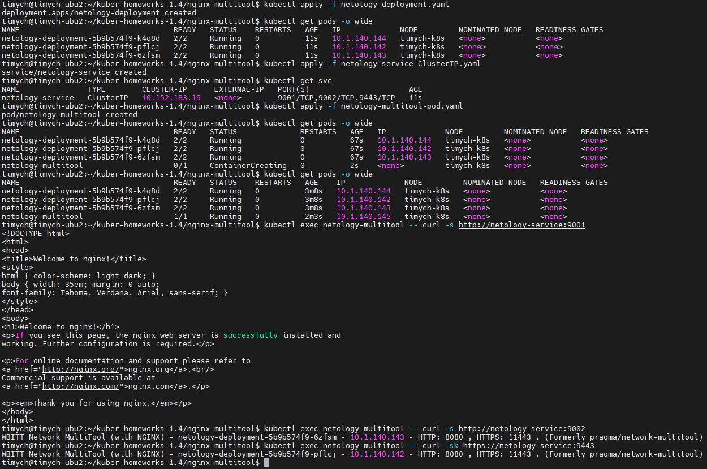
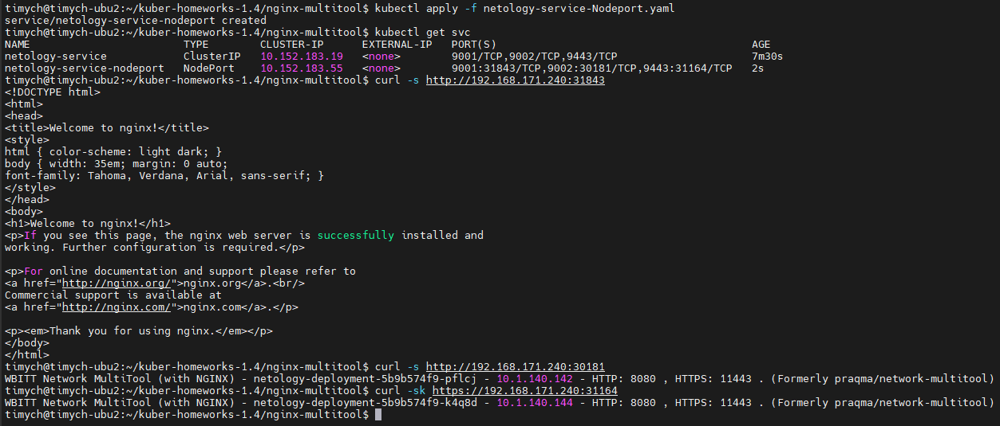

# Домашнее задание к занятию «Сетевое взаимодействие в K8S. Часть 1»

### Цель задания

В тестовой среде Kubernetes необходимо обеспечить доступ к приложению, установленному в предыдущем ДЗ и состоящему из двух контейнеров, по разным портам в разные контейнеры как внутри кластера, так и снаружи.

------

### Чеклист готовности к домашнему заданию

1. Установленное k8s-решение (например, MicroK8S).
2. Установленный локальный kubectl.
3. Редактор YAML-файлов с подключённым Git-репозиторием.

------

### Инструменты и дополнительные материалы, которые пригодятся для выполнения задания

1. [Описание](https://kubernetes.io/docs/concepts/workloads/controllers/deployment/) Deployment и примеры манифестов.
2. [Описание](https://kubernetes.io/docs/concepts/services-networking/service/) Описание Service.
3. [Описание](https://github.com/wbitt/Network-MultiTool) Multitool.

------

### Задание 1. Создать Deployment и обеспечить доступ к контейнерам приложения по разным портам из другого Pod внутри кластера

1. Создать Deployment приложения, состоящего из двух контейнеров (nginx и multitool), с количеством реплик 3 шт.
2. Создать Service, который обеспечит доступ внутри кластера до контейнеров приложения из п.1 по порту 9001 — nginx 80, по 9002 — multitool 8080.
3. Создать отдельный Pod с приложением multitool и убедиться с помощью `curl`, что из пода есть доступ до приложения из п.1 по разным портам в разные контейнеры.
4. Продемонстрировать доступ с помощью `curl` по доменному имени сервиса.
5. Предоставить манифесты Deployment и Service в решении, а также скриншоты или вывод команды п.4.


### Решение

1. Манифест Deployment

    ```yml
    apiVersion: apps/v1
    kind: Deployment
    metadata:
      name: netology-deployment
      namespace: netology
    spec:
      replicas: 3
      selector:
        matchLabels:
          app: netology-apps
      template:
        metadata:
          labels:
            app: netology-apps
        spec:
          containers:
          - name: nginx
            imagePullPolicy: IfNotPresent
            image: nginx:1.25.1-alpine3.17
            ports:
            - containerPort: 80
            env:
            - name: PORT
              value: "80"
            resources:
              limits:
                cpu: "0.1"
                memory: "128Mi"
          - name: network-multitool
            imagePullPolicy: IfNotPresent
            image: wbitt/network-multitool
            env:
            - name: HTTP_PORT
              value: "8080"
            - name: HTTPS_PORT
              value: "11443"
            ports:
            - containerPort: 8080
              name: http-port
            - containerPort: 11443
              name: https-port
            resources:
              limits:
                cpu: "0.1"
                memory: "128Mi"

    ```

1. Манифест сервиса:
    ```yml
    apiVersion: v1
    kind: Service
    metadata:
      name: netology-service
      namespace: netology
    spec:
      ports:
        - port: 9001
          targetPort: 80
          protocol: TCP
          name: nginx-http
        - port: 9002
          targetPort: 8080
          protocol: TCP
          name: multitool-http
        - port: 9443
          targetPort: 11443
          protocol: TCP
          name: multitool-https
      type: ClusterIP
      selector:
        app: netology-apps
    ```

1. Манифест пода:
    ```yml
    apiVersion: v1
    kind: Pod
    metadata:
      name: netology-multitool
      labels:
        name: netology-multitool
    spec:
      containers:
      - name: netology-multitool
        image: wbitt/network-multitool
        resources:
          limits:
            cpu: "0.1"
            memory: "128Mi"
        env:
        - name: HTTP_PORT
          value: "8080"
        - name: HTTPS_PORT
          value: "11443"
        ports:
        - containerPort: 8080
          name: http-port
        - containerPort: 11443
          name: https-port
    ```

1. Проверка доступа из пода к сервису по доменному имени:

   - Service access:\
   


1. Ссылки:

    [Манифест deployment](https://github.com/Timych84/devops-netology/blob/main/kuber-homeworks-1.4/nginx-multitool/netology-deployment.yaml)

    [Манифест service](https://github.com/Timych84/devops-netology/blob/main/kuber-homeworks-1.4/nginx-multitool/netology-service-ClusterIP.yaml)

    [Манифест multitool pod](https://github.com/Timych84/devops-netology/blob/main/kuber-homeworks-1.4/nginx-multitool/netology-multitool-pod.yaml)


------

### Задание 2. Создать Service и обеспечить доступ к приложениям снаружи кластера

1. Создать отдельный Service приложения из Задания 1 с возможностью доступа снаружи кластера к nginx, используя тип NodePort.
2. Продемонстрировать доступ с помощью браузера или `curl` с локального компьютера.
3. Предоставить манифест и Service в решении, а также скриншоты или вывод команды п.2.


### Решение

1. Манифест сервиса:
    ```yml
    apiVersion: v1
    kind: Service
    metadata:
      name: netology-service-nodeport
      namespace: netology
    spec:
      ports:
        - port: 9001
          targetPort: 80
          protocol: TCP
          name: nginx-http
        - port: 9002
          targetPort: 8080
          protocol: TCP
          name: multitool-http
        - port: 9443
          targetPort: 11443
          protocol: TCP
          name: multitool-https
      type: NodePort
      selector:
        app: netology-apps

    ```
1. Проверка доступа к сервису по порту с локального компьютера:

   - Service access from pc:\
   

1. Ссылки:

    [Манифест service](https://github.com/Timych84/devops-netology/blob/main/kuber-homeworks-1.4/nginx-multitool/netology-service-Nodeport.yaml)

------

### Правила приёма работы

1. Домашняя работа оформляется в своем Git-репозитории в файле README.md. Выполненное домашнее задание пришлите ссылкой на .md-файл в вашем репозитории.
2. Файл README.md должен содержать скриншоты вывода необходимых команд `kubectl` и скриншоты результатов.
3. Репозиторий должен содержать тексты манифестов или ссылки на них в файле README.md.
