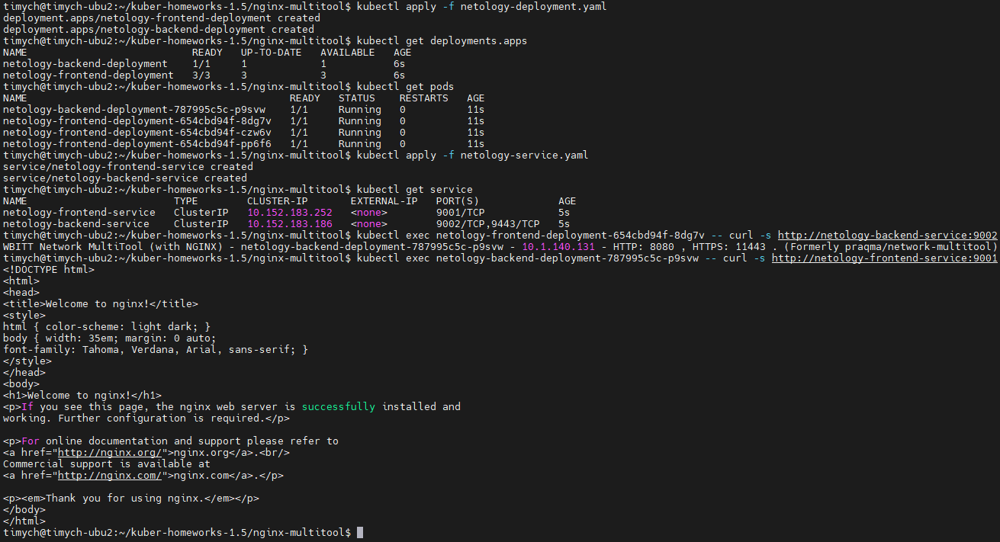
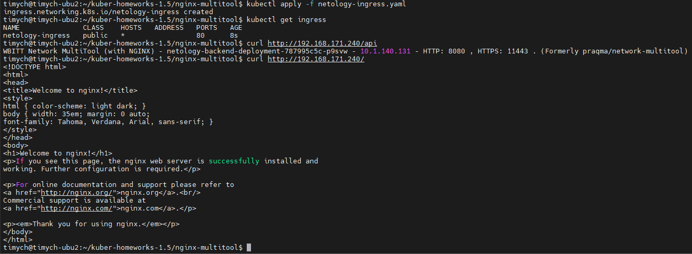

# Домашнее задание к занятию «Сетевое взаимодействие в K8S. Часть 2»

### Цель задания

В тестовой среде Kubernetes необходимо обеспечить доступ к двум приложениям снаружи кластера по разным путям.

------

### Чеклист готовности к домашнему заданию

1. Установленное k8s-решение (например, MicroK8S).
2. Установленный локальный kubectl.
3. Редактор YAML-файлов с подключённым Git-репозиторием.

------

### Инструменты и дополнительные материалы, которые пригодятся для выполнения задания

1. [Инструкция](https://microk8s.io/docs/getting-started) по установке MicroK8S.
2. [Описание](https://kubernetes.io/docs/concepts/services-networking/service/) Service.
3. [Описание](https://kubernetes.io/docs/concepts/services-networking/ingress/) Ingress.
4. [Описание](https://github.com/wbitt/Network-MultiTool) Multitool.

------

### Задание 1. Создать Deployment приложений backend и frontend

1. Создать Deployment приложения _frontend_ из образа nginx с количеством реплик 3 шт.
2. Создать Deployment приложения _backend_ из образа multitool.
3. Добавить Service, которые обеспечат доступ к обоим приложениям внутри кластера.
4. Продемонстрировать, что приложения видят друг друга с помощью Service.
5. Предоставить манифесты Deployment и Service в решении, а также скриншоты или вывод команды п.4.

------

### Задание 2. Создать Ingress и обеспечить доступ к приложениям снаружи кластера

1. Включить Ingress-controller в MicroK8S.
2. Создать Ingress, обеспечивающий доступ снаружи по IP-адресу кластера MicroK8S так, чтобы при запросе только по адресу открывался _frontend_ а при добавлении /api - _backend_.
3. Продемонстрировать доступ с помощью браузера или `curl` с локального компьютера.
4. Предоставить манифесты и скриншоты или вывод команды п.2.

------


### Решение
1. Скриншоты:

   - Доступ из backend во frontend и обратно:\
   

   - Доступ по ingress:\
   


2. Манифест Deployment
    <details>
        <summary>Deployment</summary>

    ```yml
    apiVersion: apps/v1
    kind: Deployment
    metadata:
      name: netology-frontend-deployment
      namespace: netology
    spec:
      replicas: 3
      selector:
        matchLabels:
          app: netology-nginx
      template:
        metadata:
          labels:
            app: netology-nginx
        spec:
          containers:
          - name: nginx
            imagePullPolicy: IfNotPresent
            image: nginx:1.25.1-alpine3.17
            ports:
            - containerPort: 80
            env:
            - name: PORT
              value: "80"
            resources:
              limits:
                cpu: "0.1"
                memory: "128Mi"
    ---
    apiVersion: apps/v1
    kind: Deployment
    metadata:
      name: netology-backend-deployment
      namespace: netology
    spec:
      replicas: 1
      selector:
        matchLabels:
          app: netology-multitool
      template:
        metadata:
          labels:
            app: netology-multitool
        spec:
          containers:
          - name: network-multitool
            imagePullPolicy: IfNotPresent
            image: wbitt/network-multitool
            env:
            - name: HTTP_PORT
              value: "8080"
            - name: HTTPS_PORT
              value: "11443"
            ports:
            - containerPort: 8080
              name: http-port
            - containerPort: 11443
              name: https-port
            resources:
              limits:
                cpu: "0.1"
                memory: "128Mi"

    ```
    </details>
 

3. Манифест Service
    <details>
        <summary>Service</summary>

    ```yml
    apiVersion: v1
    kind: Service
    metadata:
      name: netology-frontend-service
      namespace: netology
    spec:
      ports:
        - port: 9001
          targetPort: 80
          protocol: TCP
          name: nginx-http
      type: ClusterIP
      selector:
        app: netology-nginx
    ---
    apiVersion: v1
    kind: Service
    metadata:
      name: netology-backend-service
      namespace: netology
    spec:
      ports:
        - port: 9002
          targetPort: 8080
          protocol: TCP
          name: multitool-http
        - port: 9443
          targetPort: 11443
          protocol: TCP
          name: multitool-https
      type: ClusterIP
      selector:
        app: netology-multitool
    ```
    </details>

 

4. Манифест Ingress
    <details>
        <summary>Ingress</summary>

    ```yml
    apiVersion: networking.k8s.io/v1
    kind: Ingress
    metadata:
      name: netology-ingress
      annotations:
        nginx.ingress.kubernetes.io/rewrite-target: /$1
        nginx.ingress.kubernetes.io/use-regex: "true"
    spec:
      rules:
      - http:
          paths:
          - path: /api
            pathType: Exact
            backend:
              service:
                name: netology-backend-service
                port:
                  name: multitool-http
          - path: /
            pathType: Prefix
            backend:
              service:
                name: netology-frontend-service
                port:
                  name: nginx-http
    ```
    </details>

 
1. Ссылки:

    [Манифесты](https://github.com/Timych84/devops-netology/blob/main/kuber-homeworks-1.5/nginx-multitool/)


### Правила приема работы

1. Домашняя работа оформляется в своем Git-репозитории в файле README.md. Выполненное домашнее задание пришлите ссылкой на .md-файл в вашем репозитории.
2. Файл README.md должен содержать скриншоты вывода необходимых команд `kubectl` и скриншоты результатов.
3. Репозиторий должен содержать тексты манифестов или ссылки на них в файле README.md.

------
