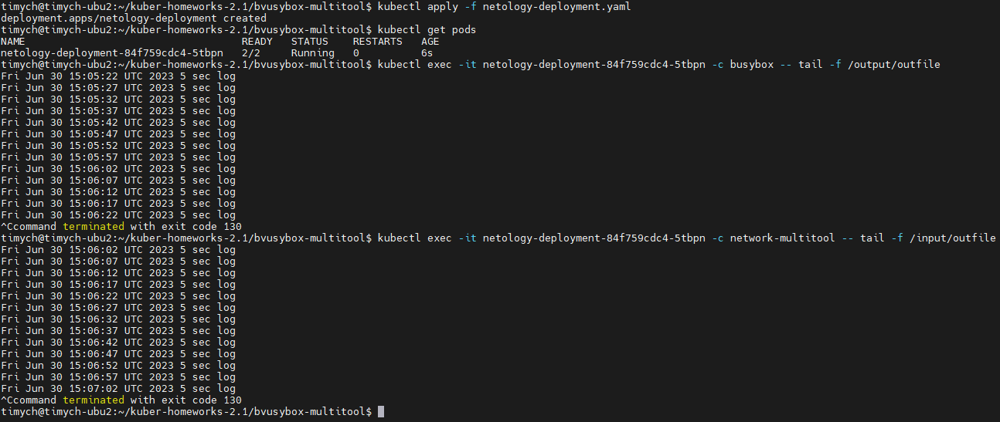
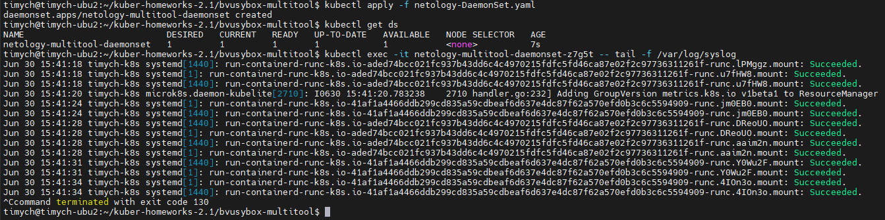

# Домашнее задание к занятию «Хранение в K8s. Часть 1»

### Цель задания

В тестовой среде Kubernetes нужно обеспечить обмен файлами между контейнерам пода и доступ к логам ноды.

------

### Чеклист готовности к домашнему заданию

1. Установленное K8s-решение (например, MicroK8S).
2. Установленный локальный kubectl.
3. Редактор YAML-файлов с подключенным GitHub-репозиторием.

------

### Дополнительные материалы для выполнения задания

1. [Инструкция по установке MicroK8S](https://microk8s.io/docs/getting-started).
2. [Описание Volumes](https://kubernetes.io/docs/concepts/storage/volumes/).
3. [Описание Multitool](https://github.com/wbitt/Network-MultiTool).

------

### Задание 1

**Что нужно сделать**

Создать Deployment приложения, состоящего из двух контейнеров и обменивающихся данными.

1. Создать Deployment приложения, состоящего из контейнеров busybox и multitool.
2. Сделать так, чтобы busybox писал каждые пять секунд в некий файл в общей директории.
3. Обеспечить возможность чтения файла контейнером multitool.
4. Продемонстрировать, что multitool может читать файл, который периодоически обновляется.
5. Предоставить манифесты Deployment в решении, а также скриншоты или вывод команды из п. 4.

### Решение

1. Манифест Deployment

    ```yml
    apiVersion: apps/v1
    kind: Deployment
    metadata:
      name: netology-deployment
      namespace: netology
    spec:
      replicas: 1
      selector:
        matchLabels:
          app: netology-apps
      template:
        metadata:
          labels:
            app: netology-apps
        spec:
          containers:
          - name: busybox
            imagePullPolicy: IfNotPresent
            image: busybox:1.36
            command: ['sh', '-c', 'for i in $(seq 30); do sleep 5; echo $(date -u) "5 sec log" >> /output/outfile; done']
            volumeMounts:
              - mountPath: "/output"
                name: netology-volume
            resources:
              limits:
                cpu: "0.1"
                memory: "128Mi"
          - name: network-multitool
            imagePullPolicy: IfNotPresent
            image: wbitt/network-multitool
            env:
            - name: HTTP_PORT
              value: "8080"
            - name: HTTPS_PORT
              value: "11443"
            ports:
            - containerPort: 8080
              name: http-port
            - containerPort: 11443
              name: https-port
            volumeMounts:
              - mountPath: "/input"
                name: netology-volume
            resources:
              limits:
                cpu: "0.1"
                memory: "128Mi"
          volumes:
            - name: netology-volume
              emptyDir:
                sizeLimit: 10Mi

    ```

1. Проверка доступа чтения данных busybox из контейнера multitool:

   - Read file:\
   

1. Ссылки:

    [Манифест deployment](https://github.com/Timych84/devops-netology/blob/main/kuber-homeworks-2.1/busybox-multitool/netology-deployment.yaml)
------

### Задание 2

**Что нужно сделать**

Создать DaemonSet приложения, которое может прочитать логи ноды.

1. Создать DaemonSet приложения, состоящего из multitool.
2. Обеспечить возможность чтения файла `/var/log/syslog` кластера MicroK8S.
3. Продемонстрировать возможность чтения файла изнутри пода.
4. Предоставить манифесты Deployment, а также скриншоты или вывод команды из п. 2.

### Решение

1. Манифест DaemonSet

    ```yml
    apiVersion: apps/v1
    kind: DaemonSet
    metadata:
      name: netology-multitool-daemonset
      namespace: netology
    spec:
      selector:
        matchLabels:
          name: network-multitool
      template:
        metadata:
          labels:
            name: network-multitool
        spec:
          containers:
          - name: network-multitool
            image: wbitt/network-multitool
            env:
            - name: HTTP_PORT
              value: "8080"
            - name: HTTPS_PORT
              value: "11443"
            ports:
            - containerPort: 8080
              name: http-port
            - containerPort: 11443
              name: https-port
            resources:
              limits:
                cpu: "0.1"
                memory: "128Mi"
            volumeMounts:
            - name: varlog
              mountPath: /var/log
          volumes:
          - name: varlog
            hostPath:
              path: /var/log
    ```

2. Проверка доступа чтения /var/log/syslog из контейнера multitool:

   - Read file:\
   

3. Ссылки:

    [Манифест deployment](https://github.com/Timych84/devops-netology/blob/main/kuber-homeworks-2.1/busybox-multitool/netology-DaemonSet.yaml)
------

------

### Правила приёма работы

1. Домашняя работа оформляется в своём Git-репозитории в файле README.md. Выполненное задание пришлите ссылкой на .md-файл в вашем репозитории.
2. Файл README.md должен содержать скриншоты вывода необходимых команд `kubectl`, а также скриншоты результатов.
3. Репозиторий должен содержать тексты манифестов или ссылки на них в файле README.md.

------
