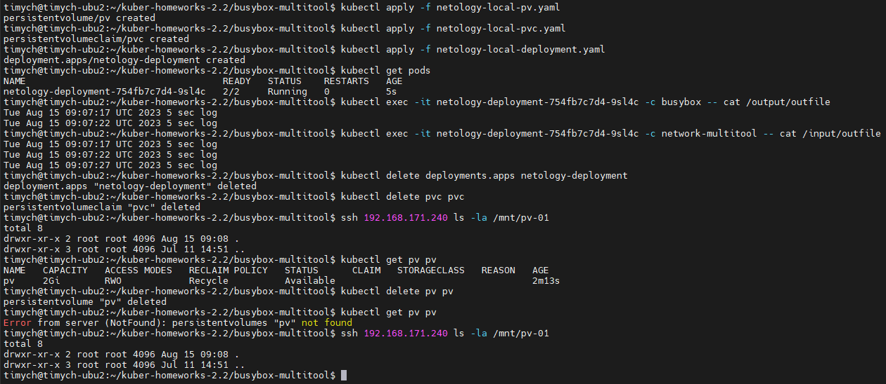
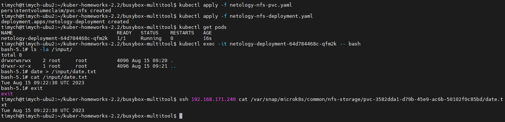
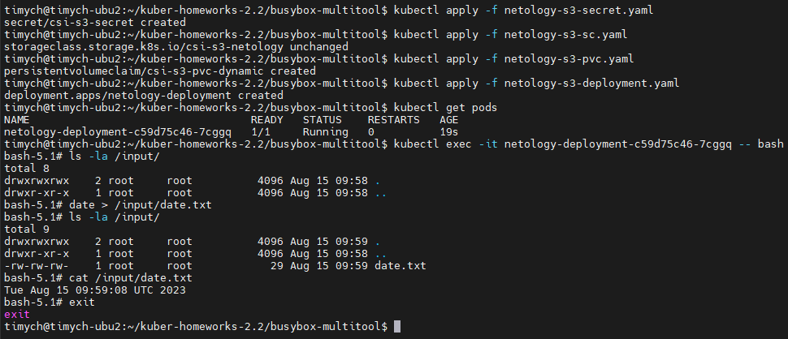
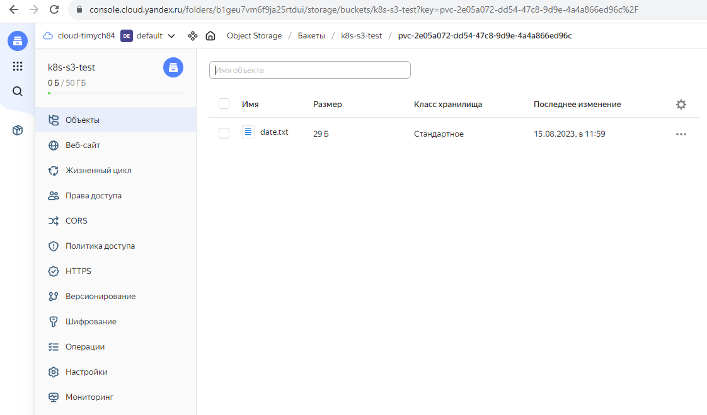

# Домашнее задание к занятию «Хранение в K8s. Часть 2»

### Цель задания

В тестовой среде Kubernetes нужно создать PV и продемострировать запись и хранение файлов.

------

### Чеклист готовности к домашнему заданию

1. Установленное K8s-решение (например, MicroK8S).
2. Установленный локальный kubectl.
3. Редактор YAML-файлов с подключенным GitHub-репозиторием.

------

### Дополнительные материалы для выполнения задания

1. [Инструкция по установке NFS в MicroK8S](https://microk8s.io/docs/nfs).
2. [Описание Persistent Volumes](https://kubernetes.io/docs/concepts/storage/persistent-volumes/).
3. [Описание динамического провижининга](https://kubernetes.io/docs/concepts/storage/dynamic-provisioning/).
4. [Описание Multitool](https://github.com/wbitt/Network-MultiTool).

------

### Задание 1

**Что нужно сделать**

Создать Deployment приложения, использующего локальный PV, созданный вручную.

1. Создать Deployment приложения, состоящего из контейнеров busybox и multitool.
2. Создать PV и PVC для подключения папки на локальной ноде, которая будет использована в поде.
3. Продемонстрировать, что multitool может читать файл, в который busybox пишет каждые пять секунд в общей директории.
4. Удалить Deployment и PVC. Продемонстрировать, что после этого произошло с PV. Пояснить, почему.
5. Продемонстрировать, что файл сохранился на локальном диске ноды. Удалить PV.  Продемонстрировать что произошло с файлом после удаления PV. Пояснить, почему.
5. Предоставить манифесты, а также скриншоты или вывод необходимых команд.

------

### Решение

1. Манифест Deployment
    <details>
        <summary>Deployment</summary>

    ```yml
    apiVersion: apps/v1
    kind: Deployment
    metadata:
      name: netology-deployment
      namespace: netology
    spec:
      replicas: 1
      selector:
        matchLabels:
          app: netology-apps
      template:
        metadata:
          labels:
            app: netology-apps
        spec:
          containers:
          - name: busybox
            imagePullPolicy: IfNotPresent
            image: busybox:1.36
            command: ['sh', '-c', 'for i in $(seq 30); do sleep 5; echo $(date -u) "5 sec log" >> /output/outfile; done']
            volumeMounts:
              - mountPath: "/output"
                name: netology-volume
            resources:
              limits:
                cpu: "0.1"
                memory: "128Mi"
          - name: network-multitool
            imagePullPolicy: IfNotPresent
            image: wbitt/network-multitool
            env:
            - name: HTTP_PORT
              value: "8080"
            - name: HTTPS_PORT
              value: "11443"
            ports:
            - containerPort: 8080
              name: http-port
            - containerPort: 11443
              name: https-port
            volumeMounts:
              - mountPath: "/input"
                name: netology-volume
            resources:
              limits:
                cpu: "0.1"
                memory: "128Mi"
          volumes:
            - name: netology-volume
              persistentVolumeClaim:
                claimName: pvc
    ```
    </details>

1. Манифест PV
    <details>
        <summary>PV</summary>

    ```yml
    apiVersion: v1
    kind: PersistentVolume
    metadata:
      name: pv
    spec:
      storageClassName: ""
      accessModes:
        - ReadWriteOnce
      capacity:
        storage: 2Gi
      hostPath:
        path: /mnt/pv-01
      persistentVolumeReclaimPolicy: Recycle
    ```
    </details>
1. Манифест PVC
    <details>
        <summary>PVC</summary>

    ```yml
    apiVersion: v1
    kind: PersistentVolumeClaim
    metadata:
      name: pvc
    spec:
      storageClassName: ""
      accessModes:
        - ReadWriteOnce
      resources:
        requests:
          storage: 2Gi
    ```
    </details>

1. Скриншоты:

   - Проверка записи и чтения:\
   

1. Комментарии:
   Поведение PV зависит от параметра persistentVolumeReclaimPolicy, если он установлен Recycle то всё удаляется, если Delete - файл останется из-за особенностей работы с hostPath


### Задание 2

**Что нужно сделать**

Создать Deployment приложения, которое может хранить файлы на NFS с динамическим созданием PV.

1. Включить и настроить NFS-сервер на MicroK8S.
2. Создать Deployment приложения состоящего из multitool, и подключить к нему PV, созданный автоматически на сервере NFS.
3. Продемонстрировать возможность чтения и записи файла изнутри пода.
4. Предоставить манифесты, а также скриншоты или вывод необходимых команд.

------

1. Манифест Deployment
    <details>
        <summary>Deployment</summary>

    ```yml
    apiVersion: apps/v1
    kind: Deployment
    metadata:
      name: netology-deployment
      namespace: netology
    spec:
      replicas: 1
      selector:
        matchLabels:
          app: netology-apps
      template:
        metadata:
          labels:
            app: netology-apps
        spec:
          containers:
          - name: network-multitool
            imagePullPolicy: IfNotPresent
            image: wbitt/network-multitool
            env:
            - name: HTTP_PORT
              value: "8080"
            - name: HTTPS_PORT
              value: "11443"
            ports:
            - containerPort: 8080
              name: http-port
            - containerPort: 11443
              name: https-port
            volumeMounts:
              - mountPath: "/input"
                name: netology-volume
            resources:
              limits:
                cpu: "0.1"
                memory: "128Mi"
          volumes:
            - name: netology-volume
              persistentVolumeClaim:
                claimName: pvc-nfs
    ```
    </details>

1. Манифест PVC
    <details>
        <summary>PVC</summary>

    ```yml
    ---
    kind: PersistentVolumeClaim
    apiVersion: v1
    metadata:
      name: pvc-nfs
    spec:
      storageClassName: "nfs"
      accessModes:
        - ReadWriteOnce
      resources:
        requests:
          storage: 100Mi
    ```
    </details>

1. Скриншоты:

   - Проверка записи и чтения:\
   


#### Дополнительно попробовал настроить работу с S3 Yandex Cloud

1. Манифест Deployment
    <details>
        <summary>Deployment</summary>

    ```yml
    apiVersion: apps/v1
    kind: Deployment
    metadata:
      name: netology-deployment
      namespace: netology
    spec:
      replicas: 1
      selector:
        matchLabels:
          app: netology-apps
      template:
        metadata:
          labels:
            app: netology-apps
        spec:
          containers:
          - name: network-multitool
            imagePullPolicy: IfNotPresent
            image: wbitt/network-multitool
            env:
            - name: HTTP_PORT
              value: "8080"
            - name: HTTPS_PORT
              value: "11443"
            ports:
            - containerPort: 8080
              name: http-port
            - containerPort: 11443
              name: https-port
            volumeMounts:
              - mountPath: "/input"
                name: netology-volume
            resources:
              limits:
                cpu: "0.1"
                memory: "128Mi"
          volumes:
            - name: netology-volume
              persistentVolumeClaim:
                claimName: csi-s3-pvc-dynamic
                readOnly: false
    ```
    </details>

1. Манифест Secret
    <details>
        <summary>Secret</summary>

    ```yml
    ---
    apiVersion: v1
    kind: Secret
    metadata:
      namespace: kube-system
      name: csi-s3-secret
    stringData:
      accessKeyID: ------
      secretAccessKey: ------
      endpoint: https://storage.yandexcloud.net
    ```
    </details>

1. Манифест StorageClass
    <details>
        <summary>StorageClass</summary>

    ```yml
    ---
    kind: StorageClass
    apiVersion: storage.k8s.io/v1
    metadata:
      name: csi-s3-netology
    provisioner: ru.yandex.s3.csi
    parameters:
      mounter: geesefs
      options: "--memory-limit=1000 --dir-mode=0777 --file-mode=0666"
      bucket: k8s-s3-test
      csi.storage.k8s.io/provisioner-secret-name: csi-s3-secret
      csi.storage.k8s.io/provisioner-secret-namespace: kube-system
      csi.storage.k8s.io/controller-publish-secret-name: csi-s3-secret
      csi.storage.k8s.io/controller-publish-secret-namespace: kube-system
      csi.storage.k8s.io/node-stage-secret-name: csi-s3-secret
      csi.storage.k8s.io/node-stage-secret-namespace: kube-system
      csi.storage.k8s.io/node-publish-secret-name: csi-s3-secret
      csi.storage.k8s.io/node-publish-secret-namespace: kube-system
    ```
    </details>
1. Манифест PVC
    <details>
        <summary>PVC</summary>

    ```yml
    ---
    apiVersion: v1
    kind: PersistentVolumeClaim
    metadata:
      name: csi-s3-pvc-dynamic
      namespace: netology
    spec:
      accessModes:
      - ReadWriteMany
      resources:
        requests:
          storage: 5Gi
      storageClassName: csi-s3-netology
    ```
    </details>

1. Скриншоты:

   - Проверка записи и чтения в S3:\
   
   - Файл в интерфейсе бакетов в Yandex Cloud:\
   


#### Ссылки:


[Манифесты](https://github.com/Timych84/devops-netology/blob/main/kuber-homeworks-2.2/busybox-multitool/)


### Правила приёма работы

1. Домашняя работа оформляется в своём Git-репозитории в файле README.md. Выполненное задание пришлите ссылкой на .md-файл в вашем репозитории.
2. Файл README.md должен содержать скриншоты вывода необходимых команд `kubectl`, а также скриншоты результатов.
3. Репозиторий должен содержать тексты манифестов или ссылки на них в файле README.md.
