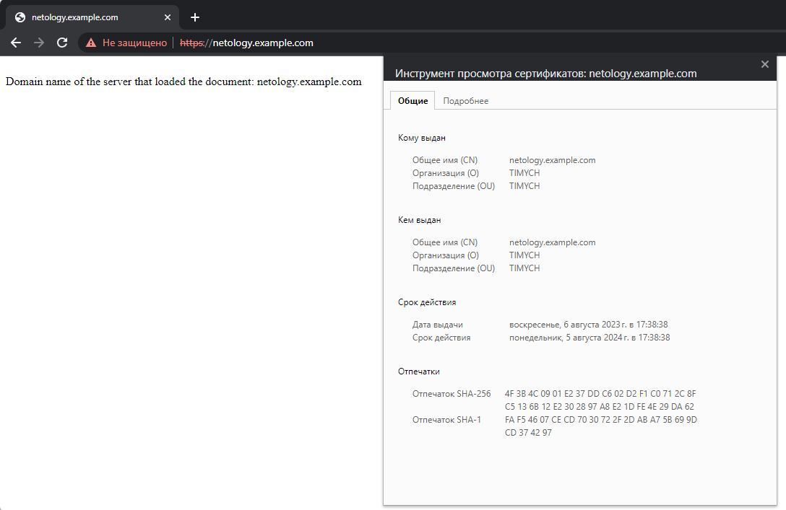
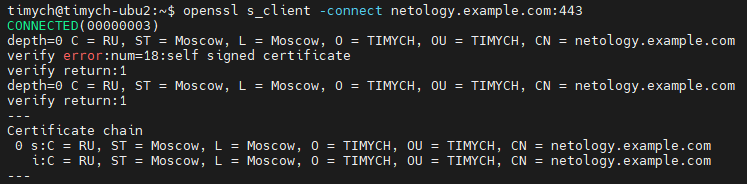

# Домашнее задание к занятию «Конфигурация приложений»

### Цель задания

В тестовой среде Kubernetes необходимо создать конфигурацию и продемонстрировать работу приложения.

------

### Чеклист готовности к домашнему заданию

1. Установленное K8s-решение (например, MicroK8s).
2. Установленный локальный kubectl.
3. Редактор YAML-файлов с подключённым GitHub-репозиторием.

------

### Инструменты и дополнительные материалы, которые пригодятся для выполнения задания

1. [Описание](https://kubernetes.io/docs/concepts/configuration/secret/) Secret.
2. [Описание](https://kubernetes.io/docs/concepts/configuration/configmap/) ConfigMap.
3. [Описание](https://github.com/wbitt/Network-MultiTool) Multitool.

------

### Задание 1. Создать Deployment приложения и решить возникшую проблему с помощью ConfigMap. Добавить веб-страницу

1. Создать Deployment приложения, состоящего из контейнеров busybox и multitool.
2. Решить возникшую проблему с помощью ConfigMap.
3. Продемонстрировать, что pod стартовал и оба конейнера работают.
4. Сделать простую веб-страницу и подключить её к Nginx с помощью ConfigMap. Подключить Service и показать вывод curl или в браузере.
5. Предоставить манифесты, а также скриншоты или вывод необходимых команд.

------

### Задание 2. Создать приложение с вашей веб-страницей, доступной по HTTPS

1. Создать Deployment приложения, состоящего из Nginx.
2. Создать собственную веб-страницу и подключить её как ConfigMap к приложению.
3. Выпустить самоподписной сертификат SSL. Создать Secret для использования сертификата.
4. Создать Ingress и необходимый Service, подключить к нему SSL в вид. Продемонстировать доступ к приложению по HTTPS.
4. Предоставить манифесты, а также скриншоты или вывод необходимых команд.

------

### Решение

1. Манифест Deployment
    <details>
        <summary>Deployment</summary>

    ```yml
    apiVersion: apps/v1
    kind: Deployment
    metadata:
        name: netology-frontend-deployment
        namespace: netology
    spec:
        replicas: 1
        selector:
        matchLabels:
            app: netology-nginx
        template:
        metadata:
            labels:
            app: netology-nginx
        spec:
            containers:
            - name: nginx
            imagePullPolicy: IfNotPresent
            image: nginx:1.25.1-alpine3.17
            ports:
            - containerPort: 80
            env:
                - name: "PORT"
                valueFrom:
                    configMapKeyRef:
                    name: netology-configmap
                    key: nginx-http-port
            resources:
                limits:
                cpu: "0.1"
                memory: "128Mi"
            volumeMounts:
            - name: nginx-config
                mountPath: "/etc/nginx"
                readOnly: true
            - name: nginx-site
                mountPath: "/var/www/html/netology"
                readOnly: true
            - name: network-multitool
            imagePullPolicy: IfNotPresent
            image: wbitt/network-multitool
            env:
                - name: "HTTP_PORT"
                valueFrom:
                    configMapKeyRef:
                    name: netology-configmap
                    key: multitool-http-port
                - name: "HTTPS_PORT"
                valueFrom:
                    configMapKeyRef:
                    name: netology-configmap
                    key: multitool-https-port
            ports:
            - containerPort: 8080
                name: http-port
            - containerPort: 11443
                name: https-port
            resources:
                limits:
                cpu: "0.1"
                memory: "128Mi"
            volumes:
            - name: nginx-config
            configMap:
                name: netology-configmap
                items:
                - key: nginx-conf
                path: nginx.conf
            - name: nginx-site
            configMap:
                name: netology-configmap
                items:
                - key: nginx-site
                path: index.html
    ```
    </details>

1. Манифест Configmap
    <details>
        <summary>Configmap</summary>

    ```yml
    apiVersion: v1
    kind: ConfigMap
    metadata:
      name: netology-configmap
    data:
      nginx-http-port: "80"
      multitool-http-port: "8080"
      multitool-https-port: "11443"
      nginx-conf: |
        events {}         # event context have to be defined to consider config valid
        http {
        server {
            listen 80;
            server_name _;
            root        /var/www/html/netology;
          }
        }
      nginx-site: |
        <!DOCTYPE html>
        <html>
        <body>
          <div id = "result"> </div>
          <script>
              var myDomain = window.location.hostname;
              document.getElementById("result").innerHTML = "<br>Domain name of the server that loaded the document: "+ myDomain;
          </script>
        </body>
        </html>
    ```
    </details>
1. Манифест Secret
    <details>
        <summary>Secret</summary>

    ```yml
    apiVersion: v1
    kind: Secret
    metadata:
      name: netology-secret
    data:
      tls.crt: # cat nginx-selfsigned.crt |base64 -w0
      tls.key: # cat nginx-selfsigned.key |base64 -w0
    type: kubernetes.io/tls
    ```
    </details>
1. Манифест Service
    <details>
        <summary>Service</summary>

    ```yml
    apiVersion: v1
    kind: Service
    metadata:
      name: netology-frontend-service
      namespace: netology
    spec:
      ports:
        - port: 9001
          targetPort: 80
          protocol: TCP
          name: nginx-http
        - port: 9002
          targetPort: 8080
          protocol: TCP
          name: multitool-http
        - port: 9003
          targetPort: 11443
          protocol: TCP
          name: multitool-https
      type: ClusterIP
      selector:
        app: netology-nginx
    ```
    </details>
1. Манифест Ingress
    <details>
        <summary>Ingress</summary>

    ```yml
    apiVersion: networking.k8s.io/v1
    kind: Ingress
    metadata:
      name: netology-ingress
      annotations:
        nginx.ingress.kubernetes.io/rewrite-target: /$1
        nginx.ingress.kubernetes.io/use-regex: "true"
        # nginx.ingress.kubernetes.io/backend-protocol: "HTTPS"
        # nginx.ingress.kubernetes.io/ssl-passthrough: "true"
        # nginx.ingress.kubernetes.io/ssl-redirect: "true"
    spec:
      tls:
      - hosts:
        - netology.example.com
        secretName: netology-secret
      rules:
      - host: netology.example.com
        http:
          paths:
          - path: /
            pathType: Prefix
            backend:
              service:
                name: netology-frontend-service
                port:
                  name: nginx-http
          - path: /multitool
            pathType: Exact
            backend:
              service:
                name: netology-frontend-service
                port:
                  name: multitool-http
    ```
    </details>
1. Скриншоты:

   - Certificate info in browser:\
   

   - Certificate info in CLI:\
   

1. Ссылки:

    [Манифесты](https://github.com/Timych84/devops-netology/blob/main/kuber-homeworks-2.3/nginx-multitool/)

### Правила приёма работы


2. Домашняя работа оформляется в своём GitHub-репозитории в файле README.md. Выполненное домашнее задание пришлите ссылкой на .md-файл в вашем репозитории.
3. Файл README.md должен содержать скриншоты вывода необходимых команд `kubectl`, а также скриншоты результатов.
4. Репозиторий должен содержать тексты манифестов или ссылки на них в файле README.md.

------
