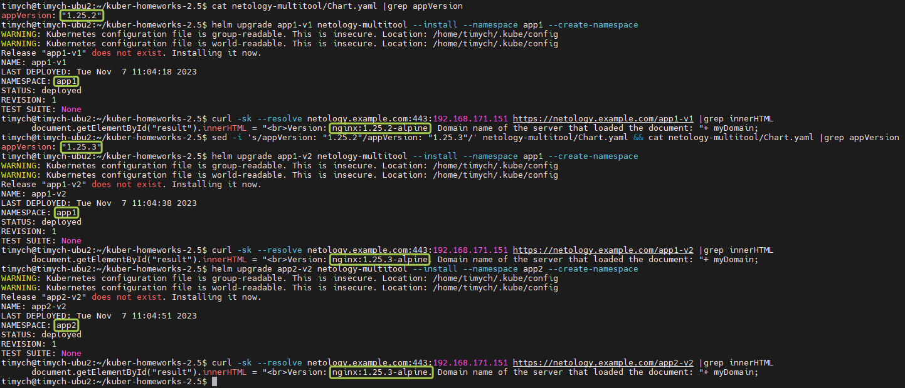

# Домашнее задание к занятию «Helm»

### Цель задания

В тестовой среде Kubernetes необходимо установить и обновить приложения с помощью Helm.

------

### Чеклист готовности к домашнему заданию

1. Установленное k8s-решение, например, MicroK8S.
2. Установленный локальный kubectl.
3. Установленный локальный Helm.
4. Редактор YAML-файлов с подключенным репозиторием GitHub.

------

### Инструменты и дополнительные материалы, которые пригодятся для выполнения задания

1. [Инструкция](https://helm.sh/docs/intro/install/) по установке Helm. [Helm completion](https://helm.sh/docs/helm/helm_completion/).

------

### Задание 1. Подготовить Helm-чарт для приложения

1. Необходимо упаковать приложение в чарт для деплоя в разные окружения.
2. Каждый компонент приложения деплоится отдельным deployment’ом или statefulset’ом.
3. В переменных чарта измените образ приложения для изменения версии.

------
### Задание 2. Запустить две версии в разных неймспейсах

1. Подготовив чарт, необходимо его проверить. Запуститe несколько копий приложения.
2. Одну версию в namespace=app1, вторую версию в том же неймспейсе, третью версию в namespace=app2.
3. Продемонстрируйте результат.

### Правила приёма работы

1. Домашняя работа оформляется в своём Git репозитории в файле README.md. Выполненное домашнее задание пришлите ссылкой на .md-файл в вашем репозитории.
2. Файл README.md должен содержать скриншоты вывода необходимых команд `kubectl`, `helm`, а также скриншоты результатов.
3. Репозиторий должен содержать тексты манифестов или ссылки на них в файле README.md.


### Решение

1. Helm Chart
   1. Chart.yaml
        ```yml
        apiVersion: v2
                name: netology-multitool
                description: A Helm chart for multitool
                type: application
                version: 0.1.0
                appVersion: "1.25.2"
        ```
   1. values.yaml
        ```yml
        replicaCount: 2

        multitoolImage:
          repository: wbitt/network-multitool
          tag: "latest"
          pullPolicy: IfNotPresent

        nginxImage:
          repository: nginx
          pullPolicy: IfNotPresent

        multitoolSpec:
          httpPort: 8080
          httpsPort: 11443

        nginxSpec:
          nginxhttpPort: 9099
          httpPort: 80
          httpsPort: 11443

        service:
          name: multitool-service
          type: ClusterIP
          httpPort: 9002
          httpsPort: 9443

        nginxConf: |
          events {}         # event context have to be defined to consider config valid
          http {
          server {
              listen 80;
              server_name _;
              root        /var/www/html/netology;
            }
          }
        nginxSite: |
          <!DOCTYPE html>
          <html>
          <body>
            <div id = "result"> </div>
            <script>
                var myDomain = window.location.hostname;
                document.getElementById("result").innerHTML = "<br>Version: Domain name of the server that loaded the document: "+ myDomain;
            </script>
          </body>
          </html>
        ```
   1. Template configmap.yaml (на веб странице будет показываться версия приложения из Chart)
        ```yml
        apiVersion: v1
        kind: ConfigMap
        metadata:
            name: {{ .Release.Name }}-configmap
        data:
            nginxConf: {{ .Values.nginxConf | toYaml | indent 1 }}
            # nginxSite: {{ .Values.nginxSite | regexReplaceAll "Version:" (.Values.nginxImage.repository) | toYaml | indent 1 }}
            nginxSite: |
            <!DOCTYPE html>
            <html>
            <body>
                <div id = "result"> </div>
                <script>
                    var myDomain = window.location.hostname;
                    document.getElementById("result").innerHTML = "<br>Version: {{ .Values.nginxImage.repository }}:{{ .Chart.AppVersion }}-alpine. Domain name of the server that loaded the document: "+ myDomain;
                </script>
            </body>
            </html>
        ```
   1. Template deployment.yaml(два деплоймента multitool:latest и nginx: .Chart.AppVersion)
        ```yml
        ---
        apiVersion: apps/v1
        kind: Deployment
        metadata:
          name: {{ .Release.Name }}-multitool
          labels:
            app: {{ .Release.Name }}-multitool
        spec:
          replicas: {{ .Values.replicaCount }}
          selector:
            matchLabels:
              app: {{ .Release.Name }}-multitool
          template:
            metadata:
              labels:
                app: {{ .Release.Name }}-multitool
            spec:
              containers:
                - name: {{ .Chart.Name }}-multitool
                  imagePullPolicy: {{ .Values.multitoolImage.pullPolicy }}
                  image: "{{ .Values.multitoolImage.repository }}:{{ .Values.multitoolImage.tag }}"
                  env:
                  - name: HTTP_PORT
                    value: {{ quote .Values.multitoolSpec.httpPort }}
                  - name: HTTPS_PORT
                    value: {{ quote .Values.multitoolSpec.httpsPort }}
                  ports:
                  - containerPort: {{ .Values.multitoolSpec.httpPort }}
                    name: http-port
                  - containerPort: {{ .Values.multitoolSpec.httpsPort }}
                    name: https-port
                  resources:
                    limits:
                      cpu: "0.1"
                      memory: "128Mi"
        ---
        apiVersion: apps/v1
        kind: Deployment
        metadata:
          name: {{ .Release.Name }}-nginx
          labels:
            app: {{ .Release.Name }}-netology-nginx
        spec:
          replicas: {{ .Values.replicaCount }}
          selector:
            matchLabels:
              app: {{ .Release.Name }}-netology-nginx
          template:
            metadata:
              labels:
                app: {{ .Release.Name }}-netology-nginx
            spec:
              containers:
              - name: {{ .Chart.Name }}-nginx
                imagePullPolicy: {{ .Values.nginxImage.pullPolicy }}
                image: "{{ .Values.nginxImage.repository }}:{{ .Chart.AppVersion }}-alpine"
                ports:
                - containerPort: 80
                env:
                - name: PORT
                  value: "80"
                resources:
                  limits:
                    cpu: "0.1"
                    memory: "128Mi"
                volumeMounts:
                - name: {{ .Release.Name }}-nginx-config
                  mountPath: "/etc/nginx"
                  readOnly: true
                - name: {{ .Release.Name }}-nginx-site
                  mountPath: "/var/www/html/netology"
                  readOnly: true
              volumes:
              - name: {{ .Release.Name }}-nginx-config
                configMap:
                  name: {{ .Release.Name }}-configmap
                  items:
                  - key: nginxConf
                    path: nginx.conf
              - name: {{ .Release.Name }}-nginx-site
                configMap:
                  name: {{ .Release.Name }}-configmap
                  items:
                  - key: nginxSite
                    path: index.html
        ```
   1. Template service.yaml
        ```yml
        ---
        apiVersion: v1
        kind: Service
        metadata:
          name: {{ .Release.Name }}-service
        spec:
          ports:
            - port: {{ .Values.service.httpPort }}
              targetPort: {{ .Values.multitoolSpec.httpPort }}
              protocol: {{ .Values.service.protocol | default "TCP" }}
              name: multitool-http
            - port: {{ .Values.service.httpsPort }}
              targetPort: {{ .Values.multitoolSpec.httpsPort }}
              protocol: {{ .Values.service.protocol | default "TCP" }}
              name: multitool-https
          type: {{ .Values.service.type }}
          selector:
            app: {{ .Release.Name }}-multitool
        ---
        apiVersion: v1
        kind: Service
        metadata:
          name: {{ .Release.Name }}-nginxservice
        spec:
          ports:
            - port: {{ .Values.service.httpPort }}
              targetPort: {{ .Values.nginxSpec.httpPort }}
              protocol: {{ .Values.service.protocol | default "TCP" }}
              name: nginx-http
          type: {{ .Values.service.type }}
          selector:
            app: {{ .Release.Name }}-netology-nginx
        ```


   2. Template ingress.yaml(nginx будет отвечать по .Release.Name, multitool по .Release.Name/mt)
        ```yml
        apiVersion: networking.k8s.io/v1
        kind: Ingress
        metadata:
          name: {{ .Release.Name }}-ingress
          annotations:
            nginx.ingress.kubernetes.io/rewrite-target: /$1
            nginx.ingress.kubernetes.io/use-regex: "true"
        spec:
          ingressClassName: nginx
          rules:
          - http:
              paths:
              - path: /{{ .Release.Name }}/mt
                pathType: Exact
                backend:
                  service:
                    name: {{ .Release.Name }}-service
                    port:
                      name: multitool-http
              - path: /{{ .Release.Name }}
                pathType: Exact
                backend:
                  service:
                    name: {{ .Release.Name }}-nginxservice
                    port:
                      name: nginx-http
        ```
1. Проверка работы с разными версиями и неймспейсами
   1. Запускаем nginx 1.25.2(appVersion) в namespace app1
   1. Проверяем с помощью curl версию
   1. Меняем appVersion на 1.25.3 в Chart.yaml
   1. Запускаем nginx 1.25.3(appVersion) в namespace app1
   1. Проверяем с помощью curl версию
   1. Запускаем nginx 1.25.3(appVersion) в namespace app2
   1. Проверяем с помощью curl версию
   
