# Домашнее задание к занятию «Установка Kubernetes»

### Цель задания

Установить кластер K8s.

### Чеклист готовности к домашнему заданию

1. Развёрнутые ВМ с ОС Ubuntu 20.04-lts.


### Инструменты и дополнительные материалы, которые пригодятся для выполнения задания

1. [Инструкция по установке kubeadm](https://kubernetes.io/docs/setup/production-environment/tools/kubeadm/create-cluster-kubeadm/).
2. [Документация kubespray](https://kubespray.io/).

-----

### Задание 1. Установить кластер k8s с 1 master node

1. Подготовка работы кластера из 5 нод: 1 мастер и 4 рабочие ноды.
2. В качестве CRI — containerd.
3. Запуск etcd производить на мастере.
4. Способ установки выбрать самостоятельно.

### Решение

1. Развертывание с помощью kubespray.


    ```bash
    declare -a IPS=(192.168.171.101 192.168.171.102 192.168.171.103 192.168.171.104 192.168.171.105)
    CONFIG_FILE=inventory/mycluster/hosts.yaml python3 contrib/inventory_builder/inventory.py ${IPS[@]}
    ```

    Редактируем inventory
    ```yml
    all:
      hosts:
        node1:
          ansible_host: 192.168.171.101
          ip: 192.168.171.101
          access_ip: 192.168.171.101
        node2:
          ansible_host: 192.168.171.102
          ip: 192.168.171.102
          access_ip: 192.168.171.102
        node3:
          ansible_host: 192.168.171.103
          ip: 192.168.171.103
          access_ip: 192.168.171.103
        node4:
          ansible_host: 192.168.171.104
          ip: 192.168.171.104
          access_ip: 192.168.171.104
        node5:
          ansible_host: 192.168.171.105
          ip: 192.168.171.105
          access_ip: 192.168.171.105
      children:
        kube_control_plane:
          hosts:
            node1:
            # node2:
        kube_node:
          hosts:
            # node1:
            node2:
            node3:
            node4:
            node5:
        etcd:
          hosts:
            node1:
            # node2:
            # node3:
        k8s_cluster:
          children:
            kube_control_plane:
            kube_node:
        calico_rr:
          hosts: {}
    ```


    ```bash
    ansible-playbook -i inventory/mycluster/hosts.yaml  --become --become-user=root reset.yml
    ansible-playbook -i inventory/mycluster/hosts.yaml  --become --become-user=root cluster.yml
    ```

    Результат:
    - Kubespray
        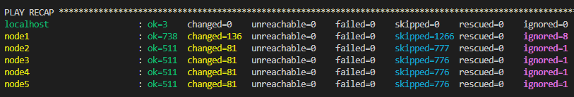
    - Nodes
        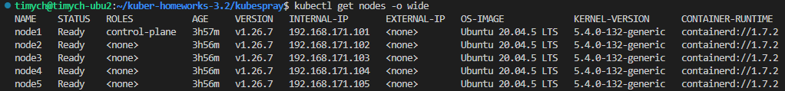
    - etcd
        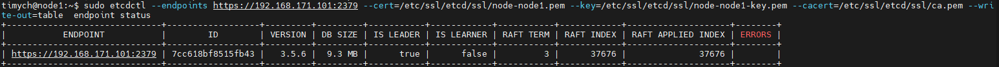
    - тест deployment
        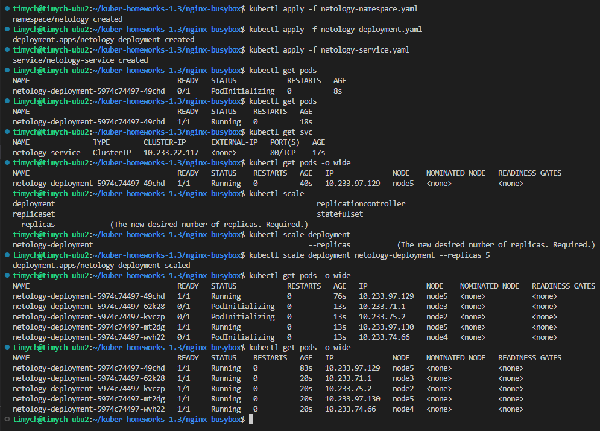


## Дополнительные задания (со звёздочкой)

**Настоятельно рекомендуем выполнять все задания под звёздочкой.** Их выполнение поможет глубже разобраться в материале.
Задания под звёздочкой необязательные к выполнению и не повлияют на получение зачёта по этому домашнему заданию.

------
### Задание 2*. Установить HA кластер

1. Установить кластер в режиме HA.
2. Использовать нечётное количество Master-node.
3. Для cluster ip использовать keepalived или другой способ.


### Решение
1. Общая схема решения\
   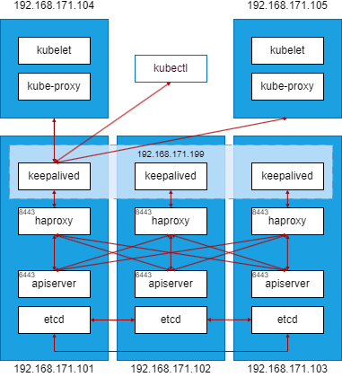
2. Настройка keepalived и habroxy
   1. Конфигурация keepalived (/etc/keepalived/keepalived.conf) следим за процессом haproxy
      ```ini
      vrrp_track_process haproxy {
          process haproxy
          quorum 1
          delay 2
      }

      vrrp_instance VI_1 {
          state MASTER
          interface ens33
          virtual_router_id 101
          priority 101
          advert_int 1
          authentication {
              auth_type PASS
              auth_pass 1111
          }
          virtual_ipaddress {
              192.168.171.199
          }
          track_process {
              haproxy
          }
      }
      ```
   1. Конфигурация haproxy (/etc/keepalived/keepalived.conf)
      ```ini
      defaults
          maxconn 20000
          mode    tcp
          option  dontlognull
          timeout http-request 10s
          timeout queue        1m
          timeout connect      10s
          timeout client       86400s
          timeout server       86400s
          timeout tunnel       86400s
      frontend k8s-api
          bind :::8443 v4v6
          mode tcp
          default_backend k8s-api
      backend k8s-api
          option  httpchk GET /readyz HTTP/1.0
          option  log-health-checks
          http-check expect status 200
          mode tcp
          balance roundrobin
          default-server verify none check-ssl inter 10s downinter 5s rise 2 fall 2 slowstart 60s maxconn 5000 maxqueue 5000 weight 100
          server node1 192.168.171.101:6443 check
          server node2 192.168.171.102:6443 check
          server node3 192.168.171.103:6443 check
      ```


3. Развертывание с помощью kubespray.


    ```bash
    declare -a IPS=(192.168.171.101 192.168.171.102 192.168.171.103 192.168.171.104 192.168.171.105)
    CONFIG_FILE=inventory/mycluster/hosts.yaml python3 contrib/inventory_builder/inventory.py ${IPS[@]}
    ```

    Редактируем invenroty
    ```yml
    all:
      hosts:
        node1:
          ansible_host: 192.168.171.101
          ip: 192.168.171.101
          access_ip: 192.168.171.101
        node2:
          ansible_host: 192.168.171.102
          ip: 192.168.171.102
          access_ip: 192.168.171.102
        node3:
          ansible_host: 192.168.171.103
          ip: 192.168.171.103
          access_ip: 192.168.171.103
        node4:
          ansible_host: 192.168.171.104
          ip: 192.168.171.104
          access_ip: 192.168.171.104
        node5:
          ansible_host: 192.168.171.105
          ip: 192.168.171.105
          access_ip: 192.168.171.105
      children:
        kube_control_plane:
          hosts:
            node1:
            node2:
            node3:
        kube_node:
          hosts:
            # node1:
            # node2:
            # node3:
            node4:
            node5:
        etcd:
          hosts:
            node1:
            node2:
            node3:
        k8s_cluster:
          children:
            kube_control_plane:
            kube_node:
        calico_rr:
          hosts: {}
    ```
    Редактируем переменные для работы с виртуальным ip (kubespray/inventory/mycluster/group_vars/all/all.yml)
    ```yml
    apiserver_loadbalancer_domain_name: "apiserver.example.com"
        loadbalancer_apiserver:
          address: 192.168.171.199
          port: 8443
    ```

    Запускаем playbook:
    ```bash
    ansible-playbook -i inventory/mycluster/hosts.yaml  --become --become-user=root reset.yml
    ansible-playbook -i inventory/mycluster/hosts.yaml  --become --become-user=root cluster.yml
    ```

    Результат:
    - Kubespray
        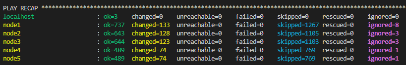
    - Nodes
        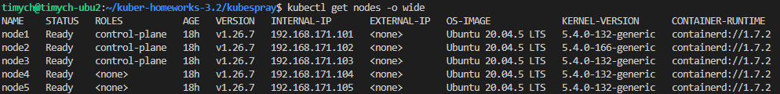
    - etcd
        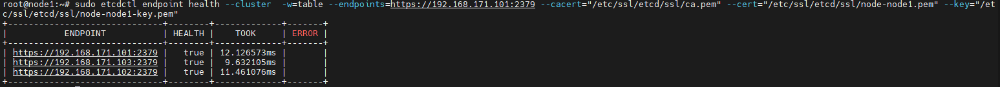
    - тест deployment
        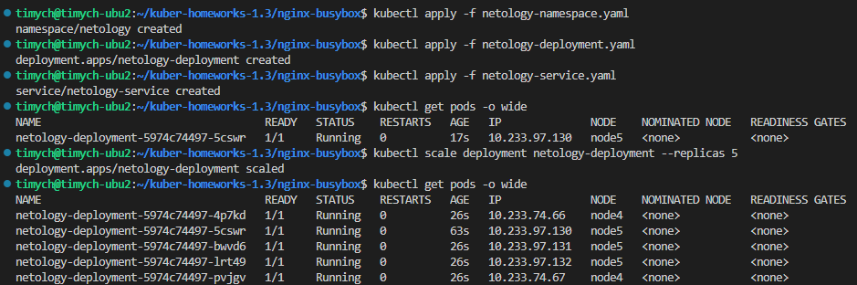

    Проверка HA:
    1. Штатная работа в .kube/config (`server: https://192.168.171.199:8443`)
        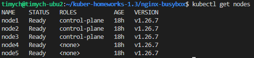
        Виртуальный адрес на node1
        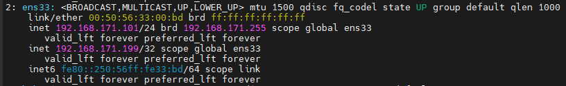
    1. Отключаем сеть на node1, виртуальный адрес на node3
        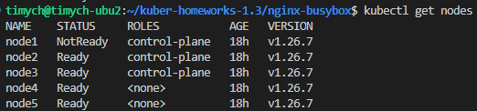
        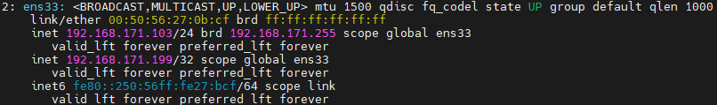
    1. Возвращаем сеть на node1, отключаем haproxy(systemctl stop haproxy.service) виртуальный адрес на node3:
        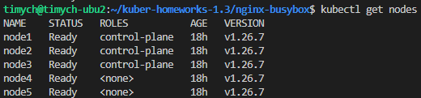
        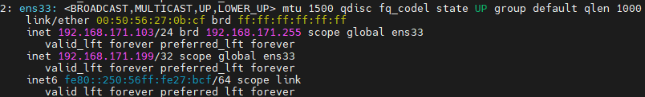
    1. Удаляем pod apiserver с node1(pod в состоянии pending), убеждаемся, что kubectl продолжает работать
        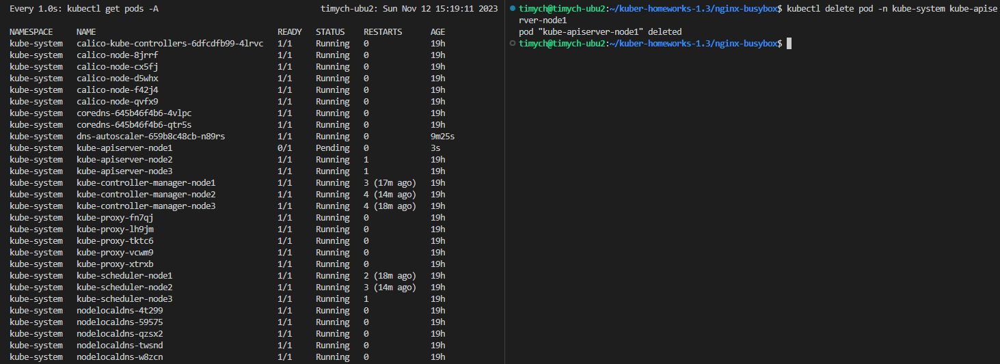
### Правила приёма работы

1. Домашняя работа оформляется в своем Git-репозитории в файле README.md. Выполненное домашнее задание пришлите ссылкой на .md-файл в вашем репозитории.
2. Файл README.md должен содержать скриншоты вывода необходимых команд `kubectl get nodes`, а также скриншоты результатов.
3. Репозиторий должен содержать тексты манифестов или ссылки на них в файле README.md.
