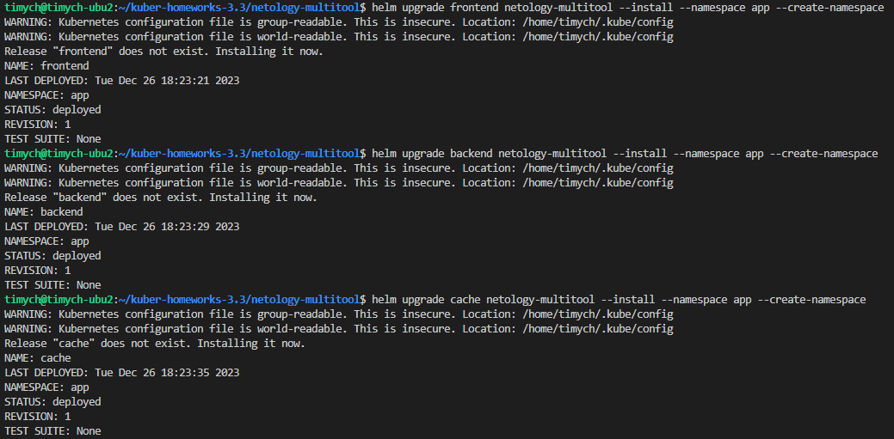
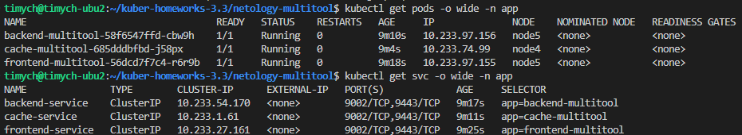
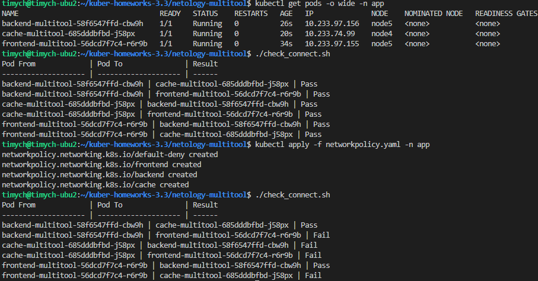

# Домашнее задание к занятию «Как работает сеть в K8s»

### Цель задания

Настроить сетевую политику доступа к подам.

### Чеклист готовности к домашнему заданию

1. Кластер K8s с установленным сетевым плагином Calico.

### Инструменты и дополнительные материалы, которые пригодятся для выполнения задания

1. [Документация Calico](https://www.tigera.io/project-calico/).
2. [Network Policy](https://kubernetes.io/docs/concepts/services-networking/network-policies/).
3. [About Network Policy](https://docs.projectcalico.org/about/about-network-policy).

-----

### Задание 1. Создать сетевую политику или несколько политик для обеспечения доступа

1. Создать deployment'ы приложений frontend, backend и cache и соответсвующие сервисы.
2. В качестве образа использовать network-multitool.
3. Разместить поды в namespace App.
4. Создать политики, чтобы обеспечить доступ frontend -> backend -> cache. Другие виды подключений должны быть запрещены.
5. Продемонстрировать, что трафик разрешён и запрещён.

### Правила приёма работы

1. Домашняя работа оформляется в своём Git-репозитории в файле README.md. Выполненное домашнее задание пришлите ссылкой на .md-файл в вашем репозитории.
2. Файл README.md должен содержать скриншоты вывода необходимых команд, а также скриншоты результатов.
3. Репозиторий должен содержать тексты манифестов или ссылки на них в файле README.md.


### Решение

1. Разворачиваем три деплоймента с помощью helm и проверяем созданные поды и сервисы.
        
        
2. Используя скрипт проверяем доступность подов, применяем политики, проверяем доступность повторно.
    Планируемые правила(остальное запрещено):
    |Среда  |Входящие  |Исходящие  |
    |---------|---------|---------|
    |frontend |С любого адреса снаружи         |backend          |
    |backend  |frontend                        |cache            |
    |cache    |backend                         |-                |
    |все      |-                               |-                |


    манифесты NetworkPolicy:
    ```yml
    ---
    apiVersion: networking.k8s.io/v1
    kind: NetworkPolicy
    metadata:
      name: default-deny
    spec:
      podSelector: {}
      policyTypes:
        - Ingress
        - Egress
    ---
    apiVersion: networking.k8s.io/v1
    kind: NetworkPolicy
    metadata:
      name: frontend
    spec:
      podSelector:
        matchLabels:
          app: frontend-multitool
      policyTypes:
        - Ingress
        - Egress
      ingress:
        - from:
            - ipBlock:
                cidr: 0.0.0.0/0
      egress:
        - to:
            - namespaceSelector: {}
              podSelector:
                matchLabels:
                  app: backend-multitool
          ports:
            - port: 8080
            - port: 11443
    ---
    apiVersion: networking.k8s.io/v1
    kind: NetworkPolicy
    metadata:
      name: backend
    spec:
      podSelector:
        matchLabels:
          app: backend-multitool
      policyTypes:
        - Ingress
        - Egress
      ingress:
        - from:
          - podSelector:
              matchLabels:
                app: frontend-multitool
          ports:
            - protocol: TCP
              port: 8080
            - protocol: TCP
              port: 11443
      egress:
        - to:
            - namespaceSelector: {}
              podSelector:
                matchLabels:
                  app: cache-multitool
          ports:
            - port: 8080
            - port: 11443

    ---
    apiVersion: networking.k8s.io/v1
    kind: NetworkPolicy
    metadata:
      name: cache
    spec:
      podSelector:
        matchLabels:
          app: cache-multitool
      policyTypes:
        - Ingress
        - Egress
      ingress:
        - from:
          - podSelector:
              matchLabels:
                app: backend-multitool
          ports:
            - protocol: TCP
              port: 8080
            - protocol: TCP
              port: 11443
    ```

     Скрипт проверки соединения(проверяем код ответа 200 с помощью curl на ip адрес пода):
    ```bash
    #!/bin/bash

    # Set the namespace
    namespace="app"

    # Get all pod names in the namespace
    pod_names=($(kubectl get pods -n "$namespace" -o jsonpath="{.items[*].metadata.name}"))

    # Print table header
    printf "%-20s | %-20s | %-6s\n" "Pod From" "Pod To" "Result"
    printf "%-20s | %-20s | %-6s\n" "--------------------" "--------------------" "------"

    # Loop through each pod
    for from_pod in "${pod_names[@]}"; do
        from_pod_ip=$(kubectl get pod "$from_pod" -n "$namespace" -o=jsonpath='{.status.podIP}')

        # Loop through each pod again to perform curl request
        for to_pod in "${pod_names[@]}"; do
            if [ "$from_pod" != "$to_pod" ]; then
                to_pod_ip=$(kubectl get pod "$to_pod" -n "$namespace" -o=jsonpath='{.status.podIP}')
                curl_output=$(kubectl exec -n "$namespace" "$from_pod" -- curl -m 1 -s -o /dev/null -w "%{http_code}" "$to_pod_ip:8080" 2>/dev/null)

                if [ "$curl_output" -eq 200 ]; then
                    result="Pass"
                else
                    result="Fail"
                fi

                # Print table row
                printf "%-20s | %-20s | %-6s\n" "$from_pod" "$to_pod" "$result"
            fi
        done
    done
    ```
    Скриншот проверки:\
    


1. Ссылка на Chart, политики и скрипт проверки:\
  [Link](https://github.com/Timych84/devops-netology/blob/main/kuber-homeworks-3.3/Code/)
