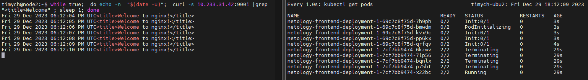
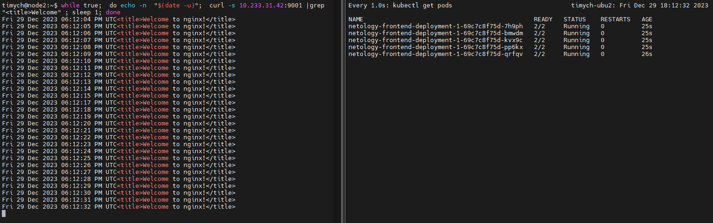
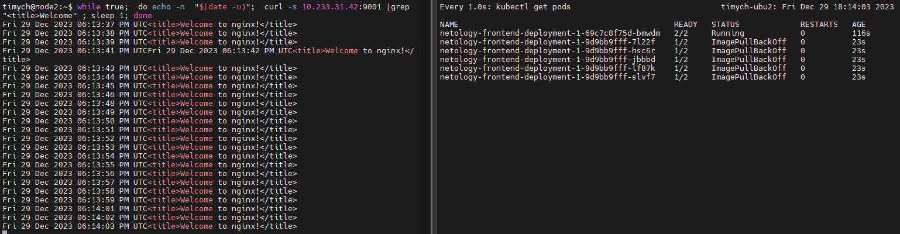
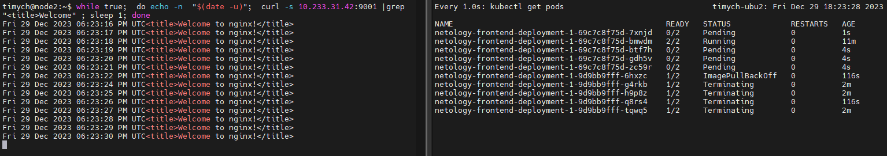
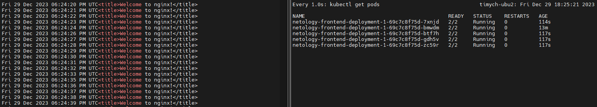
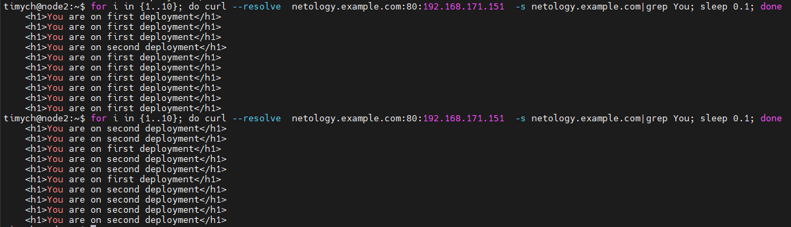

# Домашнее задание к занятию «Обновление приложений»

### Цель задания

Выбрать и настроить стратегию обновления приложения.

### Чеклист готовности к домашнему заданию

1. Кластер K8s.

### Инструменты и дополнительные материалы, которые пригодятся для выполнения задания

1. [Документация Updating a Deployment](https://kubernetes.io/docs/concepts/workloads/controllers/deployment/#updating-a-deployment).
2. [Статья про стратегии обновлений](https://habr.com/ru/companies/flant/articles/471620/).

-----

### Задание 1. Выбрать стратегию обновления приложения и описать ваш выбор

1. Имеется приложение, состоящее из нескольких реплик, которое требуется обновить.
2. Ресурсы, выделенные для приложения, ограничены, и нет возможности их увеличить.
3. Запас по ресурсам в менее загруженный момент времени составляет 20%.
4. Обновление мажорное, новые версии приложения не умеют работать со старыми.
5. Вам нужно объяснить свой выбор стратегии обновления приложения.

### Задание 2. Обновить приложение

1. Создать deployment приложения с контейнерами nginx и multitool. Версию nginx взять 1.19. Количество реплик — 5.
2. Обновить версию nginx в приложении до версии 1.20, сократив время обновления до минимума. Приложение должно быть доступно.
3. Попытаться обновить nginx до версии 1.28, приложение должно оставаться доступным.
4. Откатиться после неудачного обновления.

## Дополнительные задания — со звёздочкой*

Задания дополнительные, необязательные к выполнению, они не повлияют на получение зачёта по домашнему заданию. **Но мы настоятельно рекомендуем вам выполнять все задания со звёздочкой.** Это поможет лучше разобраться в материале.

### Задание 3*. Создать Canary deployment

1. Создать два deployment'а приложения nginx.
2. При помощи разных ConfigMap сделать две версии приложения — веб-страницы.
3. С помощью ingress создать канареечный деплоймент, чтобы можно было часть трафика перебросить на разные версии приложения.

### Правила приёма работы

1. Домашняя работа оформляется в своем Git-репозитории в файле README.md. Выполненное домашнее задание пришлите ссылкой на .md-файл в вашем репозитории.
2. Файл README.md должен содержать скриншоты вывода необходимых команд, а также скриншоты результатов.
3. Репозиторий должен содержать тексты манифестов или ссылки на них в файле README.md.


### Решение

1. Если существуют проблемы с ресурсами а главное полная несовместимость старого приложения с новым, то получается, что подходит только вариант Recreate
2. Задание 2. Обновить приложение
   1. Манифесты
       netology-deployment.yaml:
        ```yml
        ---
        apiVersion: apps/v1
        kind: Deployment
        metadata:
          name: netology-frontend-deployment-1
          namespace: netology
          labels:
            app: netology-nginx
        spec:
          replicas: 5
          selector:
            matchLabels:
              app: netology-nginx
          template:
            metadata:
              labels:
                app: netology-nginx
            spec:
              containers:
              - name: nginx
                imagePullPolicy: IfNotPresent
                image: nginx:1.19
                ports:
                - containerPort: 80
                env:
                  - name: "PORT"
                    value: "80"
                resources:
                  limits:
                    cpu: "0.1"
                    memory: "128Mi"
          strategy:
            type: RollingUpdate
            rollingUpdate:
              maxSurge: 5
              maxUnavailable: 4
        ```
        netology-service.yaml:

        ```yml
        ---
        apiVersion: v1
        kind: Service
        metadata:
          name: netology-frontend-service
          namespace: netology
          labels:
            app: netology-nginx
        spec:
          ports:
            - port: 9001
              targetPort: 80
              protocol: TCP
              name: nginx-http
          type: ClusterIP
          selector:
            app: netology-nginx
        ```
    3. Меняем image: nginx:1.19 на image: nginx:1.20 и делаем apply, при этом остается запущенным один под, параллельно проверяем доступность.\
        Процесс обновления:\
        
        После обновления:\
        

    4. Меняем image: nginx:1.20 на image: nginx:1.29 и делаем apply, при этом остается запущенным один под, параллельно проверяем доступность.\
        Процесс обновления(ошибки):\
        
        Процесс отката:\
        
        После отката:\
        

1. Задание 3*. Создать Canary deployment
   1. Для реализации установил istio.
   2. Манифесты\
   netology-namespace.yaml:
    ```yml
    apiVersion: v1
        kind: Namespace
        metadata:
          name: netology
    ```
   netology-configmap.yaml:
    ```yml
    ---
    apiVersion: v1
    kind: ConfigMap
    metadata:
      name: netology-configmap-1
    data:
      nginx-http-port: "80"
      multitool-http-port: "8080"
      multitool-https-port: "11443"
      nginx-conf: |
        events {}         # event context have to be defined to consider config valid
        http {
        server {
            listen 80;
            server_name _;
            root        /var/www/html/netology;
          }
        }
      nginx-site: |
        <!DOCTYPE html>
        <html>
        <head>
            <title>First Deployment</title>
        </head>
        <body>
            <h1>You are on first deployment</h1>
        </body>
        </html>

    ---
    apiVersion: v1
    kind: ConfigMap
    metadata:
      name: netology-configmap-2
    data:
      nginx-http-port: "80"
      multitool-http-port: "8080"
      multitool-https-port: "11443"
      nginx-conf: |
        events {}         # event context have to be defined to consider config valid
        http {
        server {
            listen 80;
            server_name _;
            root        /var/www/html/netology;
          }
        }
      nginx-site: |
        <!DOCTYPE html>
        <html>
        <head>
            <title>Second Deployment</title>
        </head>
        <body>
            <h1>You are on second deployment</h1>
        </body>
        </html>
    ```
   netology-secret.yaml
    ```yml
    apiVersion: v1
    kind: Secret
    metadata:
      name: netology-secret
    data:
      tls.crt: ----cert----
      tls.key: ----key-----
    type: kubernetes.io/tls

       netology-deployment-1.yaml
       netology-deployment-2.yaml
       netology-service.yaml
       netology-canary.yaml
    ```
   netology-deployment-1.yaml

    ```yml
    ---
    apiVersion: apps/v1
    kind: Deployment
    metadata:
      name: netology-frontend-deployment-1
      namespace: netology
      labels:
        app: netology-nginx
        version: v1
    spec:
      replicas: 3
      selector:
        matchLabels:
          app: netology-nginx
      template:
        metadata:
          labels:
            app: netology-nginx
            version: v1
        spec:
          containers:
          - name: nginx
            imagePullPolicy: IfNotPresent
            image: nginx:1.25.1-alpine3.17
            ports:
            - containerPort: 80
            env:
              - name: "PORT"
                valueFrom:
                  configMapKeyRef:
                    name: netology-configmap-1
                    key: nginx-http-port
            resources:
              limits:
                cpu: "0.1"
                memory: "128Mi"
            volumeMounts:
            - name: nginx-config
              mountPath: "/etc/nginx"
              readOnly: true
            - name: nginx-site
              mountPath: "/var/www/html/netology"
              readOnly: true
          volumes:
          - name: nginx-config
            configMap:
              name: netology-configmap-1
              items:
              - key: nginx-conf
                path: nginx.conf
          - name: nginx-site
            configMap:
              name: netology-configmap-1
              items:
              - key: nginx-site
                path: index.html
    ```
   netology-deployment-2.yaml
    ```yml
    ---
    apiVersion: apps/v1
    kind: Deployment
    metadata:
      name: netology-frontend-deployment-2
      namespace: netology
      labels:
        app: netology-nginx
        version: v2
    spec:
      replicas: 3
      selector:
        matchLabels:
          app: netology-nginx
      template:
        metadata:
          labels:
            app: netology-nginx
            version: v2
        spec:
          containers:
          - name: nginx
            imagePullPolicy: IfNotPresent
            image: nginx:1.25.1-alpine3.17
            ports:
            - containerPort: 80
            env:
              - name: "PORT"
                valueFrom:
                  configMapKeyRef:
                    name: netology-configmap-2
                    key: nginx-http-port
            resources:
              limits:
                cpu: "0.1"
                memory: "128Mi"
            volumeMounts:
            - name: nginx-config
              mountPath: "/etc/nginx"
              readOnly: true
            - name: nginx-site
              mountPath: "/var/www/html/netology"
              readOnly: true
          volumes:
          - name: nginx-config
            configMap:
              name: netology-configmap-2
              items:
              - key: nginx-conf
                path: nginx.conf
          - name: nginx-site
            configMap:
              name: netology-configmap-2
              items:
              - key: nginx-site
                path: index.html
    ```

   netology-service.yaml
    ```yml
    apiVersion: v1
    kind: Service
    metadata:
      name: netology-frontend-service
      namespace: netology
      labels:
        app: netology-nginx
    spec:
      ports:
        - port: 9001
          targetPort: 80
          protocol: TCP
          name: nginx-http
      type: ClusterIP
      selector:
        app: netology-nginx
    ```

   netology-canary.yaml
    ```yml
    apiVersion: networking.istio.io/v1alpha3
    kind: Gateway
    metadata:
      name: netology-gateway
    spec:
      # The selector matches the ingress gateway pod labels.
      # If you installed Istio using Helm following the standard documentation, this would be "istio=ingress"
      selector:
        istio: ingress  # use istio default controller
      servers:
      - port:
          number: 80
          name: http
          protocol: HTTP
        hosts:
        - "netology.example.com"
    ---
    apiVersion: networking.istio.io/v1alpha3
    kind: VirtualService
    metadata:
      name: netology-vs
    spec:
      hosts:
      - "netology.example.com"
      gateways:
      - netology-gateway
      http:
        - route:
          - destination:
              host: netology-frontend-service.netology.svc.cluster.local
              subset: v1
              port:
                number: 9001
            weight: 10
          - destination:
              host: netology-frontend-service.netology.svc.cluster.local
              subset: v2
              port:
                number: 9001
            weight: 90
    ---
    apiVersion: networking.istio.io/v1alpha3
    kind: DestinationRule
    metadata:
      name: netology-dr
    spec:
      host: netology-frontend-service.netology.svc.cluster.local
      subsets:
      - name: v1
        labels:
          version: v1
      - name: v2
        labels:
          version: v2
    ```
 2. Проверяем работу с помощью curl к netology.example.com. В первой проверке v1 - 90%, v2 - 10%. Во второй проверке  v1 - 10%, v2 - 90%.\
     
