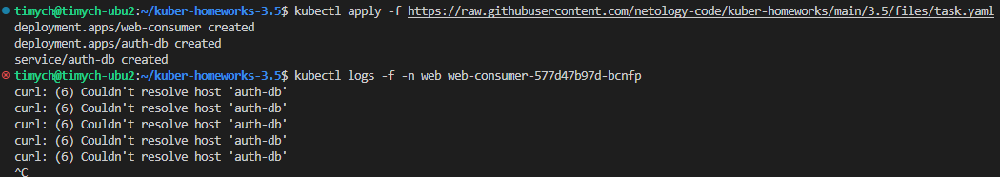
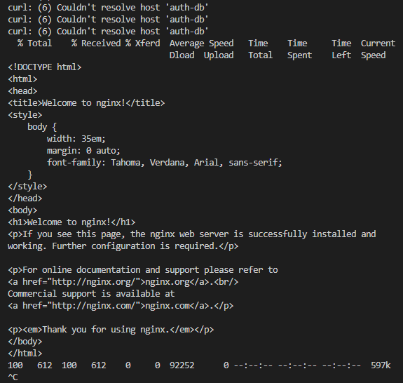

# Домашнее задание к занятию Troubleshooting

### Цель задания

Устранить неисправности при деплое приложения.

### Чеклист готовности к домашнему заданию

1. Кластер K8s.

### Задание. При деплое приложение web-consumer не может подключиться к auth-db. Необходимо это исправить

1. Установить приложение по команде:
```shell
kubectl apply -f https://raw.githubusercontent.com/netology-code/kuber-homeworks/main/3.5/files/task.yaml
```
2. Выявить проблему и описать.
3. Исправить проблему, описать, что сделано.
4. Продемонстрировать, что проблема решена.


### Правила приёма работы

1. Домашняя работа оформляется в своём Git-репозитории в файле README.md. Выполненное домашнее задание пришлите ссылкой на .md-файл в вашем репозитории.
2. Файл README.md должен содержать скриншоты вывода необходимых команд, а также скриншоты результатов.
3. Репозиторий должен содержать тексты манифестов или ссылки на них в файле README.md.

### Решение

1. При применении kubectl apply -f https://raw.githubusercontent.com/netology-code/kuber-homeworks/main/3.5/files/task.yaml сначала пришлось создать namespace web и data.
1. Смотрим логи подов web-consumer
       
       По ошибкам видно, что со стороны пода хост не пожет разрешить имя auth-db в ip адрес
1. В манифесте task.yaml видно что deployment web-consumer находится в namespace web, а deployment auth-db и сервис auth-db находятся в namespace data. При этом curl в подах деплоймента web-consumer пытается достучаться по имени auth-db, что невозможно.
1. Для решения проблемы вижу два варианта:
   1. Обращаться к сервису по FQDN, исправить в манифесте строчку
        - while true; do curl auth-db; sleep 5; done\
        на
        - while true; do curl auth-db.data.svc.cluster.local; sleep 5; done
   1. Создать вспомогательный сервис типа ExternalName с параметром externalName: auth-db.data.svc.cluster.local. Таким образом обращение к auth-db в namespace web будет отправлять на auth-db.data.svc.cluster.local.
        ```yml
        ---
        apiVersion: v1
        kind: Service
        metadata:
          name: auth-db
          namespace: web
        spec:
          type: ExternalName
          externalName: auth-db.data.svc.cluster.local
        ```

1. После любого из вариантов исправления в логах подов ошибка пропадает.
       
